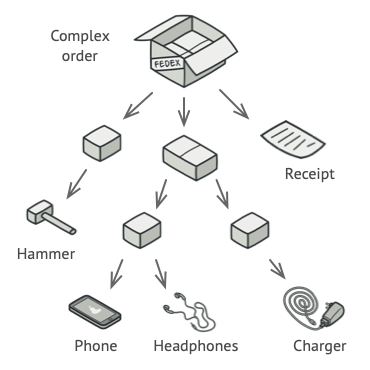

<div dir="rtl">


---

<h3 dir="rtl" align="center">
🎉 توضیح ساده دیزاین پترن‌ها ! 🎉
</h3>

<p dir="rtl" align="center">
فهمیدن دیزاین پترن‌ها از اون موضوع‌هاست که ذهن رو به چالش میکشه.
 اینجا سعی می‌کنم با مثال‌های ساده از دنیای واقعی و دنیای کد ، اونو راحت وارد ذهنتون کنم.
</p>

---

منبع اصلی این ریپازیتوری [این](https://github.com/rommel-sunga/design-patterns-for-humans-python) ریپازیتوری هست که
خودش نسخه پایتونیزه شده [این](https://github.com/kamranahmedse/design-patterns-for-humans) ریپازیتوریه.

در ترجمه، تعاریف و مثال‌ها از منابع مختلف فارسی و انگلیسی استفاده شده تا بهترین نتیجه حاصل بشه :)

---

</div>

<!-- TOC -->

- [Creational Design Patterns](#creational-design-patterns)
  - [🏠 Simple Factory](#-simple-factory)
  - [🏭 Factory Method](#-factory-method)
  - [🔨 Abstract Factory](#-abstract-factory)
  - [👷 Builder](#-builder)
  - [🐑 Prototype](#-prototype)
  - [💍 Singleton](#-singleton)
- [Structural Design Patterns](#structural-design-patterns)
  - [🔌 Adapter](#-adapter)
  - [🌉 Bridge](#-bridge)
  - [🌿 Composite](#-composite)
  - [☕ Decorator](#-decorator)
  - [📦 Facade](#-facade)
  - [🍃 Flyweight](#-flyweight)
  - [🎱 Proxy](#-proxy)
- [Behavioral Design Patterns](#behavioral-design-patterns)
  - [🔗 Chain of Responsibility](#-chain-of-responsibility)
  - [👮 Command](#-command)
  - [➿ Iterator](#-iterator)
  - [👽 Mediator](#-mediator)
  - [💾 Memento](#-memento)
  - [😎 Observer](#-observer)
  - [🏃 Visitor](#-visitor)
  - [💡 Strategy](#-strategy)
  - [💢 State](#-state)
  - [📒 Template Method](#-template-method)

<!-- TOC -->

<div dir="rtl" align="center">

# 🚀 مقدمه

</div>

<div dir="rtl">

دیزاین پترن‌ها یک سری دستور العمل برای مقابله با یک سری مشکلات رایج هستند.

اونا یک سری کلاس، پکیج یا کتابخونه نیستند که با اضافه کردنشون به پروژه‌تون جادو کنن. در عوض یک سری راه حل بهتون میدن که
در شرایط خاص به مشکل نخورین.

<br>

> پس دیزاین پترن‌ها راه حلی برای مشکلات رایج هستن.

<br>

**ویکی‌پدیا** دیزاین پترن‌ها رو اینطوری توصیف میکنه:

> در مهندسی نرم‌افزار، الگوی طراحی یک راه‌حل عمومی قابل تکرار برای مشکلات متداول در زمینه طراحی نرم‌افزار است. الگوی
> طراحی، یک طراحی تمام‌شده نیست که به صورت مستقیم بتواند تبدیل به کد منبع یا ماشین شود؛ بلکه، یک توضیح یا قالب برای حل
> یک
> مسئله در شرایط مختلف است. الگوها در واقع بهترین روش ممکن هستند که یک برنامه‌نویس می‌تواند در هنگام طراحی یک برنامه
> برای
> حل مشکلاتش از آن‌ها استفاده کند.

<br>
<div dir="rtl" align="right">

## ⚠ هشدار

</div>

- الگو‌های طراحی برای همه مشکلات راه حل ندارن.
- سعی نکنین حتما توی پروژه‌هاتون از اونا استفاده کنین و یادتون باشه دیزاین پترن‌ها راه حلی برای مشکلات هستن، نه راه حلی
  برای پیدا کردن مشکلات، پس خیلی درگیر پیدا کردن دلیل برای استفاده ازشون نباشین.
- اگه از اونا جای درست استفاده کنین، شما پروژه رو از مشکلات نجات دادین درغیر اینصورت قراره فاجعه به بار بیاد.

<br>
<br>

---

<br>

<div align="center">

# Creational Design Patterns

</div>

به زبون ساده:

> الگو‌های طراحی سازنده، به مشکلات مربوط به ساخت ابجکت‌ها می‌پردازن.

ویکی پدیا:

<div dir="ltr">

> In software engineering, creational design patterns are design patterns that deal with object creation mechanisms,
> trying to create objects in a manner

</div>

<br>

---

<div align="center">

## 🏠 Simple Factory

</div>

یک مثال از دنیای واقعی:

> فرض کنید درحال ساخت یک خونه هستین و توی بخش‌های مختلف به درب نیاز دارین، خب اگه برای هر کدومش بخواین لباس نجاری بپوشین
> و درگیر ساختنش بشین، قراره کلی هرج و مرج تجربه کنین. به همین دلیل مردم ترجیح میدن برای حل این مشکل اونو از یک کارخونه
> تهیه کنن.

به زبون ساده:

> این دیزاین پترن برای کاربر اون چیزی که نیاز داره رو میسازه بدون اینکه درگیر منطق پشتش بشه.

ویکی پدیا:

<div dir="ltr">

> In object-oriented programming (OOP), a factory is an object for creating other objects – formally a factory is a
> function or method that returns objects of a varying prototype or class from some method call, which is assumed to
> be "
> new".

</div>

**مثال برنامه نویسی**

توی این مثال میخوایم از اون مثال ساخت درب استفاده کنیم.

پس اول ما اینترفیس مربوط به درب رو میسازیم و بعدش یک کلاس factory برای ساخت درب میسازیم.

<details>
<summary>Python</summary>

<div dir="ltr">

```python
class Door:
    def getWidth(self):
        pass

    def getHeight(self):
        pass


class WoodenDoor(Door):
    width = None
    height = None

    def __init__(self, width=5, height=5):
        self.width = width
        self.height = height

    def getWidth(self):
        return self.width

    def getHeight(self):
        return self.height


class DoorFactory:
    @staticmethod
    def makeDoor(width, height):
        return WoodenDoor(width, height)

----------------------------
door = DoorFactory.makeDoor(10, 10)
print(door.getHeight())
print(door.getWidth())
```

</div>

</details>

<details>
<summary>Typescript</summary>

<div dir="ltr">

```typescript
class Door {
  getWidth(): void {}
  getHeight(): void {}
}

class WoodenDoor extends Door {
  width: number | null;
  height: number | null;

  constructor(width: number = 5, height: number = 5) {
    super();
    this.width = width;
    this.height = height;
  }

  getWidth(): number {
    return this.width;
  }

  getHeight(): number {
    return this.height;
  }
}

class DoorFactory {
  static makeDoor(width: number, height: number): WoodenDoor {
    return new WoodenDoor(width, height);
  }
}

----------------------------

let door = DoorFactory.makeDoor(10, 10);
console.log(door.getHeight());
console.log(door.getWidth());
```

</div>

</details>

<details>
<summary >#C</summary>

<div dir="ltr">

```C#
public interface IDoor
{
    int GetHeight();
    int GetWidth();
}

public class WoodenDoor : IDoor
{
    private int Height { get; set; }
    private int Width { get; set; }

    public WoodenDoor(int height, int width)
    {
        this.Height = height;
        this.Width = width;
    }

    public int GetHeight()
    {
        return this.Height;
    }
    public int GetWidth()
    {
        return this.Width;
    }
}

public static class DoorFactory
{
    public static IDoor MakeDoor(int height, int width)
    {
        return new WoodenDoor(height, width);
    }
}


----------------------------

var door = DoorFactory.MakeDoor(80, 30);
Console.WriteLine($"Height of Door : {door.GetHeight()}");
Console.WriteLine($"Width of Door : {door.GetWidth()}");
```

</div>

</details>

<details>
<summary >PHP</summary>

<div dir="ltr">

```PHP
interface DoorInterface {
    public function getHeight();
    public function getWidth();
}

class WoodenDoor implements DoorInterface {
    private $height;
    private $width;

    public function __construct($height, $width) {
        $this->height = $height;
        $this->width = $width;
    }

    public function getHeight() {
        return $this->height;
    }
    public function getWidth() {
        return $this->width;
    }
}

class DoorFactory {
    public static function makeDoor($height, $width) {
        return new woodenDoor($height, $width);
    }
}

$door = DoorFactory::makeDoor(80, 30);
echo "Height of Door : " . $door->getHeight() . "\n";
echo "Width of Door : " . $door->getWidth() . "\n";

```

</div>

</details>

<details>
<summary >Go</summary>

<div dir="ltr">

```go
package main

import "fmt"

type Door interface {
	getHeight() int
	getWidth() int
}

type WoodenDoor struct {
	height int
	width  int
}

func NewWoodenDoor(height, width int) *WoodenDoor {
	return &WoodenDoor{height: height, width: width}
}

func (w *WoodenDoor) getHeight() int {
	return w.height
}

func (w *WoodenDoor) getWidth() int {
	return w.width
}

type DoorFactory struct{}

func (df *DoorFactory) makeDoor(height, width int) Door {
	return NewWoodenDoor(height, width)
}

func main() {
	doorFactory := &DoorFactory{}
	door := doorFactory.makeDoor(80, 30)
	fmt.Printf("Height of Door : %d\n", door.getHeight())
	fmt.Printf("Width of Door : %d\n", door.getWidth())
}

```

</div>

</details>

<br>

---

<div align="center">

## 🏭 Factory Method

</div>

یک مثال از دنیای واقعی:

> یک مدیر رو فرض کنید که وظیفه استخدام افراد رو به عهده داره. مطمئنن براش غیر ممکنه که مصاحبه با همه افراد در پوزیشن‌های
> مختلف شرکت رو خودش انجام بده! پس میاد با توجه به پوزیشن تصمیم میگیره که مسئولیت مصاحبه رو به عهده یکی از کارمند‌هاش
> بزاره.

به زبون ساده:

> این دیزاین پترن میگه جای اینکه خودمون مستقیم درگیر ساخت ابجکت بشیم، این کار رو به عهده کلاس‌های فرزند بزاریم.

ویکی پدیا:

<div dir="ltr">

> In class-based programming, the factory method pattern is a creational pattern that uses factory methods to deal with
> the problem of creating objects without having to specify the exact class of the object that will be created. This is
> done by creating objects by calling a factory method—either specified in an interface and implemented by child
> classes,
> or implemented in a base class and optionally overridden by derived classes—rather than by calling a constructor.

</div>

**مثال برنامه نویسی**

بیاین از مثال مدیر استخدام برای درک بهتر استفاده کنیم.

پس اول یک اینترفیس برای مصاحبه کننده‌ها میسازیم و چند پیاده‌سازی هم برای اون ایجاد می‌کنیم.

بعد از اون `HiringManager` رو پیاده سازی میکنیم

در نهایت هر فرزند میتونه ازش ارث بری کنه و متد `makeInterviewer` خودش رو داشته باشه:

<details>
<summary>Python</summary>

<div dir="ltr">

```python
class Interviewer:
    def askQuestions(self):
        pass


class Developer(Interviewer):
    def askQuestions(self):
        print
        'Asking about design patterns'


class CommunityExecutive(Interviewer):
    def askQuestions(self):
        print('Asking about community building')


class HiringManager:
    def makeInterviewer(self):
        pass

    def takeInterview(self):
        interviewer = self.makeInterviewer()
        interviewer.askQuestions()


class DevelopmentManager(HiringManager):
    def makeInterviewer(self):
        return Developer()


class MarketingManager(HiringManager):
    def makeInterviewer(self):
        return CommunityExecutive()


----------------------------

devManager = DevelopmentManager()
devManager.takeInterview()

marketingManager = MarketingManager()
marketingManager.takeInterview()
```

</div>

</details>

<details>
<summary>Typescript</summary>

<div dir="ltr">

```typescript
class Interviewer {
  askQuestions(): void {}
}

class Developer extends Interviewer {
  askQuestions(): void {
    console.log("Asking about design patterns");
  }
}

class CommunityExecutive extends Interviewer {
  askQuestions(): void {
    console.log("Asking about community building");
  }
}

class HiringManager {
  makeInterviewer(): Interviewer {
    return null;
  }

  takeInterview(): void {
    let interviewer = this.makeInterviewer();
    interviewer.askQuestions();
  }
}

class DevelopmentManager extends HiringManager {
  makeInterviewer(): Developer {
    return new Developer();
  }
}

class MarketingManager extends HiringManager {
  makeInterviewer(): CommunityExecutive {
    return new CommunityExecutive();
  }
}

let devManager = new DevelopmentManager();
devManager.takeInterview();

let marketingManager = new MarketingManager();
marketingManager.takeInterview();
```

</div>

</details>

<details>
<summary >#C</summary>

<div dir="ltr">

```C#

interface IInterviewer
{
    void AskQuestions();
}

class Developer : IInterviewer
{
    public void AskQuestions()
    {
        Console.WriteLine("Asking about design patterns!");
    }
}

class CommunityExecutive : IInterviewer
{
    public void AskQuestions()
    {
        Console.WriteLine("Asking about community building!");
    }
}

abstract class HiringManager
{
    // Factory method
    abstract protected IInterviewer MakeInterviewer();
    public void TakeInterview()
    {
        var interviewer = this.MakeInterviewer();
        interviewer.AskQuestions();
    }
}

class DevelopmentManager : HiringManager
{
    protected override IInterviewer MakeInterviewer()
    {
        return new Developer();
    }
}

class MarketingManager : HiringManager
{
    protected override IInterviewer MakeInterviewer()
    {
        return new CommunityExecutive();
    }
}


----------------------------

var devManager = new DevelopmentManager();
devManager.TakeInterview(); //Output : Asking about design patterns!

var marketingManager = new MarketingManager();
marketingManager.TakeInterview();//Output : Asking about community building!

```

</div>

</details>

<details>
<summary>PHP</summary>

<div dir="ltr">

```PHP
interface InterviewerInterface
{
    public function askQuestions();
}

class Developer implements InterviewerInterface
{
    public function askQuestions()
    {
        echo "Asking about design patterns!";
    }
}

class CommunityExecutive implements InterviewerInterface
{
    public function askQuestions()
    {
        echo "Asking about community building!";
    }
}

abstract class HiringManager
{
    // Factory method
    abstract protected function makeInterviewer(): InterviewerInterface;

    public function takeInterview()
    {
        $interviewer = $this->makeInterviewer();
        $interviewer->askQuestions();
    }
}

class DevelopmentManager extends HiringManager
{
    protected function makeInterviewer(): InterviewerInterface
    {
        return new Developer();
    }
}

class MarketingManager extends HiringManager
{
    protected function makeInterviewer(): InterviewerInterface
    {
        return new CommunityExecutive();
    }
}


// Usage
$devManager = new DevelopmentManager();
$devManager->takeInterview(); // Output: Asking about design patterns!

$marketingManager = new MarketingManager();
$marketingManager->takeInterview(); // Output: Asking about community building!

```

</div>

</details>

<details>
<summary>Go</summary>

<div dir="ltr">

```go
package main

import "fmt"

type Interviewer interface {
	AskQuestions()
}

type Developer struct{}

func (d *Developer) AskQuestions() {
	fmt.Println("Asking about design patterns!")
}

type CommunityExecutive struct{}

func (ce *CommunityExecutive) AskQuestions() {
	fmt.Println("Asking about community building!")
}

type HiringManager interface {
	MakeInterviewer() Interviewer
	TakeInterview()
}

type DevelopmentManager struct{}

func (dm *DevelopmentManager) MakeInterviewer() Interviewer {
	return &Developer{}
}

func (dm *DevelopmentManager) TakeInterview() {
	interviewer := dm.MakeInterviewer()
	interviewer.AskQuestions()
}

type MarketingManager struct{}

func (mm *MarketingManager) MakeInterviewer() Interviewer {
	return &CommunityExecutive{}
}

func (mm *MarketingManager) TakeInterview() {
	interviewer := mm.MakeInterviewer()
	interviewer.AskQuestions()
}

func main() {
	devManager := &DevelopmentManager{}
	devManager.TakeInterview() // Output : Asking about design patterns!

	marketingManager := &MarketingManager{}
	marketingManager.TakeInterview() // Output : Asking about community building!
}

```

</div>

</details>

<br>

**چه موقع باید ازش استفاده کنیم؟**

اساساً زمانی ازین الگو استفاده میشه که چندین کلاس با ریشه مشترک داریم (یعنی چندین کلاس یک کلاس parent رو پیاده‌سازی
می‌کنند) و با توجه به شرایط تصمیم میگیریم از یکی از اون‌ها استفاده کنیم.

<br>

---

<div align="center">

## 🔨 Abstract Factory

</div>

یک مثال از دنیای واقعی:

> بیاین از مثال مربوط به Simple Factory اینجا استفاده کنیم. فرض کنید در حال ساخت خونه هستین و نیاز به چند درب مختلف
> دارید ولی اینبار نیاز به درب چوبی، درب ضد سرقت، درب شیشه و ... دارین. به طبع برای خرید باید به مغازه‌های مختلفی مراجعه
> کنید ، از طرفی برای استفاده ازشون هم ممکنه نیاز به متخصص مربوطه داشته باشین. برای مثال ما برای درب چوبی به چوب فروشی
> میریم و برای نصبش هم از یک نجار کمک میگیریم یا برای درب شیشه ای به مغازه و متخصص مربوط به خودش مراجعه میکنیم.

به زبون ساده:

> این دیزاین پترن تا حد زیادی مشابه simple factory هست با این تفاوت که `مجموعه ای` از اشیا مرتبط بهم رو ایجاد میکنه.

ویکی پدیا:

<div dir="ltr">

> The abstract factory pattern provides a way to encapsulate a group of individual factories that have a common theme
> without specifying their concrete classes

</div>

<br>

**مثال برنامه نویسی**

خب همون مثال ساخت خونه و نیاز به درب‌های مختلف رو ترجمه میکنیم.

اول باید اینترفیس درب رو بسازیم و چند پیاده‌سازی ازش ایجاد کنیم.

در مرحله بعد برای هر درب متخصص مربوطه رو ایجاد می‌کنیم.

و در مرحله آخر سراغ پیاده‌سازی دیزاین پترن‌مون میریم.

برای مثال کلاس `WoodenDoorFactory` زمانی استفاده میشه که نیاز به درب چوبی داریم و کارش اینه که برای ایجاد ابجکت درب (که
اینجا
درب چوبی هست) از کلاس `WoodenDoor` و برای ایجاد ابجکت متخصص (که اینجا نجار هست) از `Carpenter` استفاده کنه.

این موضوع برای درب آهنی و ... هم بطور مشابه پیاده‌سازی میشه.

<details>
<summary>Python</summary>

<div dir="ltr">

```python
class Door:
    def getDescription(self):
        pass


class WoodenDoor(Door):
    def getDescription(self):
        print('I am a wooden door')


class IronDoor(Door):
    def getDescription(self):
        print('I am an iron door')


class DoorFittingExpert:
    def getDescription(self):
        pass


class Welder(DoorFittingExpert):
    def getDescription(self):
        print('I can only fit iron doors')


class Carpenter(DoorFittingExpert):
    def getDescription(self):
        print('I can only fit wooden doors')


class DoorFactory:
    def makeDoor(self):
        pass

    def makeFittingExpert(self):
        pass


class WoodenDoorFactory(DoorFactory):
    def makeDoor(self):
        return WoodenDoor()

    def makeFittingExpert(self):
        return Carpenter()


class IronDoorFactory(DoorFactory):
    def makeDoor(self):
        return IronDoor()

    def makeFittingExpert(self):
        return Welder()


----------------------------

woodenFactory = WoodenDoorFactory()

door = woodenFactory.makeDoor()
expert = woodenFactory.makeFittingExpert()

door.getDescription()
expert.getDescription()

----------------------------

ironFactory = IronDoorFactory()

door = ironFactory.makeDoor()
expert = ironFactory.makeFittingExpert()

door.getDescription()
expert.getDescription()
```

</div>

**همونطور که میبیند، می‌تونیم بطور مشابه با هر دو نوع درب برخورد کنیم و ازین موضوع مطمئن باشیم که متخصص اشتباه برای یک
درب
انتخاب نمی‌کنیم.**

</details>

<details>
<summary>Typescript</summary>

<div dir="ltr">

```typescript
class Door {
  getDescription(): void {}
}

class WoodenDoor extends Door {
  getDescription(): void {
    console.log("I am a wooden door");
  }
}

class IronDoor extends Door {
  getDescription(): void {
    console.log("I am an iron door");
  }
}

class DoorFittingExpert {
  getDescription(): void {}
}

class Welder extends DoorFittingExpert {
  getDescription(): void {
    console.log("I can only fit iron doors");
  }
}

class Carpenter extends DoorFittingExpert {
  getDescription(): void {
    console.log("I can only fit wooden doors");
  }
}

class DoorFactory {
  makeDoor(): Door {
    return null;
  }

  makeFittingExpert(): DoorFittingExpert {
    return null;
  }
}

class WoodenDoorFactory extends DoorFactory {
  makeDoor(): WoodenDoor {
    return new WoodenDoor();
  }

  makeFittingExpert(): Carpenter {
    return new Carpenter();
  }
}

class IronDoorFactory extends DoorFactory {
  makeDoor(): IronDoor {
    return new IronDoor();
  }

  makeFittingExpert(): Welder {
    return new Welder();
  }
}

----------------------------

let woodenFactory = new WoodenDoorFactory();

let door = woodenFactory.makeDoor();
let expert = woodenFactory.makeFittingExpert();

door.getDescription();
expert.getDescription();

----------------------------

let ironFactory = new IronDoorFactory();

door = ironFactory.makeDoor();
expert = ironFactory.makeFittingExpert();

door.getDescription();
expert.getDescription();

```

</div>

**همونطور که میبیند، می‌تونیم بطور مشابه با هر دو نوع درب برخورد کنیم و ازین موضوع مطمئن باشیم که متخصص اشتباه برای یک
درب
انتخاب نمی‌کنیم.**

</details>

<details>
<summary >#C</summary>

<div dir="ltr">

```C#

interface IDoor {

  void GetDescription();

}
class WoodenDoor : IDoor
{
  public void GetDescription()
  {
    Console.WriteLine("I am a wooden door");
  }
}

class IronDoor : IDoor
{
  public void GetDescription()
  {
    Console.WriteLine("I am a iron door");
  }
}

interface IDoorFittingExpert
{
  void GetDescription();
}

class Welder : IDoorFittingExpert
{
  public void GetDescription()
  {
    Console.WriteLine("I can only fit iron doors");
  }
}

class Carpenter : IDoorFittingExpert
{
  public void GetDescription()
  {
    Console.WriteLine("I can only fit wooden doors");
  }
}

interface IDoorFactory {
  IDoor MakeDoor();
  IDoorFittingExpert MakeFittingExpert();
}

// Wooden factory to return carpenter and wooden door
class WoodenDoorFactory : IDoorFactory
{
  public IDoor MakeDoor()
  {
    return new WoodenDoor();
  }

  public IDoorFittingExpert MakeFittingExpert()
  {
    return new Carpenter();
  }
}

// Iron door factory to get iron door and the relevant fitting expert
class IronDoorFactory : IDoorFactory
{
  public IDoor MakeDoor()
  {
    return new IronDoor();
  }

  public IDoorFittingExpert MakeFittingExpert()
  {
    return new Welder();
  }
}
----------------------------
var woodenDoorFactory = new WoodenDoorFactory();

var woodenDoor = woodenDoorFactory.MakeDoor();
var woodenDoorFittingExpert = woodenDoorFactory.MakeFittingExpert();

woodenDoor.GetDescription(); //Output : I am a wooden door
woodenDoorFittingExpert.GetDescription();//Output : I can only fit woooden doors

----------------------------

var ironDoorFactory = new IronDoorFactory();

var ironDoor = ironDoorFactory.MakeDoor();
var ironDoorFittingExpert = ironDoorFactory.MakeFittingExpert();

ironDoor.GetDescription();//Output : I am a iron door
ironDoorFittingExpert.GetDescription();//Output : I can only fit iron doors

```

</div>

**همونطور که میبیند، می‌تونیم بطور مشابه با هر دو نوع درب برخورد کنیم و ازین موضوع مطمئن باشیم که متخصص اشتباه برای یک
درب
انتخاب نمی‌کنیم.**

</details>

<details>
<summary>PHP</summary>

<div dir="ltr">

```PHP

interface DoorInterface {
  public function getDescription();
}

class WoodenDoor implements DoorInterface {
  public function getDescription() {
    echo "I am a wooden door";
  }
}

class IronDoor implements DoorInterface {
  public function getDescription() {
    echo "I am an iron door";
  }
}

interface DoorFittingExpertInterface {
  public function getDescription();
}

class Welder implements DoorFittingExpertInterface {
  public function getDescription() {
    echo "I can only fit iron doors";
  }
}

class Carpenter implements DoorFittingExpertInterface {
  public function getDescription() {
    echo "I can only fit wooden doors";
  }
}

interface DoorFactoryInterface {
  public function makeDoor(): DoorInterface;
  public function makeFittingExpert(): DoorFittingExpertInterface;
}

// Wooden factory to return carpenter and wooden door
class WoodenDoorFactory implements DoorFactoryInterface {
  public function makeDoor(): DoorInterface {
    return new WoodenDoor();
  }

  public function makeFittingExpert(): DoorFittingExpertInterface {
    return new Carpenter();
  }
}

// Iron door factory to get iron door and the relevant fitting expert
class IronDoorFactory implements DoorFactoryInterface {
  public function makeDoor(): DoorInterface {
    return new IronDoor();
  }

  public function makeFittingExpert(): DoorFittingExpertInterface {
    return new Welder();
  }
}


// Usage
$woodenDoorFactory = new WoodenDoorFactory();

$woodenDoor = $woodenDoorFactory->makeDoor();
$woodenDoorFittingExpert = $woodenDoorFactory->makeFittingExpert();

$woodenDoor->getDescription(); // Output: I am a wooden door
$woodenDoorFittingExpert->getDescription(); // Output: I can only fit wooden doors


$ironDoorFactory = new IronDoorFactory();

$ironDoor = $ironDoorFactory->makeDoor();
$ironDoorFittingExpert = $ironDoorFactory->makeFittingExpert();

$ironDoor->getDescription(); // Output: I am an iron door
$ironDoorFittingExpert->getDescription(); // Output: I can only fit iron doors

```

</div>

**همونطور که میبیند، می‌تونیم به‌طور مشابه با هر دو نوع درب برخورد کنیم و ازین موضوع مطمئن باشیم که متخصص اشتباه برای یک
درب
انتخاب نمی‌کنیم.**

</details>

<details>
<summary>Go</summary>

<div dir="ltr">

```go

package main

import "fmt"

type IDoor interface {
	GetDescription()
}

type WoodenDoor struct{}

func (w *WoodenDoor) GetDescription() {
	fmt.Println("I am a wooden door")
}

type IronDoor struct{}

func (i *IronDoor) GetDescription() {
	fmt.Println("I am an iron door")
}

type IDoorFittingExpert interface {
	GetDescription()
}

type Carpenter struct{}

func (c *Carpenter) GetDescription() {
	fmt.Println("I can only fit wooden doors")
}

type Welder struct{}

func (w *Welder) GetDescription() {
	fmt.Println("I can only fit iron doors")
}

type IDoorFactory interface {
	MakeDoor() IDoor
	MakeFittingExpert() IDoorFittingExpert
}

type WoodenDoorFactory struct{}

func (w *WoodenDoorFactory) MakeDoor() IDoor {
	return &WoodenDoor{}
}

func (w *WoodenDoorFactory) MakeFittingExpert() IDoorFittingExpert {
	return &Carpenter{}
}

type IronDoorFactory struct{}

func (i *IronDoorFactory) MakeDoor() IDoor {
	return &IronDoor{}
}

func (i *IronDoorFactory) MakeFittingExpert() IDoorFittingExpert {
	return &Welder{}
}

func main() {
	woodenDoorFactory := &WoodenDoorFactory{}

	woodenDoor := woodenDoorFactory.MakeDoor()
	woodenDoorFittingExpert := woodenDoorFactory.MakeFittingExpert()

	woodenDoor.GetDescription()           // Output: I am a wooden door
	woodenDoorFittingExpert.GetDescription() // Output: I can only fit wooden doors

	ironDoorFactory := &IronDoorFactory{}

	ironDoor := ironDoorFactory.MakeDoor()
	ironDoorFittingExpert := ironDoorFactory.MakeFittingExpert()

	ironDoor.GetDescription()           // Output: I am an iron door
	ironDoorFittingExpert.GetDescription() // Output: I can only fit iron doors
}

```

</div>

**همونطور که میبیند، می‌تونیم به‌طور مشابه با هر دو نوع درب برخورد کنیم و ازین موضوع مطمئن باشیم که متخصص اشتباه برای یک
درب
انتخاب نمی‌کنیم.**

</details>

<br>

**چه موقع باید ازش استفاده کنیم؟**

زمانی که وابستگی‌های منطقی نه چندان ساده برای ایجاد وجود داره، میتونیم ازین دیزاین پترن استفاده کنیم.

<br>

---

<div align="center">

## 👷 Builder

</div>

یک مثال از دنیای واقعی:

> فرض کنید به یک رستوران رفتید و شما یک همبرگر معمولی سفارش می‌دید. این یک مثال از Simple Factory هست یعنی بدون اینکه
> سوال اضافه ای بپرسن اون رو براتون میارن. توی بعضی موارد پیش میاد که نیاز به یک سفارش سفارشی تر دارین. یعنی میخواین نوع
> نون رو مشخص کنید یا نوع سسی که براتون استفاده میکنن، توی این شرایط Builder به کمکمون میاد.

<br>

به زبون ساده:

> در واقع کار Builder اینه که توی ساخت ابجکت‌های پیچیده یا ابجکت‌هایی که نیاز به شخصی سازی زیادی دارن، بهمون کمک بکنه.
>
> در واقع روش کارش به این صورت هست که بجای اینکه تعداد زیادی پارامتر رو از ورودی تابع سازنده دریافت کنیم (`__init__`) ،
> اون دیتارو بصورت مرحله به مرحله دریافت کنیم.

برای همه ما پیش اومد که یک تابع سازنده به این شکل ببینیم:

<details>
<summary>Python</summary>
<div dir="ltr">

```python
def __init__(self, size, cheese=True, pepperoni=True, tomato=False, lettuce=True)
```

</div>
</details>

<details>
<summary>Typescript</summary>
<div dir="ltr">

```typescript
constructor(size: any, cheese: boolean = true, pepperoni: boolean = true, tomato: boolean = false, lettuce: boolean = true) {}

```

</div>
</details>

<details>
<summary >#C</summary>

<div dir="ltr">

```C#

public Burger(int size, bool cheese, bool pepperoni, bool lettuce, bool tomato)

```

</div>

</details>

<details>
<summary>PHP</summary>

<div dir="ltr">

```PHP

public function __construct(int $size, bool $cheese, bool $pepperoni, bool $lettuce, bool $tomato)

```

</div>

</details>

<details>
<summary>Go</summary>

<div dir="ltr">

```go

func Burger(size int, cheese bool, pepperoni bool, lettuce bool, tomato bool)

```

</div>

</details>

در این شرایط معمولا Builder میتونه به دادمون برسه.

<br>

ویکی پدیا:

<div dir="ltr">

> The builder pattern is an object creation software design pattern with the intentions of finding a solution to the
> telescoping constructor anti-pattern.

</div>

<br>

**مثال برنامه نویسی**

در این بخش هم میخوام مثال برگر رو براتون ترجمه کنم.

اولین مرحله اینه که یک کلاس برگر معمولی داشته باشیم

در ادامه کلاس Builder رو براش ایجاد میکنیم.

<details>
<summary>Python</summary>

<div dir="ltr">

```python
class Burger:
    _size = None

    _cheese = False
    _pepperoni = False
    _lettuce = False
    _tomato = False

    def __init__(self, builder):
        self._size = builder.size
        self._cheese = builder.cheese
        self._pepperoni = builder.pepperoni
        self._lettuce = builder.lettuce
        self._tomato = builder.tomato


class BurgerBuilder:
    size = None

    cheese = False
    pepperoni = False
    lettuce = False
    tomato = False

    def __init__(self, size):
        self.size = size

    def addPepperoni(self):
        self.pepperoni = True
        return self

    def addLettuce(self):
        self.lettuce = True
        return self

    def addCheese(self):
        self.cheese = True
        return self

    def addTomato(self):
        self.tomato = True
        return self

    def build(self):
        return Burger(self)


----------------------------

burger = BurgerBuilder(10).addPepperoni().addLettuce().addTomato().build()

print(vars(burger))
```

</div>

</details>

<details>
<summary>Typescript</summary>
<div dir="ltr">

```typescript
class Burger {
  private size: any;

  private cheese: boolean = false;
  private pepperoni: boolean = false;
  private lettuce: boolean = false;
  private tomato: boolean = false;

  constructor(builder: any) {
    this.size = builder.size;
    this.cheese = builder.cheese;
    this.pepperoni = builder.pepperoni;
    this.lettuce = builder.lettuce;
    this.tomato = builder.tomato;
  }
}

class BurgerBuilder {
  size: number;

  cheese: boolean = false;
  pepperoni: boolean = false;
  lettuce: boolean = false;
  tomato: boolean = false;

  constructor(size: number) {
    this.size = size;
  }

  addPepperoni() {
    this.pepperoni = true;
    return this;
  }

  addLettuce() {
    this.lettuce = true;
    return this;
  }

  addCheese() {
    this.cheese = true;
    return this;
  }

  addTomato() {
    this.tomato = true;
    return this;
  }

  build(): Burger {
    return new Burger(this);
  }
}

----------------------------

let burger = new BurgerBuilder(10)
  .addPepperoni()
  .addLettuce()
  .addTomato()
  .build();

console.log(Object.keys(burger));
```

</div>
</details>

<details>
<summary >#C</summary>

<div dir="ltr">

```C#
class Burger
{
  private int mSize;
  private bool mCheese;
  private bool mPepperoni;
  private bool mLettuce;
  private bool mTomato;

  public Burger(BurgerBuilder builder)
  {
    this.mSize = builder.Size;
    this.mCheese = builder.Cheese;
    this.mPepperoni = builder.Pepperoni;
    this.mLettuce = builder.Lettuce;
    this.mTomato = builder.Tomato;
  }

  public string GetDescription()
  {
    var sb = new StringBuilder();
    sb.Append($"This is {this.mSize} inch Burger. ");
    return sb.ToString();
  }
}

class BurgerBuilder {
  public int Size;
  public bool Cheese;
  public bool Pepperoni;
  public bool Lettuce;
  public bool Tomato;

  public BurgerBuilder(int size)
  {
    this.Size = size;
  }

  public BurgerBuilder AddCheese()
  {
    this.Cheese = true;
    return this;
  }

  public BurgerBuilder AddPepperoni()
  {
    this.Pepperoni = true;
    return this;
  }

  public BurgerBuilder AddLettuce()
  {
    this.Lettuce = true;
    return this;
  }

  public BurgerBuilder AddTomato()
  {
    this.Tomato = true;
    return this;
  }

  public Burger Build()
  {
    return new Burger(this);
  }
}

----------------------------

var burger = new BurgerBuilder(4).AddCheese()
                                .AddPepperoni()
                                .AddLettuce()
                                .AddTomato()
                                .Build();
Console.WriteLine(burger.GetDescription());

```

</div>

</details>

<details>
<summary>PHP</summary>

<div dir="ltr">

```PHP
class Burger {
    private $size;
    private $cheese = false;
    private $pepperoni = false;
    private $lettuce = false;
    private $tomato = false;

    public function __construct($builder) {
        $this->size = $builder->size;
        $this->cheese = $builder->cheese;
        $this->pepperoni = $builder->pepperoni;
        $this->lettuce = $builder->lettuce;
        $this->tomato = $builder->tomato;
    }
}

class BurgerBuilder {
    public $size;
    public $cheese = false;
    public $pepperoni = false;
    public $lettuce = false;
    public $tomato = false;

    public function __construct($size) {
        $this->size = $size;
    }

    public function addPepperoni() {
        $this->pepperoni = true;
        return $this;
    }

    public function addLettuce() {
        $this->lettuce = true;
        return $this;
    }

    public function addCheese() {
        $this->cheese = true;
        return $this;
    }

    public function addTomato() {
        $this->tomato = true;
        return $this;
    }

    public function build() {
        return new Burger($this);
    }
}

$burger = (new BurgerBuilder(10))
            ->addCheese()
            ->addPepperoni()
            ->addLettuce()
            ->addTomato()
            ->build();
            
var_dump(get_object_vars($burger));

```

</div>

</details>

<details>
<summary>Go</summary>

<div dir="ltr">

```go
package main

import (
"fmt"
"strings"
)

type Burger struct {
Size int
Cheese bool
Pepperoni bool
Lettuce bool
Tomato bool
}

func NewBurger(builder *BurgerBuilder) *Burger {
return &Burger{
Size: builder.Size,
Cheese: builder.Cheese,
Pepperoni: builder.Pepperoni,
Lettuce: builder.Lettuce,
Tomato: builder.Tomato,
}
}

func (b *Burger) GetDescription() string {
var sb strings.Builder
sb.WriteString(fmt.Sprintf("This is %d inch Burger. ", b.Size))
return sb.String()
}

type BurgerBuilder struct {
Size int
Cheese bool
Pepperoni bool
Lettuce bool
Tomato bool
}

func NewBurgerBuilder(size int) *BurgerBuilder {
return &BurgerBuilder{Size: size}
}

func (b *BurgerBuilder) AddCheese() *BurgerBuilder {
b.Cheese = true
return b
}

func (b *BurgerBuilder) AddPepperoni() *BurgerBuilder {
b.Pepperoni = true
return b
}

func (b *BurgerBuilder) AddLettuce() *BurgerBuilder {
b.Lettuce = true
return b
}

func (b *BurgerBuilder) AddTomato() *BurgerBuilder {
b.Tomato = true
return b
}

func (b *BurgerBuilder) Build() *Burger {
return NewBurger(b)
}

func main() {
burger := NewBurgerBuilder(4).AddCheese().AddPepperoni().AddLettuce().AddTomato().Build()
fmt.Println(burger.GetDescription())
}


```

</div>

</details>

<br>

**چه موقع باید ازش استفاده کنیم؟**

همونطور که قبل تر اشاره کردم این دیزاین پترن رو معمولا برای ساخت ابجکت‌های پیچیده یا ابجکت‌هایی که نیاز به شخصی سازی
زیادی دارن استفاده میکنیم.

<br>

---

<div align="center">

## 🐑 Prototype

</div>

یک مثال از دنیای واقعی:

> چیزی درمورد دالی شنیدین
> ؟ ([اگه نه اینجارو بخونید](<https://fa.wikipedia.org/wiki/%D8%AF%D8%A7%D9%84%DB%8C_(%DA%AF%D9%88%D8%B3%D9%81%D9%86%D8%AF)>))
>
> خیلی اینجا توضیح نمیدم، فقط بدونید همه‌چیز مربوط به شبیه سازیه!

به زبون ساده:

> مشکل از اینجا شروع میشه که یک ابجکت دارید و نیاز دارید از اون یک کپی ایجاد کنین. چطوری این کار رو میکنین؟ اول باید یک
> ابجکت جدید از همون کلاس ایجاد کنین بعد باید مقادیر ابجکت اصلی رو در ابجکت جدید کپی کنید. حالا از همین پروسه طاقت فرسا
> که
> بگذریم، این مشکل وجود داره این هست که به متغیر‌های خصوصی دسترسی ندارید.
>
> دیزاین پترن Prototype میگه یک Interface مشترک داشته باشید که وظیفه‌ش ساخت یک ابجکت کپی از روی ابجکت فعلی باشه.

ویکی پدیا:

<div dir="ltr">

> The prototype pattern is a creational design pattern in software development. It is used when the type of objects to
> create is determined by a prototypical instance, which is cloned to produce new objects.

</div>

**مثال برنامه نویسی**

فرض کنید کلاس SomeComponent رو به صورتی که در کد میبینید داریم.

باید دو کلاس copy و deep کپی ایجاد کنیم.

<details>
<summary>Python</summary>

پایتون magic method‌هایی برای این مساله در نظر گرفته که ماهم از همون دو تابع معروف copy و deep copy استفاده میکنیم:

<div dir="ltr">

```python
class SomeComponent:
    def __init__(self, some_int, some_list_of_objects, some_circular_ref):
        self.some_int = some_int
        self.some_list_of_objects = some_list_of_objects
        self.some_circular_ref = some_circular_ref

    def __copy__(self):
        some_list_of_objects = copy.copy(self.some_list_of_objects)
        some_circular_ref = copy.copy(self.some_circular_ref)
        new = self.__class__(
            self.some_int, some_list_of_objects, some_circular_ref
        )
        new.__dict__.update(self.__dict__)
        return new


    def __deepcopy__(self, memo={}):
        some_list_of_objects = copy.deepcopy(self.some_list_of_objects, memo)
        some_circular_ref = copy.deepcopy(self.some_circular_ref, memo)
        new = self.__class__(
            self.some_int, some_list_of_objects, some_circular_ref
        )
        new.__dict__ = copy.deepcopy(self.__dict__, memo)

        return new
```

</div>

</details>

<details>
<summary>Typescript</summary>
<div dir="ltr">

```typescript
class SomeComponent {
  someInt: number;
  someListOfObjects: any[];
  someCircularRef: any;

  constructor(someInt: number, someListOfObjects: any[], someCircularRef: any) {
    this.someInt = someInt;
    this.someListOfObjects = someListOfObjects;
    this.someCircularRef = someCircularRef;
  }

  copy() {
    let some_list_of_objects = Object.assign([], this.some_list_of_objects);
    let some_circular_ref = Object.assign({}, this.some_circular_ref);
    let new = new this.constructor(
    this.some_int, some_list_of_objects, some_circular_ref
    );
    Object.assign(new, this);
    return new;
  }

  deepcopy(memo: object = {}) {
    let some_list_of_objects = JSON.parse(JSON.stringify(this.some_list_of_objects));
    let some_circular_ref = JSON.parse(JSON.stringify(this.some_circular_ref));
    let new = new this.constructor(
    this.some_int, some_list_of_objects, some_circular_ref
    );
    new = JSON.parse(JSON.stringify(this));
    return new;
  }
}
```

</div>
</details>

<details>
<summary >#C</summary>

<div dir="ltr">

```C#

public class SomeComponent
{
    public int someInt;
    public string? someString;

    public SomeComponent ShallowCopy()
    {
        return (SomeComponent)this.MemberwiseClone();
    }

    public SomeComponent DeepCopy()
    {
        SomeComponent clone = (SomeComponent)this.MemberwiseClone();
        clone.someInt = someInt;
        clone.someString = someString;
        return clone;
    }
}

----------------------------

SomeComponent c1 = new SomeComponent();
c1.someInt = 1;
c1.someString = "someString1";

// Perform a shallow copy of c1 and assign it to c2.
SomeComponent c2 = c1.ShallowCopy();

// Make a deep copy of c1 and assign it to c3.
SomeComponent c3 = c1.DeepCopy();

Console.WriteLine(c1.someInt + ":" + c1.someString); // 1:someString1
Console.WriteLine(c2.someInt + ":" + c2.someString); // 1:someString1
Console.WriteLine(c3.someInt + ":" + c3.someString); // 1:someString1

c1.someInt = 2;
c1.someString = "someString2";

Console.WriteLine(c1.someInt + ":" + c1.someString); // 2:someString2
Console.WriteLine(c2.someInt + ":" + c2.someString); // 1:someString1
Console.WriteLine(c3.someInt + ":" + c3.someString); // 1:someString1

```

</div>


<br>

برای deepCopy میتونیم از  json Deserialize استفاده کنیم :


<div dir="ltr">


```C#

public abstract class Person
{
    public abstract string Name { get; set; }

    public abstract Person Clone(bool deepClone);
}

public class Manager : Person
{
    public override string Name { get; set; }

    public Manager(string name)
    {
        Name = name;

    }

    public override Person Clone( bool deepClone=false)
    {      
       if (deepClone)
        {
            var objectAsJson = JsonConvert.SerializeObject(this);
            return JsonConvert.DeserializeObject<Manager>(objectAsJson);

        }
        return (Person)MemberwiseClone();
    }
}

public class Employee : Person
{ 
    public Manager Manager { get; set; }
    public override string Name { get; set; }
    public Employee(string name, Manager manager)
    {

        Name = name;
        Manager = manager;
    }
    public override Person Clone(bool deepClone = false)
    {
           if (deepClone)
        {
            var objectAsJson = JsonConvert.SerializeObject(this);
            return JsonConvert.DeserializeObject<Employee>(objectAsJson);

        }
        return (Person)MemberwiseClone() ;
    }

}

var manager = new Manager("Cindey");
var managerClone = (Manager)manager.Clone(true);

var employee = new Employee("kevin", managerClone);
var employeeClone = (Employee)employee.Clone(true);
```


</div>

</details>

<details>
<summary>PHP</summary>

<div dir="ltr">

```PHP

class SomeComponent
{
    public int $someInt;
    public ?string $someString;

    public function __clone()
    {
        // no need to manually copy fields, PHP's __clone does it automatically for primitive types
    }

    public function shallowCopy(): SomeComponent
    {
        return clone $this;
    }

    public function deepCopy(): SomeComponent
    {
        $clone = clone $this;
        $clone->someInt = $this->someInt;
        $clone->someString = $this->someString;
        return $clone;
    }
}

$c1 = new SomeComponent();
$c1->someInt = 1;
$c1->someString = "someString1";

// Perform a shallow copy of c1 and assign it to c2.
$c2 = $c1->shallowCopy();

// Make a deep copy of c1 and assign it to c3.
$c3 = $c1->deepCopy();

echo $c1->someInt . ":" . $c1->someString . "\n"; // 1:someString1
echo $c2->someInt . ":" . $c2->someString . "\n"; // 1:someString1
echo $c3->someInt . ":" . $c3->someString . "\n"; // 1:someString1

$c1->someInt = 2;
$c1->someString = "someString2";

echo $c1->someInt . ":" . $c1->someString . "\n"; // 2:someString2
echo $c2->someInt . ":" . $c2->someString . "\n"; // 1:someString1
echo $c3->someInt . ":" . $c3->someString . "\n"; // 1:someString1

```

</div>

</details>

<details>
<summary>Go</summary>

<div dir="ltr">

```go
package main

import (
    "encoding/json"
    "fmt"
)

type Person interface {
    GetName() string
    SetName(name string)
    Clone(deepClone bool) Person
}

type Manager struct {
    Name string `json:"name"`
}

func NewManager(name string) *Manager {
    return &Manager{
        Name: name,
    }
}

func (m *Manager) GetName() string {
    return m.Name
}

func (m *Manager) SetName(name string) {
    m.Name = name
}

func (m *Manager) Clone(deepClone bool) Person {
    if deepClone {
        objectAsJson, _ := json.Marshal(m)
        clone := &Manager{}
        json.Unmarshal(objectAsJson, clone)
        return clone
    }
    return &Manager{
        Name: m.Name,
    }
}

type Employee struct {
    Name    string   `json:"name"`
    Manager *Manager `json:"manager"`
}

func NewEmployee(name string, manager *Manager) *Employee {
    return &Employee{
        Name:    name,
        Manager: manager,
    }
}

func (e *Employee) GetName() string {
    return e.Name
}

func (e *Employee) SetName(name string) {
    e.Name = name
}

func (e *Employee) Clone(deepClone bool) Person {
    if deepClone {
        objectAsJson, _ := json.Marshal(e)
        clone := &Employee{}
        json.Unmarshal(objectAsJson, clone)
        return clone
    }
    return &Employee{
        Name:    e.Name,
        Manager: e.Manager.Clone(false).(*Manager),
    }
}

func main() {
    manager := NewManager("Cindey")
    managerClone := manager.Clone(true).(*Manager)
    fmt.Println(managerClone.GetName())

    employee := NewEmployee("kevin", managerClone)
    employeeClone := employee.Clone(true).(*Employee)
    fmt.Println(employeeClone.GetName(), employeeClone.Manager.GetName())
}

```

</div>

</details>

<br>

**تفاوت Shadow Copy و Deep Copy ؟**
<br>
توی Shadow Copy، یک متغیر ساخته می‌شود و به مکانی توی حافظه، که مقدار متغیر قبلی توش قرار گرفته، اشاره می‌کنه. پس اگر
شما مقدار
متغیر اول رو تغییر بدین، متغیر دوم هم تغییر می‌کنه. و همین‌طور اگر مقدار متغیر دوم رو تغییر بدین، مقدار متغیر اول هم
تغییر می‌کنه.

ولی توی deep copy، یک متغیر ساخته می‌شه و مقدار متغیر قبلی توی اون کپی می‌شه. در نتیجه تغییر ابجکت اول یا ابجکت کپی
تغییری توی اون یکی به وجود نمیاره.

<br>

<div align="center">

## 💍 Singleton

</div>

یک مثال از دنیای واقعی:

> در هر زمان فقط یک رئیس جمهور میتونه برای کشور وجود داشته باشه. در نتیجه هرجا به رئیس جمهور نیاز هست باید خودش وارد عمل
> بشه. رئیس جمهور توی این مثال singleton هست.

به زبون ساده:

> این دیزاین پترن تضمین می‌کنه از یک کلاس خاص فقط یک ابجکت وجود داشته باشه.

ویکی پدیا:

<div dir="ltr">

> In software engineering, the singleton pattern is a software design pattern that restricts the instantiation of a
> class to one object. This is useful when exactly one object is needed to coordinate actions across the system.

</div>
⚠️ دیزاین پترن singleton در واقع یک آنتی پترن شناخته می‌شه و باید از استفاده زیاد اون جلوگیری کنیم. لزوما بد نیست و میتونه کاربرد‌های خوبی داشته باشه ولی باید با احتیاط ازش استفاده کرد چون تغییر توی هر بخش برنامه، میتونه روی بخش‌های دیگه هم تاثیر بزاره که ابن خودش دیباگ کردن پروژه‌هارو خیلی سخت می‌کنه.

<br>

**مثال برنامه نویسی**

بطور کلی برای ساخت singleton باید تابع سازنده private بشه، cloning و متود‌های copy بسته بشن و تابع استاتیکی برای ساخت
ابجکت تعریف بشه.

ولی توی پایتون راه حل ساده تری وجود داره که اون استفاده از metaclass هاست:

<details>
<summary>Python</summary>

<div dir="ltr">

```python
class SingletonMeta(type):
    _instances = {}

    def __call__(cls, *args, **kwargs):
        if cls not in cls._instances:
            instance = super().__call__(*args, **kwargs)
            cls._instances[cls] = instance
        return cls._instances[cls]


class Singleton(metaclass=SingletonMeta):
    def some_business_logic(self):
        pass


if __name__ == "__main__":
    # The client code.

    s1 = Singleton()
    s2 = Singleton()

    if id(s1) == id(s2):
        print("Singleton works, both variables contain the same instance.")
    else:
        print("Singleton failed, variables contain different instances.")
```

</div>
این روش Thread Safe نیست. برای اطلاعات بیشتر سرچ کنید :)

</details>

<details>
<summary>Typescript</summary>
<div dir="ltr">

```typescript
class SingletonMeta extends Function {
  static _instances: { [key: string]: any } = {};

  constructor(...args: any[]) {
    const instance = super(...args);
    const className = this.constructor.name;
    if (!SingletonMeta._instances[className]) {
      SingletonMeta._instances[className] = instance;
    }
    return SingletonMeta._instances[className];
  }
}

class Singleton extends SingletonMeta {
  someBusinessLogic() {
    // implementation
  }
}

----------------------------

const s1 = Singleton.getInstance();
const s2 = Singleton.getInstance();
if (Object.is(s1, s2)) {
  console.log("Singleton works, both variables contain the same instance.");
} else {
  console.log("Singleton failed, variables contain different instances.");
}
```

</div>

</details>

<details>
<summary >#C</summary>

<div dir="ltr">

```C#

public class President
{
  static President instance;
  // Private constructor
  private President()
  {
    //Hiding the Constructor
  }

  // Public constructor
  public static President GetInstance()
  {
    if (instance == null) {
      instance = new President();
    }
    return instance;
  }
}

----------------------------

President a = President.GetInstance();
President b = President.GetInstance();

Console.WriteLine(a == b); //Output : true

```

</div>

</details>

<details>
<summary>PHP</summary>

<div dir="ltr">

```PHP

class President
{
  private static $instance;

  private function __construct()
  {
    // Hiding the Constructor
  }

  public static function getInstance()
  {
    if (self::$instance == null) {
      self::$instance = new President();
    }
    return self::$instance;
  }
}

$a = President::getInstance();
$b = President::getInstance();

var_dump($a === $b); // Output: bool(true)

```

</div>

</details>

<details>
<summary>Go</summary>

<div dir="ltr">

```go
type President struct {}

var instance *President

func GetInstance() *President {
  if instance == nil {
    instance = &President{}
  }
  return instance
}

-----------------------

a := GetInstance()
b := GetInstance()
fmt.Println(a == b) // Output: true


```

</div>

</details>

<br>
<br>

---

<br>

<div align="center">

# Structural Design Patterns

</div>

به زبون ساده:

> بطور کلی الگو‌های طراحی ساختاری با روابط بین موجودیت‌ها و ترکیب کردن اونا کار دارن.

ویکی پدیا:

<div dir="ltr">

> In software engineering, structural design patterns are design patterns that ease the design by identifying a simple
> way to realize relationships between entities.

</div>

<br>

---

<div align="center">

## 🔌 Adapter

</div>

یک مثال از دنیای واقعی:

> واضح ترین مثال برای این الگوی طراحی خوده آداپتور‌ها هستن. (برای مثال، آداپتور‌های شارژر که سه شاخه رو به دو شاخه تبدیل
> میکنن)
>
> **یا**
>
> مترجمی که کلمات یک نفر رو برای فرد دیگه ترجمه میکنه.

به زبون ساده:

> آداپتور بهتون کمک میکنه تا یک شی ناسازگار رو سازگار کنین تا بتونین توی کلاس‌های مختلف ازش استفاده کنین.

ویکی پدیا:

<div dir="ltr">

> In software engineering, the adapter pattern is a software design pattern that allows the interface of an existing
> class to be used as another interface. It is often used to make existing classes work with others without modifying
> their source code.

</div>

**مثال برنامه نویسی**

فرض کنید یک شکارچی به شیر‌ها حمله میکنه و اون‌ها غرش میکنن.

خب اول باید یک اینترفیس `lion` بسازیم که شیر‌های مختلف ازش استفاده کنن.

در مرحله بعد شکارچی وقتی شکار انجام بده اون شیر غرش انجام میده.

حالا فرض کنید یک موجودیت جدید مثل `سگ وحشی` به برنامه اضافه شده.

خب سگ غرش انجام نمیده بجای اون `bark` انجام میده.

خب اینجا `سگ وحشی` با تابع `hunt` شکارچی ناسازگار میشه. (چون در زمان شکار تابع roar رو صدا میزنیم و سگ شکاری این تابع رو
نداره!)

برای حلش به این صورت میتونیم براش آداپتور تعریف کنیم:

<details>
<summary>Python</summary>

<div dir="ltr">

```python
class Lion:
    def roar(self):
        pass


class AfricanLion(Lion):
    def roar(self):
        pass


class AsianLion(Lion):
    def roar(self):
        pass


class Hunter:
    def hunt(self, lion):
        lion.roar()


class WildDog:
    @staticmethod
    def bark():
        pass


class WildDogAdapter(Lion):
    _dog = None

    def __init__(self, dog):
        self._dog = dog

    def roar(self):
        self._dog.bark()


----------------------------

wildDog = WildDog()
wildDogAdapter = WildDogAdapter(wildDog)

hunter = Hunter()
hunter.hunt(wildDogAdapter)
```

</div>
در واقع مثال واقعی و قابل حس نیست ولی مفهوم رو به خوبی منتقل می‌کنه.

</details>

<details>
<summary>Typescript</summary>
<div dir="ltr">

```typescript
class Lion {
  roar(): void {}
}

class AfricanLion extends Lion {
  roar(): void {}
}

class AsianLion extends Lion {
  roar(): void {}
}

class Hunter {
  hunt(lion: Lion): void {
    lion.roar();
  }
}

class WildDog {
  static bark(): void {}
}

class WildDogAdapter implements Lion {
  private dog: WildDog;

  constructor(dog: WildDog) {
    this.dog = dog;
  }

  roar(): void {
    this.dog.bark();
  }
}

----------------------------

const wildDog = new WildDog();
const wildDogAdapter = new WildDogAdapter(wildDog);

const hunter = new Hunter();
hunter.hunt(wildDogAdapter);
```

</div>
</details>

<details>
<summary >#C</summary>

<div dir="ltr">

```C#
interface ILion
{
  void Roar();
}

class AfricanLion : ILion
{
  public void Roar()
  {

  }
}

class AsiaLion : ILion
{
  public void Roar()
  {

  }
}

class Hunter
{
  public void Hunt(ILion lion)
  {

  }
}

// This needs to be added to the game
class WildDog
{
  public void bark()
  {
  }
}

// Adapter around wild dog to make it compatible with our game
class WildDogAdapter : ILion
{
  private WildDog mDog;
  public WildDogAdapter(WildDog dog)
  {
    this.mDog = dog;
  }
  public void Roar()
  {
    mDog.bark();
  }
}

----------------------------

var wildDog = new WildDog();
var wildDogAdapter = new WildDogAdapter(wildDog);

var hunter = new Hunter();
hunter.Hunt(wildDogAdapter);

```

</div>

</details>

<details>
<summary>PHP</summary>

<div dir="ltr">

```PHP

interface Lion {
    public function roar();
}

class AfricanLion implements Lion {
    public function roar() {
        // implementation specific to AfricanLion
    }
}

class AsianLion implements Lion {
    public function roar() {
        // implementation specific to AsianLion
    }
}

class Hunter {
    public function hunt(Lion $lion) {
        $lion->roar();
    }
}

class WildDog {
    public static function bark() {
        // implementation specific to WildDog
    }
}

// Adapter around wild dog to make it compatible with our game
class WildDogAdapter implements Lion
{
    private $mDog;
    public function __construct(WildDog $dog)
    {
        $this->mDog = $dog;
    }
    public function roar()
    {
        $this->mDog->bark();
    }
}

$wildDog = new WildDog();
$wildDogAdapter = new WildDogAdapter($wildDog);

$hunter = new Hunter();
$hunter->hunt($wildDogAdapter);

```

</div>

</details>

<br>

---

<div align="center">

## 🌉 Bridge

</div>

یک مثال از دنیای واقعی:

> فرض کنید یک وبسایت دارید و می‌خواید با توجه به تنظیمات کاربر از قالب‌های مختلف پشتیبانی کنید.
>
> برای انجام این کار چطور عمل می‌کنین؟
>
> به ازای هر قالب یک کپی از وبسایت ایجاد میکنید و قالب مخصوص براش اضافه میکنید؟
>
> یا قالب‌های مختلفی ایجاد میکنید با توجه به تنظیمات کاربر اون‌ها رو بارگذاری میکنید؟
>
> الگوی طراحی Bridge به شما کمک میکنه راه حل دوم رو پیاده‌سازی کنید.


به زبون ساده:

> این الگوی طراحی درمورد **ترجیح دادن** `ترکیب` **نسبت به** `ارث‌بری` صحبت میکنه.

ویکی پدیا:

<div dir="ltr">

> The bridge pattern is a design pattern used in software engineering that is meant to "decouple an abstraction from its
> implementation so that the two can vary independently"

</div>

**مثال برنامه نویسی**

بیاید همون مثال سایت و قالب که بالاتر درموردش صحبت کردیم رو پیاده‌سازی کنیم.

در مرحله اول کلاس `WebPage` و پیاده‌سازی‌هایی از اون رو داریم.

برای قالب هم، باید کلاس و پیاده سازی‌های مختلفی بنویسیم:

<details>
<summary>Python</summary>

<div dir="ltr">

```python
class WebPage:
    _theme = None

    def __init__(self, theme):
        self.theme = theme

    def getContent(self):
        pass


class About(WebPage):
    def getContent(self):
        return "About page in " + self.theme.getColor()


class Careers(WebPage):
    def getContent(self):
        return "Careers page in " + self.theme.getColor()


class Theme:
    def getColor(self):
        pass


class DarkTheme(Theme):
    def getColor(self):
        return 'Dark Black'


class LightTheme(Theme):
    def getColor(self):
        return 'Off White'


class AquaTheme(Theme):
    def getColor(self):
        return 'Light Blue'


----------------------------

darkTheme = DarkTheme()

about = About(darkTheme)
careers = Careers(darkTheme)

print(about.getContent())
print(careers.getContent())
```

</div>

</details>

<details>
<summary>Typescript</summary>
<div dir="ltr">

```typescript
class WebPage {
  protected _theme: any;

  constructor(theme: any) {
    this._theme = theme;
  }

  getContent(): string {
    return "";
  }
}

class About extends WebPage {
  getContent(): string {
    return "About page in " + this._theme.getColor();
  }
}

class Careers extends WebPage {
  getContent(): string {
    return "Careers page in " + this._theme.getColor();
  }
}

class Theme {
  getColor(): string {
    return "";
  }
}

class DarkTheme extends Theme {
  getColor(): string {
    return "Dark Black";
  }
}

class LightTheme extends Theme {
  getColor(): string {
    return "Off White";
  }
}

class AquaTheme extends Theme {
  getColor(): string {
    return "Light Blue";
  }
}

----------------------------

const darkTheme = new DarkTheme();

const about = new About(darkTheme);
const careers = new Careers(darkTheme);

console.log(about.getContent());
console.log(careers.getContent());
```

</div>

</details>

<details>
<summary >#C</summary>

<div dir="ltr">

```C#

interface IWebPage
{
  string GetContent();
}

class About : IWebPage
{
  protected ITheme theme;

  public About(ITheme theme)
  {
    this.theme = theme;
  }

  public string GetContent()
  {
    return $"About page in {theme.GetColor()}";
  }
}

class Careers : IWebPage
{
  protected ITheme theme;

  public Careers(ITheme theme)
  {
    this.theme = theme;
  }

  public string GetContent()
  {
    return $"Careers page in {theme.GetColor()}";
  }
}


interface ITheme
{
  string GetColor();
}

class DarkTheme : ITheme
{
  public string GetColor()
  {
    return "Dark Black";
  }
}

class LightTheme : ITheme
{
  public string GetColor()
  {
    return "Off White";
  }
}

class AquaTheme : ITheme
{
  public string GetColor()
  {
    return "Light blue";
  }
}

----------------------------

var darkTheme = new DarkTheme();
var lightTheme = new LightTheme();

var about= new About(darkTheme);
var careers = new Careers(lightTheme);

Console.WriteLine(about.GetContent()); //Output: About page in Dark Black
Console.WriteLine(careers.GetContent()); //Output: Careers page in Off White

```

</div>

</details>

<details>
<summary>PHP</summary>
<div dir="ltr">

```PHP
interface WebPageInterface {
  public function getContent();
}

class About implements WebPageInterface {
  protected $theme;

  public function __construct(ThemeInterface $theme) {
    $this->theme = $theme;
  }

  public function getContent() {
    return "About page in " . $this->theme->getColor();
  }
}

class Careers implements WebPageInterface {
  protected $theme;

  public function __construct(ThemeInterface $theme) {
    $this->theme = $theme;
  }

  public function getContent() {
    return "Careers page in " . $this->theme->getColor();
  }
}

interface ThemeInterface {
  public function getColor();
}

class DarkTheme implements ThemeInterface {
  public function getColor() {
    return "Dark Black";
  }
}

class LightTheme implements ThemeInterface {
  public function getColor() {
    return "Off White";
  }
}

class AquaTheme implements ThemeInterface {
  public function getColor() {
    return "Light Blue";
  }
}

$darkTheme = new DarkTheme();
$lightTheme = new LightTheme();

$about = new About($darkTheme);
$careers = new Careers($lightTheme);

echo $about->getColor() . "\n"; //Output: About page in Dark Black
echo $careers->getColor() . "\n"; //Output: Careers page in Off White

```

</div>

</details>

<br>

---

<div align="center">

## 🌿 Composite

</div>

یک مثال از دنیای واقعی:

> فرض کنید شما یک کلاس ارسال مرسوله طراحی میکنید:
> <br> > 
>
> هر کلاس یک جعبه هست که میتونه شامل چند جعبه دیگه یا شامل چند شیء باشه.
>
> برای ثبت یا محاسبه قیمت چطور عمل میکنید؟
>
> در هر جعبه رو باز میکنید و اشیای توش رو بررسی میکنید؟
>
> این قضیه توی دنیای واقعی شاید قابل انجام باشه ولی توی دنیای برنامه نویسی یا نشدنیه یا خیلی طاقت‌فرسا

به زبون ساده:

> در واقع این دیزاین پترن این امکان رو بهتون میده که ساختار‌های درختی بسازید و سپس با این ساختار‌ها طوری کار کنید که
> انگار با یک ابجکت منفرد کار کردید.

ویکی پدیا:

<div dir="ltr">

> In software engineering, the composite pattern is a partitioning design pattern. The composite pattern describes that
> a group of objects is to be treated in the same way as a single instance of an object. The intent of a composite is
> to "
> compose" objects into tree structures to represent part-whole hierarchies. Implementing the composite pattern lets
> clients treat individual objects and compositions uniformly.

</div>

**مثال برنامه نویسی**

بطور کلی توی دیزاین پترن composite ما دو مدل دیتا داریم:

یک: اینکه Composite که میتونه برای خودش زیرمجموعه داشته باشه. (هرچند خودش هم وظایفی داشته باشه)

دو: Leaf که در واقع زیر مجموعه نداره و فقط یک سری وظیفه داره.

خب اول بیایم یک اینترفیس پایه برای کامپوننت‌هامون بسازیم و در ادامه هم اینترفیس‌های Composite و Leaf رو بسازیم:

<details>

<summary>Python</summary>

<div dir="ltr">

```python
class Component():
    def add(self, component: Component) -> None:
        pass

    def remove(self, component: Component) -> None:
        pass

    def operation(self) -> str:
        pass


class Leaf(Component):
    def operation(self) -> str:
        return "Leaf"


class Composite(Component):
    def __init__(self) -> None:
        self._children: List[Component] = []

    def add(self, component: Component) -> None:
        self._children.append(component)

    def remove(self, component: Component) -> None:
        self._children.remove(component)

    def operation(self) -> str:
        results = []
        for child in self._children:
            results.append(child.operation())
        return f"Branch({'+'.join(results)})"


----------------------------

tree = Composite()

branch1 = Composite()
branch1.add(Leaf())
branch1.add(Leaf())

branch2 = Composite()
branch2.add(Leaf())

tree.add(branch1)
tree.add(branch2)

print(f"RESULT: {tree.operation()}", end="")
# RESULT: Branch(Branch(Leaf+Leaf)+Branch(Leaf))

```

</div>

</details>

<details>

<summary>Typescript</summary>

<div dir="ltr">

```typescript
interface Component {
  add(component: Component): void;
  remove(component: Component): void;
  operation(): string;
}

class Leaf implements Component {
  operation(): string {
    return "Leaf";
  }
}

class Composite implements Component {
  private children: Component[] = [];

  add(component: Component): void {
    this.children.push(component);
  }

  remove(component: Component): void {
    const index = this.children.indexOf(component);
    this.children.splice(index, 1);
  }

  operation(): string {
    const results: string[] = [];
    for (const child of this.children) {
      results.push(child.operation());
    }
    return `Branch(${results.join("+")})`;
  }
}

----------------------------

const tree = new Composite();

const branch1 = new Composite();
branch1.add(new Leaf());
branch1.add(new Leaf());

const branch2 = new Composite();
branch2.add(new Leaf());

tree.add(branch1);
tree.add(branch2);

console.log(`RESULT: ${tree.operation()}`);
// RESULT: Branch(Branch(Leaf+Leaf)+Branch(Leaf))
```

</div>

</details>

<details>
<summary >#C</summary>

<div dir="ltr">

```C#

interface IEmployee
{
  float GetSalary();
  string GetRole();
  string GetName();
}


class Developer : IEmployee
{
  private string mName;
  private float mSalary;

  public Developer(string name, float salary)
  {
    this.mName = name;
    this.mSalary = salary;
  }

  public float GetSalary()
  {
    return this.mSalary;
  }

  public string GetRole()
  {
    return "Developer";
  }

  public string GetName()
  {
    return this.mName;
  }
}

class Designer : IEmployee
{
  private string mName;
  private float mSalary;

  public Designer(string name, float salary)
  {
    this.mName = name;
    this.mSalary = salary;
  }

  public float GetSalary()
  {
    return this.mSalary;
  }

  public string GetRole()
  {
    return "Designer";
  }

  public string GetName()
  {
    return this.mName;
  }
}


class Organization
{
  protected List<IEmployee> employees;

  public Organization()
  {
    employees = new List<IEmployee>();
  }

  public void AddEmployee(IEmployee employee)
  {
    employees.Add(employee);
  }

  public float GetNetSalaries()
  {
    float netSalary = 0;

    foreach (var e in employees) {
      netSalary += e.GetSalary();
    }
    return netSalary;
  }
}

----------------------------

//Arrange Employees, Organization and add employees
var developer = new Developer("John", 5000);
var designer = new Designer("Arya", 5000);

var organization = new Organization();
organization.AddEmployee(developer);
organization.AddEmployee(designer);

Console.WriteLine($"Net Salary of Employees in Organization is {organization.GetNetSalaries():c}");
//Ouptut: Net Salary of Employees in Organization is $10000.00

```

</div>

</details>

<details>
<summary>PHP</summary>

<div dir="ltr">

```PHP
interface EmployeeInterface {
  function getSalary(): float;
  function getRole(): string;
  function getName(): string;
}

class Developer implements EmployeeInterface {
  private string $name;
  private float $salary;

  public function __construct(string $name, float $salary) {
    $this->name = $name;
    $this->salary = $salary;
  }

  public function getSalary(): float {
    return $this->salary;
  }

  public function getRole(): string {
    return "Developer";
  }

  public function getName(): string {
    return $this->name;
  }
}

class Designer implements EmployeeInterface {
  private string $name;
  private float $salary;

  public function __construct(string $name, float $salary) {
    $this->name = $name;
    $this->salary = $salary;
  }

  public function getSalary(): float {
    return $this->salary;
  }

  public function getRole(): string {
    return "Designer";
  }

  public function getName(): string {
    return $this->name;
  }
}

class Organization {
  protected array $employees;

  public function __construct() {
    $this->employees = array();
  }

  public function addEmployee(EmployeeInterface $employee): void {
    $this->employees[] = $employee;
  }

  public function getNetSalaries(): float {
    $netSalary = 0;
    foreach ($this->employees as $e) {
      $netSalary += $e->getSalary();
    }
    return $netSalary;
  }
}

// Arrange Employees, Organization, and add employees
$developer = new Developer("John", 5000);
$designer = new Designer("Aria", 5000);

$organization = new Organization();
$organization->addEmployee($developer);
$organization->addEmployee($designer);

echo "Net Salary of Employees in Organization is " . number_format($organization->getNetSalaries(), 2, '.', ',') . PHP_EOL;
// Output: Net Salary of Employees in Organization is $10,000.00

```

</div>

</details>

<br>

---

<div align="center">

## ☕ Decorator

</div>

یک مثال از دنیای واقعی:

> فرض کنید یک مغازه خدمات خودرویی دارید که خدمات متنوع ای ارائه می دهید. فاکتور نهایی رو چطور محاسبه می کنید؟ شما یک
> سرویس رو انتخاب می کنید و به صورت پویا قیمت خدمات ارائه شده رو به اون اضافه می کنید تا به هزینه نهایی برسید. در اینجا
> هر
> نوع خدمات یک دکوریتور است.

به زبون ساده:

> دکوریتور به ما کمک میکنه به یک ابجکت یک Behavior اضافه کنیم بدون اینکه اون ابجکت رو تغییر بدیم.
>
> مفهوم Behavior = رفتاری که یک شیء می‌تواند از خود بروز دهد.

ویکی پدیا:

<div dir="ltr">

> In object-oriented programming, the decorator pattern is a design pattern that allows behavior to be added to an
> individual object, either statically or dynamically, without affecting the behavior of other objects from the same
> class. The decorator pattern is often useful for adhering to the Single Responsibility Principle, as it allows
> functionality to be divided between classes with unique areas of concern.

</div>

**مثال برنامه نویسی**

برای مثال قهوه را در نظر بگیرید. اول از همه ما یک قهوه ساده داریم که رابط قهوه را پیاده سازی می کند.

ما می‌خوایم کد رو توسعه‌پذیر کنیم تا در صورت نیاز، گزینه‌ها بتونند اون رو تغییر بدند.

پس بیاید چند دکوریتور براش بسازیم.

همونطور که میبینید خیلی ساده میتونیم هر ابجکت رو به عنوان ورودی تابع بعدی بدیم و اینطوری چندین مرحله افزودنی رو خیلی راحت به ابجکتمون اضافه کردیم!

<details>
<summary>Python</summary>

<div dir="ltr">

```python
class Coffee:
    def getCost(self):
        pass

    def getDescription(self):
        pass


class SimpleCoffee(Coffee):
    def getCost(self):
        return 10

    def getDescription(self):
        return 'Simple Coffee'


class MilkCoffee(Coffee):
    _coffee = None

    def __init__(self, coffee):
        self._coffee = coffee

    def getCost(self):
        return self._coffee.getCost() + 2

    def getDescription(self):
        return self._coffee.getDescription() + ', milk'


class WhipCoffee(Coffee):
    _coffee = None

    def __init__(self, coffee):
        self._coffee = coffee

    def getCost(self):
        return self._coffee.getCost() + 5

    def getDescription(self):
        return self._coffee.getDescription() + ', whip'


class VanillaCoffee(Coffee):
    _coffee = None

    def __init__(self, coffee):
        self._coffee = coffee

    def getCost(self):
        return self._coffee.getCost() + 3

    def getDescription(self):
        return self._coffee.getDescription() + ', vanilla'

----------------------------

someCoffee = SimpleCoffee()
print(someCoffee.getCost())
print(someCoffee.getDescription())

someCoffee = MilkCoffee(someCoffee)
print(someCoffee.getCost())
print(someCoffee.getDescription())

someCoffee = VanillaCoffee(someCoffee)
print(someCoffee.getCost())
print(someCoffee.getDescription())

someCoffee = WhipCoffee(someCoffee)
print(someCoffee.getCost())
print(someCoffee.getDescription())
```

</div>

</details>

<details>
<summary>Typescript</summary>
<div dir="ltr">

```typescript
class Coffee {
  getCost(): number {
    return;
  }
  getDescription(): string {
    return;
  }
}

class SimpleCoffee extends Coffee {
  getCost(): number {
    return 10;
  }
  getDescription(): string {
    return "Simple Coffee";
  }
}

class MilkCoffee extends Coffee {
  private coffee: Coffee;

  constructor(coffee: Coffee) {
    super();
    this.coffee = coffee;
  }

  getCost(): number {
    return this.coffee.getCost() + 2;
  }

  getDescription(): string {
    return this.coffee.getDescription() + ", milk";
  }
}

class WhipCoffee extends Coffee {
  private coffee: Coffee;
  constructor(coffee: Coffee) {
    super();
    this.coffee = coffee;
  }

  getCost(): number {
    return this.coffee.getCost() + 5;
  }

  getDescription(): string {
    return this.coffee.getDescription() + ", whip";
  }
}

class VanillaCoffee extends Coffee {
  private coffee: Coffee;
  constructor(coffee: Coffee) {
    super();
    this.coffee = coffee;
  }

  getCost(): number {
    return this.coffee.getCost() + 3;
  }

  getDescription(): string {
    return this.coffee.getDescription() + ", vanilla";
  }
}

----------------------------

let someCoffee = new SimpleCoffee();
console.log(someCoffee.getCost());
console.log(someCoffee.getDescription());

someCoffee = new MilkCoffee(someCoffee);
console.log(someCoffee.getCost());
console.log(someCoffee.getDescription());

someCoffee = new VanillaCoffee(someCoffee);
console.log(someCoffee.getCost());
console.log(someCoffee.getDescription());

someCoffee = new WhipCoffee(someCoffee);
console.log(someCoffee.getCost());
console.log(someCoffee.getDescription());
```

</div>
</details>

<details>
<summary >#C</summary>

<div dir="ltr">

```C#

interface ICoffee
{
  int GetCost();
  string GetDescription();
}

class SimpleCoffee : ICoffee
{
  public int GetCost()
  {
    return 5;
  }

  public string GetDescription()
  {
    return "Simple Coffee";
  }
}

class MilkCoffee : ICoffee
{
  private readonly ICoffee mCoffee;

  public MilkCoffee(ICoffee coffee)
  {
    mCoffee = coffee ?? throw new ArgumentNullException("coffee", "coffee should not be null");
  }
  public int GetCost()
  {
    return mCoffee.GetCost() + 1;
  }

  public string GetDescription()
  {
    return String.Concat(mCoffee.GetDescription(), ", milk");
  }
}

class WhipCoffee : ICoffee
{
  private readonly ICoffee mCoffee;

  public WhipCoffee(ICoffee coffee)
  {
    mCoffee = coffee ?? throw new ArgumentNullException("coffee", "coffee should not be null");
  }
  public int GetCost()
  {
    return mCoffee.GetCost() + 1;
  }

  public string GetDescription()
  {
    return String.Concat(mCoffee.GetDescription(), ", whip");
  }
}

class VanillaCoffee : ICoffee
{
  private readonly ICoffee mCoffee;

  public VanillaCoffee(ICoffee coffee)
  {
    mCoffee = coffee ?? throw new ArgumentNullException("coffee", "coffee should not be null");
  }
  public int GetCost()
  {
    return mCoffee.GetCost() + 1;
  }

  public string GetDescription()
  {
    return String.Concat(mCoffee.GetDescription(), ", vanilla");
  }
}


----------------------------

var myCoffee = new SimpleCoffee();
Console.WriteLine($"{myCoffee.GetCost():c}"); // $ 5.00
Console.WriteLine(myCoffee.GetDescription()); // Simple Coffee

var milkCoffee = new MilkCoffee(myCoffee);
Console.WriteLine($"{milkCoffee.GetCost():c}"); // $ 6.00
Console.WriteLine(milkCoffee.GetDescription()); // Simple Coffee, milk

var whipCoffee = new WhipCoffee(milkCoffee);
Console.WriteLine($"{whipCoffee.GetCost():c}"); // $ 7.00
Console.WriteLine(whipCoffee.GetDescription()); // Simple Coffee, milk, whip

var vanillaCoffee = new VanillaCoffee(whipCoffee);
Console.WriteLine($"{vanillaCoffee.GetCost():c}"); // $ 8.00
Console.WriteLine(vanillaCoffee.GetDescription()); // Simple Coffee, milk, whip, vanilla

```

</div>

</details>

<details>
<summary>PHP</summary>

<div dir="ltr">

```PHP
interface CoffeeInterface {
  public function getCost();
  public function getDescription();
}

class SimpleCoffee implements CoffeeInterface {
  public function getCost() {
    return 5;
  }

  public function getDescription() {
    return "Simple Coffee";
  }
}

class MilkCoffee implements CoffeeInterface {
  private $coffee;

  public function __construct(CoffeeInterface $coffee) {
    $this->coffee = $coffee ?? throw new Exception("coffee should not be null");
  }

  public function getCost() {
    return $this->coffee->getCost() + 1;
  }

  public function getDescription() {
    return $this->coffee->getDescription() . ", milk";
  }
}

class WhipCoffee implements CoffeeInterface {
  private $coffee;

  public function __construct(CoffeeInterface $coffee) {
    $this->coffee = $coffee ?? throw new Exception("coffee should not be null");
  }

  public function getCost() {
    return $this->coffee->getCost() + 1;
  }

  public function getDescription() {
    return $this->coffee->getDescription() . ", whip";
  }
}

class VanillaCoffee implements CoffeeInterface {
  private $coffee;

  public function __construct(CoffeeInterface $coffee) {
    $this->coffee = $coffee ?? throw new Exception("coffee should not be null");
  }

  public function getCost() {
    return $this->coffee->getCost() + 1;
  }

  public function getDescription() {
    return $this->coffee->getDescription() . ", vanilla";
  }
}

$myCoffee = new SimpleCoffee();
echo "$" . number_format($myCoffee->getCost(), 2) . "\n"; // $5.00
echo $myCoffee->getDescription() . "\n"; // Simple Coffee

$milkCoffee = new MilkCoffee($myCoffee);
echo "$" . number_format($milkCoffee->getCost(), 2) . "\n"; // $6.00
echo $milkCoffee->getDescription() . "\n"; // Simple Coffee, milk

$whipCoffee = new WhipCoffee($milkCoffee);
echo "$" . number_format($whipCoffee->getCost(), 2) . "\n"; // $7.00
echo $whipCoffee->getDescription() . "\n"; // Simple Coffee, milk, whip

$vanillaCoffee = new VanillaCoffee($whipCoffee);
echo "$" . number_format($vanillaCoffee->getCost(), 2) . "\n"; // $8.00
echo $vanillaCoffee->getDescription() . "\n"; // Simple Coffee, milk, whip, vanilla

```

</div>

</details>

<br>

---

<div align="center">

## 📦 Facade

</div>

یک مثال از دنیای واقعی:

> اگه ازتون بپرسم چطور یک لپ تاپ رو روشن میکنید؟ جواب شما این هست که "دکمه پاور رو میزنم"
>
> خب این چیزیه که شما بهش باور دارین، ولی در واقع دارین از یک رابط کاربری ساده میخواید تا یک عمل پیچیده با مراحل زیاد رو
> انجام بده.

به زبون ساده:

> این دیزاین پترن یک رابط ساده برای یک سیستم پیچیده دراختیار ما میزاره.

ویکی پدیا:

<div dir="ltr">

> A facade is an object that provides a simplified interface to a larger body of code, such as a class library.

</div>

**مثال برنامه نویسی**

بیاین همون مثال مربوط به کامپیوتر رو پیاده‌سازی کنیم!

اول باید کلاس کامپیوتر رو بسازیم.

کلاس Facade به این صورت پیاده‌سازی میشه که یک ابجکت رو به عنوان ورودی دریافت میکنه و با هر تابع خودش یک سری عملیات رو
روی اون ابجکت اعمال میکنه.

<details>

<summary>Python</summary>

<div dir="ltr">

```python
class Computer:
    def getElectricShock(self):
        print("Ouch!")

    def makeSound(self):
        print("Beep Beep!")

    def showLoadingScreen(self):
        print("Loading...")

    def bam(self):
        print("Ready to be used...")

    def closeEverything(self):
        print("Bup bup bup buzzz!")

    def sooth(self):
        print("Zzzzz")

    def pullCurrent(self):
        print("Haaah!")


class ComputerFacade:
    _computer = None

    def __init__(self, computer):
        self.computer = computer

    def turnOn(self):
        self.computer.getElectricShock()
        self.computer.makeSound()
        self.computer.showLoadingScreen()
        self.computer.bam()

    def turnOff(self):
        self.computer.closeEverything()
        self.computer.pullCurrent()
        self.computer.sooth()

----------------------------

computer = ComputerFacade(Computer())
computer.turnOn()
computer.turnOff()
```

</div>

</details>

<details>

<summary>TypeScript</summary>

<div dir="ltr">

```typescript
class Computer {
  getElectricShock() {
    console.log("Ouch!");
  }
  makeSound() {
    console.log("Beep Beep!");
  }

  showLoadingScreen() {
    console.log("Loading...");
  }

  bam() {
    console.log("Ready to be used...");
  }

  closeEverything() {
    console.log("Bup bup bup buzzz!");
  }

  sooth() {
    console.log("Zzzzz");
  }

  pullCurrent() {
    console.log("Haaah!");
  }
}

class ComputerFacade {
  private computer: Computer;
  constructor(computer: Computer) {
    this.computer = computer;
  }

  set computer(computer: Computer) {
    this.computer = computer;
  }

  turnOn() {
    this.computer.getElectricShock();
    this.computer.makeSound();
    this.computer.showLoadingScreen();
    this.computer.bam();
  }

  turnOff() {
    this.computer.closeEverything();
    this.computer.pullCurrent();
    this.computer.sooth();
  }
}

----------------------------

let computer = new ComputerFacade(new Computer());
computer.turnOn();
computer.turnOff();
```

</div>

</details>

<details>
<summary >#C</summary>

<div dir="ltr">

```C#

class Computer
{
  public void GetElectricShock()
  {
    Console.Write("Ouch!");
  }

  public void MakeSound()
  {
    Console.Write("Beep beep!");
  }

  public void ShowLoadingScreen()
  {
    Console.Write("Loading..");
  }

  public void Bam()
  {
    Console.Write("Ready to be used!");
  }

  public void CloseEverything()
  {
    Console.Write("Bup bup bup buzzzz!");
  }

  public void Sooth()
  {
    Console.Write("Zzzzz");
  }

  public void PullCurrent()
  {
    Console.Write("Haaah!");
  }
}


class ComputerFacade
{
  private readonly Computer mComputer;

  public ComputerFacade(Computer computer)
  {
    this.mComputer = computer ?? throw new ArgumentNullException("computer", "computer cannot be null");
  }

  public void TurnOn()
  {
    mComputer.GetElectricShock();
    mComputer.MakeSound();
    mComputer.ShowLoadingScreen();
    mComputer.Bam();
  }

  public void TurnOff()
  {
    mComputer.CloseEverything();
    mComputer.PullCurrent();
    mComputer.Sooth();
  }
}

----------------------------

var computer = new ComputerFacade(new Computer());
computer.TurnOn(); // Ouch! Beep beep! Loading.. Ready to be used!
Console.WriteLine();
computer.TurnOff();  // Bup bup buzzz! Haah! Zzzzz
Console.ReadLine();

```

</div>

</details>

<details>
<summary>PHP</summary>

<div dir="ltr">

```PHP
class Computer
{
  public function getElectricShock()
  {
    echo "Ouch!";
  }

  public function makeSound()
  {
    echo "Beep beep!";
  }

  public function showLoadingScreen()
  {
    echo "Loading..";
  }

  public function bam()
  {
    echo "Ready to be used!";
  }

  public function closeEverything()
  {
    echo "Bup bup bup buzzzz!";
  }

  public function sooth()
  {
    echo "Zzzzz";
  }

  public function pullCurrent()
  {
    echo "Haaah!";
  }
}

class ComputerFacade
{
  public function __construct(private Computer $computer)
  {
  }

  public function turnOn()
  {
    $this->computer->getElectricShock();
    $this->computer->makeSound();
    $this->computer->showLoadingScreen();
    $this->computer->bam();
  }

  public function turnOff()
  {
    $this->computer->closeEverything();
    $this->computer->pullCurrent();
    $this->computer->sooth();
  }
}

$computerFacade = new ComputerFacade(new Computer());
$computerFacade->turnOn(); // Ouch! Beep beep! Loading.. Ready to be used!
echo PHP_EOL;
$computerFacade->turnOff();  // Bup bup buzzz! Haah! Zzzzz

```

</div>

</details>

<br>

---

<div align="center">

## 🍃 Flyweight

</div>

یک مثال از دنیای واقعی:

> تا حالا به غرفه‌های چای فروشی رفتین؟ توی این غرفه‌ها چند فنجان چای آماده میکنن و شما از هر مدل چای که بخواید براتون یک
> فنجون میریزن. با اینکار کلی توی زمان و انرژی و ... صرفه جویی میکنن. بطور خلاصه این الگوی طراحی در رابطه با اشتراک
> گذاری
> منابع هست.

به زبون ساده:

> در واقع کار این دیزاین پترن این هست که با اشتراک گذاری بخش‌های مشترک شیء‌ها، استفاد از حافظه و هزینه‌های محاسباتی رو
> بهینه کنه.

ویکی پدیا:

<div dir="ltr">

> In computer programming, flyweight is a software design pattern. A flyweight is an object that minimizes memory use by
> sharing as much data as possible with other similar objects; it is a way to use objects in large numbers when a simple
> repeated representation would use an unacceptable amount of memory.

</div>

**مثال برنامه نویسی**

بیاین مثال غرفه چای رو پیاده سازی کنیم. اول باید انواع چای و چای ساز رو پیاده سازی کنیم.

توی مرحله بعد ما یک کلاس `TeaShop` داریم که وظیفه ثبت سفارش و آماده کردن اون‌هارو به عهده داره.

<details>
<summary>Python</summary>

<div dir="ltr">

```python
class GreenTea:
    pass


class TeaMaker:
    _availableTea = {}

    def make(self, preference):
        if not preference in self._availableTea:
            self._availableTea[preference] = GreenTea()

        return self._availableTea[preference]


class TeaShop:
    _orders = {}
    _teaMaker = None

    def __init__(self, teaMaker):
        self._teaMaker = teaMaker

    def takeOrder(self, teaType, table):
        self._orders[table] = self._teaMaker.make(teaType)

    def serve(self):
        for table, tea in self._orders.iteritems():
            print("Serving tea to table #" + str(table))

----------------------------

teaMaker = TeaMaker()
shop = TeaShop(teaMaker)

shop.takeOrder('less sugar', 1)
shop.takeOrder('more milk', 2)
shop.takeOrder('without sugar', 5)

shop.serve()
# Serving tea to table# 1
# Serving tea to table# 2
# Serving tea to table# 5
```

</div>

</details>

<details>
<summary>Typescript</summary>
<div dir="ltr">

```typescript
class GreenTea {}

class TeaMaker {
  private availableTea: { [key: string]: GreenTea } = {};
  make(preference: string): GreenTea {
    if (!(preference in this.availableTea)) {
      this.availableTea[preference] = new GreenTea();
    }

    return this.availableTea[preference];
  }
}

class TeaShop {
  private orders: { [key: number]: GreenTea } = {};
  private teaMaker: TeaMaker;
  constructor(teaMaker: TeaMaker) {
    this.teaMaker = teaMaker;
  }

  takeOrder(teaType: string, table: number) {
    this.orders[table] = this.teaMaker.make(teaType);
  }

  serve() {
    for (const table in this.orders) {
      const tea = this.orders[table];
      console.log(`Serving tea to table #${table}`);
    }
  }
}

----------------------------

let teaMaker = new TeaMaker();
let shop = new TeaShop(teaMaker);

shop.takeOrder("less sugar", 1);
shop.takeOrder("more milk", 2);
shop.takeOrder("without sugar", 5);

shop.serve();
// Serving tea to table# 1
// Serving tea to table# 2
// Serving tea to table# 5
```

</div>

</details>

<details>
<summary >#C</summary>

<div dir="ltr">

```C#

// Anything that will be cached is flyweight.
// Types of tea here will be flyweights.
class KarakTea
{
}

// Acts as a factory and saves the tea
class TeaMaker
{
  private Dictionary<string,KarakTea> mAvailableTea = new Dictionary<string,KarakTea>();

  public KarakTea Make(string preference)
  {
    if (!mAvailableTea.ContainsKey(preference))
    {
      mAvailableTea[preference] = new KarakTea();
    }

    return mAvailableTea[preference];
  }
}

class TeaShop
{
  private Dictionary<int,KarakTea> mOrders = new Dictionary<int,KarakTea>();
  private readonly TeaMaker mTeaMaker;

  public TeaShop(TeaMaker teaMaker)
  {
    mTeaMaker = teaMaker ?? throw new ArgumentNullException("teaMaker", "teaMaker cannot be null");
  }

  public void TakeOrder(string teaType, int table)
  {
    mOrders[table] = mTeaMaker.Make(teaType);
  }

  public void Serve()
  {
    foreach(var table  in mOrders.Keys){
      Console.WriteLine($"Serving Tea to table # {table}");
    }
  }
}

----------------------------

var teaMaker = new TeaMaker();
var teaShop = new TeaShop(teaMaker);

teaShop.TakeOrder("less sugar", 1);
teaShop.TakeOrder("more milk", 2);
teaShop.TakeOrder("without sugar", 5);

teaShop.Serve();
// Serving tea to table# 1
// Serving tea to table# 2
// Serving tea to table# 5

```

</div>

</details>

<details>
<summary>PHP</summary>

<div dir="ltr">

```PHP
// Anything that will be cached is flyweight.
// Types of tea here will be flyweights.
class KarakTea
{
}

// Acts as a factory and saves the tea
class TeaMaker
{
  private array $mAvailableTea = [];

  public function make(string $preference): KarakTea
  {
    if (!array_key_exists($preference, $this->mAvailableTea)) {
      $this->mAvailableTea[$preference] = new KarakTea();
    }

    return $this->mAvailableTea[$preference];
  }
}

class TeaShop
{
  private array $mOrders = [];

  public function __construct(private TeaMaker $teaMaker)
  {
  }

  public function takeOrder(string $teaType, int $table): void
  {
    $this->mOrders[$table] = $this->teaMaker->make($teaType);
  }

  public function serve(): void
  {
    foreach ($this->mOrders as $table => $tea) {
      echo "Serving tea to table # $table\n";
    }
  }
}

$teaMaker = new TeaMaker();
$teaShop = new TeaShop($teaMaker);

$teaShop->takeOrder("less sugar", 1);
$teaShop->takeOrder("more milk", 2);
$teaShop->takeOrder("without sugar", 5);

$teaShop->serve();
// Serving tea to table# 1
// Serving tea to table# 2
// Serving tea to table# 5


```

</div>

</details>

<br>

---

<div align="center">

## 🎱 Proxy

</div>

یک مثال از دنیای واقعی:

> درب‌هایی که با کارت باز میشن رو دیدین؟ یا درب‌هایی که با رمز عددی باز میشن؟ در واقع این دو روش به عملکرد اصلی درب
> اضافه شدن تا کار مارو راحت تر کنن.

به زبون ساده:

> هدف اصلی Proxy راحت تر کردن استفاده از کلاس یا دسترسی کنترل‌شده هست.

ویکی پدیا:

<div dir="ltr">

> A proxy, in its most general form, is a class functioning as an interface to something else. A proxy is a wrapper or
> agent object that is being called by the client to access the real serving object behind the scenes. Use of the proxy
> can simply be forwarding to the real object, or can provide additional logic. In the proxy extra functionality can be
> provided, for example caching when operations on the real object are resource intensive, or checking preconditions
> before operations on the real object are invoked.

</div>

**مثال برنامه نویسی**

خب بیاید مثال درب رو پیاده سازی کنیم.

اول اینترفیس درب رو میسازیم و بعدش یک مدل درب پیاده سازی میکنیم.
در مرحله بعد هم یک پروکسی برای اضافه کردن امنیت به درب میسازیم.

<details>
<summary>Python</summary>

<div dir="ltr">

```python
class Door:
    def open(self):
        pass

    def close(self):
        pass


class LabDoor(Door):
    def open(self):
        print("Opening lab door")

    def close(self):
        print("Closing the lab door")


class SecuredDoor():
    _door = None

    def __init__(self, door):
        self.door = door

    def open(self, password):
        if self.authenticate(password):
            self.door.open()
        else:
            print("Big no! It ain't possible.")

    def authenticate(self, password):
        return password == '$ecr@t'

    def close(self):
        self.door.close()

----------------------------

door = SecuredDoor(LabDoor())
door.open('invalid')  # Big no! It ain't possible

door.open('$ecr@t')  # Opening lab door
door.close()  # Closing Lab Door
```

</div>

</details>

<details>
<summary>Typescript</summary>
<div dir="ltr">

```typescript
class Door {
  open(): void {}
  close(): void {}
}

class LabDoor extends Door {
  open(): void {
    console.log("Opening lab door");
  }
  close(): void {
    console.log("Closing the lab door");
  }
}

class SecuredDoor {
  private door: Door;
  constructor(door: Door) {
    this.door = door;
  }

  open(password: string): void {
    if (this.authenticate(password)) {
      this.door.open();
    } else {
      console.log("Big no! It ain't possible.");
    }
  }

  authenticate(password: string): boolean {
    return password === "$ecr@t";
  }

  close(): void {
    this.door.close();
  }
}

----------------------------

const door = new SecuredDoor(new LabDoor());
door.open("invalid"); // Big no! It ain't possible
door.open("$ecr@t"); // Opening lab door
door.close(); // Closing Lab Door
```

</div>

</details>

<details>
<summary >#C</summary>

<div dir="ltr">

```C#

interface IDoor
{
  void Open();
  void Close();
}

class LabDoor : IDoor
{
  public void Close()
  {
    Console.WriteLine("Closing lab door");
  }

  public void Open()
  {
    Console.WriteLine("Opening lab door");
  }
}

class SecuredDoor : IDoor
{
  private IDoor mDoor;

  public SecuredDoor(IDoor door)
  {
    mDoor = door ?? throw new ArgumentNullException("door", "door can not be null");
  }

  public void Open(string password)
  {
    if (Authenticate(password))
    {
      mDoor.Open();
    }
    else
    {
      Console.WriteLine("Big no! It ain't possible.");
    }
  }

  private bool Authenticate(string password)
  {
    return password == "$ecr@t";
  }

  public void Close()
  {
    mDoor.Close();
  }
}

----------------------------

var door = new SecuredDoor(new LabDoor());
door.Open("invalid"); // Big no! It ain't possible.

door.Open("$ecr@t"); // Opening lab door
door.Close(); // Closing lab door

```

</div>

</details>

<details>
<summary>PHP</summary>

<div dir="ltr">

```PHP
interface DoorInterface {
  public function open();
  public function close();
}

class LabDoor implements DoorInterface {
  public function close() {
    echo "Closing lab door\n";
  }

  public function open() {
    echo "Opening lab door\n";
  }
}

class SecuredDoor implements DoorInterface {
  private $door;

  public function __construct(private DoorInterface $door) {
  }

  public function open(string $password) {
    if ($this->authenticate($password)) {
      $this->door->open();
    } else {
      echo "Big no! It ain't possible.\n";
    }
  }

  private function authenticate(string $password): bool {
    return $password === '$ecr@t';
  }

  public function close() {
    $this->door->close();
  }
}
```

</div>

</details>

<br>
<br>

---

<br>

<div align="center">

# Behavioral Design Patterns

</div>

به زبون ساده:

> این الگوها به شما اجازه میدهند که رفتار کلاس‌ها رو تغییر بدین و یا اینکه این رفتار رو به کلاس‌های دیگه اضافه کنین.

ویکی پدیا:

<div dir="ltr">

> In software engineering, behavioral design patterns are design patterns that identify common communication patterns
> among objects. By doing so, these patterns increase flexibility in carrying out communication.

</div>

<br>

---

<div align="center">

## 🔗 Chain of Responsibility

</div>

یک مثال از دنیای واقعی:

> یکی از مثال‌های خوب این الگو، یک سیستم پشتیبانی هست. اگر یک کاربر یک مشکل داشته باشه، اون مشکل به یکی از مراحل
> پشتیبانی ارسال میشه. اگر مشکل در این مرحله حل نشد، مشکل به مرحله بعدی ارسال میشه و این کار تا زمانی که مشکل حل نشد
> ادامه
> پیدا میکنه.
>
> مثال دیگه ای که میشه زد اینه که شما سه تا حساب دارید که اولی ۱۰۰ تومن پول داره دومی ۳۰۰ و سومی ۱۰۰۰، حالا میخواید یک
> جنس که ۲۱۰ تومن قیمت داره رو بخرید، خب اول سعی میشه از حساب اول خرید بشه وقتی موجودی نداشت، با حساب دوم تلاش میشه و
> پرداخت انجام میشه!

به زبون ساده:

> به زبون ساده این الگو سعی میکنه در یک مسیر سعی در انجام یک کار داشته باشه و اگر اون کار در مرحله اول انجام نشد، اون
> کار رو به مرحله بعدی انتقال بده.

ویکی پدیا:

<div dir="ltr">

> In object-oriented design, the chain-of-responsibility pattern is a design pattern consisting of a source of command
> objects and a series of processing objects. Each processing object contains logic that defines the types of command
> objects that it can handle; the rest are passed to the next processing object in the chain.

</div>

**مثال برنامه نویسی**

میخوایم همون مثال پرداخت رو باهم پیاده سازی کنیم.

خب توی کد بالا یک کلاس مرجع ساختیم که اسمش Account هست. این کلاس یک متد داره که اسمش pay هست. این متد یک مقدار رو میگیره
و سعی میکنه اون مقدار رو از حساب خود پرداخت کنه. اگر موفق نشد، اون مقدار رو به حساب بعدی انتقال میده.

تابع inspect.stack یک تابعیه که میتونه اطلاعاتی از فراخوانی تابع رو برگردونه. مثلا اگر ما از این تابع در یک تابع دیگه
استفاده کنیم، این تابع میتونه اسم تابعی که از اون استفاده شده رو برگردونه.

خب حالا میخوایم یک حساب بانکی، یک حساب پی پال و یک حساب بیت کوین بسازیم.

همونطور که میبینید اومدیم و بعد از ساختن این حساب‌ها اونارو به هم متصل کردیم!

سیستم اول سعی کرده با حساب بانکی پرداخت کنه ولی موجودی کافی نداشت، بعدش سعی کرده با حساب پی پال پرداخت کنه ولی موجودی
کافی نداشت، و در نهایت با حساب بیت کوین پرداخت میکنه!

<details>
<summary>Python</summary>

<div dir="ltr">

```python
import inspect


class Account:
    _successor = None
    _balance = None

    def setNext(self, account):
        self._successor = account

    def pay(self, amountToPay):
        import inspect
        myCaller = inspect.stack()[1][3]
        if self.canPay(amountToPay):
            print
            "Paid " + str(amountToPay) + " using " + myCaller
        elif (self._successor):
            print
            "Cannot pay using " + myCaller + ". Proceeding .."
            self._successor.pay(amountToPay)
        else:
            raise ValueError('None of the accounts have enough balance')

    def canPay(self, amount):
        return self.balance >= amount


class Bank(Account):
    _balance = None

    def __init__(self, balance):
        self.balance = balance


class Paypal(Account):
    _balance = None

    def __init__(self, balance):
        self.balance = balance


class Bitcoin(Account):
    _balance = None

    def __init__(self, balance):
        self.balance = balance


----------------------------

bank = Bank(100)  # Bank with balance 100
paypal = Paypal(200)  # Paypal with balance 200
bitcoin = Bitcoin(300)  # Bitcoin with balance 300

bank.setNext(paypal)
paypal.setNext(bitcoin)

bank.pay(259)

'''
Output will be
==============
Cannot pay using bank. Proceeding ..
Cannot pay using paypal. Proceeding ..:
Paid 259 using Bitcoin!
'''
```

</div>

</details>

<details>
<summary>Typescript</summary>
<div dir="ltr">

```typescript
class Account {
    protected _successor: Account | null = null;
    protected _balance: number | null = null;

    setNext(account: Account): void {
        this._successor = account;
    }

    pay(amountToPay: number): void {
        const myCaller = (new Error().stack as string).split("at ")[2].split(" ")[0];
        if (this.canPay(amountToPay)) {
            console.log(‍‍`Paid ${amountToPay} using ${myCaller}`);
        } else if (this._successor) {
            console.log(`Cannot pay using ${myCaller}. Proceeding ..`);
            this._successor.pay(amountToPay);
        } else {
            throw new Error("None of the accounts have enough balance");
        }
    }

    canPay(amount: number): boolean {
        return this._balance >= amount;
    }
}

class Bank extends Account {
    protected _balance: number | null = null;

    constructor(balance: number) {
        super();
        this._balance = balance;
    }
}

class Paypal extends Account {
    protected _balance: number | null = null;

    constructor(balance: number) {
        super();
        this._balance = balance;
    }
}

class Bitcoin extends Account {
    protected _balance: number | null = null;

    constructor(balance: number) {
        super();
        this._balance = balance;
    }
}

----------------------------

const bank = new Bank(100);
const paypal = new Paypal(200);
const bitcoin = new Bitcoin(300);

bank.setNext(paypal);
paypal.setNext(bitcoin);

bank.pay(259);

'''
Output will be
==============
Cannot pay using bank. Proceeding ..
Cannot pay using paypal. Proceeding ..:
Paid 259 using Bitcoin!
'''
```

</div>
</details>

<details>
<summary >#C</summary>

<div dir="ltr">

```C#

abstract class Account
{
  private Account mSuccessor;
  protected decimal mBalance;

  public void SetNext(Account account)
  {
    mSuccessor = account;
  }

  public void Pay(decimal amountTopay)
  {
    if (CanPay(amountTopay))
    {
      Console.WriteLine($"Paid {amountTopay:c} using {this.GetType().Name}.");
    }
    else if (this.mSuccessor != null)
    {
      Console.WriteLine($"Cannot pay using {this.GetType().Name}. Proceeding..");
      mSuccessor.Pay(amountTopay);
    }
    else
    {
      throw new Exception("None of the accounts have enough balance");
    }
  }
  private bool CanPay(decimal amount)
  {
    return mBalance >= amount;
  }
}

class Bank : Account
{
  public Bank(decimal balance)
  {
    this.mBalance = balance;
  }
}

class Paypal : Account
{
  public Paypal(decimal balance)
  {
    this.mBalance = balance;
  }
}

class Bitcoin : Account
{
  public Bitcoin(decimal balance)
  {
    this.mBalance = balance;
  }
}

----------------------------

// Let's prepare a chain like below
//      $bank->$paypal->$bitcoin
//
// First priority bank
//      If bank can't pay then paypal
//      If paypal can't pay then bit coin
var bank = new Bank(100);          // Bank with balance 100
var paypal = new Paypal(200);      // Paypal with balance 200
var bitcoin = new Bitcoin(300);    // Bitcoin with balance 300

bank.SetNext(paypal);
paypal.SetNext(bitcoin);

// Let's try to pay using the first priority i.e. bank
bank.Pay(259);
// Output will be
// ==============
// Cannot pay using bank. Proceeding ..
// Cannot pay using paypal. Proceeding ..:
// Paid 259 using Bitcoin!

```

</div>

</details>

<details>
<summary>PHP</summary>

<div dir="ltr">

```PHP
abstract class Account
{
    private $successor;
    protected $balance;

    public function setNext(Account $account)
    {
        $this->successor = $account;
    }

    public function pay($amountToPay)
    {
        if ($this->canPay($amountToPay)) {
            echo "Paid " . number_format($amountToPay, 2) . " using " . get_class($this) . "." . PHP_EOL;
        } elseif ($this->successor != null) {
            echo "Cannot pay using " . get_class($this) . ". Proceeding.." . PHP_EOL;
            $this->successor->pay($amountToPay);
        } else {
            throw new Exception("None of the accounts have enough balance");
        }
    }

    private function canPay($amount)
    {
        return $this->balance >= $amount;
    }
}

class Bank extends Account
{
    public function __construct($balance)
    {
        $this->balance = $balance;
    }
}

class Paypal extends Account
{
    public function __construct($balance)
    {
        $this->balance = $balance;
    }
}

class Bitcoin extends Account
{
    public function __construct($balance)
    {
        $this->balance = $balance;
    }
}

// Let's prepare a chain like below
//      $bank->$paypal->$bitcoin
//
// First priority bank
//      If bank can't pay then PayPal
//      If PayPal can't pay then bitcoin
$bank = new Bank(100);          // Bank with balance 100
$paypal = new Paypal(200);      // PayPal with balance 200
$bitcoin = new Bitcoin(300);    // Bitcoin with balance 300

$bank->setNext($paypal);
$paypal->setNext($bitcoin);

// Let's try to pay using the first priority i.e. bank
$bank->pay(259);
// Output will be
// ==============
// Cannot pay using Bank. Proceeding..
// Cannot pay using Paypal. Proceeding..
// Paid 259.00 using Bitcoin.

```

</div>

</details>

<br>

---

<div align="center">

## 👮 Command

</div>

یک مثال از دنیای واقعی:

> فرض کنید توی یک رستوران یک غذا سفارش میدید! شما (client) از گارسون (Invoker) میخواید که براتون مقداری غذا
> بیاره (Command)! گارسون درخواست شمارو به آشپز میرسونه و آشپز اطلاعات و مهارت کافی برای اجرای درخواست شمارو داره!

به زبون ساده:

> ایده اصلی پشت این الگو اینه که مشتری رو از آشپز جدا کنه! یعنی Client یا درخواست کننده از Receiver یا همون اجراکننده
> کار جدا بشه.

ویکی پدیا:

<div dir="ltr">

> In object-oriented programming, the command pattern is a behavioral design pattern in which an object is used to
> encapsulate all information needed to perform an action or trigger an event at a later time. This information includes
> the method name, the object that owns the method and values for the method parameters.

</div>

**مثال برنامه نویسی**

میخوایم یک کنترل برای لامپ درست کنیم (Receiver).

اول باید یک ساختار برای دستورات درست کنیم (Command).

و در نهایت باید کنترل رو بسازیم که میتونه دستورات رو اجرا کنه! (Invoker)

توی این کد هم اول یک لامپ میسازیم و بعدش کامند‌های روشن کردن و خاموش کردن رو ایجاد میکنیم!

در نهایت وقتی نیاز به خاموش کردن یا روشن کردن داشته باشیم این کامند‌هارو به کنترلمون میفرستیم و اون اجراشون میکنه!

<details>
<summary>Python</summary>

<div dir="ltr">

```python
class Bulb:
    def turnOn(self):
        print("Bulb has been lit")

    def turnOff(self):
        print("Darkness!")

class Command:
    _bulb = None

    def __init__(self, bulb):
        self._bulb = bulb

    def execute(self):
        pass


class TurnOn(Command):
    def execute(self):
        self._bulb.turnOn()


class TurnOff(Command):
    def execute(self):
        self._bulb.turnOff()


class RemoteControl:
    def submit(self, command):
        command.execute()


----------------------------

bulb = Bulb()

turnOn = TurnOn(bulb)
turnOff = TurnOff(bulb)

remote = RemoteControl()
remote.submit(turnOn)  # Bulb has been lit!
remote.submit(turnOff)  # Darkness!

```

</div>

</details>

<details>
<summary>Typescript</summary>
<div dir="ltr">

```typescript
class Bulb {
  turnOn() {
    console.log("Bulb has been lit");
  }

  turnOff() {
    console.log("Darkness!");
  }
}

class Command {
  protected _bulb: Bulb | null = null;

  constructor(bulb: Bulb) {
    this._bulb = bulb;
  }

  execute(): void {}
}

class TurnOn extends Command {
  execute() {
    this._bulb!.turnOn();
  }
}

class TurnOff extends Command {
  execute() {
    this._bulb!.turnOff();
  }
}

class RemoteControl {
  submit(command: { execute: () => void }) {
    command.execute();
  }
}

----------------------------

const bulb = new Bulb();

const turnOn = new TurnOn(bulb);
const turnOff = new TurnOff(bulb);

const remote = new RemoteControl();
remote.submit(turnOn); // Bulb has been lit!
remote.submit(turnOff); // Darkness!
```

</div>
</details>

<details>
<summary >#C</summary>

<div dir="ltr">

```C#

// Receiver
class Bulb
{
  public void TurnOn()
  {
    Console.WriteLine("Bulb has been lit");
  }

  public void TurnOff()
  {
    Console.WriteLine("Darkness!");
  }
}


interface ICommand
{
  void Execute();
  void Undo();
  void Redo();
}

// Command
class TurnOn : ICommand
{
  private Bulb mBulb;

  public TurnOn(Bulb bulb)
  {
    mBulb = bulb ?? throw new ArgumentNullException("Bulb", "Bulb cannot be null");
  }

  public void Execute()
  {
    mBulb.TurnOn();
  }

  public void Undo()
  {
    mBulb.TurnOff();
  }

  public void Redo()
  {
    Execute();
  }
}

class TurnOff : ICommand
{
  private Bulb mBulb;

  public TurnOff(Bulb bulb)
  {
    mBulb = bulb ?? throw new ArgumentNullException("Bulb", "Bulb cannot be null");
  }

  public void Execute()
  {
    mBulb.TurnOff();
  }

  public void Undo()
  {
    mBulb.TurnOn();
  }

  public void Redo()
  {
    Execute();
  }
}


// Invoker
class RemoteControl
{
  public void Submit(ICommand command)
  {
    command.Execute();
  }
}


----------------------------

  var bulb = new Bulb();

  var turnOn = new TurnOn(bulb);
  var turnOff = new TurnOff(bulb);

  var remote = new RemoteControl();
  remote.Submit(turnOn); // Bulb has been lit!
  remote.Submit(turnOff); // Darkness!

  Console.ReadLine();

```

</div>

</details>

<details>
<summary>PHP</summary>

<div dir="ltr">

```PHP
// Receiver
class Bulb
{
    public function turnOn()
    {
        echo "Bulb has been lit\n";
    }

    public function turnOff()
    {
        echo "Darkness!\n";
    }
}

interface CommandInterface
{
    public function execute();
    public function undo();
    public function redo();
}

// Command
class TurnOn implements CommandInterface
{
    public function __construct(private Bulb $bulb)
    {
    }

    public function execute()
    {
        $this->bulb->turnOn();
    }

    public function undo()
    {
        $this->bulb->turnOff();
    }

    public function redo()
    {
        $this->execute();
    }
}

class TurnOff implements CommandInterface
{
    public function __construct(private Bulb $bulb)
    {
    }

    public function execute()
    {
        $this->bulb->turnOff();
    }

    public function undo()
    {
        $this->bulb->turnOn();
    }

    public function redo()
    {
        $this->execute();
    }
}

// Invoker
class RemoteControl
{
    public function submit(CommandInterface $command)
    {
        $command->execute();
    }
}

// Usage
$bulb = new Bulb();

$turnOn = new TurnOn($bulb);
$turnOff = new TurnOff($bulb);

$remote = new RemoteControl();
$remote->submit($turnOn); // Bulb has been lit!
$remote->submit($turnOff); // Darkness!


```

</div>

</details>

<br>

---

<div align="center">

## ➿ Iterator

</div>

یک مثال از دنیای واقعی:

> یک رادیو رو در نظر بگیرین که میتونین بین فرکانس‌های مختلفش جابجا بشین! در واقع این رادیو یک Iterator هستش!
>
> چون میتونین از یک فرکانس به فرکانس دیگه بروید و از اونجا به فرکانس دیگه و ... بدون اینکه درگیر فرکانس قبلی یا بعدی
> بشین!

به زبون ساده:

> دسترسی پی در پی به عناصر مختلف یک مجموعه هست بدون اینکه نیاز باشه به جزئیات بقیه عناصر نگاه کنیم!

ویکی پدیا:

<div dir="ltr">

> In object-oriented programming, the iterator pattern is a design pattern in which an iterator is used to traverse a
> container and access the container's elements. The iterator pattern decouples algorithms from containers; in some
> cases,
> algorithms are necessarily container-specific and thus cannot be decoupled.

</div>

**مثال برنامه نویسی**

این مثال رو میخوایم یکم پایتونیک پیش بریم! میدونید که توی پایتون دو تا مفهوم Iterable و Iterator رو داریم پس میریم ازشون
استفاده کنیم!

این کلاس یک Iterator هستش که میتونه توی یک WordsCollection جابجا بشه و عناصرش رو برگردونه!

توی این کد هم میتونید ببینید که چطوری میتونیم از Iterator‌ها استفاده کنیم!

<details>
<summary>Python</summary>

<div dir="ltr">

```python
from __future__ import annotations
from collections.abc import Iterable, Iterator
from typing import Any, List


class AlphabeticalOrderIterator(Iterator):
    _position: int = None

    def __init__(self, collection: WordsCollection, reverse: bool = False) -> None:
        self._collection = collection
        self._reverse = reverse
        self._position = -1 if reverse else 0

    def __next__(self):
        try:
            value = self._collection[self._position]
            self._position += -1 if self._reverse else 1
        except IndexError:
            raise StopIteration()

        return value


class WordsCollection(Iterable):
    def __init__(self, collection: List[Any] = []) -> None:
        self._collection = collection

    def __iter__(self) -> AlphabeticalOrderIterator:
        return AlphabeticalOrderIterator(self._collection)

    def get_reverse_iterator(self) -> AlphabeticalOrderIterator:
        return AlphabeticalOrderIterator(self._collection, True)

    def add_item(self, item: Any) -> None:
        self._collection.append(item)


if __name__ == "__main__":
    collection = WordsCollection()
    collection.add_item("First")
    collection.add_item("Second")
    collection.add_item("Third")

    print("Straight traversal:")
    print("\n".join(collection))

    print("\n")
    print("Reverse traversal:")
    print("\n".join(collection.get_reverse_iterator()), end="")
```

</div>

</details>

<details>
<summary>Typescript</summary>
<div dir="ltr">

```typescript
interface Iterator<T> {
  next(): { value: T; done: boolean };
}

class AlphabeticalOrderIterator implements Iterator<string> {
  private position: number;

  constructor(private collection: WordsCollection, private reverse = false) {
    this.position = this.reverse ? -1 : 0;
  }

  next() {
    try {
      const value = this.collection.collection[this.position];
      this.position += this.reverse ? -1 : 1;
      return { value, done: false };
    } catch (error) {
      return { value: undefined, done: true };
    }
  }
}

class WordsCollection {
  collection: string[];

  constructor(collection: string[] = []) {
    this.collection = collection;
  }

  [Symbol.iterator]() {
    return new AlphabeticalOrderIterator(this);
  }

  getReverseIterator() {
    return new AlphabeticalOrderIterator(this, true);
  }

  addItem(item: string) {
    this.collection.push(item);
  }
}

----------------------------

const collection = new WordsCollection();
collection.addItem("First");
collection.addItem("Second");
collection.addItem("Third");

console.log("Straight traversal:");
for (const item of collection) {
  console.log(item);
}

console.log("\nReverse traversal:");
for (const item of collection.getReverseIterator()) {
  console.log(item);
}
```

</div>
</details>

<details>
<summary >#C</summary>

<div dir="ltr">

```C#

class RadioStation
{
  private float mFrequency;

  public RadioStation(float frequency)
  {
    mFrequency = frequency;
  }

  public float GetFrequecy()
  {
    return mFrequency;
  }

}


class StationList : IEnumerable<RadioStation>
{
  List<RadioStation> mStations = new List<RadioStation>();

  public RadioStation this[int index]
  {
    get { return mStations[index]; }
    set { mStations.Insert(index, value); }
  }

  public void Add(RadioStation station)
  {
    mStations.Add(station);
  }

  public void Remove(RadioStation station)
  {
    mStations.Remove(station);
  }

  public IEnumerator<RadioStation> GetEnumerator()
  {
    return this.GetEnumerator();
  }

  IEnumerator IEnumerable.GetEnumerator()
  {
    //Use can switch to this internal collection if you do not want to transform
    //return mStations.GetEnumerator();

    //use this if you want to transform the object before rendering
    foreach (var x in mStations)
    {
      yield return x;
    }
  }
}


----------------------------

var stations = new StationList();
var station1 = new RadioStation(89);
stations.Add(station1);

var station2 = new RadioStation(101);
stations.Add(station2);

var station3 = new RadioStation(102);
stations.Add(station3);

foreach(var x in stations)
{
  Console.Write(x.GetFrequecy());
}

var q = stations.Where(x => x.GetFrequecy() == 89).FirstOrDefault();
Console.WriteLine(q.GetFrequecy());

Console.ReadLine();

```

</div>

</details>

<details>
<summary>PHP</summary>

<div dir="ltr">

```PHP
class RadioStation
{
    private $mFrequency;

    public function __construct($frequency)
    {
        $this->mFrequency = $frequency;
    }

    public function getFrequency()
    {
        return $this->mFrequency;
    }
}

class StationList implements IteratorAggregate
{
    private $mStations = [];

    public function add(RadioStation $station)
    {
        array_push($this->mStations, $station);
    }

    public function remove(RadioStation $station)
    {
        $index = array_search($station, $this->mStations, true);
        if ($index !== false) {
            array_splice($this->mStations, $index, 1);
        }
    }

    public function getIterator()
    {
        // Use can switch to this internal collection if you do not want to transform
        // return new ArrayIterator($this->mStations);

        // Use this if you want to transform the object before rendering
        foreach ($this->mStations as $x) {
            yield $x;
        }
    }
}

$stations = new StationList();
$station1 = new RadioStation(89);
$stations->add($station1);

$station2 = new RadioStation(101);
$stations->add($station2);

$station3 = new RadioStation(102);
$stations->add($station3);

foreach ($stations as $x) {
    echo $x->getFrequency() . ' ';
}

$q = array_filter($stations, function ($x) {
    return $x->getFrequency() == 89;
});
echo reset($q)->getFrequency();

```

</div>

</details>

<br>

---

<div align="center">

## 👽 Mediator

</div>

یک مثال از دنیای واقعی:

> وقتی دارین با یک نفر با کمک اینترنت چت میکنید، شبکه اینترنت بین شما و اون فرد قرار داره. این شبکه mediator هست!

به زبون ساده:

> این الگو یک ابجکت که ما mediator بهش میگیم بین دو ابجکت قرار میده که ارتباط بین این دو ابجکت (که بهشون colleagues
> میگیم) رو مدیریت میکنه! حالا چرا
> بهش نیاز داریم؟ چون در این صورت دیگه این دوتا نیاز نیست درمورد پیاده سازی طرف دیگه چیزی بدونن و این باعث کاهش coupling
> بین دو ابجکت میشه!

ویکی پدیا:

<div dir="ltr">

> In software engineering, the mediator pattern defines an object that encapsulates how a set of objects interact. This
> pattern is considered to be a behavioral pattern due to the way it can alter the program's running behavior.

</div>

**مثال برنامه نویسی**

میخوایم یک ساختار چت روم بسازیم! (Mediator)

خب حالا بخش یوزر‌ها: (Colleagues)

<details>
<summary>Python</summary>

<div dir="ltr">

```python
class ChatRoomMediator:
    def showMessage(self, user, message):
        pass


class ChatRoom(ChatRoomMediator):
    def showMessage(self, user, message):
        time = datetime.datetime.now()
        sender = user.getName()

        print(str(time) + '[' + sender + ']: ' + message)


class User:
    _name = None
    _chatMediator = None

    def __init__(self, name, chatMediator):
        self.name = name
        self._chatMediator = chatMediator

    def getName(self):
        return self.name

    def send(self, message):
        self._chatMediator.showMessage(self, message)

----------------------------


mediator = ChatRoom()

john = User('John', mediator)
jane = User('Jane', mediator)

john.send('Hi There!')
jane.send('Hey!')
# Output will be
# Feb 14, 10:58 [John]: Hi there!
# Feb 14, 10:58 [Jane]: Hey!
```

</div>

</details>

<details>
<summary>Typescript</summary>

<div dir="ltr">

```typescript
class ChatRoomMediator {
  showMessage(user: User, message: string): void {}
}

class ChatRoom extends ChatRoomMediator {
  showMessage(user: User, message: string): void {
    let time = new Date();
    let sender = user.getName();

    console.log(`${time.toLocaleString()} [${sender}]: ${message}`);
  }
}

class User {
  private name: string;
  private chatMediator: ChatRoomMediator;

  constructor(name: string, chatMediator: ChatRoomMediator) {
    this.name = name;
    this.chatMediator = chatMediator;
  }

  getName(): string {
    return this.name;
  }

  send(message: string): void {
    this.chatMediator.showMessage(this, message);
  }
}

----------------------------

const mediator = new ChatRoom();

const john = new User("John", mediator);
const jane = new User("Jane", mediator);

john.send("Hi there!");
jane.send("Hey!");

// Output will be:
// Feb 14, 10:58 [John]: Hi there!
// Feb 14, 10:58 [Jane]: Hey!
```

</div>
</details>

<details>
<summary >#C</summary>

<div dir="ltr">

```C#

interface IChatRoomMediator
{
  void ShowMessage(User user, string message);
}

//Mediator
class ChatRoom : IChatRoomMediator
{
  public void ShowMessage(User user, string message)
  {
    Console.WriteLine($"{DateTime.Now.ToString("MMMM dd, H:mm")} [{user.GetName()}]:{message}");
  }
}


class User
{
  private string mName;
  private IChatRoomMediator mChatRoom;

  public User(string name, IChatRoomMediator chatroom)
  {
    mChatRoom = chatroom;
    mName = name;
  }

  public string GetName()
  {
    return mName;
  }

  public void Send(string message)
  {
    mChatRoom.ShowMessage(this, message);
  }
}

----------------------------

var mediator = new ChatRoom();

var john = new User("John", mediator);
var jane = new User("Jane", mediator);

john.Send("Hi there!");
jane.Send("Hey!");

//April 14, 20:05[John]:Hi there!
//April 14, 20:05[Jane]:Hey!

```

</div>

</details>

<details>
<summary>PHP</summary>

<div dir="ltr">

```PHP
interface ChatRoomMediator
{
    public function showMessage(User $user, string $message): void;
}

class ChatRoom implements ChatRoomMediator
{
    public function showMessage(User $user, string $message): void
    {
        echo date('F d, H:i') . " [" . $user->getName() . "]: " . $message . "\n";
    }
}

class User
{
    private $name;
    private $chatRoom;

    public function __construct(string $name, ChatRoomMediator $chatRoom)
    {
        $this->name = $name;
        $this->chatRoom = $chatRoom;
    }

    public function getName(): string
    {
        return $this->name;
    }

    public function send(string $message): void
    {
        $this->chatRoom->showMessage($this, $message);
    }
}

$mediator = new ChatRoom();

$john = new User("John", $mediator);
$jane = new User("Jane", $mediator);

$john->send("Hi there!");
$jane->send("Hey!");

// Output:
// February 15, 14:44 [John]: Hi there!
// February 15, 14:44 [Jane]: Hey!

```

</div>

</details>

<br>

---

<div align="center">

## 💾 Memento

</div>

یک مثال از دنیای واقعی:

> ماشین حساب‌های گوشی رو دیدید؟ وقتی محاسبه‌هاتون پیش میره، یک قسمت حافظه داره که محاسبه‌های قبلی رو بهتون نشون میده و
> هروقت بخواید میتونید مقدار فعلی رو برگردونید به محاسبه‌های قبلی!

به زبون ساده:

> به زبون ساده این الگو یک حافظه از حالت‌های قبلی داره که قابلیت برگشت بهشون وجود داره!

ویکی پدیا:

<div dir="ltr">

> The memento pattern is a software design pattern that provides the ability to restore an object to its previous
> state (undo via rollback).

</div>

**مثال برنامه نویسی**

میخوایم یک ادیتور متن بسازیم و قابلیت ذخیره کردن و بازگردانی بهش اضافه کنیم!

خب اول یک کلاس به عنوان حافظه ادیتور میسازیم! مشخصه که وظیفه‌اش فقط نگهداری یک مقدار هست!

در ادامه یک کلاس ادیتور میسازیم که قابلیت تایپ کردن، خالی کردن، سیو و برگشت حافظه داره!

<details>
<summary>Python</summary>

<div dir="ltr">

```python
class EditorMemento:
    _content = None

    def __init__(self, content):
        self._content = content

    def getContent(self):
        return self._content


class Editor:
    _content = ''

    def type(self, words):
        self._content = self._content + ' ' + words

    def getContent(self):
        return self._content

    def save(self):
        return EditorMemento(self._content)

    def restore(self, memento):
        self.content = memento.getContent()

----------------------------

editor = Editor()
editor.type('This is the first sentence')
editor.type('This is the second.')

saved = editor.save()
editor.type('And this is the third')

print(editor.getContent())  ## This is the first sentence. This is second. And this is third.

editor.restore(saved)
print(editor.getContent())  ## This is the first sentence. This is second.

```

</div>

</details>

<details>
<summary>Typescript</summary>
<div dir="ltr">

```typescript
class EditorMemento {
  private content: string | null = null;
  constructor(content: string) {
    this.content = content;
  }

  getContent(): string {
    return this.content;
  }
}

class Editor {
  private content = "";

  type(words: string): void {
    this.content = this.content + " " + words;
  }

  getContent(): string {
    return this.content;
  }

  save(): EditorMemento {
    return new EditorMemento(this.content);
  }

  restore(memento: EditorMemento): void {
    this.content = memento.getContent();
  }
}

----------------------------

const editor = new Editor();
editor.type("This is the first sentence");
editor.type("This is the second.");

const saved = editor.save();
editor.type("And this is the third");

console.log(editor.getContent()); // This is the first sentence. This is second. And this is third.

editor.restore(saved);
console.log(editor.getContent()); // This is the first sentence. This is second.
```

</div>
</details>

<details>
<summary >#C</summary>

<div dir="ltr">

```C#

class EditorMemento
{
  private string mContent;

  public EditorMemento(string content)
  {
    mContent = content;
  }

  public string Content
  {
    get
    {
      return mContent;
    }
  }
}


class Editor {

  private string mContent = string.Empty;
  private EditorMemento memento;

  public Editor()
  {
    memento = new EditorMemento(string.Empty);
  }

  public void Type(string words)
  {
    mContent = String.Concat(mContent," ", words);
  }

  public string Content
  {
    get
    {
      return mContent;
    }
  }

  public void Save()
  {
    memento = new EditorMemento(mContent);
  }

  public void Restore()
  {
    mContent = memento.Content;
  }
}

----------------------------

var editor = new Editor();

//Type some stuff
editor.Type("This is the first sentence.");
editor.Type("This is second.");

// Save the state to restore to : This is the first sentence. This is second.
editor.Save();

//Type some more
editor.Type("This is third.");

//Output the content
Console.WriteLine(editor.Content); // This is the first sentence. This is second. This is third.

//Restoring to last saved state
editor.Restore();

Console.Write(editor.Content); // This is the first sentence. This is second


```

</div>

</details>

<details>
<summary>PHP</summary>

<div dir="ltr">

```PHP
class EditorMemento
{
  private $mContent;

  public function __construct($content)
  {
    $this->mContent = $content;
  }

  public function getContent()
  {
    return $this->mContent;
  }
}

class Editor
{
  private $mContent = '';
  private $memento;

  public function __construct()
  {
    $this->memento = new EditorMemento('');
  }

  public function type($words)
  {
    $this->mContent .= ' ' . $words;
  }

  public function getContent()
  {
    return $this->mContent;
  }

  public function save()
  {
    $this->memento = new EditorMemento($this->mContent);
  }

  public function restore()
  {
    $this->mContent = $this->memento->getContent();
  }
}

$editor = new Editor();

//Type some stuff
$editor->type("This is the first sentence.");
$editor->type("This is second.");

// Save the state to restore to : This is the first sentence. This is second.
$editor->save();

//Type some more
$editor->type("This is third.");

//Output the content
echo $editor->getContent(); // This is the first sentence. This is second. This is third.

//Restoring to last saved state
$editor->restore();

echo $editor->getContent(); // This is the first sentence. This is second
```

</div>

</details>


<br>

---

<div align="center">

## 😎 Observer

</div>

یک مثال از دنیای واقعی:

> یک سری سایت کاریابی وجود داره که شما میرید و مهارت‌هاتون رو به پروفایلتون اضافه میکنید تا هروقت شغل مناسبی براتون پیدا
> بشه، براتون ایمیل اطلاع رسانی ارسال میشه!

به زبون ساده:

> یک سری ارتباط بین ابجکت‌ها ایجاد میکنه و هروقت تغییر در وضعیت اونا رخ بده به ابجکت‌های وابسته‌شون اطلاع داده میشه!

ویکی پدیا:

<div dir="ltr">

> The observer pattern is a software design pattern in which an object, called the subject, maintains a list of its
> dependents, called observers, and notifies them automatically of any state changes, usually by calling one of their
> methods.

</div>

**مثال برنامه نویسی**

در بخش اول یک کلاس برای ذخیره کردن یک شغل میسازیم و در بخش بعدی یک کلاس برای جویندگان کار میسازیم!

و بعد باید یک کلاس برای دسته بندی‌های مختلف کار ایجاد کنیم و جویندگان کار میتونن بهش اضافه بشن و اگه شغلی توی اون دسته
بندی ارسال بشه به اونا اطلاع رسانی میشه!

<details>
<summary>Python</summary>

<div dir="ltr">

```python
class JobPost:
    _title = None

    def __init__(self, title):
        self.title = title

    def getTitle(self):
        return self.title


class JobSeeker:
    _name = None

    def __init__(self, name):
        self.name = name

    def onJobPosted(self, job):
        print('Hi ' + self.name + '! New job posted: ' + job.getTitle())


class JobCategory:
    _observers = []

    def notify(self, jobPosting):
        for observer in self._observers:
            observer.onJobPosted(jobPosting)

    def attach(self, observer):
        self._observers.append(observer)

    def addJob(self, jobPosting):
        self.notify(jobPosting)


----------------------------

johnDoe = JobSeeker('John Doe')
janeDoe = JobSeeker('Jane Doe')

jobPostings = JobCategory()
jobPostings.attach(janeDoe)
jobPostings.attach(johnDoe)

jobPostings.addJob(JobPost('Software Engineer at XXX'))

# Output
# Hi John Doe! New job posted: Software Engineer
# Hi Jane Doe! New job posted: Software Engineer

```

</div>

</details>

<details>
<summary>Typescript</summary>
<div dir="ltr">

```typescript
class JobPost {
  private title: string | null = null;
  constructor(title: string) {
    this.title = title;
  }

  getTitle(): string {
    return this.title;
  }
}
class JobSeeker {
  private name: string | null = null;
  constructor(name: string) {
    this.name = name;
  }

  onJobPosted(job: JobPost): void {
    console.log(`Hi ${this.name}! New job posted: ${job.getTitle()}`);
  }
}

class JobCategory {
  private observers: JobSeeker[] = [];
  notify(jobPosting: JobPost): void {
    for (const observer of this.observers) {
      observer.onJobPosted(jobPosting);
    }
  }

  attach(observer: JobSeeker): void {
    this.observers.push(observer);
  }

  addJob(jobPosting: JobPost): void {
    this.notify(jobPosting);
  }
}

----------------------------

const johnDoe = new JobSeeker("John Doe");
const janeDoe = new JobSeeker("Jane Doe");

const jobPostings = new JobCategory();
jobPostings.attach(janeDoe);
jobPostings.attach(johnDoe);

jobPostings.addJob(new JobPost("Software Engineer at XXX"));

// Output
// Hi John Doe! New job posted: Software Engineer
// Hi Jane Doe! New job posted: Software Engineer
```

</div>
</details>

<details>
<summary >#C</summary>

<div dir="ltr">

```C#

class JobPost
{
  public string Title { get; private set; }

  public JobPost(string title)
  {
    Title = title;
  }
}
class JobSeeker : IObserver<JobPost>
{
  public string Name { get; private set; }

  public JobSeeker(string name)
  {
    Name = name;
  }

  //Method is not being called by JobPostings class currently
  public void OnCompleted()
  {
    //No Implementation
  }

  //Method is not being called by JobPostings class currently
  public void OnError(Exception error)
  {
    //No Implementation
  }

  public void OnNext(JobPost value)
  {
    Console.WriteLine($"Hi {Name} ! New job posted: {value.Title}");
  }
}


class JobPostings : IObservable<JobPost>
{
  private List<IObserver<JobPost>> mObservers;
  private List<JobPost> mJobPostings;

  public JobPostings()
  {
    mObservers = new List<IObserver<JobPost>>();
    mJobPostings = new List<JobPost>();
  }

  public IDisposable Subscribe(IObserver<JobPost> observer)
  {
    // Check whether observer is already registered. If not, add it
    if (!mObservers.Contains(observer))
    {
      mObservers.Add(observer);
    }
    return new Unsubscriber<JobPost>(mObservers, observer);
  }

  private void Notify(JobPost jobPost)
  {
    foreach(var observer in mObservers)
    {
      observer.OnNext(jobPost);
    }
  }

  public void AddJob(JobPost jobPost)
  {
    mJobPostings.Add(jobPost);
    Notify(jobPost);
  }

}

internal class Unsubscriber<JobPost> : IDisposable
{
  private List<IObserver<JobPost>> mObservers;
  private IObserver<JobPost> mObserver;

  internal Unsubscriber(List<IObserver<JobPost>> observers, IObserver<JobPost> observer)
  {
    this.mObservers = observers;
    this.mObserver = observer;
  }

  public void Dispose()
  {
    if (mObservers.Contains(mObserver))
      mObservers.Remove(mObserver);
  }
}

----------------------------

//Create Subscribers
var johnDoe = new JobSeeker("John Doe");
var janeDoe = new JobSeeker("Jane Doe");

//Create publisher and attch subscribers
var jobPostings = new JobPostings();
jobPostings.Subscribe(johnDoe);
jobPostings.Subscribe(janeDoe);

//Add a new job and see if subscribers get notified
jobPostings.AddJob(new JobPost("Software Engineer"));

//Output
// Hi John Doe! New job posted: Software Engineer
// Hi Jane Doe! New job posted: Software Engineer

Console.ReadLine();

```

</div>

</details>

<details>
<summary>PHP</summary>

<div dir="ltr">

```PHP
class JobPost
{
    public function __construct(private string $title)
    {
    }

    public function getTitle()
    {
        return $this->title;
    }
}

class JobSeeker implements SplObserver
{
    public function __construct(private string $name)
    {
    }

    public function update(SplSubject $subject)
    {
        if ($subject instanceof JobPostings) {
            $jobPost = $subject->getJobPost();
            echo "Hi {$this->name} ! New job posted: {$jobPost->getTitle()}\n";
        }
    }
}

class JobPostings implements SplSubject
{
    private $observers;
    private $jobPostings;

    public function __construct()
    {
        $this->observers = new SplObjectStorage();
        $this->jobPostings = [];
    }

    public function attach(SplObserver $observer)
    {
        $this->observers->attach($observer);
    }

    public function detach(SplObserver $observer)
    {
        $this->observers->detach($observer);
    }

    public function notify()
    {
        foreach ($this->observers as $observer) {
            $observer->update($this);
        }
    }

    public function addJob(JobPost $jobPost)
    {
        $this->jobPostings[] = $jobPost;
        $this->notify();
    }

    public function getJobPost()
    {
        return end($this->jobPostings);
    }
}

//Create Subscribers
$johnDoe = new JobSeeker("John Doe");
$janeDoe = new JobSeeker("Jane Doe");

//Create publisher and attach subscribers
$jobPostings = new JobPostings();
$jobPostings->attach($johnDoe);
$jobPostings->attach($janeDoe);

//Add a new job and see if subscribers get notified
$jobPostings->addJob(new JobPost("Software Engineer"));

//Output
// Hi John Doe! New job posted: Software Engineer
// Hi Jane Doe! New job posted: Software Engineer
```

</div>

</details>

<br>

---

<div align="center">

## 🏃 Visitor

</div>

یک مثال از دنیای واقعی:

> شما یک وبسایت فروشگاهی دارید که دسته بندی‌های مختلفی دارید، این الگو به شما کمک میکنه درصد تخفیف متفاوتی روی دسته بندی
> ‌های مختلف اعمال کنید یا همینکار رو در زمینه دسترسی داشته باشید مثلا یک دسترسی ویژه برای دسته بندی وسایل اداری ایجاد
> کنید!

به زبون ساده:

> این الگو به شما این امکان میده که بدون نیاز به تغییر ابجکت‌ها عملیات بیشتری را بهشون اضافه کنید.
>
> اون ابجکت‌هایی که بهشون امکانات اضافه میشه، Visitee گفته میشن و اون کلاس‌هایی که ویژگی رو به ابجکت‌ها اضافه میکنن
> Visitor گفته میشن!

ویکی پدیا:

<div dir="ltr">

> In object-oriented programming and software engineering, the visitor design pattern is a way of separating an
> algorithm from an object structure on which it operates. A practical result of this separation is the ability to add
> new
> operations to existing object structures without modifying those structures. It is one way to follow the open/closed
> principle.

</div>

**مثال برنامه نویسی**

فرض کنید یک باغ وحش مجازی داریم و میخوایم یک عالمه امکان رو به حیوون‌های مختلف اضافه کنیم! مثلا صداشون، نحوه پریدنشون و
...

<details>
<summary>Python</summary>

<div dir="ltr">

```python

# Visitee
class Animal:
    def accept(self, operation):
        pass


# Visitor
class AnimalOperation:
    def visitMonkey(self, monkey):
        pass

    def visitLion(self, lion):
        pass

    def visitDolphin(self, dolphin):
        pass


class Monkey(Animal):
    def shout(self):
        print('Ooh oo aa aa!')

    def accept(self, operation):
        operation.visitMonkey(self)


class Lion(Animal):
    def roar(self):
        print('Roaaar!')

    def accept(self, operation):
        operation.visitLion(self)


class Dolphin(Animal):
    def speak(self):
        print('Tuut tuttu tuutt!')

    def accept(self, operation):
        operation.visitDolphin(self)


class Speak(AnimalOperation):
    def visitMonkey(self, monkey):
        monkey.shout()

    def visitLion(self, lion):
        lion.roar()

    def visitDolphin(self, dolphin):
        dolphin.speak()


monkey = Monkey()
lion = Lion()
dolphin = Dolphin()

speak = Speak()
monkey.accept(speak)  # Ooh oo aa aa!
lion.accept(speak)  # Roaaar!
dolphin.accept(speak)  # Tuut tutt tuttt!
```

</div>

حالا اگه بخوایم قابلیت پریدن رو به حیوونا اضافه کنیم، کار خیلی راحته ببینید:

<div dir="ltr">

```python
class Jump(AnimalOperation):
    def visitMonkey(self, monkey):
        print('Jumped 20 feet high! on to the tree!')

    def visitLion(self, lion):
        print('Jumped 7 feet! back on the ground!')

    def visitDolphin(self, dolphin):
        print('Walked on water a little and disappeared')
```

</div>

حالا نحوه فراخوانیش رو در کنار صدای حیوونا ببینید:

<div dir="ltr">

```python
jump = Jump()

monkey.accept(speak)  # Ooh oo aa aa!
monkey.accept(jump)  # Jumped 20 feet high! on to the tree!

lion.accept(speak)  # Roaaar!
lion.accept(jump)  # Jumped 7 feet! Back on the ground!

dolphin.accept(speak)  # Tuut tutt tuutt!
dolphin.accept(jump)  # Walked on water a little and disappeared
```

</div>

</details>

<details>
<summary>Typescript</summary>
<div dir="ltr">

```typescript
interface AnimalOperation {
  visitMonkey(monkey: Monkey): void;
  visitLion(lion: Lion): void;
  visitDolphin(dolphin: Dolphin): void;
}

interface Animal {
  accept(operation: AnimalOperation): void;
}

class Monkey implements Animal {
  shout() {
    console.log("Ooh oo aa aa!");
  }
  accept(operation: AnimalOperation): void {
    operation.visitMonkey(this);
  }
}

class Lion implements Animal {
  roar() {
    console.log("Roaaar!");
  }
  accept(operation: AnimalOperation): void {
    operation.visitLion(this);
  }
}

class Dolphin implements Animal {
  speak() {
    console.log("Tuut tuttu tuutt!");
  }
  accept(operation: AnimalOperation): void {
    operation.visitDolphin(this);
  }
}

class Speak extends AnimalOperation {
  visitMonkey(monkey: Monkey) {
    monkey.shout();
  }

  visitLion(lion: Lion) {
    lion.roar();
  }

  visitDolphin(dolphin: Dolphin) {
    dolphin.speak();
  }
}

const monkey = new Monkey();
const lion = new Lion();
const dolphin = new Dolphin();
const speak = new Speak();

monkey.accept(speak); // Ooh oo aa aa!
lion.accept(speak); // Roaaar!
dolphin.accept(speak); //Tuut tutt tuttt!

class Jump implements AnimalOperation {
  visitMonkey(monkey: Monkey): void {
    console.log("Jumped 20 feet high! on to the tree!");
  }

  visitLion(lion: Lion): void {
    console.log("Jumped 7 feet! back on the ground!");
  }

  visitDolphin(dolphin: Dolphin): void {
    console.log("Walked on water a little and disappeared");
  }
}

const jump = new Jump();

monkey.accept(speak); // Ooh oo aa aa!
monkey.accept(jump); // Jumped 20 feet high! on to the tree!

lion.accept(speak); // Roaaar!
lion.accept(jump); // Jumped 7 feet! Back on the ground!

dolphin.accept(speak); // Tuut tutt tuutt!
dolphin.accept(jump); // Walked on water a little and disappeared
```

</div>
</details>

<details>
<summary >#C</summary>

<div dir="ltr">

```C#

// Visitee
interface IAnimal
{
  void Accept(IAnimalOperation operation);
}

// Visitor
interface IAnimalOperation
{
  void VisitMonkey(Monkey monkey);
  void VisitLion(Lion lion);
  void VisitDolphin(Dolphin dolphin);
}


class Monkey : IAnimal
{
  public void Shout()
  {
    Console.WriteLine("Oooh o aa aa!");
  }

  public void Accept(IAnimalOperation operation)
  {
      operation.VisitMonkey(this);
  }
}

class Lion : IAnimal
{
  public void Roar()
  {
    Console.WriteLine("Roaar!");
  }

  public void Accept(IAnimalOperation operation)
  {
      operation.VisitLion(this);
  }
}

class Dolphin : IAnimal
{
  public void Speak()
  {
    Console.WriteLine("Tuut tittu tuutt!");
  }

  public void Accept(IAnimalOperation operation)
  {
      operation.VisitDolphin(this);
  }
}


class Speak : IAnimalOperation
{
  public void VisitDolphin(Dolphin dolphin)
  {
    dolphin.Speak();
  }

  public void VisitLion(Lion lion)
  {
    lion.Roar();
  }

  public void VisitMonkey(Monkey monkey)
  {
    monkey.Shout();
  }
}

----------------------------

var monkey = new Monkey();
var lion = new Lion();
var dolphin = new Dolphin();

var speak = new Speak();

monkey.Accept(speak);    // Ooh oo aa aa!
lion.Accept(speak);      // Roaaar!
dolphin.Accept(speak);   // Tuut tutt tuutt!

-----------------------------

class Jump : IAnimalOperation
{
  public void VisitDolphin(Dolphin dolphin)
  {
    Console.WriteLine("Walked on water a little and disappeared!");
  }

  public void VisitLion(Lion lion)
  {
    Console.WriteLine("Jumped 7 feet! Back on the ground!");
  }

  public void VisitMonkey(Monkey monkey)
  {
    Console.WriteLine("Jumped 20 feet high! on to the tree!");
  }
}

------------------------------

var jump = new Jump();

monkey.Accept(speak);   // Ooh oo aa aa!
monkey.Accept(jump);    // Jumped 20 feet high! on to the tree!

lion.Accept(speak);     // Roaaar!
lion.Accept(jump);      // Jumped 7 feet! Back on the ground!

dolphin.Accept(speak);  // Tuut tutt tuutt!
dolphin.Accept(jump);   // Walked on water a little and disappeared


```

</div>

</details>

<details>
<summary>PHP</summary>

<div dir="ltr">

```PHP
// Visitee
interface AnimalInterface
{
  public function accept(AnimalOperationInterface $operation);
}

// Visitor
interface AnimalOperationInterface
{
  public function visitMonkey(Monkey $monkey);
  public function visitLion(Lion $lion);
  public function visitDolphin(Dolphin $dolphin);
}

class Monkey implements AnimalInterface
{
  public function shout()
  {
    echo "Oooh o aa aa!";
  }

  public function accept(AnimalOperationInterface $operation)
  {
    $operation->visitMonkey($this);
  }
}

class Lion implements AnimalInterface
{
  public function roar()
  {
    echo "Roaar!";
  }

  public function accept(AnimalOperationInterface $operation)
  {
    $operation->visitLion($this);
  }
}

class Dolphin implements AnimalInterface
{
  public function speak()
  {
    echo "Tuut tittu tuutt!";
  }

  public function accept(AnimalOperationInterface $operation)
  {
    $operation->visitDolphin($this);
  }
}

class Speak implements AnimalOperationInterface
{
  public function visitDolphin(Dolphin $dolphin)
  {
    $dolphin->speak();
  }

  public function visitLion(Lion $lion)
  {
    $lion->roar();
  }

  public function visitMonkey(Monkey $monkey)
  {
    $monkey->shout();
  }
}

$monkey = new Monkey();
$lion = new Lion();
$dolphin = new Dolphin();

$speak = new Speak();

$monkey->accept($speak);    // Ooh oo aa aa!
$lion->accept($speak);      // Roaaar!
$dolphin->accept($speak);   // Tuut tutt tuutt!

class Jump implements AnimalOperationInterface
{
  public function visitDolphin(Dolphin $dolphin)
  {
    echo "Walked on water a little and disappeared!";
  }

  public function visitLion(Lion $lion)
  {
    echo "Jumped 7 feet! Back on the ground!";
  }

  public function visitMonkey(Monkey $monkey)
  {
    echo "Jumped 20 feet high! on to the tree!";
  }
}

$jump = new Jump();

$monkey->accept($speak);   // Ooh oo aa aa!
$monkey->accept($jump);    // Jumped 20 feet high! on to the tree!

$lion->accept($speak);     // Roaaar!
$lion->accept($jump);      // Jumped 7 feet! Back on the ground!

$dolphin->accept($speak);  // Tuut tutt tuutt!
$dolphin->accept($jump);   // Walked on water a little and disappeared

```

</div>

</details>

<br>

---

<div align="center">

## 💡 Strategy

</div>

یک مثال از دنیای واقعی:

> فرض کنید که شما یک سرباز درحال جنگ هستید که چندین سلاح همراه خودتون دارید از جمله کلت، کلاش و نارنجک. حالا مشخصه که در
> شرایط مختلف با توجه به شرایط تصمیم میگیرید که یکی از اونا استفاده کنید! به این انتخاب‌های مختلف با توجه به شرایط
> استراتژی میگن!

به زبون ساده:

> این الگو به شما امکان میده الگوریتم یا استراتژی را بر اساس موقعیت تغییر بدین.

ویکی پدیا:

<div dir="ltr">

> In computer programming, the strategy pattern (also known as the policy pattern) is a behavioural software design
> pattern that enables an algorithm's behavior to be selected at runtime.

</div>

**مثال برنامه نویسی**

میخوایم یک سرویس پیاده سازی کنیم که با توجه به داده‌هامون تصمیم بگیریم از یک نوع از مرتب سازی استفاده کنیم!

یک کلاس بسازیم که وظیفه‌اش مدیریت این استراتژی‌ها باشه.

<details>
<summary>Python</summary>

<div dir="ltr">

```python
class SortStrategy:
    def sort(self, dataset):
        pass


class BubbleSortStrategy(SortStrategy):
    def sort(self, dataset):
        print('Sorting using bubble sort')

        return dataset


class QuickSortStrategy(SortStrategy):
    def sort(self, dataset):
        print('Sorting using quick sort')
        return dataset


class Sorter:
    _sorter = None

    def __init__(self, sorter):
        self._sorter = sorter

    def sort(self, dataset):
        return self._sorter.sort(dataset)


----------------------------

dataset = [1, 5, 4, 3, 2, 8]

sorter = Sorter(BubbleSortStrategy())
sorter.sort(dataset)

sorter = Sorter(QuickSortStrategy())
sorter.sort(dataset)
```

</div>

</details>

<details>
<summary>Typescript</summary>
<div dir="ltr">

```typescript
interface SortStrategy {
  sort(dataset: any[]): any[];
}

class BubbleSortStrategy implements SortStrategy {
  sort(dataset: any[]): any[] {
    console.log("Sorting using bubble sort");
    return dataset;
  }
}

class QuickSortStrategy implements SortStrategy {
  sort(dataset: any[]): any[] {
    console.log("Sorting using quick sort");
    return dataset;
  }
}

class Sorter {
  private sorter: SortStrategy;

  constructor(sorter: SortStrategy) {
    this.sorter = sorter;
  }

  sort(dataset: any[]): any[] {
    return this.sorter.sort(dataset);
  }
}

----------------------------

const dataset = [1, 5, 4, 3, 2, 8];

const sorter = new Sorter(new BubbleSortStrategy());
sorter.sort(dataset);

const sorter2 = new Sorter(new QuickSortStrategy());
sorter2.sort(dataset);
```

</div>
</details>

<details>
<summary >#C</summary>

<div dir="ltr">

```C#

interface ISortStrategy
{
  List<int> Sort(List<int> dataset);
}

class BubbleSortStrategy : ISortStrategy
{
  public List<int> Sort(List<int> dataset)
  {
    Console.WriteLine("Sorting using Bubble Sort !");
    return dataset;
  }
}

class QuickSortStrategy : ISortStrategy
{
  public List<int> Sort(List<int> dataset)
  {
    Console.WriteLine("Sorting using Quick Sort !");
    return dataset;
  }
}

class Sorter
{
  private readonly ISortStrategy mSorter;

  public Sorter(ISortStrategy sorter)
  {
    mSorter = sorter;
  }

  public List<int> Sort(List<int> unSortedList)
  {
    return mSorter.Sort(unSortedList);
  }
}

----------------------------

var unSortedList = new List<int> { 1, 10, 2, 16, 19 };

var sorter = new Sorter(new BubbleSortStrategy());
sorter.Sort(unSortedList); // // Output : Sorting using Bubble Sort !

sorter = new Sorter(new QuickSortStrategy());
sorter.Sort(unSortedList); // // Output : Sorting using Quick Sort !

```

</div>

</details>


<details>
<summary>PHP</summary>

<div dir="ltr">

```PHP
interface SortStrategyInterface {
  public function sort($dataset);
}

class BubbleSortStrategy implements SortStrategyInterface {
  public function sort($dataset) {
    echo "Sorting using Bubble Sort !\n";
    return $dataset;
  }
}

class QuickSortStrategy implements SortStrategyInterface {
  public function sort($dataset) {
    echo "Sorting using Quick Sort !\n";
    return $dataset;
  }
}

class Sorter {
  private $mSorter;

  public function __construct(SortStrategyInterface $sorter) {
    $this->mSorter = $sorter;
  }

  public function sort($unSortedList) {
    return $this->mSorter->sort($unSortedList);
  }
}

$unSortedList = [1, 10, 2, 16, 19];

$sorter = new Sorter(new BubbleSortStrategy());
$sorter->sort($unSortedList); // Output : Sorting using Bubble Sort !

$sorter = new Sorter(new QuickSortStrategy());
$sorter->sort($unSortedList); // Output : Sorting using Quick Sort !

```

</div>

</details>

<br>

---

<div align="center">

## 💢 State

</div>

یک مثال از دنیای واقعی:

> نرم افزار paint ویندوز رو یادتونه؟ میومدیم خودکار رو انتخاب میکردیم و شروع میکردیم به نقاشی کردن. بعد توی قسمت پالت
> رنگ قرمز کلیک میکردیم و بعدش خودکارمون قرمز میشد و میتونستیم ادامه بدیم! حتی میتونستیم خودکار رو به قلمو تغییر بدیم!
> این
> مفهوم به یاد داشتن حالت و ادامه کار مشابه الگوی State هست!

به زبون ساده:

> به شما اجازه میده یک سری ویژگی رو مشخص کنید و حالت‌شون رو به یاد داشته باشید!

ویکی پدیا:

<div dir="ltr">

> The state pattern is a behavioral software design pattern that implements a state machine in an object-oriented way.
> With the state pattern, a state machine is implemented by implementing each individual state as a derived class of the
> state pattern interface, and implementing state transitions by invoking methods defined by the pattern's superclass.
> The
> state pattern can be interpreted as a strategy pattern which is able to switch the current strategy through
> invocations
> of methods defined in the pattern's interface.

</div>

**مثال برنامه نویسی**

میخوایم یک ادیتور بسازیم که قابلیت‌هایی مثل این داشته باشه که متنی که تایپ میشه حروف کوچیک باشه یا همش حروف بزرگ باشه یا
معمولی باشه!

اول بیاید کلاس‌هامون بر پایه الگوی State رو بسازیم:

بعد ادیتور رو بسازیم و بهش یاد بدیم این کلاس‌ها رو توی خودش نگه داره و ازشون استفاده کنه!

<details>
<summary>Python</summary>

<div dir="ltr">

```python
class WritingState:
    def write(self, words):
        pass


class UpperCase(WritingState):
    def write(self, words):
        print(words.upper())


class LowerCase(WritingState):
    def write(self, words):
        print(words.lower())


class DefaultText(WritingState):
    def write(self, words):
        print(words)

class TextEditor():
    _state = None

    def __init__(self, state):
        self._state = state

    def setState(self, state):
        self._state = state

    def type(self, words):
        self._state.write(words)


----------------------------

editor = TextEditor(DefaultText())
editor.type('First Line')  # First line

editor.setState(UpperCase())

editor.type('Second Line')  # SECOND LINE

editor.type('Third Line')  # THIRD LINE

editor.setState(LowerCase())

editor.type('Fourth Line')  # fourth line

editor.type('Fifth Line')  # fifth line

```

</div>

</details>

<details>
<summary>Typescript</summary>
<div dir="ltr">

```typescript
interface WritingState {
  write(words: string): void;
}

class UpperCase implements WritingState {
  write(words: string): void {
    console.log(words.toUpperCase());
  }
}

class LowerCase implements WritingState {
  write(words: string): void {
    console.log(words.toLowerCase());
  }
}

class DefaultText implements WritingState {
  write(words: string): void {
    console.log(words);
  }
}

class TextEditor {
  private state: WritingState;

  constructor(state: WritingState) {
    this.state = state;
  }

  setState(state: WritingState) {
    this.state = state;
  }

  type(words: string) {
    this.state.write(words);
  }
}

----------------------------

const editor = new TextEditor(new DefaultText());
editor.type("First Line"); // First Line

editor.setState(new UpperCase());

editor.type("Second Line"); // SECOND LINE
editor.type("Third Line"); // THIRD LINE

editor.setState(new LowerCase());

editor.type("Fourth Line"); // fourth line
editor.type("Fifth Line"); // fifth line
```

</div>
</details>

<details>
<summary >#C</summary>

<div dir="ltr">

```C#

interface IWritingState {

  void Write(string words);

}

class UpperCase : IWritingState
{
  public void Write(string words)
  {
    Console.WriteLine(words.ToUpper());
  }
}

class LowerCase : IWritingState
{
  public void Write(string words)
  {
    Console.WriteLine(words.ToLower());
  }
}

class DefaultText : IWritingState
{
  public void Write(string words)
  {
    Console.WriteLine(words);
  }
}


class TextEditor {

  private IWritingState mState;

  public TextEditor()
  {
    mState = new DefaultText();
  }

  public void SetState(IWritingState state)
  {
    mState = state;
  }

  public void Type(string words)
  {
    mState.Write(words);
  }

}


----------------------------

var editor = new TextEditor();

editor.Type("First line");

editor.SetState(new UpperCase());

editor.Type("Second Line");
editor.Type("Third Line");

editor.SetState(new LowerCase());

editor.Type("Fourth Line");
editor.Type("Fifthe Line");

// Output:
// First line
// SECOND LINE
// THIRD LINE
// fourth line
// fifth line

```

</div>

</details>

<details>
<summary>PHP</summary>

<div dir="ltr">

```PHP
interface WritingStateInterface {
  public function write(string $words);
}

class UpperCase implements WritingStateInterface
{
  public function write(string $words)
  {
    echo strtoupper($words) . "\n";
  }
}

class LowerCase implements WritingStateInterface
{
  public function write(string $words)
  {
    echo strtolower($words) . "\n";
  }
}

class DefaultText implements WritingStateInterface
{
  public function write(string $words)
  {
    echo $words . "\n";
  }
}

class TextEditor {
  private WritingStateInterface $state;

  public function __construct()
  {
    $this->state = new DefaultText();
  }

  public function setState(WritingStateInterface $state)
  {
    $this->state = $state;
  }

  public function type(string $words)
  {
    $this->state->write($words);
  }
}

$editor = new TextEditor();

$editor->type("First line");

$editor->setState(new UpperCase());

$editor->type("Second Line");
$editor->type("Third Line");

$editor->setState(new LowerCase());

$editor->type("Fourth Line");
$editor->type("Fifth Line");

// Output:
// First line
// SECOND LINE
// THIRD LINE
// fourth line
// fifth line

```

</div>

</details>

<br>

---

<div align="center">

## 📒 Template Method

</div>

یک مثال از دنیای واقعی:

> فرض کنید قصد خونه سازی دارید! مراحلش به این صورته که اول باید زیربنا رو درست کنید بعد دیوار بسازید و بعد برید سراغ
> سقف! مشخصا شما نمیتونید اول سقف بزنید و بعد زیر بنا! پس این قضیه یک ترتیب داره که شما فقط میتونید مثلا جنس دیوار رو
> عوض
> کنید یا نحوه ساخت زیربنا رو عوض کنید ولی ترتیب و کلیت قضیه تغییر نمیکنه.

به زبون ساده:

> درواقع توی این الگو ما یک الگوریتم مشخص داریم که از قبل پیاده سازی شده و فقط میتونیم مراحل اون رو ما پیاده سازی کنیم
> یا تغییر بدیم!

ویکی پدیا:

<div dir="ltr">

> In software engineering, the template method pattern is a behavioral design pattern that defines the program skeleton
> of an algorithm in an operation, deferring some steps to subclasses. It lets one redefine certain steps of an
> algorithm
> without changing the algorithm's structure.

</div>

**مثال برنامه نویسی**

فرض کنید ما یک زیرساخت برای ساخت اپلیکیشن‌های گوشی نیاز داریم!

خب مراحل تقریبا مشخصه و فقط ما باید مراحل build, lint , test و deploy رو پیاده سازی کنیم!

بعد باید پیاده سازی برای اندروید و آی او اس رو بسازیم.

<details>
<summary>Python</summary>

<div dir="ltr">

```python
class Builder:
    def build(self):
        self.test()
        self.lint()
        self.assemble()
        self.deploy()

    def test(self):
        pass

    def lint(self):
        pass

    def assemble(self):
        pass

    def deploy(self):
        pass


class AndroidBuilder(Builder):
    def test(self):
        print('Running android tests')

    def lint(self):
        print('Linting the android code')

    def assemble(self):
        print('Assembling the android build')

    def deploy(self):
        print('Deploying android build to server')


class IosBuilder(Builder):
    def test(self):
        print('Running ios tests')

    def lint(self):
        print('Linting the ios code')

    def assemble(self):
        print('Assembling the ios build')

    def deploy(self):
        print('Deploying ios build to server')

----------------------------

androidBuilder = AndroidBuilder()
androidBuilder.build()

# Output:
# Running android tests
# Linting the android code
# Assembling the android build
# Deploying android build to server


iosBuilder = IosBuilder()
iosBuilder.build()

# Output:
# Running ios tests
# Linting the ios code
# Assembling the ios build
# Deploying ios build to server
```

</div>

</details>

<details>
<summary>Typescript</summary>
<div dir="ltr">

```typescript
class Builder {
  build(): void {
    this.test();
    this.lint();
    this.assemble();
    this.deploy();
  }

  test(): void {}

  lint(): void {}

  assemble(): void {}

  deploy(): void {}
}

class AndroidBuilder extends Builder {
  test(): void {
    console.log("Running android tests");
  }

  lint(): void {
    console.log("Linting the android code");
  }

  assemble(): void {
    console.log("Assembling the android build");
  }

  deploy(): void {
    console.log("Deploying android build to server");
  }
}

class IosBuilder extends Builder {
  test(): void {
    console.log("Running ios tests");
  }
  lint(): void {
    console.log("Linting the ios code");
  }

  assemble(): void {
    console.log("Assembling the ios build");
  }

  deploy(): void {
    console.log("Deploying ios build to server");
  }
}

----------------------------

const androidBuilder = new AndroidBuilder();
androidBuilder.build();

// Output:
// Running android tests
// Linting the android code
// Assembling the android build
// Deploying android build to server

const iosBuilder = new IosBuilder();
iosBuilder.build();

// Output:
// Running ios tests
// Linting the ios code
// Assembling the ios build
// Deploying ios build to server
```

</div>
</details>

<details>
<summary >#C</summary>

<div dir="ltr">

```C#

abstract class Builder
{
    // Template method
    public void Build()
    {
      Test();
      Lint();
      Assemble();
      Deploy();
    }

    abstract public void Test();
    abstract public void Lint();
    abstract public void Assemble();
    abstract public void Deploy();
}


class AndroidBuilder : Builder
{
  public override void Assemble()
  {
    Console.WriteLine("Assembling the android build");
  }

  public override void Deploy()
  {
    Console.WriteLine("Deploying android build to server");
  }

  public override void Lint()
  {
    Console.WriteLine("Linting the android code");
  }

  public override void Test()
  {
    Console.WriteLine("Running android tests");
  }
}


class IosBuilder : Builder
{
  public override void Assemble()
  {
    Console.WriteLine("Assembling the ios build");
  }

  public override void Deploy()
  {
    Console.WriteLine("Deploying ios build to server");
  }

  public override void Lint()
  {
    Console.WriteLine("Linting the ios code");
  }

  public override void Test()
  {
    Console.WriteLine("Running ios tests");
  }
}


----------------------------

var androidBuilder = new AndroidBuilder();
androidBuilder.Build();

// Output:
// Running android tests
// Linting the android code
// Assembling the android build
// Deploying android build to server

var iosBuilder = new IosBuilder();
iosBuilder.Build();

// Output:
// Running ios tests
// Linting the ios code
// Assembling the ios build
// Deploying ios build to server

```

</div>

</details>

<details>
<summary>PHP</summary>

<div dir="ltr">

```PHP
abstract class Builder {
  // Template method
  public function Build() {
    $this->test();
    $this->lint();
    $this->assemble();
    $this->deploy();
  }

  abstract public function test();
  abstract public function lint();
  abstract public function assemble();
  abstract public function deploy();
}

class AndroidBuilder extends Builder {
  public function assemble() {
    echo "Assembling the android build\n";
  }

  public function deploy() {
    echo "Deploying android build to server\n";
  }

  public function lnt() {
    echo "Linting the android code\n";
  }

  public function test() {
    echo "Running android tests\n";
  }
}

class IosBuilder extends Builder {
  public function assemble() {
    echo "Assembling the ios build\n";
  }

  public function deploy() {
    echo "Deploying ios build to server\n";
  }

  public function lint() {
    echo "Linting the ios code\n";
  }

  public function test() {
    echo "Running ios tests\n";
  }
}

$androidBuilder = new AndroidBuilder();
$androidBuilder->build();

// Output:
// Running android tests
// Linting the android code
// Assembling the android build
// Deploying android build to server

$iosBuilder = new IosBuilder();
$iosBuilder->build();

// Output:
// Running ios tests
// Linting the ios code
// Assembling the ios build
// Deploying ios build to server

```

</div>

</details>

<br>

---

<br>

<div align="center">

# 🤝 کمک کردن به این پروژه!

</div>

<div align="right">

- این پروژه رو fork کنید و به زبون‌های برنامه نویسی دیگه توسعه بدید!
- این ریپو رو برای دوستاتون بفرستید!
- اشتباهاتی که وجود داره رو با issue و یا pull request فیکس کنید!
- مثال‌ها رو بهبود ببخشید و با issue و یا pull request به اشتراک بسازید!
- اگه تجربه عملی ای با هر الگو دارید اون رو به مثال ها اضافه کنید!
- با ⭐ به پروژه از من و این ریپو حمایت کنید و باعث دیده شدنش بشید!

</div>

<div align="center">

## مشارکت کنندگان

</div>

<div align="right">

- امیر عزیز که زحمت مثال های TypeScript رو کشید.([amirmalekian](https://github.com/amirmalekian))
- رضا عزیز که زحمت مثال های #C رو کشید.([RezaMansouri70](https://github.com/RezaMansouri70))
- صالح عزیز که زحمت مثال های PHP رو کشید.([salehhashemi1992](https://github.com/salehhashemi1992))
- مهسا و عاطفه عزیز که زحمت رفع اشکالات تایپی و بهبود کد هارو کشیدند. ([Atefe-Komeili](https://github.com/Atefe-Komeili), [MahsaMahdavian](https://github.com/MahsaMahdavian))
</div>

</div>
