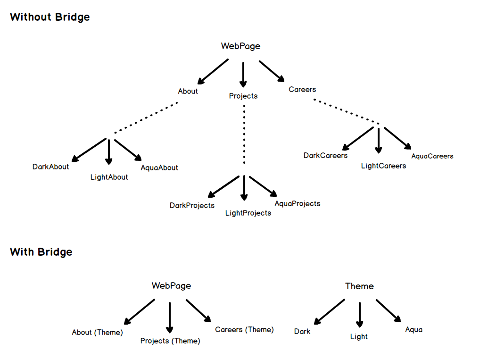
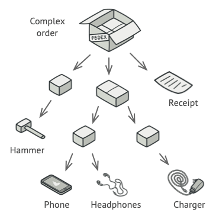

<div dir="rtl">


---

<h3 dir="rtl" align="center">
🎉 توضیح ساده دیزاین پترن‌ها ! 🎉
</h3>

<p dir="rtl" align="center">
فهمیدن دیزاین پترن‌ها از اون موضوع‌هاست که ذهن رو به چالش می‌کشه.
 اینجا سعی می‌کنم با مثال‌های ساده از دنیای واقعی و دنیای کد ، اونو راحت وارد ذهنتون کنم.
</p>

---

منبع اصلی این ریپازیتوری [این](https://github.com/rommel-sunga/design-patterns-for-humans-python) ریپازیتوری هست که
خودش نسخه پایتونیزه شده [این](https://github.com/kamranahmedse/design-patterns-for-humans) ریپازیتوریه.

در ترجمه، تعاریف و مثال‌ها از منابع مختلف فارسی و انگلیسی استفاده شده تا بهترین نتیجه حاصل بشه :)


</div>

---


<div dir="rtl">

<!-- TOC -->

<details open>
<summary><b>فهرست سریع</b></summary>

<br>

| دسته‌بندی | دیزاین پترن‌ها |
| --- | --- |
| 🧱 **اصول SOLID** | [🧱 اصول SOLID (SOLID Principles)](#اصول-solid-solid-principles-)<br>[تک‌وظیفگی (SRP)](#۱-اصل-تک‌وظیفگی-single-responsibility-principle---srp-)<br>[باز/بسته (OCP)](#۲-اصل-بازبسته-openclosed-principle---ocp-)<br>[جایگزینی لیسکوف (LSP)](#۳-اصل-جایگزینی-لیسکوف-liskov-substitution-principle---lsp-)<br>[جداسازی اینترفیس (ISP)](#۴-اصل-جداسازی-اینترفیس-interface-segregation-principle---isp-)<br>[وارونگی وابستگی (DIP)](#۵-اصل-وارونگی-وابستگی-dependency-inversion-principle---dip-) |
| 🏗️ **سازنده (Creational)** | [🏠 کارخانه ساده (Simple Factory)](#کارخانه-ساده-simple-factory-)<br>[🏭 متد کارخانه (Factory Method)](#متد-کارخانه-factory-method-)<br>[🔨 کارخانه انتزاعی (Abstract Factory)](#کارخانه-انتزاعی-abstract-factory-)<br>[👷 سازنده (Builder)](#سازنده-builder-)<br>[🐑 نمونه اولیه (Prototype)](#نمونه-اولیه-prototype-)<br>[💍 تک‌نمونه (Singleton)](#تک‌نمونه-singleton-) |
| 🧩 **ساختاری (Structural)** | [🔌 مبدل (Adapter)](#مبدل-adapter-)<br>[🌉 پل (Bridge)](#پل-bridge-)<br>[🌿 مرکب (Composite)](#مرکب-composite-)<br>[☕ تزئین‌گر (Decorator)](#تزئین‌گر-decorator-)<br>[📦 نما (Facade)](#نما-facade-)<br>[🍃 وزن‌سبک (Flyweight)](#وزن‌سبک-flyweight-)<br>[🎱 پراکسی (Proxy)](#پراکسی-proxy-) |
| 🎭 **رفتاری (Behavioral)** | [🔗 زنجیره مسئولیت (Chain of Responsibility)](#زنجیره-مسئولیت-chain-of-responsibility-)<br>[👮 فرمان (Command)](#فرمان-command-)<br>[➿ پیمایش‌گر (Iterator)](#پیمایش‌گر-iterator-)<br>[👽 میانجی (Mediator)](#میانجی-mediator-)<br>[💾 یادبود (Memento)](#یادبود-memento-)<br>[😎 ناظر (Observer)](#ناظر-observer-)<br>[🏃 بازدیدکننده (Visitor)](#بازدیدکننده-visitor-)<br>[💡 استراتژی (Strategy)](#استراتژی-strategy-)<br>[💢 حالت (State)](#حالت-state-)<br>[📒 متد قالب (Template Method)](#متد-قالب-template-method-) |

</details>

<!-- TOC -->

</div>

---

<div dir="rtl" align="center">

# مقدمه 🚀

</div>

<div dir="rtl">

دیزاین پترن‌ها یک سری دستور العمل برای مقابله با یک سری مشکلات رایج هستند.

اونا یک سری کلاس، پکیج یا کتابخونه نیستند که با اضافه کردنشون به پروژه‌تون جادو کنن. در عوض یک سری راه حل بهتون می‌دن که
در شرایط خاص به مشکل نخوری.

<br>

> پس دیزاین پترن‌ها راه حلی برای مشکلات رایج هستن.

<br>

**ویکی‌پدیا** دیزاین پترن‌ها رو اینطوری توصیف می‌کنه:

> در مهندسی نرم‌افزار، الگوی طراحی یک راه‌حل عمومی قابل تکرار برای مشکلات متداول در زمینه طراحی نرم‌افزار است. الگوی
> طراحی، یک طراحی تمام‌شده نیست که به صورت مستقیم بتواند تبدیل به کد منبع یا ماشین شود؛ بلکه، یک توضیح یا قالب برای حل
> یک
> مسئله در شرایط مختلف است. الگوها در واقع بهترین روش ممکن هستند که یک برنامه‌نویس می‌تواند در هنگام طراحی یک برنامه
> برای
> حل مشکلاتش از آن‌ها استفاده کند.

<br>
<div dir="rtl" align="right">

## هشدار ⚠

</div>

- الگوهای طراحی برای همه مشکلات راه‌حل ندارن.
- سعی نکن حتماً توی پروژه‌هات از اونا استفاده کنی؛ یادت باشه دیزاین پترن‌ها راه‌حلی برای مشکلاتن، نه راهی برای پیدا کردن مشکل. پس خیلی درگیرِ پیدا کردن دلیل برای استفاده ازشون نشو.
- اگه سرِ جای درست از اونا استفاده کنی، پروژه رو از مشکلات نجات می‌دی؛ در غیر این صورت قراره فاجعه به بار بیاد.

<br>
<br>

---

<div align="center">

## اصول SOLID (SOLID Principles) 🧱

</div>

<div dir="rtl">

قبل از اینکه بریم سراغ دیزاین پترن‌ها، باید الفبای کدنویسی تمیز رو یاد بگیریم. این ۵ تا اصل (SOLID) بهتون کمک می‌کنن کدی بنویسید که راحت تغییر کنه و مثل ماکارونی درهم‌پیچیده نشه! 🍝

### ۱. اصل تک‌وظیفگی (Single Responsibility Principle - SRP) 🧙‍♂️
> **قانون طلایی:** هر کلاس فقط و فقط باید **یک دلیل** برای تغییر داشته باشه.

<div align="center">
📦 <b>مثال دنیای واقعی: جعبه ابزار vs چاقوی سوئیسی</b>
</div>

فرض کنید یه چاقوی سوئیسی دارید که هم پیچ‌گوشتیه، هم اره، هم دربازکن. اگه اره‌ش بشکنه، باید کل چاقو رو بدید تعمیر و دیگه پیچ‌گوشتی هم ندارید!
بهترین کار اینه که یه جعبه ابزار داشته باشید که توش پیچ‌گوشتی جدا و اره جدا باشه. اینطوری خرابی یکی به بقیه ربطی نداره.

💻 **توی کد یعنی چی؟**
کلاسی که هم اطلاعات یوزر رو ثبت می‌کنه، هم بهش ایمیل خوش‌آمدگویی می‌فرسته، هم لاگ می‌ندازه، اشتباهه!
*   اگه سرویس ایمیل عوض بشه -> کلاس باید تغییر کنه.
*   اگه فرمت لاگ عوض بشه -> کلاس باید تغییر کنه.
✅ **درست:** `UserRepository` برای دیتابیس، `EmailService` برای ایمیل، `Logger` برای لاگ.

---

### ۲. اصل باز/بسته (Open/Closed Principle - OCP) 🚪
> **قانون طلایی:** نرم‌افزار باید برای **توسعه باز** (Open)، اما برای **تغییر بسته** (Closed) باشه.

<div align="center">
🎮 <b>مثال دنیای واقعی: کنسول بازی</b>
</div>

شما یک پلی‌استیشن دارید. وقتی بازی جدیدی (مثل GTA VI) میاد، لازم نیست کل دستگاه رو باز کنید و سیم‌کشی‌شو عوض کنید تا بازی جدید رو بخونه!
کنسول **بسته** است (سخت‌افزارش ثابت می‌مونه) اما برای **توسعه** بازه (فقط دیسک بازی جدید رو می‌ذارید توش).

💻 **توی کد یعنی چی؟**
اگه فردا مشتری گفت «حالا می‌خوام پرداخت با بیت‌کوین هم داشته باشیم»، نباید برید توی کلاس `PaymentService` و کد `if (type == 'bitcoin')` اضافه کنید (این یعنی تغییر کد قبلی ❌).
باید طوری کد زده باشید که فقط یه کلاس جدید `BitcoinPayment` بسازید و سیستم خودکار بشناستش (این یعنی توسعه ✅).

---

### ۳. اصل جایگزینی لیسکوف (Liskov Substitution Principle - LSP) 🧩
> **قانون طلایی:** کلاس فرزند باید بتونه جای کلاس پدر بشینه، بدون اینکه رفتار برنامه عوض بشه یا ارور بده.

<div align="center">
☕️ <b>مثال دنیای واقعی: دستگاه قهوه‌ساز</b>
</div>

فرض کنید یه کلاس کلی داریم به اسم **«دستگاه قهوه‌ساز»** که یه دستور داره به اسم: `addMilk()` (شیر اضافه کن).
حالا میایم یه کلاس فرزند می‌سازیم به اسم **«دستگاه اسپرسوساز خالص»** (که فقط قهوه سیاه می‌ده و اصلاً مخزن شیر نداره).

اگه توی کد برنامه، هر جا که «دستگاه قهوه‌ساز» لازم داشتیم، بیایم این «اسپرسوساز» رو بذاریم، چی می‌شه؟
وقتی برنامه دستورِ `addMilk()` رو صدا بزنه، اسپرسوساز قاطی می‌کنه یا ارور می‌ده! 💥

چرا؟ چون این فرزند (اسپرسوساز) نتونست به عهد و پیمان پدرش (که قول داده بود شیر اضافه کنه) وفادار بمونه. پس **اصل جایگزینی** رو نقض کرده.

💻 **توی کد یعنی چی؟**
اگه یه کلاس `Bird` (پدر) دارید که متد `fly()` داره، نباید کلاسی مثل `Penguin` (فرزند) بسازید که ازش ارث ببره ولی موقع پرواز ارور `I can't fly` بده!
چون هر جا تو کد از `Bird` استفاده کردید، باید بتونید `Penguin` هم بذارید. اگه پنگوئن پرواز نمی‌کنه، پس نباید از `Bird` (که پرواز می‌کنه) ارث ببره.

---

### ۴. اصل جداسازی اینترفیس (Interface Segregation Principle - ISP) ✂️
> **قانون طلایی:** نباید کلاس‌ها رو مجبور کنیم متد‌هایی رو پیاده‌سازی کنن که بهشون نیاز ندارن.

<div align="center">
🍔 <b>مثال دنیای واقعی: منوی رستوران</b>
</div>

فرض کنید رفتید رستوران و فقط یه «سالاد فصل» می‌خواید. اما رستوران فقط یه منوی غول‌آسا داره به اسم «سوپر منو» که توش پیتزا، کباب، سوشی و سالاد هست. گارسون مجبورتون می‌کنه کل این منوی سنگین رو دستتون بگیرید و ورق بزنید تا برسید به سالاد.
خیلی بهتر بود اگه یه «منوی سالاد» جدا و کوچیک و سبک وجود داشت.

💻 **توی کد یعنی چی؟**
اگه یه اینترفیس گنده دارید به اسم `Animal` که توش هم `fly()` داره، هم `swim()` و هم `bark()`.
حالا کلاس `Dog` مجبوره `fly()` رو هم داشته باشه (و توش خالی باشه)!
✅ **درست:** اینترفیس‌ها رو بشکنید: `Flyable`، `Swimmable`، `Barkable`. حالا سگ فقط `Barkable` و `Swimmable` رو پیاده‌سازی می‌کنه.

---

### ۵. اصل وارونگی وابستگی (Dependency Inversion Principle - DIP) 🔌
> **قانون طلایی:** به چیزهای واقعی و ملموس (Concrete) وابسته نباش، به مفاهیم کلی (Abstractions) وابسته باش.

<div align="center">
🔌 <b>مثال دنیای واقعی: دوشاخه و پریز برق</b>
</div>

لامپ اتاق شما که مستقیم به سیم‌های توی دیوار لحیم نشده، شده؟ معلومه که نه!
چون اگه اینطوری بود، هر بار که می‌خواستید یه سشوار به برق بزنید یا لامپ رو عوض کنید، باید دیوار رو خراب می‌کردید و سیم‌کشی رو تغییر می‌دادید. 🧱
به جاش چی داریم؟ «پریز برق». پریز یه استاندارد (Interface) هست. سشوار و تلویزیون و لامپ، همگی فقط با پریز کار دارن و براشون اصلا مهم نیست که پشت دیوار سیم‌ها چجوری سیم‌کشی شدن.

💻 **توی کد یعنی چی؟**
کلاس `Store` نباید مستقیم بگه `new MySQLDatabase()`. چون اگه فردا بخوایم بریم روی `PostgreSQL` بیچاره می‌شیم.
کلاس `Store` باید بگه «من یه چیزی می‌خوام که `IDatabase` باشه». حالا اینکه اون پشت MySQL هست یا Mongo، برای `Store` مهم نیست.

</div>

<br>

---

<br>

<div align="center">

# الگوهای سازنده (Creational Design Patterns) 🧱

</div>

به زبون ساده:

> الگوهای طراحی سازنده، به مشکلات مربوط به ساخت آبجکت‌ها می‌پردازن.

ویکی‌پدیا:

<div dir="ltr">

> In software engineering, creational design patterns are design patterns that deal with object creation mechanisms,
> trying to create objects in a manner

</div>

<br>

---

<div align="center">

## کارخانه ساده (Simple Factory) 🏠

</div>

<div align="center">
🚪 <b>مثال دنیای واقعی: کارگاه نجاری</b>
</div>

فرض کنید دارید یه خونه می‌سازید. برای هر اتاقی یه در لازم دارید.
آیا منطقیه که برای هر در، خودتون اره و تیشه بردارید و شروع کنید به بریدن چوب؟ 🪚 نه! اینطوری که تو گل می‌مونید.

راه حل چیه؟ زنگ می‌زنید به «کارگاه نجاری» (Factory) و می‌گید: «آقا یه در چوبی با عرض ۹۰ و ارتفاع ۲۱۰ می‌خوام».
دیگه براتون مهم نیست نجار چجوری چوب رو می‌بره یا از چه چسبی استفاده می‌کنه. شما فقط محصول نهایی رو تحویل می‌گیرید.

💡 **به زبون ساده:**
> این پترن می‌گه: **«بی‌خیالِ `new` کردنِ مستقیم شو! ساختن آبجکت رو بسپار به یه متد مخصوص.»**
> اینطوری کدتون تمیز می‌مونه و اگه فردا خواستید روش ساخت در رو عوض کنید، فقط همون کارگاه رو تغییر می‌دید، نه کل خونه رو.

ویکی‌پدیا:

<div dir="ltr">

> In object-oriented programming (OOP), a factory is an object for creating other objects – formally a factory is a
> function or method that returns objects of a varying prototype or class from some method call, which is assumed to
> be "
> new".

</div>

**مثال برنامه‌نویسی**

توی این مثال دقیقاً همون سناریوی در و کارگاه رو پیاده‌سازی می‌کنیم.
اول یه اینترفیس `Door` داریم، بعد پیاده‌سازی `WoodenDoor`، و در نهایت `DoorFactory` که برامون در می‌سازه.

<details>
<summary>Python</summary>

<div dir="ltr">

```python
class Door:
    def getWidth(self):
        pass

    def getHeight(self):
        pass


class WoodenDoor(Door):
    width = None
    height = None

    def __init__(self, width=5, height=5):
        self.width = width
        self.height = height

    def getWidth(self):
        return self.width

    def getHeight(self):
        return self.height


class DoorFactory:
    @staticmethod
    def makeDoor(width, height):
        return WoodenDoor(width, height)


# ----------------------------
door = DoorFactory.makeDoor(10, 10)
print(door.getHeight())
print(door.getWidth())
```

</div>

</details>

<details>
<summary>Typescript</summary>

<div dir="ltr">

```typescript
class Door {
    getWidth(): void {
    }

    getHeight(): void {
    }
}

class WoodenDoor extends Door {
    width: number | null;
    height: number | null;

    constructor(width: number = 5, height: number = 5) {
        super();
        this.width = width;
        this.height = height;
    }

    getWidth(): number {
        return this.width;
    }

    getHeight(): number {
        return this.height;
    }
}

class DoorFactory {
    static makeDoor(width: number, height: number): WoodenDoor {
        return new WoodenDoor(width, height);
    }
}

// ----------------------------

let door = DoorFactory.makeDoor(10, 10);
console.log(door.getHeight());
console.log(door.getWidth());
```

</div>

</details>

<details>
<summary>JavaScript</summary>

<div dir="ltr">

```javascript
class Door {
    getWidth() {
    }

    getHeight() {
    }
}

class WoodenDoor extends Door {
    constructor(width = 5, height = 5) {
        super();
        this.width = width;
        this.height = height;
    }

    getWidth() {
        return this.width;
    }

    getHeight() {
        return this.height;
    }
}

class DoorFactory {
    static makeDoor(width, height) {
        return new WoodenDoor(width, height);
    }
}


let door = DoorFactory.makeDoor(10, 10);
console.log(door.getHeight());
console.log(door.getWidth());
```

</div>

</details>

<details>
<summary>C#</summary>

<div dir="ltr">

```csharp
public interface IDoor
{
    int GetHeight();
    int GetWidth();
}

public class WoodenDoor : IDoor
{
    private int Height { get; set; }
    private int Width { get; set; }

    public WoodenDoor(int width, int height)
    {
        this.Width = width;
        this.Height = height;
    }

    public int GetHeight()
    {
        return this.Height;
    }
    public int GetWidth()
    {
        return this.Width;
    }
}

public static class DoorFactory
{
    public static IDoor MakeDoor(int width, int height)
    {
        return new WoodenDoor(width, height);
    }
}


// ----------------------------

var door = DoorFactory.MakeDoor(80, 30);
Console.WriteLine($"Height of Door : {door.GetHeight()}");
Console.WriteLine($"Width of Door : {door.GetWidth()}");
```

</div>

</details>

<details>
<summary>PHP</summary>

<div dir="ltr">

```php
interface DoorInterface {
    public function getHeight();
    public function getWidth();
}

class WoodenDoor implements DoorInterface {
    private $width;
    private $height;

    public function __construct($width, $height) {
        $this->width = $width;
        $this->height = $height;
    }

    public function getHeight() {
        return $this->height;
    }
    public function getWidth() {
        return $this->width;
    }
}

class DoorFactory {
    public static function makeDoor($width, $height) {
        return new WoodenDoor($width, $height);
    }
}

$door = DoorFactory::makeDoor(80, 30);
echo "Height of Door : " . $door->getHeight() . "\n";
echo "Width of Door : " . $door->getWidth() . "\n";

```

</div>

</details>

<details>
<summary>Go</summary>

<div dir="ltr">

```go
package main

import "fmt"

type Door interface {
	getHeight() int
	getWidth() int
}

type WoodenDoor struct {
	width  int
	height int
}

func NewWoodenDoor(width, height int) *WoodenDoor {
	return &WoodenDoor{width: width, height: height}
}

func (w *WoodenDoor) getHeight() int {
	return w.height
}

func (w *WoodenDoor) getWidth() int {
	return w.width
}

type DoorFactory struct{}

func (df *DoorFactory) makeDoor(width, height int) Door {
	return NewWoodenDoor(width, height)
}

func main() {
	doorFactory := &DoorFactory{}
	door := doorFactory.makeDoor(80, 30)
	fmt.Printf("Height of Door : %d\n", door.getHeight())
	fmt.Printf("Width of Door : %d\n", door.getWidth())
}

```

</div>

</details>

<details>
  <summary>Java</summary>

<div dir="ltr">

```java
public class Door {
    private int width;
    private int height;

    public Door(int width, int height) {
        this.width = width;
        this.height = height;
    }

    public int getHeight() {
        return height;
    }
    public void setHeight(int height) {
        this.height = height;
    }
    public int getWidth() {
        return width;
    }
    public void setWidth(int width) {
        this.width = width;
    }
}

public class WoodenDoor extends Door {

    WoodenDoor(int width, int height) {
        super(width, height);
    }
}

public class DoorFactory {
    public static WoodenDoor makeDoor(int width, int height) {
        return new WoodenDoor(width, height);
    }
}

// ----------------------------

Door door = DoorFactory.makeDoor(10, 10);
System.out.println(door.getHeight());
System.out.println(door.getWidth());
```

</div>
</details>

<details>
<summary>C++</summary>

<div dir="ltr">

```cpp
#include <iostream>

// Door interface
class Door {
public:
    virtual ~Door() = default;
    virtual double getWidth() const = 0;
    virtual double getHeight() const = 0;
};

// Wooden door implementation
class WoodenDoor : public Door {
private:
    double width;
    double height;

public:
    WoodenDoor(double width = 5.0, double height = 5.0) 
        : width(width), height(height) {}
    
    double getWidth() const override {
        return width;
    }
    
    double getHeight() const override {
        return height;
    }
};

// Door factory
class DoorFactory {
public:
    static Door* makeDoor(double width, double height) {
        return new WoodenDoor(width, height);
    }
};

// Usage
int main() {
    Door* door = DoorFactory::makeDoor(100, 200);
    std::cout << "Width: " << door->getWidth() << std::endl;
    std::cout << "Height: " << door->getHeight() << std::endl;
    
    delete door;
    return 0;
}
```

</div>
</details>

<br>

---

<div align="center">

## متد کارخانه (Factory Method) 🏭

</div>

<div align="center">
👔 <b>مثال دنیای واقعی: مدیر استخدام</b>
</div>

فرض کنید یه مدیر استخدام (`HiringManager`) داریم. فرآیند استخدام توی این شرکت یه قانون کلی داره:
۱. مصاحبه‌کننده رو انتخاب کن.
۲. ازش بخواه سوال بپرسه.

اما نکته اینجاست: مدیر استخدامِ کل، خودش نمی‌دونه برای هر پوزیشن چه سوالای تخصصی‌ای باید پرسیده بشه یا چه کسی صلاحیت داره. پس چی‌کار می‌کنه؟ ساختن «مصاحبه‌کننده» رو می‌سپاره به مدیرهای هر بخش.

*   اگه استخدام برای بخش **فنی** باشه، مدیر فنی (`DevelopmentManager`) میاد و یه **برنامه‌نویس** (`Developer`) رو می‌سازه تا سوالای فنی بپرسه.
*   اگه استخدام برای بخش **مارکتینگ** باشه، مدیر مارکتینگ (`MarketingManager`) میاد و یه **بازاریاب** (`CommunityExecutive`) رو می‌سازه.

پس «فرآیند کلی مصاحبه» ثابته، اما اینکه «کی قراره سوال بپرسه» (یا همون ساختن آبجکت مصاحبه‌کننده) رو می‌سپاریم به زیرکلاس‌ها.

💡 **به زبون ساده:**
> این پترن می‌گه: **«من (کلاس پدر) منطق کلی کار رو می‌دونم، اما ساختن ابزار دقیقش (آبجکت) رو می‌سپارم به بچه‌هام (کلاس‌های فرزند).»**

ویکی‌پدیا:

<div dir="ltr">

> In class-based programming, the factory method pattern is a creational pattern that uses factory methods to deal with
> the problem of creating objects without having to specify the exact class of the object that will be created. This is
> done by creating objects by calling a factory method—either specified in an interface and implemented by child
> classes,
> or implemented in a base class and optionally overridden by derived classes—rather than by calling a constructor.

</div>

**مثال برنامه‌نویسی**

بیا از مثال مدیر استخدام برای درک بهتر استفاده کنیم.

پس اول یک اینترفیس برای مصاحبه کننده‌ها می‌سازیم و چند پیاده‌سازی هم برای اون ایجاد می‌کنیم.

بعد از اون `HiringManager` رو پیاده‌سازی می‌کنیم

در نهایت هر فرزند می‌تونه ازش ارث بری کنه و متد `makeInterviewer` خودش رو داشته باشه:

<details>
<summary>Python</summary>

<div dir="ltr">

```python
class Interviewer:
    def askQuestions(self):
        pass


class Developer(Interviewer):
    def askQuestions(self):
        print('Asking about design patterns')


class CommunityExecutive(Interviewer):
    def askQuestions(self):
        print('Asking about community building')


class HiringManager:
    def makeInterviewer(self):
        pass

    def takeInterview(self):
        interviewer = self.makeInterviewer()
        interviewer.askQuestions()


class DevelopmentManager(HiringManager):
    def makeInterviewer(self):
        return Developer()


class MarketingManager(HiringManager):
    def makeInterviewer(self):
        return CommunityExecutive()


# ----------------------------

devManager = DevelopmentManager()
devManager.takeInterview()

marketingManager = MarketingManager()
marketingManager.takeInterview()
```

</div>

</details>

<details>
<summary>Typescript</summary>

<div dir="ltr">

```typescript
interface Interviewer {
  askQuestions(): void;
}

class Developer implements Interviewer {
  askQuestions(): void {
    console.log("Asking about design patterns");
  }
}

class CommunityExecutive implements Interviewer {
  askQuestions(): void {
    console.log("Asking about community building");
  }
}

abstract class HiringManager {
  abstract makeInterviewer(): Interviewer;

  takeInterview(): void {
    let interviewer = this.makeInterviewer();
    interviewer.askQuestions();
  }
}

class DevelopmentManager extends HiringManager {
  makeInterviewer(): Developer {
    return new Developer();
  }
}

class MarketingManager extends HiringManager {
  makeInterviewer(): CommunityExecutive {
    return new CommunityExecutive();
  }
}

let devManager = new DevelopmentManager();
devManager.takeInterview();

let marketingManager = new MarketingManager();
marketingManager.takeInterview();
```

</div>

</details>

<details>
<summary>JavaScript</summary>

<div dir="ltr">

```javascript
class Developer {
    askQuestions() {
        console.log("Asking about design patterns");
    }
}

class CommunityExecutive {
    askQuestions() {
        console.log("Asking about community building");
    }
}

class HiringManager {
    takeInterview() {
        const interviewer = this.makeInterviewer();
        interviewer.askQuestions();
    }
}

class DevelopmentManager extends HiringManager {
    makeInterviewer() {
        return new Developer();
    }
}

class MarketingManager extends HiringManager {
    makeInterviewer() {
        return new CommunityExecutive();
    }
}

const devManager = new DevelopmentManager();
devManager.takeInterview();

const marketingManager = new MarketingManager();
marketingManager.takeInterview();

```

</div>

</details>

<details>
<summary>C#</summary>

<div dir="ltr">

```csharp

interface IInterviewer
{
    void AskQuestions();
}

class Developer : IInterviewer
{
    public void AskQuestions()
    {
        Console.WriteLine("Asking about design patterns!");
    }
}

class CommunityExecutive : IInterviewer
{
    public void AskQuestions()
    {
        Console.WriteLine("Asking about community building!");
    }
}

abstract class HiringManager
{
    // Factory method
    abstract protected IInterviewer MakeInterviewer();
    public void TakeInterview()
    {
        var interviewer = this.MakeInterviewer();
        interviewer.AskQuestions();
    }
}

class DevelopmentManager : HiringManager
{
    protected override IInterviewer MakeInterviewer()
    {
        return new Developer();
    }
}

class MarketingManager : HiringManager
{
    protected override IInterviewer MakeInterviewer()
    {
        return new CommunityExecutive();
    }
}


// ----------------------------

var devManager = new DevelopmentManager();
devManager.TakeInterview(); //Output : Asking about design patterns!

var marketingManager = new MarketingManager();
marketingManager.TakeInterview();//Output : Asking about community building!

```

</div>

</details>

<details>
<summary>PHP</summary>

<div dir="ltr">

```php
interface InterviewerInterface
{
    public function askQuestions();
}

class Developer implements InterviewerInterface
{
    public function askQuestions()
    {
        echo "Asking about design patterns!";
    }
}

class CommunityExecutive implements InterviewerInterface
{
    public function askQuestions()
    {
        echo "Asking about community building!";
    }
}

abstract class HiringManager
{
    // Factory method
    abstract protected function makeInterviewer(): InterviewerInterface;

    public function takeInterview()
    {
        $interviewer = $this->makeInterviewer();
        $interviewer->askQuestions();
    }
}

class DevelopmentManager extends HiringManager
{
    protected function makeInterviewer(): InterviewerInterface
    {
        return new Developer();
    }
}

class MarketingManager extends HiringManager
{
    protected function makeInterviewer(): InterviewerInterface
    {
        return new CommunityExecutive();
    }
}


// Usage
$devManager = new DevelopmentManager();
$devManager->takeInterview(); // Output: Asking about design patterns!

$marketingManager = new MarketingManager();
$marketingManager->takeInterview(); // Output: Asking about community building!

```

</div>

</details>

<details>
<summary>Go</summary>

<div dir="ltr">

```go
package main

import "fmt"

type Interviewer interface {
	AskQuestions()
}

type Developer struct{}

func (d *Developer) AskQuestions() {
	fmt.Println("Asking about design patterns!")
}

type CommunityExecutive struct{}

func (ce *CommunityExecutive) AskQuestions() {
	fmt.Println("Asking about community building!")
}

type HiringManager interface {
	MakeInterviewer() Interviewer
	TakeInterview()
}

type DevelopmentManager struct{}

func (dm *DevelopmentManager) MakeInterviewer() Interviewer {
	return &Developer{}
}

func (dm *DevelopmentManager) TakeInterview() {
	interviewer := dm.MakeInterviewer()
	interviewer.AskQuestions()
}

type MarketingManager struct{}

func (mm *MarketingManager) MakeInterviewer() Interviewer {
	return &CommunityExecutive{}
}

func (mm *MarketingManager) TakeInterview() {
	interviewer := mm.MakeInterviewer()
	interviewer.AskQuestions()
}

func main() {
	devManager := &DevelopmentManager{}
	devManager.TakeInterview() // Output : Asking about design patterns!

	marketingManager := &MarketingManager{}
	marketingManager.TakeInterview() // Output : Asking about community building!
}

```

</div>

</details>

<details>
  <summary>Java</summary>

<div dir="ltr">

```java
interface Interviewer {
  void askQuestions();
}

class Developer implements Interviewer {

  @Override
  public void askQuestions() {
    System.out.println("Asking about design patterns");
  }
}

class CommunityExecutive implements Interviewer {

  @Override
  public void askQuestions() {
    System.out.println("Asking about community building");
  }
}

abstract class HiringManager {
  abstract Interviewer makeInterviewer();
  public void takeInterview() {
    Interviewer interviewer = this.makeInterviewer();
    interviewer.askQuestions();
  }
}

class DevelopmentManager extends HiringManager {
  public Developer makeInterviewer() {
    return new Developer();
  }
}

class MarketingManager extends HiringManager {
  public CommunityExecutive makeInterviewer() {
    return new CommunityExecutive();
  }
}

// ----------------------------

DevelopmentManager devManager = new DevelopmentManager();
devManager.takeInterview();

MarketingManager marketingManager = new MarketingManager();
marketingManager.takeInterview();
```

</div>
</details>

<details>
<summary>C++</summary>

<div dir="ltr">

```cpp
#include <iostream>
#include <memory>

// Interviewer interface
class Interviewer {
public:
    virtual ~Interviewer() = default;
    virtual void askQuestions() = 0;
};

// Developer interviewer
class Developer : public Interviewer {
public:
    void askQuestions() override {
        std::cout << "Asking about design patterns" << std::endl;
    }
};

// Community executive interviewer
class CommunityExecutive : public Interviewer {
public:
    void askQuestions() override {
        std::cout << "Asking about community building" << std::endl;
    }
};

// Abstract hiring manager
class HiringManager {
public:
    virtual ~HiringManager() = default;
    virtual std::unique_ptr<Interviewer> makeInterviewer() = 0;
    
    void takeInterview() {
        auto interviewer = makeInterviewer();
        interviewer->askQuestions();
    }
};

// Development manager
class DevelopmentManager : public HiringManager {
public:
    std::unique_ptr<Interviewer> makeInterviewer() override {
        return std::make_unique<Developer>();
    }
};

// Marketing manager
class MarketingManager : public HiringManager {
public:
    std::unique_ptr<Interviewer> makeInterviewer() override {
        return std::make_unique<CommunityExecutive>();
    }
};

// Usage
int main() {
    DevelopmentManager devManager;
    devManager.takeInterview(); // Output: Asking about design patterns
    
    MarketingManager marketingManager;
    marketingManager.takeInterview(); // Output: Asking about community building
    
    return 0;
}
```

</div>
</details>

<br>

**چه موقع باید ازش استفاده کنیم؟**

اساساً زمانی ازین الگو استفاده می‌شه که چندین کلاس با ریشه مشترک داریم (یعنی چندین کلاس یک کلاس parent رو پیاده‌سازی
می‌کنند) و با توجه به شرایط تصمیم می‌گیریم از یکی از اون‌ها استفاده کنیم.

<br>

---

<div align="center">

## کارخانه انتزاعی (Abstract Factory) 🔨

</div>

<div align="center">
🛠 <b>مثال دنیای واقعی: سرویس کامل نصب در</b>
</div>

بیاید مثال قبلی رو کامل‌تر کنیم. فرض کنید شما فقط «در» نمی‌خواید، بلکه «نصاب» هم می‌خواید.
نکته مهم اینه که اینا باید با هم **ست** باشن:
*   اگه در **چوبی** خریدید، باید **نجار** بیاد نصبش کنه.
*   اگه در **آهنی** خریدید، باید **جوشکار** بیاد.

فاجعه اونجاست که در چوبی بخرید ولی جوشکار بیاد دم خونه! 🔥

اینجاست که **Abstract Factory** میاد وسط. ما به جای اینکه در و نصاب رو جدا جدا سفارش بدیم، زنگ می‌زنیم به «کارخونه محصولات چوبی». اونا هم در چوبی می‌دن، هم نجار رو می‌فرستن. اینطوری خیالمون راحته که همه چی با هم جوره.

💡 **به زبون ساده:**
> این پترن کارخونه‌ای از کارخونه‌هاست! یعنی یه کارخونه که بسته‌های کامل و هماهنگ (Products Family) رو تحویل می‌ده تا مبادا قطعات ناسازگار کنار هم قرار بگیرن.

ویکی‌پدیا:

<div dir="ltr">

> The abstract factory pattern provides a way to encapsulate a group of individual factories that have a common theme
> without specifying their concrete classes

</div>

<br>

**مثال برنامه‌نویسی**

خب همون مثال ساخت خونه و نیاز به درب‌های مختلف رو ترجمه می‌کنیم.

اول باید اینترفیس درب رو بسازیم و چند پیاده‌سازی ازش ایجاد کنیم.

در مرحله بعد برای هر درب متخصص مربوطه رو ایجاد می‌کنیم.

و در مرحله آخر سراغ پیاده‌سازی دیزاین پترن‌مون می‌ریم.

برای مثال کلاس `WoodenDoorFactory` زمانی استفاده می‌شه که نیاز به درب چوبی داریم و کارش اینه که برای ایجاد آبجکت درب (که
اینجا
درب چوبی هست) از کلاس `WoodenDoor` و برای ایجاد آبجکت متخصص (که اینجا نجار هست) از `Carpenter` استفاده کنه.

این موضوع برای درب آهنی و ... هم بطور مشابه پیاده‌سازی می‌شه.

<details>
<summary>Python</summary>

<div dir="ltr">

```python
class Door:
    def getDescription(self):
        pass


class WoodenDoor(Door):
    def getDescription(self):
        print('I am a wooden door')


class IronDoor(Door):
    def getDescription(self):
        print('I am an iron door')


class DoorFittingExpert:
    def getDescription(self):
        pass


class Welder(DoorFittingExpert):
    def getDescription(self):
        print('I can only fit iron doors')


class Carpenter(DoorFittingExpert):
    def getDescription(self):
        print('I can only fit wooden doors')


class DoorFactory:
    def makeDoor(self):
        pass

    def makeFittingExpert(self):
        pass


class WoodenDoorFactory(DoorFactory):
    def makeDoor(self):
        return WoodenDoor()

    def makeFittingExpert(self):
        return Carpenter()


class IronDoorFactory(DoorFactory):
    def makeDoor(self):
        return IronDoor()

    def makeFittingExpert(self):
        return Welder()


# ----------------------------

woodenFactory = WoodenDoorFactory()

door = woodenFactory.makeDoor()
expert = woodenFactory.makeFittingExpert()

door.getDescription()
expert.getDescription()

# ----------------------------

ironFactory = IronDoorFactory()

door = ironFactory.makeDoor()
expert = ironFactory.makeFittingExpert()

door.getDescription()
expert.getDescription()
```

</div>

**همونطور که می‌بیند، می‌تونیم بطور مشابه با هر دو نوع درب برخورد کنیم و ازین موضوع مطمئن باشیم که متخصص اشتباه برای یک
درب
انتخاب نمی‌کنیم.**

</details>

<details>
<summary>Typescript</summary>

<div dir="ltr">

```typescript
interface Door {
    getDescription(): void;
}

class WoodenDoor implements Door {
    getDescription(): void {
        console.log("I am a wooden door");
    }
}

class IronDoor implements Door {
    getDescription(): void {
        console.log("I am an iron door");
    }
}

interface DoorFittingExpert {
    getDescription(): void;
}

class Welder implements DoorFittingExpert {
    getDescription(): void {
        console.log("I can only fit iron doors");
    }
}

class Carpenter implements DoorFittingExpert {
    getDescription(): void {
        console.log("I can only fit wooden doors");
    }
}

abstract class DoorFactory {
    abstract makeDoor(): Door;

    abstract makeFittingExpert(): DoorFittingExpert;
}

class WoodenDoorFactory extends DoorFactory {
    makeDoor(): WoodenDoor {
        return new WoodenDoor();
    }

    makeFittingExpert(): Carpenter {
        return new Carpenter();
    }
}

class IronDoorFactory extends DoorFactory {
    makeDoor(): IronDoor {
        return new IronDoor();
    }

    makeFittingExpert(): Welder {
        return new Welder();
    }
}
// ----------------------------

let woodenFactory = new WoodenDoorFactory();

let door = woodenFactory.makeDoor();
let expert = woodenFactory.makeFittingExpert();

door.getDescription();
expert.getDescription();

// ----------------------------

let ironFactory = new IronDoorFactory();

door = ironFactory.makeDoor();
expert = ironFactory.makeFittingExpert();

door.getDescription();
expert.getDescription();

```

</div>

**همونطور که می‌بیند، می‌تونیم بطور مشابه با هر دو نوع درب برخورد کنیم و ازین موضوع مطمئن باشیم که متخصص اشتباه برای یک
درب
انتخاب نمی‌کنیم.**

</details>

<details>
<summary>JavaScript</summary>

<div dir="ltr">

```javascript
class WoodenDoor {
    getDescription() {
        console.log("I am a wooden door");
    }
}

class IronDoor {
    getDescription() {
        console.log("I am an iron door");
    }
}

class Welder {
    getDescription() {
        console.log("I can only fit iron doors");
    }
}

class Carpenter {
    getDescription() {
        console.log("I can only fit wooden doors");
    }
}

class DoorFactory {
    makeDoor() {
        throw new Error("makeDoor() must be implemented by subclasses");
    }

    makeFittingExpert() {
        throw new Error("makeFittingExpert() must be implemented by subclasses");
    }
}

class WoodenDoorFactory extends DoorFactory {
    makeDoor() {
        return new WoodenDoor();
    }

    makeFittingExpert() {
        return new Carpenter();
    }
}

class IronDoorFactory extends DoorFactory {
    makeDoor() {
        return new IronDoor();
    }

    makeFittingExpert() {
        return new Welder();
    }
}


let woodenFactory = new WoodenDoorFactory();

let door = woodenFactory.makeDoor();
let expert = woodenFactory.makeFittingExpert();

door.getDescription();
expert.getDescription();

let ironFactory = new IronDoorFactory();

door = ironFactory.makeDoor();
expert = ironFactory.makeFittingExpert();

door.getDescription();
expert.getDescription();
```

</div>

</details>

<details>
<summary>C#</summary>

<div dir="ltr">

```csharp

interface IDoor {

  void GetDescription();

}
class WoodenDoor : IDoor
{
  public void GetDescription()
  {
    Console.WriteLine("I am a wooden door");
  }
}

class IronDoor : IDoor
{
  public void GetDescription()
  {
    Console.WriteLine("I am a iron door");
  }
}

interface IDoorFittingExpert
{
  void GetDescription();
}

class Welder : IDoorFittingExpert
{
  public void GetDescription()
  {
    Console.WriteLine("I can only fit iron doors");
  }
}

class Carpenter : IDoorFittingExpert
{
  public void GetDescription()
  {
    Console.WriteLine("I can only fit wooden doors");
  }
}

interface IDoorFactory {
  IDoor MakeDoor();
  IDoorFittingExpert MakeFittingExpert();
}

// Wooden factory to return carpenter and wooden door
class WoodenDoorFactory : IDoorFactory
{
  public IDoor MakeDoor()
  {
    return new WoodenDoor();
  }

  public IDoorFittingExpert MakeFittingExpert()
  {
    return new Carpenter();
  }
}

// Iron door factory to get iron door and the relevant fitting expert
class IronDoorFactory : IDoorFactory
{
  public IDoor MakeDoor()
  {
    return new IronDoor();
  }

  public IDoorFittingExpert MakeFittingExpert()
  {
    return new Welder();
  }
}
// ----------------------------
var woodenDoorFactory = new WoodenDoorFactory();

var woodenDoor = woodenDoorFactory.MakeDoor();
var woodenDoorFittingExpert = woodenDoorFactory.MakeFittingExpert();

woodenDoor.GetDescription(); //Output : I am a wooden door
woodenDoorFittingExpert.GetDescription();//Output : I can only fit woooden doors

// ----------------------------

var ironDoorFactory = new IronDoorFactory();

var ironDoor = ironDoorFactory.MakeDoor();
var ironDoorFittingExpert = ironDoorFactory.MakeFittingExpert();

ironDoor.GetDescription();//Output : I am a iron door
ironDoorFittingExpert.GetDescription();//Output : I can only fit iron doors

```

</div>

**همونطور که می‌بیند، می‌تونیم بطور مشابه با هر دو نوع درب برخورد کنیم و ازین موضوع مطمئن باشیم که متخصص اشتباه برای یک
درب
انتخاب نمی‌کنیم.**

</details>

<details>
<summary>PHP</summary>

<div dir="ltr">

```php

interface DoorInterface {
  public function getDescription();
}

class WoodenDoor implements DoorInterface {
  public function getDescription() {
    echo "I am a wooden door";
  }
}

class IronDoor implements DoorInterface {
  public function getDescription() {
    echo "I am an iron door";
  }
}

interface DoorFittingExpertInterface {
  public function getDescription();
}

class Welder implements DoorFittingExpertInterface {
  public function getDescription() {
    echo "I can only fit iron doors";
  }
}

class Carpenter implements DoorFittingExpertInterface {
  public function getDescription() {
    echo "I can only fit wooden doors";
  }
}

interface DoorFactoryInterface {
  public function makeDoor(): DoorInterface;
  public function makeFittingExpert(): DoorFittingExpertInterface;
}

// Wooden factory to return carpenter and wooden door
class WoodenDoorFactory implements DoorFactoryInterface {
  public function makeDoor(): DoorInterface {
    return new WoodenDoor();
  }

  public function makeFittingExpert(): DoorFittingExpertInterface {
    return new Carpenter();
  }
}

// Iron door factory to get iron door and the relevant fitting expert
class IronDoorFactory implements DoorFactoryInterface {
  public function makeDoor(): DoorInterface {
    return new IronDoor();
  }

  public function makeFittingExpert(): DoorFittingExpertInterface {
    return new Welder();
  }
}


// Usage
$woodenDoorFactory = new WoodenDoorFactory();

$woodenDoor = $woodenDoorFactory->makeDoor();
$woodenDoorFittingExpert = $woodenDoorFactory->makeFittingExpert();

$woodenDoor->getDescription(); // Output: I am a wooden door
$woodenDoorFittingExpert->getDescription(); // Output: I can only fit wooden doors


$ironDoorFactory = new IronDoorFactory();

$ironDoor = $ironDoorFactory->makeDoor();
$ironDoorFittingExpert = $ironDoorFactory->makeFittingExpert();

$ironDoor->getDescription(); // Output: I am an iron door
$ironDoorFittingExpert->getDescription(); // Output: I can only fit iron doors

```

</div>

**همونطور که می‌بیند، می‌تونیم به‌طور مشابه با هر دو نوع درب برخورد کنیم و ازین موضوع مطمئن باشیم که متخصص اشتباه برای یک
درب
انتخاب نمی‌کنیم.**

</details>

<details>
<summary>Go</summary>

<div dir="ltr">

```go

package main

import "fmt"

type IDoor interface {
	GetDescription()
}

type WoodenDoor struct{}

func (w *WoodenDoor) GetDescription() {
	fmt.Println("I am a wooden door")
}

type IronDoor struct{}

func (i *IronDoor) GetDescription() {
	fmt.Println("I am an iron door")
}

type IDoorFittingExpert interface {
	GetDescription()
}

type Carpenter struct{}

func (c *Carpenter) GetDescription() {
	fmt.Println("I can only fit wooden doors")
}

type Welder struct{}

func (w *Welder) GetDescription() {
	fmt.Println("I can only fit iron doors")
}

type IDoorFactory interface {
	MakeDoor() IDoor
	MakeFittingExpert() IDoorFittingExpert
}

type WoodenDoorFactory struct{}

func (w *WoodenDoorFactory) MakeDoor() IDoor {
	return &WoodenDoor{}
}

func (w *WoodenDoorFactory) MakeFittingExpert() IDoorFittingExpert {
	return &Carpenter{}
}

type IronDoorFactory struct{}

func (i *IronDoorFactory) MakeDoor() IDoor {
	return &IronDoor{}
}

func (i *IronDoorFactory) MakeFittingExpert() IDoorFittingExpert {
	return &Welder{}
}

func main() {
	woodenDoorFactory := &WoodenDoorFactory{}

	woodenDoor := woodenDoorFactory.MakeDoor()
	woodenDoorFittingExpert := woodenDoorFactory.MakeFittingExpert()

	woodenDoor.GetDescription()           // Output: I am a wooden door
	woodenDoorFittingExpert.GetDescription() // Output: I can only fit wooden doors

	ironDoorFactory := &IronDoorFactory{}

	ironDoor := ironDoorFactory.MakeDoor()
	ironDoorFittingExpert := ironDoorFactory.MakeFittingExpert()

	ironDoor.GetDescription()           // Output: I am an iron door
	ironDoorFittingExpert.GetDescription() // Output: I can only fit iron doors
}

```

</div>

**همونطور که می‌بیند، می‌تونیم به‌طور مشابه با هر دو نوع درب برخورد کنیم و ازین موضوع مطمئن باشیم که متخصص اشتباه برای یک
درب
انتخاب نمی‌کنیم.**

</details>

<details>
  <summary>Java</summary>

<div dir="ltr">

```java
interface Door {
    void getDescription();
}

class WoodenDoor implements Door {
    @Override
    public void getDescription() {
        System.out.println("I am a wooden door");
    }
}

class IronDoor implements Door {
    @Override
    public void getDescription() {
        System.out.println("I am an iron door");
    }
}

interface DoorFittingExpert {
    void getDescription();
}

class Welder implements DoorFittingExpert {
    @Override
    public void getDescription() {
        System.out.println("I can only fit iron doors");
    }
}

class Carpenter implements DoorFittingExpert {
    @Override
    public void getDescription() {
        System.out.println("I can only fit wooden doors");
    }
}

interface DoorFactory {
    Door makeDoor();
    DoorFittingExpert makeFittingExpert();
}

class WoodenDoorFactory implements DoorFactory {
    @Override
    public WoodenDoor makeDoor() {
        return new WoodenDoor();
    }

    @Override
    public Carpenter makeFittingExpert() {
        return new Carpenter();
    }
}

class IronDoorFactory implements DoorFactory {
    public IronDoor makeDoor() {
        return new IronDoor();
    }

    public Welder makeFittingExpert() {
        return new Welder();
    }
}

// ----------------------------

WoodenDoorFactory woodenDoorFactory = new WoodenDoorFactory();
WoodenDoor woodenDoor = woodenDoorFactory.makeDoor();
Carpenter carpenter = woodenDoorFactory.makeFittingExpert();

woodenDoor.getDescription(); // Output: I am a wooden door
carpenter.getDescription(); // Output: I can only fit wooden doors

IronDoorFactory ironDoorFactory = new IronDoorFactory();
IronDoor ironDoor = ironDoorFactory.makeDoor();
Welder welder = ironDoorFactory.makeFittingExpert();

ironDoor.getDescription(); // Output: I am an iron door
welder.getDescription(); // Output: I can only fit iron doors
```

</div>
</details>

<details>
<summary>C++</summary>

<div dir="ltr">

```cpp
#include <iostream>
#include <memory>

// Door interface
class Door {
public:
    virtual ~Door() = default;
    virtual void getDescription() = 0;
};

// Wooden door
class WoodenDoor : public Door {
public:
    void getDescription() override {
        std::cout << "I am a wooden door" << std::endl;
    }
};

// Iron door
class IronDoor : public Door {
public:
    void getDescription() override {
        std::cout << "I am an iron door" << std::endl;
    }
};

// Door fitting expert interface
class DoorFittingExpert {
public:
    virtual ~DoorFittingExpert() = default;
    virtual void getDescription() = 0;
};

// Welder
class Welder : public DoorFittingExpert {
public:
    void getDescription() override {
        std::cout << "I can only fit iron doors" << std::endl;
    }
};

// Carpenter
class Carpenter : public DoorFittingExpert {
public:
    void getDescription() override {
        std::cout << "I can only fit wooden doors" << std::endl;
    }
};

// Door factory interface
class DoorFactory {
public:
    virtual ~DoorFactory() = default;
    virtual std::unique_ptr<Door> makeDoor() = 0;
    virtual std::unique_ptr<DoorFittingExpert> makeFittingExpert() = 0;
};

// Wooden door factory
class WoodenDoorFactory : public DoorFactory {
public:
    std::unique_ptr<Door> makeDoor() override {
        return std::make_unique<WoodenDoor>();
    }
    
    std::unique_ptr<DoorFittingExpert> makeFittingExpert() override {
        return std::make_unique<Carpenter>();
    }
};

// Iron door factory
class IronDoorFactory : public DoorFactory {
public:
    std::unique_ptr<Door> makeDoor() override {
        return std::make_unique<IronDoor>();
    }
    
    std::unique_ptr<DoorFittingExpert> makeFittingExpert() override {
        return std::make_unique<Welder>();
    }
};

// Usage
int main() {
    IronDoorFactory ironDoorFactory;
    auto ironDoor = ironDoorFactory.makeDoor();
    auto ironDoorFittingExpert = ironDoorFactory.makeFittingExpert();
    
    ironDoor->getDescription(); // Output: I am an iron door
    ironDoorFittingExpert->getDescription(); // Output: I can only fit iron doors
    
    return 0;
}
```
</div>
</details>

**همونطور که می‌بیند، می‌تونیم به‌طور مشابه با هر دو نوع درب برخورد کنیم و ازین موضوع مطمئن باشیم که متخصص اشتباه برای یک
درب
انتخاب نمی‌کنیم.**

<br>

**چه موقع باید ازش استفاده کنیم؟**

زمانی که وابستگی‌های منطقی نه چندان ساده برای ایجاد وجود داره، می‌تونیم ازین دیزاین پترن استفاده کنیم.

<br>

---

<div align="center">

## سازنده (Builder) 👷

</div>

<div align="center">
🍔 <b>مثال دنیای واقعی: ساخت ساندویچ سفارشی</b>
</div>

فرض کنید رفتید ساندویچ‌فروشی که خودتون مواد رو انتخاب می‌کنید (مثل Subway یا هایدا).
شما نمی‌گید «یه ساندویچ بده!» (چون ممکنه توش پیاز باشه و شما متنفر باشید).

بلکه مرحله به مرحله می‌گید:
۱. نون باگت باشه. 🥖
۲. پنیر اضافه بزن. 🧀
۳. گوجه و خیارشور بذار. 🍅
۴. پیاز نذار! 🧅
۵. سس خردل بزن. 🌭

در نهایت ساندویچ مخصوص **خودتون** ساخته می‌شه. این دقیقاً کاریه که الگوی **Builder** انجام می‌ده.

💡 **به زبون ساده:**
> دیدید بعضی وقت‌ها یه تابع سازنده (Constructor) داریم که ۱۰ تا ورودی داره و آدم گیج می‌شه کدوم به کدومه؟ 😵‍💫
> (به این مشکل می‌گن "Telescoping Constructor Anti-pattern")
>
> الگوی Builder می‌گه: **«به جای اینکه همه چیز رو یه هو بریزی تو حلق تابع، بیا مرحله به مرحله و تمیز آبجکت رو بسازیم.»**

برای همه ما پیش اومده که یک تابع سازنده ترسناک به این شکل ببینیم که آدم رو فراری می‌ده:


<details>
<summary>Python</summary>
<div dir="ltr">

```python
def __init__(self, size, cheese=True, pepperoni=True, tomato=False, lettuce=True)
```

</div>
</details>

<details>
<summary>Typescript</summary>
<div dir="ltr">

```typescript
constructor(size: any, cheese: boolean = true, pepperoni:boolean = true, tomato: boolean = false, lettuce: boolean = true) {}

```

</div>
</details>

<details>
<summary>JavaScript</summary>

<div dir="ltr">

```javascript
constructor(size, cheese = true, pepperoni = true, tomato = false, lettuce = true) {}
```

</div>

</details>

<details>
<summary>C#</summary>

<div dir="ltr">

```csharp

public Burger(int size, bool cheese, bool pepperoni, bool lettuce, bool tomato)

```

</div>

</details>

<details>
<summary>PHP</summary>

<div dir="ltr">

```php

public function __construct(int $size, bool $cheese, bool $pepperoni, bool $lettuce, bool $tomato)

```

</div>

</details>

<details>
<summary>Go</summary>

<div dir="ltr">

```go

func Burger(size int, cheese bool, pepperoni bool, lettuce bool, tomato bool)

```

</div>

</details>

<details>
  <summary>Java</summary>

<div dir="ltr">

```java
public Burger(int size, boolean cheese, boolean pepperoni, boolean lettuce, boolean tomato)
```

</div>
</details>

در این شرایط معمولا Builder می‌تونه به دادمون برسه.

<br>

ویکی‌پدیا:

<div dir="ltr">

> The builder pattern is an object creation software design pattern with the intentions of finding a solution to the
> telescoping constructor anti-pattern.

</div>

<br>

**مثال برنامه‌نویسی**

در این بخش هم می‌خوام مثال برگر رو براتون ترجمه کنم.

اولین مرحله اینه که یک کلاس برگر معمولی داشته باشیم

در ادامه کلاس Builder رو براش ایجاد می‌کنیم.

<details>
<summary>Python</summary>

<div dir="ltr">

```python
class Burger:
    _size = None

    _cheese = False
    _pepperoni = False
    _lettuce = False
    _tomato = False

    def __init__(self, builder):
        self._size = builder.size
        self._cheese = builder.cheese
        self._pepperoni = builder.pepperoni
        self._lettuce = builder.lettuce
        self._tomato = builder.tomato


class BurgerBuilder:
    size = None

    cheese = False
    pepperoni = False
    lettuce = False
    tomato = False

    def __init__(self, size):
        self.size = size

    def addPepperoni(self):
        self.pepperoni = True
        return self

    def addLettuce(self):
        self.lettuce = True
        return self

    def addCheese(self):
        self.cheese = True
        return self

    def addTomato(self):
        self.tomato = True
        return self

    def build(self):
        return Burger(self)


# ----------------------------

burger = BurgerBuilder(10).addPepperoni().addLettuce().addTomato().build()

print(vars(burger))
```

</div>

</details>

<details>
<summary>Typescript</summary>
<div dir="ltr">

```typescript
class Burger {
    private size: any;

    private cheese: boolean = false;
    private pepperoni: boolean = false;
    private lettuce: boolean = false;
    private tomato: boolean = false;

    constructor(builder: BurgerBuilder) {
        this.size = builder.size;
        this.cheese = builder.cheese;
        this.pepperoni = builder.pepperoni;
        this.lettuce = builder.lettuce;
        this.tomato = builder.tomato;
    }
}

class BurgerBuilder {
    size: number;

    cheese: boolean = false;
    pepperoni: boolean = false;
    lettuce: boolean = false;
    tomato: boolean = false;

    constructor(size: number) {
        this.size = size;
    }

    addPepperoni() {
        this.pepperoni = true;
        return this;
    }

    addLettuce() {
        this.lettuce = true;
        return this;
    }

    addCheese() {
        this.cheese = true;
        return this;
    }

    addTomato() {
        this.tomato = true;
        return this;
    }

    build(): Burger {
        return new Burger(this);
    }
}

// ----------------------------

let burger = new BurgerBuilder(10)
    .addPepperoni()
    .addLettuce()
    .addTomato()
    .build();

console.log(Object.keys(burger));
```

</div>
</details>

<details>
<summary>JavaScript</summary>

<div dir="ltr">

```javascript
class Burger {
    constructor(builder) {
        this.size = builder.size;
        this.cheese = builder.cheese;
        this.pepperoni = builder.pepperoni;
        this.lettuce = builder.lettuce;
        this.tomato = builder.tomato;
    }
}

class BurgerBuilder {
    constructor(size) {
        this.size = size;
        this.cheese = false;
        this.pepperoni = false;
        this.lettuce = false;
        this.tomato = false;
    }

    addPepperoni() {
        this.pepperoni = true;
        return this;
    }

    addLettuce() {
        this.lettuce = true;
        return this;
    }

    addCheese() {
        this.cheese = true;
        return this;
    }

    addTomato() {
        this.tomato = true;
        return this;
    }

    build() {
        return new Burger(this);
    }
}


let burger = new BurgerBuilder(10)
    .addPepperoni()
    .addLettuce()
    .addTomato()
    .build();

console.log(burger);
console.log(Object.keys(burger));
```

</div>

</details>

<details>
<summary>C#</summary>

<div dir="ltr">

```csharp
class Burger
{
  private int mSize;
  private bool mCheese;
  private bool mPepperoni;
  private bool mLettuce;
  private bool mTomato;

  public Burger(BurgerBuilder builder)
  {
    this.mSize = builder.Size;
    this.mCheese = builder.Cheese;
    this.mPepperoni = builder.Pepperoni;
    this.mLettuce = builder.Lettuce;
    this.mTomato = builder.Tomato;
  }

  public string GetDescription()
  {
    var sb = new StringBuilder();
    sb.Append($"This is {this.mSize} inch Burger. ");
    return sb.ToString();
  }
}

class BurgerBuilder {
  public int Size;
  public bool Cheese;
  public bool Pepperoni;
  public bool Lettuce;
  public bool Tomato;

  public BurgerBuilder(int size)
  {
    this.Size = size;
  }

  public BurgerBuilder AddCheese()
  {
    this.Cheese = true;
    return this;
  }

  public BurgerBuilder AddPepperoni()
  {
    this.Pepperoni = true;
    return this;
  }

  public BurgerBuilder AddLettuce()
  {
    this.Lettuce = true;
    return this;
  }

  public BurgerBuilder AddTomato()
  {
    this.Tomato = true;
    return this;
  }

  public Burger Build()
  {
    return new Burger(this);
  }
}

// ----------------------------

var burger = new BurgerBuilder(4).AddCheese()
                                .AddPepperoni()
                                .AddLettuce()
                                .AddTomato()
                                .Build();
Console.WriteLine(burger.GetDescription());

```

</div>

</details>

<details>
<summary>PHP</summary>

<div dir="ltr">

```php
class Burger {
    private $size;
    private $cheese = false;
    private $pepperoni = false;
    private $lettuce = false;
    private $tomato = false;

    public function __construct($builder) {
        $this->size = $builder->size;
        $this->cheese = $builder->cheese;
        $this->pepperoni = $builder->pepperoni;
        $this->lettuce = $builder->lettuce;
        $this->tomato = $builder->tomato;
    }
}

class BurgerBuilder {
    public $size;
    public $cheese = false;
    public $pepperoni = false;
    public $lettuce = false;
    public $tomato = false;

    public function __construct($size) {
        $this->size = $size;
    }

    public function addPepperoni() {
        $this->pepperoni = true;
        return $this;
    }

    public function addLettuce() {
        $this->lettuce = true;
        return $this;
    }

    public function addCheese() {
        $this->cheese = true;
        return $this;
    }

    public function addTomato() {
        $this->tomato = true;
        return $this;
    }

    public function build() {
        return new Burger($this);
    }
}

$burger = (new BurgerBuilder(10))
            ->addCheese()
            ->addPepperoni()
            ->addLettuce()
            ->addTomato()
            ->build();

var_dump(get_object_vars($burger));

```

</div>

</details>

<details>
<summary>Go</summary>

<div dir="ltr">

```go
package main

import (
"fmt"
"strings"
)

type Burger struct {
Size int
Cheese bool
Pepperoni bool
Lettuce bool
Tomato bool
}

func NewBurger(builder *BurgerBuilder) *Burger {
return &Burger{
Size: builder.Size,
Cheese: builder.Cheese,
Pepperoni: builder.Pepperoni,
Lettuce: builder.Lettuce,
Tomato: builder.Tomato,
}
}

func (b *Burger) GetDescription() string {
var sb strings.Builder
sb.WriteString(fmt.Sprintf("This is %d inch Burger. ", b.Size))
return sb.String()
}

type BurgerBuilder struct {
Size int
Cheese bool
Pepperoni bool
Lettuce bool
Tomato bool
}

func NewBurgerBuilder(size int) *BurgerBuilder {
return &BurgerBuilder{Size: size}
}

func (b *BurgerBuilder) AddCheese() *BurgerBuilder {
b.Cheese = true
return b
}

func (b *BurgerBuilder) AddPepperoni() *BurgerBuilder {
b.Pepperoni = true
return b
}

func (b *BurgerBuilder) AddLettuce() *BurgerBuilder {
b.Lettuce = true
return b
}

func (b *BurgerBuilder) AddTomato() *BurgerBuilder {
b.Tomato = true
return b
}

func (b *BurgerBuilder) Build() *Burger {
return NewBurger(b)
}

func main() {
burger := NewBurgerBuilder(4).AddCheese().AddPepperoni().AddLettuce().AddTomato().Build()
fmt.Println(burger.GetDescription())
}


```

</div>

</details>

<details>
  <summary>Java</summary>

<div dir="ltr">

```java
class Burger {
    private int size;
    private boolean cheese;
    private boolean pepperoni;
    private boolean lettuce;
    private boolean tomato;

    public Burger(BurgerBuilder builder) {
        this.size = builder.size;
        this.cheese = builder.cheese;
        this.pepperoni = builder.pepperoni;
        this.lettuce = builder.lettuce;
        this.tomato = builder.tomato;
    }
    public String getDescription() {
        var sb = new StringBuilder();
        sb.append("This is " + this.size + " inch Burger.");
        return sb.toString();
    }
    public static BurgerBuilder builder() {
        return new BurgerBuilder();
    }
}

class BurgerBuilder {
    public int size;
    public boolean cheese;
    public boolean pepperoni;
    public boolean lettuce;
    public boolean tomato;

    public Burger build() {
        return new Burger(this);
    }
    public BurgerBuilder size(int size) {
        this.size = size;
        return this;
    }
    public BurgerBuilder cheese(boolean cheese) {
        this.cheese = cheese;
        return this;
    }
    public BurgerBuilder pepperoni(boolean pepperoni) {
        this.pepperoni = pepperoni;
        return this;
    }
    public BurgerBuilder lettuce(boolean lettuce) {
        this.lettuce = lettuce;
        return this;
    }
    public BurgerBuilder tomato(boolean tomato) {
        this.tomato = tomato;
        return this;
    }
}

// ----------------------------

Burger burger = Burger.builder()
        .size(10)
        .cheese(true)
        .pepperoni(true)
        .lettuce(false)
        .tomato(false)
        .build();

System.out.println(burger.getDescription());
```

</div>
</details>

<details>
<summary>C++</summary>

<div dir="ltr">

```cpp
#include <iostream>
#include <string>
#include <memory>

class Burger {
private:
    int size;
    bool cheese;
    bool pepperoni;
    bool lettuce;
    bool tomato;

public:
    Burger(int size, bool cheese, bool pepperoni, bool lettuce, bool tomato)
        : size(size), cheese(cheese), pepperoni(pepperoni), lettuce(lettuce), tomato(tomato) {}
    
    std::string getDescription() const {
        return "This is " + std::to_string(size) + " inch Burger.";
    }
};

class BurgerBuilder {
private:
    int size = 0;
    bool cheese = false;
    bool pepperoni = false;
    bool lettuce = false;
    bool tomato = false;

public:
    BurgerBuilder& setSize(int size) {
        this->size = size;
        return *this;
    }
    
    BurgerBuilder& addCheese(bool cheese = true) {
        this->cheese = cheese;
        return *this;
    }
    
    BurgerBuilder& addPepperoni(bool pepperoni = true) {
        this->pepperoni = pepperoni;
        return *this;
    }
    
    BurgerBuilder& addLettuce(bool lettuce = true) {
        this->lettuce = lettuce;
        return *this;
    }
    
    BurgerBuilder& addTomato(bool tomato = true) {
        this->tomato = tomato;
        return *this;
    }
    
    std::unique_ptr<Burger> build() {
        return std::make_unique<Burger>(size, cheese, pepperoni, lettuce, tomato);
    }
};

// Usage
int main() {
    auto burger = BurgerBuilder()
        .setSize(10)
        .addCheese(true)
        .addPepperoni(true)
        .addLettuce(false)
        .addTomato(false)
        .build();
    
    std::cout << burger->getDescription() << std::endl;
    
    return 0;
}
```
</div>
</details>

<br>

**چه موقع باید ازش استفاده کنیم؟**

همونطور که قبل تر اشاره کردم این دیزاین پترن رو معمولا برای ساخت آبجکت‌های پیچیده یا آبجکت‌هایی که نیاز به شخصی سازی
زیادی دارن استفاده می‌کنیم.

<br>

---

<div align="center">

## نمونه اولیه (Prototype) 🐑

</div>

<div align="center">
🧬 <b>مثال دنیای واقعی: گوسفند دالی (شبیه‌سازی)</b>
</div>

ماجرای گوسفند دالی رو شنیدید؟ 🐑 دالی اولین گوسفندی بود که «متولد» نشد، بلکه از روی یه گوسفند دیگه **کپی** (Clone) شد.

توی دنیای کامپیوتر هم خیلی وقتا پیش میاد که ساختن یه آبجکت از صفر خیلی هزینه داره (مثلاً باید کلی دیتابیس رو کوئری بزنه تا ساخته بشه).
به جای اینکه هر دفعه این مسیر سخت رو بریم، میایم از روی یه نمونه آماده (Prototype) یه کپی می‌گیریم. مثل دستور **Copy/Paste**.

💡 **به زبون ساده:**
> این پترن می‌گه: **«به جای اینکه بگی `new` و همه چیز رو از اول بسازی، از روی یکی که داری یه `clone` بگیر.»**
> (مخصوصاً وقتی ساختن آبجکت خیلی زمان‌بر یا پیچیده باشه).

ویکی‌پدیا:

<div dir="ltr">

> The prototype pattern is a creational design pattern in software development. It is used when the type of objects to
> create is determined by a prototypical instance, which is cloned to produce new objects.

</div>

**مثال برنامه‌نویسی**

فرض کنید کلاس SomeComponent رو به صورتی که در کد می‌بینید داریم.

باید دو کلاس copy و deep کپی ایجاد کنیم.

<details>
<summary>Python</summary>

پایتون magic method‌هایی برای این مساله در نظر گرفته که ماهم از همون دو تابع معروف copy و deep copy استفاده می‌کنیم:

<div dir="ltr">

```python
class SomeComponent:
    def __init__(self, some_int, some_list_of_objects, some_circular_ref):
        self.some_int = some_int
        self.some_list_of_objects = some_list_of_objects
        self.some_circular_ref = some_circular_ref

    def __copy__(self):
        some_list_of_objects = copy.copy(self.some_list_of_objects)
        some_circular_ref = copy.copy(self.some_circular_ref)
        new = self.__class__(
            self.some_int, some_list_of_objects, some_circular_ref
        )
        new.__dict__.update(self.__dict__)
        return new

    def __deepcopy__(self, memo={}):
        some_list_of_objects = copy.deepcopy(self.some_list_of_objects, memo)
        some_circular_ref = copy.deepcopy(self.some_circular_ref, memo)
        new = self.__class__(
            self.some_int, some_list_of_objects, some_circular_ref
        )
        new.__dict__ = copy.deepcopy(self.__dict__, memo)

        return new
```

</div>

</details>

<details>
<summary>Typescript</summary>
<div dir="ltr">

```typescript
class SomeComponent {
    someInt: number;
    someListOfObjects: any[];
    someCircularRef: any;

    constructor(someInt: number, someListOfObjects: any[], someCircularRef: any) {
        this.someInt = someInt;
        this.someListOfObjects = someListOfObjects;
        this.someCircularRef = someCircularRef;
    }

    copy() {
        let someListOfObjects = Object.assign([], this.someListOfObjects);
        let someCircularRef = Object.assign({}, this.someCircularRef);
        let newComponent = new SomeComponent(
            this.someInt, someListOfObjects, someCircularRef
        );
        Object.assign(newComponent, this);
        return newComponent;
    }

    deepCopy(memo: object = {}) {
        let someListOfObjects = JSON.parse(JSON.stringify(this.someListOfObjects));
        let someCircularRef = JSON.parse(JSON.stringify(this.someCircularRef));
        let newComponent = new SomeComponent(
            this.someInt, someListOfObjects, someCircularRef
        );
        newComponent = JSON.parse(JSON.stringify(this));
        return newComponent;
    }
}

// ------------------------------

let component = new SomeComponent(1, [1,2,3], {x : 1});
let copyComponent = component.copy();

console.log(copyComponent.someListOfObjects);   // [ 1, 2, 3 ]
console.log(copyComponent.someCircularRef);     // { x: 1 }

component.someListOfObjects.push(4);
component.someCircularRef.y = 6;

console.log(copyComponent.someListOfObjects)    // [ 1, 2, 3, 4 ]
console.log(copyComponent.someCircularRef)      // { x: 1, y: 6 }

// ------------------------------
let component2 = new SomeComponent(1, [1,2,3], {x : 1});
let copyComponent2 = component2.deepCopy();

console.log(copyComponent2.someListOfObjects);   // [ 1, 2, 3 ]
console.log(copyComponent2.someCircularRef);     // { x: 1 }

component2.someListOfObjects.push(4);
component2.someCircularRef.y = 6;

console.log(copyComponent2.someListOfObjects);   // [ 1, 2, 3 ]
console.log(copyComponent2.someCircularRef);     // { x: 1 }
```

</div>
</details>

<details>
<summary>JavaScript</summary>

<div dir="ltr">

```javascript
class SomeComponent {
    constructor(someInt, someListOfObjects, someCircularRef) {
        this.someInt = someInt;
        this.someListOfObjects = someListOfObjects;
        this.someCircularRef = someCircularRef;
    }

    copy() {
        let someListOfObjects = Object.assign([], this.someListOfObjects);
        let someCircularRef = Object.assign({}, this.someCircularRef);
        let newComponent = new SomeComponent(
            this.someInt, someListOfObjects, someCircularRef
        );
        Object.assign(newComponent, this);
        return newComponent;
    }

    deepCopy() {

        let someListOfObjects = JSON.parse(JSON.stringify(this.someListOfObjects));
        let someCircularRef = JSON.parse(JSON.stringify(this.someCircularRef));
        let newComponent = new SomeComponent(
            this.someInt, someListOfObjects, someCircularRef
        );
        newComponent = JSON.parse(JSON.stringify(this));
        return newComponent;
    }
}

let component = new SomeComponent(1, [1, 2, 3], { x: 1 });
let copyComponent = component.copy();

console.log(copyComponent.someListOfObjects);   // [ 1, 2, 3 ]
console.log(copyComponent.someCircularRef);     // { x: 1 }

component.someListOfObjects.push(4);
component.someCircularRef.y = 6;

console.log(copyComponent.someListOfObjects);   // [ 1, 2, 3, 4 ]
console.log(copyComponent.someCircularRef);     // { x: 1, y: 6 }

let component2 = new SomeComponent(1, [1, 2, 3], { x: 1 });
let copyComponent2 = component2.deepCopy();

console.log(copyComponent2.someListOfObjects);   // [ 1, 2, 3 ]
console.log(copyComponent2.someCircularRef);     // { x: 1 }

component2.someListOfObjects.push(4);
component2.someCircularRef.y = 6;

console.log(copyComponent2.someListOfObjects);   // [ 1, 2, 3 ]
console.log(copyComponent2.someCircularRef);     // { x: 1 }
```

</div>

</details>

<details>
<summary>C#</summary>

<div dir="ltr">

```csharp

public class SomeComponent
{
    public int someInt;
    public string? someString;

    public SomeComponent ShallowCopy()
    {
        return (SomeComponent)this.MemberwiseClone();
    }

    public SomeComponent DeepCopy()
    {
        SomeComponent clone = (SomeComponent)this.MemberwiseClone();
        clone.someInt = someInt;
        clone.someString = someString;
        return clone;
    }
}

// ----------------------------

SomeComponent c1 = new SomeComponent();
c1.someInt = 1;
c1.someString = "someString1";

// Perform a shallow copy of c1 and assign it to c2.
SomeComponent c2 = c1.ShallowCopy();

// Make a deep copy of c1 and assign it to c3.
SomeComponent c3 = c1.DeepCopy();

Console.WriteLine(c1.someInt + ":" + c1.someString); // 1:someString1
Console.WriteLine(c2.someInt + ":" + c2.someString); // 1:someString1
Console.WriteLine(c3.someInt + ":" + c3.someString); // 1:someString1

c1.someInt = 2;
c1.someString = "someString2";

Console.WriteLine(c1.someInt + ":" + c1.someString); // 2:someString2
Console.WriteLine(c2.someInt + ":" + c2.someString); // 1:someString1
Console.WriteLine(c3.someInt + ":" + c3.someString); // 1:someString1

```

</div>

<br>

برای deepCopy می‌تونیم از json Deserialize استفاده کنیم :

<div dir="ltr">

```csharp

public abstract class Person
{
    public abstract string Name { get; set; }

    public abstract Person Clone(bool deepClone);
}

public class Manager : Person
{
    public override string Name { get; set; }

    public Manager(string name)
    {
        Name = name;

    }

    public override Person Clone( bool deepClone=false)
    {
       if (deepClone)
        {
            var objectAsJson = JsonConvert.SerializeObject(this);
            return JsonConvert.DeserializeObject<Manager>(objectAsJson);

        }
        return (Person)MemberwiseClone();
    }
}

public class Employee : Person
{
    public Manager Manager { get; set; }
    public override string Name { get; set; }
    public Employee(string name, Manager manager)
    {

        Name = name;
        Manager = manager;
    }
    public override Person Clone(bool deepClone = false)
    {
           if (deepClone)
        {
            var objectAsJson = JsonConvert.SerializeObject(this);
            return JsonConvert.DeserializeObject<Employee>(objectAsJson);

        }
        return (Person)MemberwiseClone() ;
    }

}

var manager = new Manager("Cindey");
var managerClone = (Manager)manager.Clone(true);

var employee = new Employee("kevin", managerClone);
var employeeClone = (Employee)employee.Clone(true);
```

</div>

</details>

<details>
<summary>PHP</summary>

<div dir="ltr">

```php

class SomeComponent
{
    public int $someInt;
    public ?string $someString;

    public function __clone()
    {
        // no need to manually copy fields, PHP's __clone does it automatically for primitive types
    }

    public function shallowCopy(): SomeComponent
    {
        return clone $this;
    }

    public function deepCopy(): SomeComponent
    {
        $clone = clone $this;
        $clone->someInt = $this->someInt;
        $clone->someString = $this->someString;
        return $clone;
    }
}

$c1 = new SomeComponent();
$c1->someInt = 1;
$c1->someString = "someString1";

// Perform a shallow copy of c1 and assign it to c2.
$c2 = $c1->shallowCopy();

// Make a deep copy of c1 and assign it to c3.
$c3 = $c1->deepCopy();

echo $c1->someInt . ":" . $c1->someString . "\n"; // 1:someString1
echo $c2->someInt . ":" . $c2->someString . "\n"; // 1:someString1
echo $c3->someInt . ":" . $c3->someString . "\n"; // 1:someString1

$c1->someInt = 2;
$c1->someString = "someString2";

echo $c1->someInt . ":" . $c1->someString . "\n"; // 2:someString2
echo $c2->someInt . ":" . $c2->someString . "\n"; // 1:someString1
echo $c3->someInt . ":" . $c3->someString . "\n"; // 1:someString1

```

</div>

</details>

<details>
<summary>Go</summary>

<div dir="ltr">

```go
package main

import (
    "encoding/json"
    "fmt"
)

type Person interface {
    GetName() string
    SetName(name string)
    Clone(deepClone bool) Person
}

type Manager struct {
    Name string `json:"name"`
}

func NewManager(name string) *Manager {
    return &Manager{
        Name: name,
    }
}

func (m *Manager) GetName() string {
    return m.Name
}

func (m *Manager) SetName(name string) {
    m.Name = name
}

func (m *Manager) Clone(deepClone bool) Person {
    if deepClone {
        objectAsJson, _ := json.Marshal(m)
        clone := &Manager{}
        json.Unmarshal(objectAsJson, clone)
        return clone
    }
    return &Manager{
        Name: m.Name,
    }
}

type Employee struct {
    Name    string   `json:"name"`
    Manager *Manager `json:"manager"`
}

func NewEmployee(name string, manager *Manager) *Employee {
    return &Employee{
        Name:    name,
        Manager: manager,
    }
}

func (e *Employee) GetName() string {
    return e.Name
}

func (e *Employee) SetName(name string) {
    e.Name = name
}

func (e *Employee) Clone(deepClone bool) Person {
    if deepClone {
        objectAsJson, _ := json.Marshal(e)
        clone := &Employee{}
        json.Unmarshal(objectAsJson, clone)
        return clone
    }
    return &Employee{
        Name:    e.Name,
        Manager: e.Manager.Clone(false).(*Manager),
    }
}

func main() {
    manager := NewManager("Cindey")
    managerClone := manager.Clone(true).(*Manager)
    fmt.Println(managerClone.GetName())

    employee := NewEmployee("kevin", managerClone)
    employeeClone := employee.Clone(true).(*Employee)
    fmt.Println(employeeClone.GetName(), employeeClone.Manager.GetName())
}

```

</div>

</details>

<details>
  <summary>Java</summary>

<div dir="ltr">

```java
interface Cloneable {
    Object clone();
}
class SomeComponent implements Cloneable {
    private int someInt;
    private String someString;

    public int getSomeInt() {return someInt;}
    public void setSomeInt(int someInt) {this.someInt = someInt;}
    public String getSomeString() {return someString;}
    public void setSomeString(String someString) {this.someString = someString;}

    public SomeComponent copy() {
        return this;
    }

    public SomeComponent deepCopy() {
        return this.clone();
    }

    @Override
    public SomeComponent clone() {
        SomeComponent cloned = new SomeComponent();
        cloned.setSomeInt(this.someInt);
        cloned.setSomeString(this.someString);
        return cloned;
    }
}

// ----------------------------

SomeComponent mainComponent = new SomeComponent();
mainComponent.setSomeInt(1);
mainComponent.setSomeString("main");

SomeComponent copyComponent = mainComponent.copy();
SomeComponent clonedComponent = mainComponent.deepCopy();

copyComponent.setSomeString("copy");
clonedComponent.setSomeString("clone");

System.out.println(mainComponent.getSomeString().equals(copyComponent.getSomeString()));    // True
System.out.println(mainComponent.getSomeString().equals(clonedComponent.getSomeString()));  // False
```

</div>
</details>

<details>
<summary>C++</summary>

<div dir="ltr">

```cpp
#include <iostream>
#include <string>
#include <memory>

class SomeComponent {
private:
    int someInt;
    std::string someString;

public:
    SomeComponent() : someInt(0), someString("") {}
    
    SomeComponent(int someInt, const std::string& someString) 
        : someInt(someInt), someString(someString) {}
    
    // Copy constructor for shallow copy
    SomeComponent(const SomeComponent& other) 
        : someInt(other.someInt), someString(other.someString) {}
    
    void setSomeInt(int value) { someInt = value; }
    void setSomeString(const std::string& value) { someString = value; }
    int getSomeInt() const { return someInt; }
    const std::string& getSomeString() const { return someString; }
    
    // Shallow copy
    SomeComponent copy() const {
        return SomeComponent(*this);
    }
    
    // Deep copy
    SomeComponent deepCopy() const {
        SomeComponent cloned;
        cloned.setSomeInt(this->someInt);
        cloned.setSomeString(this->someString);
        return cloned;
    }
};

// Usage
int main() {
    SomeComponent mainComponent;
    mainComponent.setSomeInt(1);
    mainComponent.setSomeString("main");
    
    SomeComponent copyComponent = mainComponent.copy();
    SomeComponent clonedComponent = mainComponent.deepCopy();
    
    copyComponent.setSomeString("copy");
    clonedComponent.setSomeString("clone");
    
    std::cout << (mainComponent.getSomeString() == copyComponent.getSomeString()) << std::endl;    // 0
    std::cout << (mainComponent.getSomeString() == clonedComponent.getSomeString()) << std::endl;  // 0
    
    return 0;
}
```
</div>
</details>

<br>

**تفاوت Shadow Copy و Deep Copy ؟**
<br>
توی Shadow Copy، یک متغیر ساخته می‌شود و به مکانی توی حافظه، که مقدار متغیر قبلی توش قرار گرفته، اشاره می‌کنه. پس اگر
شما مقدار
متغیر اول رو تغییر بدی، متغیر دوم هم تغییر می‌کنه. و همین‌طور اگر مقدار متغیر دوم رو تغییر بدی، مقدار متغیر اول هم
تغییر می‌کنه.

ولی توی deep copy، یک متغیر ساخته می‌شه و مقدار متغیر قبلی توی اون کپی می‌شه. در نتیجه تغییر آبجکت اول یا آبجکت کپی
تغییری توی اون یکی به وجود نمیاره.

<br>

<div align="center">

## تک‌نمونه (Singleton) 💍

</div>

<div align="center">
👑 <b>مثال دنیای واقعی: رئیس‌جمهور</b>
</div>

توی یک کشور، نمی‌شه ۱۰ تا رئیس‌جمهور داشت! 🏛️
همیشه **فقط و فقط یک** رئیس‌جمهور وجود داره. هر وقت هر کسی (از هر وزارتخونه‌ای) با رئیس‌جمهور کار داره، باید به همون **یک نفر واحد** مراجعه کنه، نه اینکه بره برای خودش یه رئیس‌جمهور جدید بسازه!

💡 **به زبون ساده:**
> این پترن تضمین می‌کنه که از یه کلاس، **فقط یه دونه آبجکت** ساخته بشه و همه جای برنامه از همون یکی استفاده کنن. (مثلاً برای کانکشن دیتابیس).

⚠️ **هشدار:**
> دیزاین پترن Singleton یه جورایی «آنتی پترن» (ضد الگو) هم حساب می‌شه! چون مثل «متغیر عمومی» (Global Variable) عمل می‌کنه و اگه زیاده‌روی کنید، تست نوشتن و دیباگ کردن پروژه رو تبدیل به کابوس می‌کنه. پس با احتیاط مصرف کنید! 💊

ویکی‌پدیا:

<div dir="ltr">

> In software engineering, the singleton pattern is a software design pattern that restricts the instantiation of a
> class to one object. This is useful when exactly one object is needed to coordinate actions across the system.

</div>

<br>

**مثال برنامه‌نویسی**

بطور کلی برای ساخت singleton باید تابع سازنده private بشه، cloning و متود‌های copy بسته بشن و تابع استاتیکی برای ساخت
آبجکت تعریف بشه.

ولی توی پایتون راه حل ساده تری وجود داره که اون استفاده از metaclass هاست:

<details>
<summary>Python</summary>

<div dir="ltr">

```python
class SingletonMeta(type):
    _instances = {}

    def __call__(cls, *args, **kwargs):
        if cls not in cls._instances:
            instance = super().__call__(*args, **kwargs)
            cls._instances[cls] = instance
        return cls._instances[cls]


class Singleton(metaclass=SingletonMeta):
    def some_business_logic(self):
        pass


if __name__ == "__main__":
    # The client code.

    s1 = Singleton()
    s2 = Singleton()

    if id(s1) == id(s2):
        print("Singleton works, both variables contain the same instance.")
    else:
        print("Singleton failed, variables contain different instances.")
```

</div>
این روش Thread Safe نیست. برای اطلاعات بیشتر سرچ کنید :)

</details>

<details>
<summary>Typescript</summary>
<div dir="ltr">

```typescript
class Singleton {
    private static instance: Singleton;

    private constructor() {
        // Private constructor prevents direct instantiation
    }

    public static getInstance(): Singleton {
        if (!Singleton.instance) {
            Singleton.instance = new Singleton();
        }
        return Singleton.instance;
    }

    someBusinessLogic() {
        console.log("Executing some business logic...");
    }
}

// ----------------------------

const s1 = Singleton.getInstance();
const s2 = Singleton.getInstance();

if (Object.is(s1, s2)) {
    console.log("Singleton works, both variables contain the same instance.");
} else {
    console.log("Singleton failed, variables contain different instances.");
}
```

</div>

</details>

<details>
<summary>JavaScript</summary>

<div dir="ltr">

```javascript
class SingletonMeta extends Function {
    static _instances = {};

    constructor(...args) {
        const instance = super(...args);
        const className = this.constructor.name;
        if (!SingletonMeta._instances[className]) {
            SingletonMeta._instances[className] = instance;
        }
        return SingletonMeta._instances[className];
    }

    static getInstance() {
        const className = this.name;
        if (!SingletonMeta._instances[className]) {
            SingletonMeta._instances[className] = new this();
        }
        return SingletonMeta._instances[className];
    }
}

class Singleton extends SingletonMeta {
    someBusinessLogic() {
        console.log("Executing some business logic...");
    }
}

const s1 = Singleton.getInstance();
const s2 = Singleton.getInstance();

if (Object.is(s1, s2)) {
    console.log("Singleton works, both variables contain the same instance.");
} else {
    console.log("Singleton failed, variables contain different instances.");
}

s1.someBusinessLogic();
```

</div>

</details>

<details>
<summary>C#</summary>

<div dir="ltr">

```csharp

public class President
{
  static President instance;
  // Private constructor
  private President()
  {
    //Hiding the Constructor
  }

  // Public constructor
  public static President GetInstance()
  {
    if (instance == null) {
      instance = new President();
    }
    return instance;
  }
}

// ----------------------------

President a = President.GetInstance();
President b = President.GetInstance();

Console.WriteLine(a == b); //Output : true

```

</div>

</details>

<details>
<summary>PHP</summary>

<div dir="ltr">

```php

class President
{
  private static $instance;

  private function __construct()
  {
    // Hiding the Constructor
  }

  public static function getInstance()
  {
    if (self::$instance == null) {
      self::$instance = new President();
    }
    return self::$instance;
  }
}

$a = President::getInstance();
$b = President::getInstance();

var_dump($a === $b); // Output: bool(true)

```

</div>

</details>

<details>
<summary>Go</summary>

<div dir="ltr">

```go
type President struct {}

var instance *President

func GetInstance() *President {
  if instance == nil {
    instance = &President{}
  }
  return instance
}

// -----------------------

a := GetInstance()
b := GetInstance()
fmt.Println(a == b) // Output: true


```

</div>

</details>

<details>
  <summary>Java</summary>

<div dir="ltr">

```java
class President {
    private static President instance;
    // Private constructor
    private President() {
        // Hiding the Constructor
    }

    public static President getInstance() {
        if (instance == null) {
            instance = new President();
        }
        return instance;
    }
}

// ----------------------------

President a = President.getInstance();
President b = President.getInstance();

System.out.println(a == b); // True
```

</div>
</details>

<details>
<summary>C++</summary>

<div dir="ltr">

```cpp
#include <iostream>
#include <memory>
#include <mutex>

class President {
private:
    static std::unique_ptr<President> instance;
    static std::mutex mtx;
    
    // Private constructor
    President() = default;
    
    // Delete copy constructor and assignment operator
    President(const President&) = delete;
    President& operator=(const President&) = delete;

public:
    static President& getInstance() {
        std::lock_guard<std::mutex> lock(mtx);
        if (!instance) {
            instance = std::unique_ptr<President>(new President());
        }
        return *instance;
    }
    
    void doSomething() {
        std::cout << "President is doing something" << std::endl;
    }
};

// Static member definitions
std::unique_ptr<President> President::instance = nullptr;
std::mutex President::mtx;

// Usage
int main() {
    President& a = President::getInstance();
    President& b = President::getInstance();
    
    std::cout << (&a == &b) << std::endl; // True
    
    a.doSomething();
    b.doSomething();
    
    return 0;
}
```
</div>
</details>

<br>
<br>

---

<br>

<div align="center">

# الگوهای ساختاری (Structural Design Patterns) 🧰

</div>

به زبون ساده:

> بطور کلی الگوهای طراحی ساختاری با روابط بین موجودیت‌ها و ترکیب کردن اونا کار دارن.

ویکی‌پدیا:

<div dir="ltr">

> In software engineering, structural design patterns are design patterns that ease the design by identifying a simple
> way to realize relationships between entities.

</div>

<br>

---

<div align="center">

## مبدل (Adapter) 🔌

</div>

<div align="center">
🔌 <b>مثال دنیای واقعی: تبدیل دوشاخه برق</b>
</div>

فرض کنید رفتید سفر خارج (مثلاً آمریکا). لپ‌تاپتون شارژش تموم شده و می‌خواید بزنید به برق.
اما ای داد بیداد! 😱 پریزهای اونجا سه شاخه‌ست، ولی شارژر شما دو شاخه‌ست.

شارژر شما (کلاینت) نمی‌تونه مستقیم وارد پریز (سرویس) بشه.
اینجا چیکار می‌کنید؟ سیم شارژر رو می‌برید؟ دیوار رو خراب می‌کنید؟ نه!
می‌رید یه **«مبدل» (Adapter)** می‌خرید. مبدل یه سرش به شارژر شما می‌خوره، سر دیگه‌ش به پریز دیوار.

💡 **به زبون ساده:**
> آداپتور یعنی: **«وقتی دو تا چیز به هم نمی‌خورن، یه واسطه بذار وسط که اینو به اون وصل کنه، بدون اینکه دست به ترکیب اصلیشون بزنی.»**

ویکی‌پدیا:

<div dir="ltr">

> In software engineering, the adapter pattern is a software design pattern that allows the interface of an existing
> class to be used as another interface. It is often used to make existing classes work with others without modifying
> their source code.

</div>

**مثال برنامه‌نویسی**

فرض کنید یه بازی داریم که توش یه «شکارچی» (`Hunter`) هست که عادت داره «شیر» (`Lion`) شکار کنه.
شکارچی وقتی شیر می‌بینه، انتظار داره شیر «غرش» (`roar`) کنه.

حالا یه «سگ وحشی» (`WildDog`) به بازی اضافه شده. اما سگ‌ها غرش نمی‌کنن، «پارس» (`bark`) می‌کنن.
شکارچی قاطی می‌کنه! چون فقط بلده با متد `roar` کار کنه.

اینجا یه `WildDogAdapter` می‌سازیم. این آداپتور:
1.  از بیرون شبیه `Lion` به نظر میاد (متد `roar` داره).
2.  اما اون پشت، وقتی `roar` صدا زده می‌شه، می‌ره `bark` سگ رو صدا می‌زنه.
اینطوری شکارچی فکر می‌کنه داره شیر شکار می‌کنه، ولی در واقع داره سگ شکار می‌کنه! 😉

برای حلش به این صورت می‌تونیم براش آداپتور تعریف کنیم:

<details>
<summary>Python</summary>

<div dir="ltr">

```python
class Lion:
    def roar(self):
        pass


class AfricanLion(Lion):
    def roar(self):
        pass


class AsianLion(Lion):
    def roar(self):
        pass


class Hunter:
    def hunt(self, lion):
        lion.roar()


class WildDog:
    @staticmethod
    def bark():
        pass


class WildDogAdapter(Lion):
    _dog = None

    def __init__(self, dog):
        self._dog = dog

    def roar(self):
        self._dog.bark()


# ----------------------------

wildDog = WildDog()
wildDogAdapter = WildDogAdapter(wildDog)

hunter = Hunter()
hunter.hunt(wildDogAdapter)
```

</div>
در واقع مثال واقعی و قابل حس نیست ولی مفهوم رو به خوبی منتقل می‌کنه.

</details>

<details>
<summary>Typescript</summary>
<div dir="ltr">

```typescript
class Lion {
    roar(): void {
    }
}

class AfricanLion extends Lion {
    roar(): void {
    }
}

class AsianLion extends Lion {
    roar(): void {
    }
}

class Hunter {
    hunt(lion: Lion): void {
        lion.roar();
    }
}

class WildDog {
    static bark(): void {
    }
}

class WildDogAdapter implements Lion {
    private dog: WildDog;

    constructor(dog: WildDog) {
        this.dog = dog;
    }

    roar(): void {
        this.dog.bark();
    }
}

// ----------------------------

const wildDog = new WildDog();
const wildDogAdapter = new WildDogAdapter(wildDog);

const hunter = new Hunter();
hunter.hunt(wildDogAdapter);
```

</div>
</details>

<details>
<summary>JavaScript</summary>
<div dir="ltr">

```javascript
class Lion {
    roar() {
        console.log("Lion roars!");
    }
}

class AfricanLion extends Lion {
    roar() {
        console.log("African Lion roars!");
    }
}

class AsianLion extends Lion {
    roar() {
        console.log("Asian Lion roars!");
    }
}

class Hunter {
    hunt(lion) {
        lion.roar();
    }
}

class WildDog {
    static bark() {
        console.log("Wild Dog barks!");
    }
}

class WildDogAdapter extends Lion {
    constructor(dog) {
        super();
        this.dog = dog;
    }

    roar() {
        this.dog.bark();
    }
}


const wildDog = new WildDog();
const wildDogAdapter = new WildDogAdapter(wildDog);

const hunter = new Hunter();
hunter.hunt(wildDogAdapter);
```

</div>
</details>

<details>
<summary>C#</summary>

<div dir="ltr">

```csharp
interface ILion
{
  void Roar();
}

class AfricanLion : ILion
{
  public void Roar()
  {

  }
}

class AsiaLion : ILion
{
  public void Roar()
  {

  }
}

class Hunter
{
  public void Hunt(ILion lion)
  {

  }
}

// This needs to be added to the game
class WildDog
{
  public void bark()
  {
  }
}

// Adapter around wild dog to make it compatible with our game
class WildDogAdapter : ILion
{
  private WildDog mDog;
  public WildDogAdapter(WildDog dog)
  {
    this.mDog = dog;
  }
  public void Roar()
  {
    mDog.bark();
  }
}

// ----------------------------

var wildDog = new WildDog();
var wildDogAdapter = new WildDogAdapter(wildDog);

var hunter = new Hunter();
hunter.Hunt(wildDogAdapter);

```

</div>

</details>

<details>
<summary>PHP</summary>

<div dir="ltr">

```php

interface Lion {
    public function roar();
}

class AfricanLion implements Lion {
    public function roar() {
        // implementation specific to AfricanLion
    }
}

class AsianLion implements Lion {
    public function roar() {
        // implementation specific to AsianLion
    }
}

class Hunter {
    public function hunt(Lion $lion) {
        $lion->roar();
    }
}

class WildDog {
    public static function bark() {
        // implementation specific to WildDog
    }
}

// Adapter around wild dog to make it compatible with our game
class WildDogAdapter implements Lion
{
    private $mDog;
    public function __construct(WildDog $dog)
    {
        $this->mDog = $dog;
    }
    public function roar()
    {
        $this->mDog->bark();
    }
}

$wildDog = new WildDog();
$wildDogAdapter = new WildDogAdapter($wildDog);

$hunter = new Hunter();
$hunter->hunt($wildDogAdapter);

```

</div>

</details>

<details>
<summary>Go</summary>

<div dir="ltr">

```go

package main

import "fmt"

type ILion interface {
Roar()
}

type AfricanLion struct{}

func (a AfricanLion) Roar() {}

type AsiaLion struct{}

func (a AsiaLion) Roar() {}

type Hunter struct{}

func (h Hunter) Hunt(lion ILion) {}

type WildDog struct{}

func (w WildDog) bark() {}

type WildDogAdapter struct {
dog WildDog
}

func (w WildDogAdapter) Roar() {
w.dog.bark()
}

func main() {
wildDog := WildDog{}
wildDogAdapter := WildDogAdapter{wildDog}

hunter := Hunter{}
hunter.Hunt(wildDogAdapter)

fmt.Println("Done")
}

```

</div>

</details>

<details>
  <summary>Java</summary>

<div dir="ltr">

```java
interface Lion {

    void roar();
}

class AfricanLion implements Lion {

    @Override
    public void roar() {
        System.out.println("African lion roaring.");
    }
}

class AsianLion implements Lion {

    @Override
    public void roar() {
        System.out.println("Asian lion roaring.");
    }
}

class Hunter {

    public void Hunt(Lion lion) {
        System.out.println("Attacking and listening...🦻");
        lion.roar();
    }
}

class WildDog {

    public void bark() {
        System.out.println("Wild dog barking");
    }
}

// Adapter around wild dog to make it compatible
class WildDogAdapter implements Lion {
    private WildDog wildDog;

    public WildDogAdapter(WildDog wildDog) {
        this.wildDog = wildDog;
    }
    public void roar() {
        wildDog.bark();
    }
}

// ----------------------------

WildDog wildDog = new WildDog();
WildDogAdapter wildDogAdapter = new WildDogAdapter(wildDog);

Hunter hunter = new Hunter();
hunter.Hunt(wildDogAdapter);
```

</div>
</details>

<details>
<summary>C++</summary>

<div dir="ltr">

```cpp
#include <iostream>

// Lion interface
class Lion {
public:
    virtual ~Lion() = default;
    virtual void roar() = 0;
};

// African lion
class AfricanLion : public Lion {
public:
    void roar() override {
        std::cout << "African Lion: Roar!" << std::endl;
    }
};

// Asian lion
class AsianLion : public Lion {
public:
    void roar() override {
        std::cout << "Asian Lion: Roar!" << std::endl;
    }
};

// Wild dog (incompatible interface)
class WildDog {
public:
    void bark() {
        std::cout << "Wild Dog: Bark!" << std::endl;
    }
};

// Adapter to make WildDog compatible with Lion interface
class WildDogAdapter : public Lion {
private:
    WildDog* dog;

public:
    WildDogAdapter(WildDog* dog) : dog(dog) {}
    
    void roar() override {
        dog->bark();
    }
};

// Hunter class
class Hunter {
public:
    void hunt(Lion* lion) {
        lion->roar();
    }
};

// Usage
int main() {
    WildDog wildDog;
    WildDogAdapter wildDogAdapter(&wildDog);
    
    Hunter hunter;
    hunter.hunt(&wildDogAdapter);
    
    return 0;
}
```
</div>
</details>

<br>

---

<div align="center">

## پل (Bridge) 🌉

</div>

<div align="center">
🎨 <b>مثال دنیای واقعی: تم وب‌سایت</b>
</div>

فرض کنید یه وب‌سایت دارید که ۲ تا صفحه داره: `About` و `Careers`.
حالا می‌خواید ۳ تا تم رنگی هم اضافه کنید: `Dark`, `Light`, `Aqua`.

اگه از روش معمولی (ارث‌بری) برید، باید برای هر صفحه، ۳ تا حالت بسازید:
*   `AboutDark`, `AboutLight`, `AboutAqua`
*   `CareersDark`, `CareersLight`, `CareersAqua`

می‌بینید؟ تعداد کلاس‌ها داره منفجر می‌شه! (تعداد صفحات × تعداد تم‌ها). 💣
اگه فردا ۱۰ تا صفحه و ۵ تا تم داشته باشید، باید ۵۰ تا کلاس بسازید!

**راه‌حل Bridge چیه؟**
می‌گه این دوتا رو از هم جدا کن:
۱. یه سلسله‌مراتب برای **صفحات** (About, Careers).
۲. یه سلسله‌مراتب برای **تم‌ها** (Dark, Light).
حالا توی هر صفحه، یه «پل» (Bridge) می‌زنیم به تم مورد نظر. اینطوری فقط ۱۰ + ۵ کلاس داریم، نه ۱۰ × ۵.

💡 **به زبون ساده:**
> این پترن می‌گه: **«ارث‌بری رو ول کن، از ترکیب (Composition) استفاده کن.»**
> به جای اینکه بگی «من یه صفحه درباره ما هستم که سیاهه»، بگو «من یه صفحه درباره ما هستم که یه تم (حالا هر چی) دارم.»



ویکی‌پدیا:

<div dir="ltr">

> The bridge pattern is a design pattern used in software engineering that is meant to "decouple an abstraction from its
> implementation so that the two can vary independently"

</div>

**مثال برنامه‌نویسی**

بیاید همون مثال سایت و قالب که بالاتر درموردش صحبت کردیم رو پیاده‌سازی کنیم.

در مرحله اول کلاس `WebPage` و پیاده‌سازی‌هایی از اون رو داریم.

برای قالب هم، باید کلاس و پیاده‌سازی‌های مختلفی بنویسیم:

<details>
<summary>Python</summary>

<div dir="ltr">

```python
class WebPage:
    _theme = None

    def __init__(self, theme):
        self.theme = theme

    def getContent(self):
        pass


class About(WebPage):
    def getContent(self):
        return "About page in " + self.theme.getColor()


class Careers(WebPage):
    def getContent(self):
        return "Careers page in " + self.theme.getColor()


class Theme:
    def getColor(self):
        pass


class DarkTheme(Theme):
    def getColor(self):
        return 'Dark Black'


class LightTheme(Theme):
    def getColor(self):
        return 'Off White'


class AquaTheme(Theme):
    def getColor(self):
        return 'Light Blue'


# ----------------------------

darkTheme = DarkTheme()

about = About(darkTheme)
careers = Careers(darkTheme)

print(about.getContent())
print(careers.getContent())
```

</div>

</details>

<details>
<summary>Typescript</summary>
<div dir="ltr">

```typescript
class WebPage {
    protected _theme: any;

    constructor(theme: any) {
        this._theme = theme;
    }

    getContent(): string {
        return "";
    }
}

class About extends WebPage {
    getContent(): string {
        return "About page in " + this._theme.getColor();
    }
}

class Careers extends WebPage {
    getContent(): string {
        return "Careers page in " + this._theme.getColor();
    }
}

class Theme {
    getColor(): string {
        return "";
    }
}

class DarkTheme extends Theme {
    getColor(): string {
        return "Dark Black";
    }
}

class LightTheme extends Theme {
    getColor(): string {
        return "Off White";
    }
}

class AquaTheme extends Theme {
    getColor(): string {
        return "Light Blue";
    }
}

// ----------------------------

const darkTheme = new DarkTheme();

const about = new About(darkTheme);
const careers = new Careers(darkTheme);

console.log(about.getContent());
console.log(careers.getContent());
```

</div>

</details>

<details>
<summary>JavaScript</summary>
<div dir="ltr">

```javascript
class WebPage {
    constructor(theme) {
        this._theme = theme;
    }

    getContent() {
        return "";
    }
}

class About extends WebPage {
    getContent() {
        return `About page in ${this._theme.getColor()}`;
    }
}

class Careers extends WebPage {
    getContent() {
        return `Careers page in ${this._theme.getColor()}`;
    }
}

class Theme {
    getColor() {
        return "";
    }
}

class DarkTheme extends Theme {
    getColor() {
        return "Dark Black";
    }
}

class LightTheme extends Theme {
    getColor() {
        return "Off White";
    }
}

class AquaTheme extends Theme {
    getColor() {
        return "Light Blue";
    }
}


const darkTheme = new DarkTheme();

const about = new About(darkTheme);
const careers = new Careers(darkTheme);

console.log(about.getContent());
console.log(careers.getContent());
```

</div>

</details>

<details>
<summary>C#</summary>

<div dir="ltr">

```csharp

interface IWebPage
{
  string GetContent();
}

class About : IWebPage
{
  protected ITheme theme;

  public About(ITheme theme)
  {
    this.theme = theme;
  }

  public string GetContent()
  {
    return $"About page in {theme.GetColor()}";
  }
}

class Careers : IWebPage
{
  protected ITheme theme;

  public Careers(ITheme theme)
  {
    this.theme = theme;
  }

  public string GetContent()
  {
    return $"Careers page in {theme.GetColor()}";
  }
}


interface ITheme
{
  string GetColor();
}

class DarkTheme : ITheme
{
  public string GetColor()
  {
    return "Dark Black";
  }
}

class LightTheme : ITheme
{
  public string GetColor()
  {
    return "Off White";
  }
}

class AquaTheme : ITheme
{
  public string GetColor()
  {
    return "Light blue";
  }
}

// ----------------------------

var darkTheme = new DarkTheme();
var lightTheme = new LightTheme();

var about= new About(darkTheme);
var careers = new Careers(lightTheme);

Console.WriteLine(about.GetContent()); // Output: About page in Dark Black
Console.WriteLine(careers.GetContent()); // Output: Careers page in Off White

```

</div>

</details>

<details>
<summary>PHP</summary>
<div dir="ltr">

```php
interface WebPageInterface {
  public function getContent();
}

class About implements WebPageInterface {
  protected $theme;

  public function __construct(ThemeInterface $theme) {
    $this->theme = $theme;
  }

  public function getContent() {
    return "About page in " . $this->theme->getColor();
  }
}

class Careers implements WebPageInterface {
  protected $theme;

  public function __construct(ThemeInterface $theme) {
    $this->theme = $theme;
  }

  public function getContent() {
    return "Careers page in " . $this->theme->getColor();
  }
}

interface ThemeInterface {
  public function getColor();
}

class DarkTheme implements ThemeInterface {
  public function getColor() {
    return "Dark Black";
  }
}

class LightTheme implements ThemeInterface {
  public function getColor() {
    return "Off White";
  }
}

class AquaTheme implements ThemeInterface {
  public function getColor() {
    return "Light Blue";
  }
}

$darkTheme = new DarkTheme();
$lightTheme = new LightTheme();

$about = new About($darkTheme);
$careers = new Careers($lightTheme);

echo $about->getColor() . "\n"; // Output: About page in Dark Black
echo $careers->getColor() . "\n"; // Output: Careers page in Off White

```

</div>

</details>

<details>
<summary>Go</summary>
<div dir="ltr">

```go
package main

import "fmt"

type IWebPage interface {
GetContent() string
}

type About struct {
theme ITheme
}

func NewAbout(theme ITheme) *About {
return &About{theme: theme}
}

func (a *About) GetContent() string {
return fmt.Sprintf("About page in %s", a.theme.GetColor())
}

type Careers struct {
theme ITheme
}

func NewCareers(theme ITheme) *Careers {
return &Careers{theme: theme}
}

func (c *Careers) GetContent() string {
return fmt.Sprintf("Careers page in %s", c.theme.GetColor())
}

type ITheme interface {
GetColor() string
}

type DarkTheme struct{}

func (d *DarkTheme) GetColor() string {
return "Dark Black"
}

type LightTheme struct{}

func (l *LightTheme) GetColor() string {
return "Off White"
}

type AquaTheme struct{}

func (a *AquaTheme) GetColor() string {
return "Light blue"
}

func main() {
darkTheme := &DarkTheme{}
lightTheme := &LightTheme{}

about := NewAbout(darkTheme)
careers := NewCareers(lightTheme)

fmt.Println(about.GetContent())   // Output: About page in Dark Black
fmt.Println(careers.GetContent()) // Output: Careers page in Off White
}
```

</div>

</details>

<details>
  <summary>Java</summary>

<div dir="ltr">

```java
interface WebPage {
    String getContent();
}

interface Theme {
    String getColor();
}

class About implements WebPage {
    private Theme theme;

    public About(Theme theme) {
        this.theme = theme;
    }

    public String getContent() {
        return "About page in " + theme.getColor();
    }
}

class Careers implements WebPage {
    private Theme theme;

    public Careers(Theme theme) {
        this.theme = theme;
    }

    public String getContent(){
        return "Careers page in "+ theme.getColor();
    }
}

class DarkTheme implements Theme {
    public String getColor() {
        return "Dark theme";
    }
}

class LightTheme implements Theme {
    public String getColor() {
        return "Light theme";
    }
}

// ----------------------------


DarkTheme darkTheme = new DarkTheme();
LightTheme lightTheme = new LightTheme();

About about= new About(darkTheme);
Careers careers = new Careers(lightTheme);

System.out.println(about.getContent());     // About page in Dark theme
System.out.println(careers.getContent());   // Careers page in Light theme
```

</div>
</details>

<details>
<summary>C++</summary>

<div dir="ltr">

```cpp
#include <iostream>
#include <string>
#include <memory>

// Theme interface (Implementor)
class Theme {
public:
    virtual ~Theme() = default;
    virtual std::string getColor() = 0;
};

// Dark theme implementation
class DarkTheme : public Theme {
public:
    std::string getColor() override {
        return "Dark Black";
    }
};

// Light theme implementation
class LightTheme : public Theme {
public:
    std::string getColor() override {
        return "Off White";
    }
};

// Aqua theme implementation
class AquaTheme : public Theme {
public:
    std::string getColor() override {
        return "Light Blue";
    }
};

// Web page abstraction
class WebPage {
protected:
    std::unique_ptr<Theme> theme;

public:
    WebPage(std::unique_ptr<Theme> theme) : theme(std::move(theme)) {}
    virtual ~WebPage() = default;
    virtual std::string getContent() = 0;
};

// About page
class About : public WebPage {
public:
    About(std::unique_ptr<Theme> theme) : WebPage(std::move(theme)) {}
    
    std::string getContent() override {
        return "About page in " + theme->getColor() + " theme";
    }
};

// Careers page
class Careers : public WebPage {
public:
    Careers(std::unique_ptr<Theme> theme) : WebPage(std::move(theme)) {}
    
    std::string getContent() override {
        return "Careers page in " + theme->getColor() + " theme";
    }
};

// Usage
int main() {
    About about(std::make_unique<DarkTheme>());
    Careers careers(std::make_unique<LightTheme>());
    
    std::cout << about.getContent() << std::endl;     // About page in Dark Black theme
    std::cout << careers.getContent() << std::endl;   // Careers page in Off White theme
    
    return 0;
}
```
</div>
</details>

<br>

---

<div align="center">

## مرکب (Composite) 🌿

</div>

<div align="center">
📦 <b>مثال دنیای واقعی: جعبه تو جعبه</b>
</div>

فرض کنید قراره قیمت یه بسته پستی بزرگ رو حساب کنید.
توی این بسته بزرگ، ممکنه:
۱. چندتا محصول تکی باشه (مثلاً یه کتاب، یه گوشی).
۲. چندتا «جعبه کوچیک‌تر» باشه که توی اون جعبه‌ها هم دوباره محصول یا حتی جعبه‌های دیگه هست!

اگه بخواید قیمت کل رو حساب کنید، باید دونه دونه جعبه‌ها رو باز کنید.
اما توی دنیای کامپیوتر، ما دوست داریم با **کل بسته** یه طوری رفتار کنیم که انگار یه **محصول تکی** هست.
یعنی وقتی می‌گیم `GetPrice()`، خودش بره ته توش رو دراره و قیمت همه زیرمجموعه‌هاش رو جمع بزنه و برگردونه.

💡 **به زبون ساده:**
> این پترن برای ساختن **ساختارهای درختی** (Tree Structures) عالیه.
> به شما اجازه می‌ده با یک «گروه از آبجکت‌ها» (Composite) دقیقاً همون‌طوری رفتار کنید که با یک «آبجکت تکی» (Leaf) رفتار می‌کنید.



ویکی‌پدیا:

<div dir="ltr">

> In software engineering, the composite pattern is a partitioning design pattern. The composite pattern describes that
> a group of objects is to be treated in the same way as a single instance of an object. The intent of a composite is
> to "
> compose" objects into tree structures to represent part-whole hierarchies. Implementing the composite pattern lets
> clients treat individual objects and compositions uniformly.

</div>

**مثال برنامه‌نویسی**

بطور کلی توی دیزاین پترن composite ما دو مدل دیتا داریم:

یک: اینکه Composite که می‌تونه برای خودش زیرمجموعه داشته باشه. (هرچند خودش هم وظایفی داشته باشه)

دو: Leaf که در واقع زیر مجموعه نداره و فقط یک سری وظیفه داره.

خب اول بیایم یک اینترفیس پایه برای کامپوننت‌هامون بسازیم و در ادامه هم اینترفیس‌های Composite و Leaf رو بسازیم:

<details>

<summary>Python</summary>

<div dir="ltr">

```python
class Component():
    def add(self, component: Component) -> None:
        pass

    def remove(self, component: Component) -> None:
        pass

    def operation(self) -> str:
        pass


class Leaf(Component):
    def operation(self) -> str:
        return "Leaf"


class Composite(Component):
    def __init__(self) -> None:
        self._children: List[Component] = []

    def add(self, component: Component) -> None:
        self._children.append(component)

    def remove(self, component: Component) -> None:
        self._children.remove(component)

    def operation(self) -> str:
        results = []
        for child in self._children:
            results.append(child.operation())
        return f"Branch({'+'.join(results)})"


# ----------------------------

tree = Composite()

branch1 = Composite()
branch1.add(Leaf())
branch1.add(Leaf())

branch2 = Composite()
branch2.add(Leaf())

tree.add(branch1)
tree.add(branch2)

print(f"RESULT: {tree.operation()}", end="")
# RESULT: Branch(Branch(Leaf+Leaf)+Branch(Leaf))

```

</div>

</details>

<details>

<summary>Typescript</summary>

<div dir="ltr">

```typescript
interface Component {
    add(component: Component): void;

    remove(component: Component): void;

    operation(): string;
}

class Leaf implements Component {
    operation(): string {
        return "Leaf";
    }
}

class Composite implements Component {
    private children: Component[] = [];

    add(component: Component): void {
        this.children.push(component);
    }

    remove(component: Component): void {
        const index = this.children.indexOf(component);
        this.children.splice(index, 1);
    }

    operation(): string {
        const results: string[] = [];
        for (const child of this.children) {
            results.push(child.operation());
        }
        return `Branch(${results.join("+")})`;
    }
}

// ----------------------------

const tree = new Composite();

const branch1 = new Composite();
branch1.add(new Leaf());
branch1.add(new Leaf());

const branch2 = new Composite();
branch2.add(new Leaf());

tree.add(branch1);
tree.add(branch2);

console.log(`RESULT: ${tree.operation()}`);
// RESULT: Branch(Branch(Leaf+Leaf)+Branch(Leaf))
```

</div>

</details>

<details>

<summary>JavaScript</summary>

<div dir="ltr">

```javascript
class Leaf {
    operation() {
        return "Leaf";
    }
}

class Composite {
    constructor() {
        this.children = [];
    }

    add(component) {
        this.children.push(component);
    }

    remove(component) {
        const index = this.children.indexOf(component);
        if (index !== -1) {
            this.children.splice(index, 1);
        }
    }

    operation() {
        const results = [];
        for (const child of this.children) {
            results.push(child.operation());
        }
        return `Branch(${results.join("+")})`;
    }
}


const tree = new Composite();

const branch1 = new Composite();
branch1.add(new Leaf());
branch1.add(new Leaf());

const branch2 = new Composite();
branch2.add(new Leaf());

tree.add(branch1);
tree.add(branch2);

console.log(`RESULT: ${tree.operation()}`);
// Output: RESULT: Branch(Branch(Leaf+Leaf)+Branch(Leaf))
```

</div>

</details>

<details>
<summary>C#</summary>

<div dir="ltr">

```csharp

interface IEmployee
{
  float GetSalary();
  string GetRole();
  string GetName();
}


class Developer : IEmployee
{
  private string mName;
  private float mSalary;

  public Developer(string name, float salary)
  {
    this.mName = name;
    this.mSalary = salary;
  }

  public float GetSalary()
  {
    return this.mSalary;
  }

  public string GetRole()
  {
    return "Developer";
  }

  public string GetName()
  {
    return this.mName;
  }
}

class Designer : IEmployee
{
  private string mName;
  private float mSalary;

  public Designer(string name, float salary)
  {
    this.mName = name;
    this.mSalary = salary;
  }

  public float GetSalary()
  {
    return this.mSalary;
  }

  public string GetRole()
  {
    return "Designer";
  }

  public string GetName()
  {
    return this.mName;
  }
}


class Organization
{
  protected List<IEmployee> employees;

  public Organization()
  {
    employees = new List<IEmployee>();
  }

  public void AddEmployee(IEmployee employee)
  {
    employees.Add(employee);
  }

  public float GetNetSalaries()
  {
    float netSalary = 0;

    foreach (var e in employees) {
      netSalary += e.GetSalary();
    }
    return netSalary;
  }
}

// ----------------------------

//Arrange Employees, Organization and add employees
var developer = new Developer("John", 5000);
var designer = new Designer("Arya", 5000);

var organization = new Organization();
organization.AddEmployee(developer);
organization.AddEmployee(designer);

Console.WriteLine($"Net Salary of Employees in Organization is {organization.GetNetSalaries():c}");
//Ouptut: Net Salary of Employees in Organization is $10000.00

```

</div>

</details>

<details>
<summary>PHP</summary>

<div dir="ltr">

```php
interface EmployeeInterface {
  function getSalary(): float;
  function getRole(): string;
  function getName(): string;
}

class Developer implements EmployeeInterface {
  private string $name;
  private float $salary;

  public function __construct(string $name, float $salary) {
    $this->name = $name;
    $this->salary = $salary;
  }

  public function getSalary(): float {
    return $this->salary;
  }

  public function getRole(): string {
    return "Developer";
  }

  public function getName(): string {
    return $this->name;
  }
}

class Designer implements EmployeeInterface {
  private string $name;
  private float $salary;

  public function __construct(string $name, float $salary) {
    $this->name = $name;
    $this->salary = $salary;
  }

  public function getSalary(): float {
    return $this->salary;
  }

  public function getRole(): string {
    return "Designer";
  }

  public function getName(): string {
    return $this->name;
  }
}

class Organization {
  protected array $employees;

  public function __construct() {
    $this->employees = array();
  }

  public function addEmployee(EmployeeInterface $employee): void {
    $this->employees[] = $employee;
  }

  public function getNetSalaries(): float {
    $netSalary = 0;
    foreach ($this->employees as $e) {
      $netSalary += $e->getSalary();
    }
    return $netSalary;
  }
}

// Arrange Employees, Organization, and add employees
$developer = new Developer("John", 5000);
$designer = new Designer("Aria", 5000);

$organization = new Organization();
$organization->addEmployee($developer);
$organization->addEmployee($designer);

echo "Net Salary of Employees in Organization is " . number_format($organization->getNetSalaries(), 2, '.', ',') . PHP_EOL;
// Output: Net Salary of Employees in Organization is $10,000.00

```

</div>

</details>

<details>
<summary>Go</summary>

<div dir="ltr">

```go
package main

import "fmt"

type IEmployee interface {
    GetSalary() float32
    GetRole() string
    GetName() string
}

type Developer struct {
    Name   string
    Salary float32
}

func (d *Developer) GetSalary() float32 {
    return d.Salary
}

func (d *Developer) GetRole() string {
    return "Developer"
}

func (d *Developer) GetName() string {
    return d.Name
}

type Designer struct {
    Name   string
    Salary float32
}

func (d *Designer) GetSalary() float32 {
    return d.Salary
}

func (d *Designer) GetRole() string {
    return "Designer"
}

func (d *Designer) GetName() string {
    return d.Name
}

type Organization struct {
    employees []IEmployee
}

func (o *Organization) AddEmployee(employee IEmployee) {
    o.employees = append(o.employees, employee)
}

func (o *Organization) GetNetSalaries() float32 {
    netSalary := float32(0)
    for _, e := range o.employees {
        netSalary += e.GetSalary()
    }
    return netSalary
}

func main() {
    //Arrange Employees, Organization and add employees
    developer := &Developer{Name: "John", Salary: 5000}
    designer := &Designer{Name: "Arya", Salary: 5000}

    organization := &Organization{}
    organization.AddEmployee(developer)
    organization.AddEmployee(designer)

    fmt.Printf("Net Salary of Employees in Organization is %v\n", organization.GetNetSalaries())
    // Output: Net Salary of Employees in Organization is 10000
}

```

</div>

</details>

<details>
  <summary>Java</summary>

<div dir="ltr">

```java
interface Employee {

    float getSalary();
    String getRole();
    String getName();
}

class Developer implements Employee {
    private String name;
    private float salary;

    public Developer(String name, float salary) {
        this.name = name;
        this.salary = salary;
    }

    public float getSalary() {
        return this.salary;
    }
    public String getRole() {
        return "Developer";
    }
    public String getName() {
        return this.name;
    }
}

class Designer implements Employee {
    private String name;
    private float salary;

    public Designer(String name, float salary) {
        this.name = name;
        this.salary = salary;
    }

    public float getSalary() {
        return this.salary;
    }
    public String getRole() {
        return "Designer";
    }
    public String getName() {
        return this.name;
    }
}

class Organization {
    protected List<Employee> employees;

    public Organization() {
        employees = new ArrayList<>();
    }

    public void addEmployee(Employee employee) {
        employees.add(employee);
    }

    public float getNetSalaries() {
        float netSalary = 0;

        for(Employee employee : employees) {
            netSalary += employee.getSalary();
        }
        return netSalary;
    }
}

// ----------------------------

Developer developer = new Developer("John",5000);
Designer designer = new Designer("Arya",5000);

Organization organization = new Organization();
organization.addEmployee(developer);
organization.addEmployee(designer);

System.out.println("Organization employees salary : " + organization.getNetSalaries());
// Organization employees salary : 10000.0
```

</div>
</details>

<details>
<summary>C++</summary>

<div dir="ltr">

```cpp
#include <iostream>
#include <string>
#include <vector>
#include <memory>

// Employee interface
class Employee {
public:
    virtual ~Employee() = default;
    virtual std::string getName() const = 0;
    virtual double getSalary() const = 0;
};

// Developer class
class Developer : public Employee {
private:
    std::string name;
    double salary;

public:
    Developer(const std::string& name, double salary) : name(name), salary(salary) {}
    
    std::string getName() const override {
        return name;
    }
    
    double getSalary() const override {
        return salary;
    }
};

// Designer class
class Designer : public Employee {
private:
    std::string name;
    double salary;

public:
    Designer(const std::string& name, double salary) : name(name), salary(salary) {}
    
    std::string getName() const override {
        return name;
    }
    
    double getSalary() const override {
        return salary;
    }
};

// Organization class (Composite)
class Organization {
private:
    std::vector<std::unique_ptr<Employee>> employees;

public:
    void addEmployee(std::unique_ptr<Employee> employee) {
        employees.push_back(std::move(employee));
    }
    
    double getNetSalaries() const {
        double total = 0.0;
        for (const auto& employee : employees) {
            total += employee->getSalary();
        }
        return total;
    }
};

// Usage
int main() {
    auto developer = std::make_unique<Developer>("John", 5000);
    auto designer = std::make_unique<Designer>("Arya", 5000);
    
    Organization organization;
    organization.addEmployee(std::move(developer));
    organization.addEmployee(std::move(designer));
    
    std::cout << "Organization employees salary : " << organization.getNetSalaries() << std::endl;
    // Organization employees salary : 10000.0
    
    return 0;
}
```
</div>
</details>

<br>

---

<div align="center">

## تزئین‌گر (Decorator) ☕

</div>

<div align="center">
☕ <b>مثال دنیای واقعی: کافی‌شاپ</b>
</div>

فرض کنید رفتید کافی‌شاپ و سفارش قهوه می‌دید.
اول یه «قهوه ساده» سفارش می‌دید. ☕
بعد می‌گید «شیر هم اضافه کن». 🥛 (الآن شد قهوه با شیر)
بعد می‌گید «خامه هم روش بریز». 🧁 (الآن شد قهوه با شیر و خامه)

آیا برای هر کدوم از این ترکیب‌ها باید یه کلاس جدید بسازیم؟
*   `SimpleCoffee`
*   `CoffeeWithMilk`
*   `CoffeeWithMilkAndWhip`
*   ...

نه! اینطوری که کلاس‌ها منفجر می‌شن!
الگوی **Decorator** می‌گه: «قهوه ساده رو پایه قرار بده و هر چیزی که خواستی رو مثل لایه‌های مختلف دورش بپیچ (Decorate کن).»

💡 **به زبون ساده:**
> این پترن می‌گه: **«به جای اینکه کلاس رو تغییر بدی، قابلیت‌های جدید رو لایه لایه بهش اضافه کن.»**
> (دقیقا مثل لباس پوشیدن! اول لباس زیر، بعد پیراهن، بعد کاپشن. هر لایه یه چیزی به قبلی اضافه می‌کنه).

ویکی‌پدیا:

<div dir="ltr">

> In object-oriented programming, the decorator pattern is a design pattern that allows behavior to be added to an
> individual object, either statically or dynamically, without affecting the behavior of other objects from the same
> class. The decorator pattern is often useful for adhering to the Single Responsibility Principle, as it allows
> functionality to be divided between classes with unique areas of concern.

</div>

**مثال برنامه‌نویسی**

برای مثال قهوه را در نظر بگیرید. اول از همه ما یک قهوه ساده داریم که رابط قهوه را پیاده‌سازی می کند.

ما می‌خوایم کد رو توسعه‌پذیر کنیم تا در صورت نیاز، گزینه‌ها بتونند اون رو تغییر بدند.

پس بیاید چند دکوریتور براش بسازیم.

همونطور که می‌بینید خیلی ساده می‌تونیم هر آبجکت رو به عنوان ورودی تابع بعدی بدیم و اینطوری چندین مرحله افزودنی رو خیلی
راحت به آبجکتمون اضافه کردیم!

<details>
<summary>Python</summary>

<div dir="ltr">

```python
class Coffee:
    def getCost(self):
        pass

    def getDescription(self):
        pass


class SimpleCoffee(Coffee):
    def getCost(self):
        return 10

    def getDescription(self):
        return 'Simple Coffee'


class MilkCoffee(Coffee):
    _coffee = None

    def __init__(self, coffee):
        self._coffee = coffee

    def getCost(self):
        return self._coffee.getCost() + 2

    def getDescription(self):
        return self._coffee.getDescription() + ', milk'


class WhipCoffee(Coffee):
    _coffee = None

    def __init__(self, coffee):
        self._coffee = coffee

    def getCost(self):
        return self._coffee.getCost() + 5

    def getDescription(self):
        return self._coffee.getDescription() + ', whip'


class VanillaCoffee(Coffee):
    _coffee = None

    def __init__(self, coffee):
        self._coffee = coffee

    def getCost(self):
        return self._coffee.getCost() + 3

    def getDescription(self):
        return self._coffee.getDescription() + ', vanilla'


# ----------------------------

someCoffee = SimpleCoffee()
print(someCoffee.getCost())
print(someCoffee.getDescription())

someCoffee = MilkCoffee(someCoffee)
print(someCoffee.getCost())
print(someCoffee.getDescription())

someCoffee = VanillaCoffee(someCoffee)
print(someCoffee.getCost())
print(someCoffee.getDescription())

someCoffee = WhipCoffee(someCoffee)
print(someCoffee.getCost())
print(someCoffee.getDescription())
```

</div>

</details>

<details>
<summary>Typescript</summary>
<div dir="ltr">

```typescript
abstract class Coffee {
    abstract getCost(): number;

    abstract getDescription(): string;
}

class SimpleCoffee extends Coffee {
    getCost(): number {
        return 10;
    }

    getDescription(): string {
        return "Simple Coffee";
    }
}

class MilkCoffee extends Coffee {
    private coffee: Coffee;

    constructor(coffee: Coffee) {
        super();
        this.coffee = coffee;
    }

    getCost(): number {
        return this.coffee.getCost() + 2;
    }

    getDescription(): string {
        return this.coffee.getDescription() + ", milk";
    }
}

class WhipCoffee extends Coffee {
    private coffee: Coffee;

    constructor(coffee: Coffee) {
        super();
        this.coffee = coffee;
    }

    getCost(): number {
        return this.coffee.getCost() + 5;
    }

    getDescription(): string {
        return this.coffee.getDescription() + ", whip";
    }
}

class VanillaCoffee extends Coffee {
    private coffee: Coffee;

    constructor(coffee: Coffee) {
        super();
        this.coffee = coffee;
    }

    getCost(): number {
        return this.coffee.getCost() + 3;
    }

    getDescription(): string {
        return this.coffee.getDescription() + ", vanilla";
    }
}

// ----------------------------

let someCoffee = new SimpleCoffee();
console.log(someCoffee.getCost());
console.log(someCoffee.getDescription());

someCoffee = new MilkCoffee(someCoffee);
console.log(someCoffee.getCost());
console.log(someCoffee.getDescription());

someCoffee = new VanillaCoffee(someCoffee);
console.log(someCoffee.getCost());
console.log(someCoffee.getDescription());

someCoffee = new WhipCoffee(someCoffee);
console.log(someCoffee.getCost());
console.log(someCoffee.getDescription());
```

</div>
</details>

<details>
<summary>JavaScript</summary>
<div dir="ltr">

```javascript
class Coffee {
    getCost() {
        throw new Error("getCost() must be implemented by subclasses");
    }

    getDescription() {
        throw new Error("getDescription() must be implemented by subclasses");
    }
}

class SimpleCoffee extends Coffee {
    getCost() {
        return 10;
    }

    getDescription() {
        return "Simple Coffee";
    }
}

class MilkCoffee extends Coffee {
    constructor(coffee) {
        super();
        this.coffee = coffee;
    }

    getCost() {
        return this.coffee.getCost() + 2;
    }

    getDescription() {
        return this.coffee.getDescription() + ", milk";
    }
}

class WhipCoffee extends Coffee {
    constructor(coffee) {
        super();
        this.coffee = coffee;
    }

    getCost() {
        return this.coffee.getCost() + 5;
    }

    getDescription() {
        return this.coffee.getDescription() + ", whip";
    }
}

class VanillaCoffee extends Coffee {
    constructor(coffee) {
        super();
        this.coffee = coffee;
    }

    getCost() {
        return this.coffee.getCost() + 3;
    }

    getDescription() {
        return this.coffee.getDescription() + ", vanilla";
    }
}


let someCoffee = new SimpleCoffee();
console.log(someCoffee.getCost());
console.log(someCoffee.getDescription());

someCoffee = new MilkCoffee(someCoffee);
console.log(someCoffee.getCost());
console.log(someCoffee.getDescription());

someCoffee = new VanillaCoffee(someCoffee);
console.log(someCoffee.getCost());
console.log(someCoffee.getDescription());

someCoffee = new WhipCoffee(someCoffee);
console.log(someCoffee.getCost());
console.log(someCoffee.getDescription());
```

</div>
</details>

<details>
<summary>C#</summary>

<div dir="ltr">

```csharp

interface ICoffee
{
  int GetCost();
  string GetDescription();
}

class SimpleCoffee : ICoffee
{
  public int GetCost()
  {
    return 5;
  }

  public string GetDescription()
  {
    return "Simple Coffee";
  }
}

class MilkCoffee : ICoffee
{
  private readonly ICoffee mCoffee;

  public MilkCoffee(ICoffee coffee)
  {
    mCoffee = coffee ?? throw new ArgumentNullException("coffee", "coffee should not be null");
  }
  public int GetCost()
  {
    return mCoffee.GetCost() + 1;
  }

  public string GetDescription()
  {
    return String.Concat(mCoffee.GetDescription(), ", milk");
  }
}

class WhipCoffee : ICoffee
{
  private readonly ICoffee mCoffee;

  public WhipCoffee(ICoffee coffee)
  {
    mCoffee = coffee ?? throw new ArgumentNullException("coffee", "coffee should not be null");
  }
  public int GetCost()
  {
    return mCoffee.GetCost() + 1;
  }

  public string GetDescription()
  {
    return String.Concat(mCoffee.GetDescription(), ", whip");
  }
}

class VanillaCoffee : ICoffee
{
  private readonly ICoffee mCoffee;

  public VanillaCoffee(ICoffee coffee)
  {
    mCoffee = coffee ?? throw new ArgumentNullException("coffee", "coffee should not be null");
  }
  public int GetCost()
  {
    return mCoffee.GetCost() + 1;
  }

  public string GetDescription()
  {
    return String.Concat(mCoffee.GetDescription(), ", vanilla");
  }
}


// ----------------------------

var myCoffee = new SimpleCoffee();
Console.WriteLine($"{myCoffee.GetCost():c}"); // $ 5.00
Console.WriteLine(myCoffee.GetDescription()); // Simple Coffee

var milkCoffee = new MilkCoffee(myCoffee);
Console.WriteLine($"{milkCoffee.GetCost():c}"); // $ 6.00
Console.WriteLine(milkCoffee.GetDescription()); // Simple Coffee, milk

var whipCoffee = new WhipCoffee(milkCoffee);
Console.WriteLine($"{whipCoffee.GetCost():c}"); // $ 7.00
Console.WriteLine(whipCoffee.GetDescription()); // Simple Coffee, milk, whip

var vanillaCoffee = new VanillaCoffee(whipCoffee);
Console.WriteLine($"{vanillaCoffee.GetCost():c}"); // $ 8.00
Console.WriteLine(vanillaCoffee.GetDescription()); // Simple Coffee, milk, whip, vanilla

```

</div>

</details>

<details>
<summary>PHP</summary>

<div dir="ltr">

```php
interface CoffeeInterface {
  public function getCost();
  public function getDescription();
}

class SimpleCoffee implements CoffeeInterface {
  public function getCost() {
    return 5;
  }

  public function getDescription() {
    return "Simple Coffee";
  }
}

class MilkCoffee implements CoffeeInterface {
  private $coffee;

  public function __construct(CoffeeInterface $coffee) {
    $this->coffee = $coffee ?? throw new Exception("coffee should not be null");
  }

  public function getCost() {
    return $this->coffee->getCost() + 1;
  }

  public function getDescription() {
    return $this->coffee->getDescription() . ", milk";
  }
}

class WhipCoffee implements CoffeeInterface {
  private $coffee;

  public function __construct(CoffeeInterface $coffee) {
    $this->coffee = $coffee ?? throw new Exception("coffee should not be null");
  }

  public function getCost() {
    return $this->coffee->getCost() + 1;
  }

  public function getDescription() {
    return $this->coffee->getDescription() . ", whip";
  }
}

class VanillaCoffee implements CoffeeInterface {
  private $coffee;

  public function __construct(CoffeeInterface $coffee) {
    $this->coffee = $coffee ?? throw new Exception("coffee should not be null");
  }

  public function getCost() {
    return $this->coffee->getCost() + 1;
  }

  public function getDescription() {
    return $this->coffee->getDescription() . ", vanilla";
  }
}

$myCoffee = new SimpleCoffee();
echo "$" . number_format($myCoffee->getCost(), 2) . "\n"; // $5.00
echo $myCoffee->getDescription() . "\n"; // Simple Coffee

$milkCoffee = new MilkCoffee($myCoffee);
echo "$" . number_format($milkCoffee->getCost(), 2) . "\n"; // $6.00
echo $milkCoffee->getDescription() . "\n"; // Simple Coffee, milk

$whipCoffee = new WhipCoffee($milkCoffee);
echo "$" . number_format($whipCoffee->getCost(), 2) . "\n"; // $7.00
echo $whipCoffee->getDescription() . "\n"; // Simple Coffee, milk, whip

$vanillaCoffee = new VanillaCoffee($whipCoffee);
echo "$" . number_format($vanillaCoffee->getCost(), 2) . "\n"; // $8.00
echo $vanillaCoffee->getDescription() . "\n"; // Simple Coffee, milk, whip, vanilla

```

</div>

</details>

<details>
<summary>Go</summary>

<div dir="ltr">

```go
package main

import (
	"fmt"
)

type ICoffee interface {
	GetCost() int
	GetDescription() string
}

type SimpleCoffee struct{}

func (c *SimpleCoffee) GetCost() int {
	return 5
}

func (c *SimpleCoffee) GetDescription() string {
	return "Simple Coffee"
}

type MilkCoffee struct {
	coffee ICoffee
}

func NewMilkCoffee(coffee ICoffee) *MilkCoffee {
	if coffee == nil {
		panic("coffee should not be nil")
	}
	return &MilkCoffee{coffee: coffee}
}

func (c *MilkCoffee) GetCost() int {
	return c.coffee.GetCost() + 1
}

func (c *MilkCoffee) GetDescription() string {
	return fmt.Sprintf("%s, milk", c.coffee.GetDescription())
}

type WhipCoffee struct {
	coffee ICoffee
}

func NewWhipCoffee(coffee ICoffee) *WhipCoffee {
	if coffee == nil {
		panic("coffee should not be nil")
	}
	return &WhipCoffee{coffee: coffee}
}

func (c *WhipCoffee) GetCost() int {
	return c.coffee.GetCost() + 1
}

func (c *WhipCoffee) GetDescription() string {
	return fmt.Sprintf("%s, whip", c.coffee.GetDescription())
}

type VanillaCoffee struct {
	coffee ICoffee
}

func NewVanillaCoffee(coffee ICoffee) *VanillaCoffee {
	if coffee == nil {
		panic("coffee should not be nil")
	}
	return &VanillaCoffee{coffee: coffee}
}

func (c *VanillaCoffee) GetCost() int {
	return c.coffee.GetCost() + 1
}

func (c *VanillaCoffee) GetDescription() string {
	return fmt.Sprintf("%s, vanilla", c.coffee.GetDescription())
}

func main() {
	myCoffee := &SimpleCoffee{}
	fmt.Printf("%s\n", myCoffee.GetCost())
	fmt.Printf("%s\n", myCoffee.GetDescription())

	milkCoffee := NewMilkCoffee(myCoffee)
	fmt.Printf("%s\n", milkCoffee.GetCost())
	fmt.Printf("%s\n", milkCoffee.GetDescription())

	whipCoffee := NewWhipCoffee(milkCoffee)
	fmt.Printf("%s\n", whipCoffee.GetCost())
	fmt.Printf("%s\n", whipCoffee.GetDescription())

	vanillaCoffee := NewVanillaCoffee(whipCoffee)
	fmt.Printf("%s\n", vanillaCoffee.GetCost())
	fmt.Printf("%s\n", vanillaCoffee.GetDescription())
}


```

</div>

</details>

<details>
  <summary>Java</summary>

<div dir="ltr">

```java
interface Coffee {

    int getCost();
    String getDescription();
}

class SimpleCoffee implements Coffee {

    public int getCost() {
        return 5;
    }

    public String getDescription() {
        return "Simple Coffee";
    }
}

class MilkCoffee implements Coffee {
    private final Coffee coffee;

    public MilkCoffee(Coffee coffee) {
        if(coffee == null)
            throw new IllegalArgumentException("coffee should not be null");
        this.coffee = coffee;
    }

    public int getCost() {
        return coffee.getCost() + 1;
    }

    public String getDescription() {
        return coffee.getDescription() + ", Milk";
    }
}

class WhipCoffee implements Coffee {
    private final Coffee coffee;

    public WhipCoffee(Coffee coffee) {
        if(coffee == null)
            throw new IllegalArgumentException("coffee should not be null");
        this.coffee = coffee;
    }

    public int getCost() {
        return coffee.getCost() + 1;
    }

    public String getDescription() {
        return coffee.getDescription() + ", Whip";
    }
}

class VanillaCoffee implements Coffee {
    private final Coffee coffee;

    public VanillaCoffee(Coffee coffee) {
        if(coffee == null)
            throw new IllegalArgumentException("coffee should not be null");
        this.coffee = coffee;
    }

    public int getCost() {
        return coffee.getCost() + 1;
    }

    public String getDescription() {
        return coffee.getDescription() + ", Vanilla";
    }
}

// ----------------------------

SimpleCoffee simpleCoffee = new SimpleCoffee();
System.out.println("$" + simpleCoffee.getCost()); // $5
System.out.println(simpleCoffee.getDescription()); // Simple Coffee

MilkCoffee milkCoffee = new MilkCoffee(simpleCoffee);
System.out.println("$" + milkCoffee.getCost()); // $6
System.out.println(milkCoffee.getDescription()); // Simple Coffee, Milk

WhipCoffee whipCoffee = new WhipCoffee(milkCoffee);
System.out.println("$" + whipCoffee.getCost()); // $7
System.out.println(whipCoffee.getDescription()); // Simple Coffee, Milk, Whip

VanillaCoffee vanillaCoffee = new VanillaCoffee(whipCoffee);
System.out.println("$" + vanillaCoffee.getCost()); // $8
System.out.println(vanillaCoffee.getDescription()); // Simple Coffee, Milk, Whip, Vanilla
```

</div>
</details>

<details>
<summary>C++</summary>

<div dir="ltr">

```cpp
#include <iostream>
#include <string>
#include <memory>

// Coffee interface
class Coffee {
public:
    virtual ~Coffee() = default;
    virtual double getCost() const = 0;
    virtual std::string getDescription() const = 0;
};

// Simple coffee
class SimpleCoffee : public Coffee {
public:
    double getCost() const override {
        return 10.0;
    }
    
    std::string getDescription() const override {
        return "Simple Coffee";
    }
};

// Coffee decorator base class
class CoffeeDecorator : public Coffee {
protected:
    std::unique_ptr<Coffee> coffee;

public:
    CoffeeDecorator(std::unique_ptr<Coffee> coffee) : coffee(std::move(coffee)) {}
};

// Milk decorator
class MilkCoffee : public CoffeeDecorator {
public:
    MilkCoffee(std::unique_ptr<Coffee> coffee) : CoffeeDecorator(std::move(coffee)) {}
    
    double getCost() const override {
        return coffee->getCost() + 2.0;
    }
    
    std::string getDescription() const override {
        return coffee->getDescription() + ", Milk";
    }
};

// Whip decorator
class WhipCoffee : public CoffeeDecorator {
public:
    WhipCoffee(std::unique_ptr<Coffee> coffee) : CoffeeDecorator(std::move(coffee)) {}
    
    double getCost() const override {
        return coffee->getCost() + 5.0;
    }
    
    std::string getDescription() const override {
        return coffee->getDescription() + ", Whip";
    }
};

// Vanilla decorator
class VanillaCoffee : public CoffeeDecorator {
public:
    VanillaCoffee(std::unique_ptr<Coffee> coffee) : CoffeeDecorator(std::move(coffee)) {}
    
    double getCost() const override {
        return coffee->getCost() + 3.0;
    }
    
    std::string getDescription() const override {
        return coffee->getDescription() + ", Vanilla";
    }
};

// Usage
int main() {
    auto someCoffee = std::make_unique<SimpleCoffee>();
    auto milkCoffee = std::make_unique<MilkCoffee>(std::move(someCoffee));
    auto whipCoffee = std::make_unique<WhipCoffee>(std::move(milkCoffee));
    auto vanillaCoffee = std::make_unique<VanillaCoffee>(std::move(whipCoffee));
    
    std::cout << "$" << vanillaCoffee->getCost() << std::endl; // $20
    std::cout << vanillaCoffee->getDescription() << std::endl; // Simple Coffee, Milk, Whip, Vanilla
    
    return 0;
}
```
</div>
</details>

<br>

---

<div align="center">

## نما (Facade) 📦

</div>

<div align="center">
💻 <b>مثال دنیای واقعی: دکمه پاور لپ‌تاپ</b>
</div>

شما برای روشن کردن لپ‌تاپ فقط یه کار می‌کنید: دکمه پاور رو می‌زنید.
ولی پشت همون یک دکمه، کلی کار ریز و درشت اتفاق می‌افته: برق‌رسانی، چک کردن سخت‌افزار، بوت شدن سیستم‌عامل، بالا اومدن سرویس‌ها و...

شما نه لازم دارید این مراحل رو حفظ باشید، نه دوست دارید هر بار ۱۰ تا دکمه بزنید. فقط می‌خواید «روشن بشه». 😄

💡 **به زبون ساده:**
> این پترن می‌گه: **«برای یک سیستم شلوغ و پیچیده، یه ورودیِ ساده و خوش‌دست درست کن.»**
> کاربر فقط با همون ورودی ساده کار می‌کنه و جزئیاتِ پشت پرده قایم می‌مونه.

ویکی‌پدیا:

<div dir="ltr">

> A facade is an object that provides a simplified interface to a larger body of code, such as a class library.

</div>

**مثال برنامه‌نویسی**

بیا همون مثال مربوط به کامپیوتر رو پیاده‌سازی کنیم!

اول باید کلاس کامپیوتر رو بسازیم.

کلاس Facade به این صورت پیاده‌سازی می‌شه که یک آبجکت رو به عنوان ورودی دریافت می‌کنه و با هر تابع خودش یک سری عملیات رو
روی اون آبجکت اعمال می‌کنه.

<details>

<summary>Python</summary>

<div dir="ltr">

```python
class Computer:
    def getElectricShock(self):
        print("Ouch!")

    def makeSound(self):
        print("Beep Beep!")

    def showLoadingScreen(self):
        print("Loading...")

    def bam(self):
        print("Ready to be used...")

    def closeEverything(self):
        print("Bup bup bup buzzz!")

    def sooth(self):
        print("Zzzzz")

    def pullCurrent(self):
        print("Haaah!")


class ComputerFacade:
    _computer = None

    def __init__(self, computer):
        self.computer = computer

    def turnOn(self):
        self.computer.getElectricShock()
        self.computer.makeSound()
        self.computer.showLoadingScreen()
        self.computer.bam()

    def turnOff(self):
        self.computer.closeEverything()
        self.computer.pullCurrent()
        self.computer.sooth()


# ----------------------------

computer = ComputerFacade(Computer())
computer.turnOn()
computer.turnOff()

'''
Output will be
==============
Ouch!
Beep Beep!
Loading...
Ready to be used...
Bup bup bup buzzz!
Haaah!
Zzzzz
'''
```

</div>

</details>

<details>

<summary>Typescript</summary>

<div dir="ltr">

```typescript
class Computer {
    getElectricShock() {
        console.log("Ouch!");
    }

    makeSound() {
        console.log("Beep Beep!");
    }

    showLoadingScreen() {
        console.log("Loading...");
    }

    bam() {
        console.log("Ready to be used...");
    }

    closeEverything() {
        console.log("Bup bup bup buzzz!");
    }

    sooth() {
        console.log("Zzzzz");
    }

    pullCurrent() {
        console.log("Haaah!");
    }
}

class ComputerFacade {
    private computer: Computer;

    constructor(computer: Computer) {
        this.computer = computer;
    }

    set computer(computer: Computer) {
        this.computer = computer;
    }

    turnOn() {
        this.computer.getElectricShock();
        this.computer.makeSound();
        this.computer.showLoadingScreen();
        this.computer.bam();
    }

    turnOff() {
        this.computer.closeEverything();
        this.computer.pullCurrent();
        this.computer.sooth();
    }
}

// ----------------------------

    let
computer = new ComputerFacade(new Computer());
computer.turnOn();
computer.turnOff();
```

</div>

</details>

<details>

<summary>JavaScript</summary>

<div dir="ltr">

```javascript
class Computer {
    getElectricShock() {
        console.log("Ouch!");
    }

    makeSound() {
        console.log("Beep Beep!");
    }

    showLoadingScreen() {
        console.log("Loading...");
    }

    bam() {
        console.log("Ready to be used...");
    }

    closeEverything() {
        console.log("Bup bup bup buzzz!");
    }

    sooth() {
        console.log("Zzzzz");
    }

    pullCurrent() {
        console.log("Haaah!");
    }
}

class ComputerFacade {
    constructor(computer) {
        this.computer = computer;
    }

    set computer(computer) {
        this.computer = computer;
    }

    turnOn() {
        this.computer.getElectricShock();
        this.computer.makeSound();
        this.computer.showLoadingScreen();
        this.computer.bam();
    }

    turnOff() {
        this.computer.closeEverything();
        this.computer.pullCurrent();
        this.computer.sooth();
    }
}

const computer = new ComputerFacade(new Computer());
computer.turnOn();
computer.turnOff();
```

</div>

</details>

<details>
<summary>C#</summary>

<div dir="ltr">

```csharp

class Computer
{
  public void GetElectricShock()
  {
    Console.Write("Ouch!");
  }

  public void MakeSound()
  {
    Console.Write("Beep beep!");
  }

  public void ShowLoadingScreen()
  {
    Console.Write("Loading..");
  }

  public void Bam()
  {
    Console.Write("Ready to be used!");
  }

  public void CloseEverything()
  {
    Console.Write("Bup bup bup buzzzz!");
  }

  public void Sooth()
  {
    Console.Write("Zzzzz");
  }

  public void PullCurrent()
  {
    Console.Write("Haaah!");
  }
}


class ComputerFacade
{
  private readonly Computer mComputer;

  public ComputerFacade(Computer computer)
  {
    this.mComputer = computer ?? throw new ArgumentNullException("computer", "computer cannot be null");
  }

  public void TurnOn()
  {
    mComputer.GetElectricShock();
    mComputer.MakeSound();
    mComputer.ShowLoadingScreen();
    mComputer.Bam();
  }

  public void TurnOff()
  {
    mComputer.CloseEverything();
    mComputer.PullCurrent();
    mComputer.Sooth();
  }
}

// ----------------------------

var computer = new ComputerFacade(new Computer());
computer.TurnOn(); // Ouch! Beep beep! Loading.. Ready to be used!
Console.WriteLine();
computer.TurnOff();  // Bup bup buzzz! Haah! Zzzzz
Console.ReadLine();

```

</div>

</details>

<details>
<summary>PHP</summary>

<div dir="ltr">

```php
class Computer
{
  public function getElectricShock()
  {
    echo "Ouch!";
  }

  public function makeSound()
  {
    echo "Beep beep!";
  }

  public function showLoadingScreen()
  {
    echo "Loading..";
  }

  public function bam()
  {
    echo "Ready to be used!";
  }

  public function closeEverything()
  {
    echo "Bup bup bup buzzzz!";
  }

  public function sooth()
  {
    echo "Zzzzz";
  }

  public function pullCurrent()
  {
    echo "Haaah!";
  }
}

class ComputerFacade
{
  public function __construct(private Computer $computer)
  {
  }

  public function turnOn()
  {
    $this->computer->getElectricShock();
    $this->computer->makeSound();
    $this->computer->showLoadingScreen();
    $this->computer->bam();
  }

  public function turnOff()
  {
    $this->computer->closeEverything();
    $this->computer->pullCurrent();
    $this->computer->sooth();
  }
}

$computerFacade = new ComputerFacade(new Computer());
$computerFacade->turnOn(); // Ouch! Beep beep! Loading.. Ready to be used!
echo PHP_EOL;
$computerFacade->turnOff();  // Bup bup buzzz! Haah! Zzzzz

```

</div>

</details>

<details>
<summary>Go</summary>

<div dir="ltr">

```go

package main

import (
    "fmt"
)

type computer struct{}

func (c *computer) getElectricShock() {
    fmt.Print("Ouch!")
}

func (c *computer) makeSound() {
    fmt.Print("Beep beep!")
}

func (c *computer) showLoadingScreen() {
    fmt.Print("Loading..")
}

func (c *computer) bam() {
    fmt.Print("Ready to be used!")
}

func (c *computer) closeEverything() {
    fmt.Print("Bup bup bup buzzzz!")
}

func (c *computer) soothe() {
    fmt.Print("Zzzzz")
}

func (c *computer) pullCurrent() {
    fmt.Print("Haaah!")
}

type computerFacade struct {
    computer *computer
}

func newComputerFacade(c *computer) *computerFacade {
    if c == nil {
        panic("computer cannot be nil")
    }
    return &computerFacade{computer: c}
}

func (cf *computerFacade) turnOn() {
    cf.computer.getElectricShock()
    cf.computer.makeSound()
    cf.computer.showLoadingScreen()
    cf.computer.bam()
}

func (cf *computerFacade) turnOff() {
    cf.computer.closeEverything()
    cf.computer.pullCurrent()
    cf.computer.soothe()
}

func main() {
    c := newComputerFacade(&computer{})
    c.turnOn() // Ouch! Beep beep! Loading.. Ready to be used!
    fmt.Println()
    c.turnOff() // Bup bup buzzz! Haah! Zzzzz
}

```

</div>

</details>

<details>
  <summary>Java</summary>

<div dir="ltr">

```java
class Computer {
    public void getElectricShock() {
        System.out.println("Ouch!");
    }

    public void makeSound() {
        System.out.println("Beep beep!");
    }

    public void showLoadingScreen() {
        System.out.println("Loading..");
    }

    public void bam() {
        System.out.println("Ready to be used!");
    }

    public void closeEverything() {
        System.out.println("Bup bup bup buzzzz!");
    }

    public void sooth() {
        System.out.println("Zzzzz");
    }

    public void pullCurrent() {
        System.out.println("Haaah!");
    }
}

class ComputerFacade {
    private Computer computer;

    public ComputerFacade(Computer computer) {
        if (computer == null)
            throw new IllegalArgumentException("computer cannot be null");
        this.computer = computer;
    }

    public void turnOn() {
        computer.getElectricShock();
        computer.makeSound();
        computer.showLoadingScreen();
        computer.bam();
    }

    public void turnOff() {
        computer.closeEverything();
        computer.pullCurrent();
        computer.sooth();
    }
}

// ----------------------------

ComputerFacade computer = new ComputerFacade(new Computer());
computer.turnOn();      // Ouch! Beep beep! Loading.. Ready to be used!
System.out.println();
computer.turnOff();     // Bup bup buzzz! Haah! Zzzzz
System.out.println();
```

</div>

</details>

<details>
<summary>C++</summary>

<div dir="ltr">

```cpp
#include <iostream>

class Computer {
public:
    void getElectricShock() {
        std::cout << "Ouch!" << std::endl;
    }

    void makeSound() {
        std::cout << "Beep beep!" << std::endl;
    }

    void showLoadingScreen() {
        std::cout << "Loading.." << std::endl;
    }

    void bam() {
        std::cout << "Ready to be used!" << std::endl;
    }

    void closeEverything() {
        std::cout << "Bup bup bup buzzzz!" << std::endl;
    }

    void sooth() {
        std::cout << "Zzzzz" << std::endl;
    }

    void pullCurrent() {
        std::cout << "Haaah!" << std::endl;
    }
};

class ComputerFacade {
private:
    Computer& computer;

public:
    ComputerFacade(Computer& comp) : computer(comp) {}

    void turnOn() {
        computer.getElectricShock();
        computer.makeSound();
        computer.showLoadingScreen();
        computer.bam();
    }

    void turnOff() {
        computer.closeEverything();
        computer.pullCurrent();
        computer.sooth();
    }
};

// ----------------------------

int main() {
    Computer comp;
    ComputerFacade computer(comp);
    computer.turnOn();      // Ouch! Beep beep! Loading.. Ready to be used!
    std::cout << std::endl;
    computer.turnOff();     // Bup bup buzzz! Haah! Zzzzz
    return 0;
}
```

</div>

</details>

<br>

---

<div align="center">

## وزن‌سبک (Flyweight) 🍃

</div>

<div align="center">
🍵 <b>مثال دنیای واقعی: غرفه چای</b>
</div>

توی غرفه چای معمولاً یه دیگ چای آماده هست و فروشنده فقط برای هر نفر یه لیوان می‌ریزه.
یعنی برای ۱۰۰ تا مشتری، قرار نیست ۱۰۰ بار «چای رو از صفر درست کنه»؛ بخش اصلی و مشترک (خودِ چای) رو نگه می‌داره و فقط چیزهای متفاوت رو برای هر نفر جدا حساب می‌کنه (مثلاً «کم‌شکر»، «با شیر»، «لیوانِ میز ۵»).

💡 **به زبون ساده:**
> این پترن می‌گه: **«بخش‌های مشترکِ آبجکت‌ها رو share کن؛ تفاوت‌ها رو از بیرون بهش بده.»**
> نتیجه؟ وقتی تعداد آبجکت‌ها خیلی زیاد می‌شه، حافظه و هزینه‌ی ساختن‌شون کمتر می‌شه.

ویکی‌پدیا:

<div dir="ltr">

> In computer programming, flyweight is a software design pattern. A flyweight is an object that minimizes memory use by
> sharing as much data as possible with other similar objects; it is a way to use objects in large numbers when a simple
> repeated representation would use an unacceptable amount of memory.

</div>

**مثال برنامه‌نویسی**

بیا مثال غرفه چای رو پیاده‌سازی کنیم. اول باید انواع چای و چای‌ساز رو پیاده‌سازی کنیم.

توی مرحله بعد ما یک کلاس `TeaShop` داریم که وظیفه ثبت سفارش و آماده کردن اون‌هارو به عهده داره.

<details>
<summary>Python</summary>

<div dir="ltr">

```python
class GreenTea:
    pass


class TeaMaker:
    _availableTea = {}

    def make(self, preference):
        if not preference in self._availableTea:
            self._availableTea[preference] = GreenTea()

        return self._availableTea[preference]


class TeaShop:
    _orders = {}
    _teaMaker = None

    def __init__(self, teaMaker):
        self._teaMaker = teaMaker

    def takeOrder(self, teaType, table):
        self._orders[table] = self._teaMaker.make(teaType)

    def serve(self):
        for table, tea in self._orders.iteritems():
            print("Serving tea to table #" + str(table))


# ----------------------------

teaMaker = TeaMaker()
shop = TeaShop(teaMaker)

shop.takeOrder('less sugar', 1)
shop.takeOrder('more milk', 2)
shop.takeOrder('without sugar', 5)

shop.serve()
# Serving tea to table# 1
# Serving tea to table# 2
# Serving tea to table# 5
```

</div>

</details>

<details>
<summary>Typescript</summary>
<div dir="ltr">

```typescript
class GreenTea {
}

class TeaMaker {
    private availableTea: { [key: string]: GreenTea } = {};

    make(preference: string): GreenTea {
        if (!(preference in this.availableTea)) {
            this.availableTea[preference] = new GreenTea();
        }

        return this.availableTea[preference];
    }
}

class TeaShop {
    private orders: { [key: number]: GreenTea } = {};
    private teaMaker: TeaMaker;

    constructor(teaMaker: TeaMaker) {
        this.teaMaker = teaMaker;
    }

    takeOrder(teaType: string, table: number) {
        this.orders[table] = this.teaMaker.make(teaType);
    }

    serve() {
        for (const table in this.orders) {
            const tea = this.orders[table];
            console.log(`Serving tea to table #${table}`);
        }
    }
}

// ----------------------------

    let
teaMaker = new TeaMaker();
let shop = new TeaShop(teaMaker);

shop.takeOrder("less sugar", 1);
shop.takeOrder("more milk", 2);
shop.takeOrder("without sugar", 5);

shop.serve();
// Serving tea to table# 1
// Serving tea to table# 2
// Serving tea to table# 5
```

</div>

</details>

<details>

<summary>JavaScript</summary>

<div dir="ltr">

```javascript
class GreenTea {
}

class TeaMaker {
    constructor() {
        this.availableTea = {};
    }

    make(preference) {
        if (!(preference in this.availableTea)) {
            this.availableTea[preference] = new GreenTea();
        }

        return this.availableTea[preference];
    }
}

class TeaShop {
    constructor(teaMaker) {
        this.orders = {};
        this.teaMaker = teaMaker;
    }

    takeOrder(teaType, table) {
        this.orders[table] = this.teaMaker.make(teaType);
    }

    serve() {
        for (const table in this.orders) {
            const tea = this.orders[table];
            console.log(`Serving tea to table #${table}`);
        }
    }
}


const teaMaker = new TeaMaker();
const shop = new TeaShop(teaMaker);

shop.takeOrder("less sugar", 1);
shop.takeOrder("more milk", 2);
shop.takeOrder("without sugar", 5);

shop.serve();
// Serving tea to table #1
// Serving tea to table #2
// Serving tea to table #5
```

</div>

</details>

<details>
<summary>C#</summary>

<div dir="ltr">

```csharp

// Anything that will be cached is flyweight.
// Types of tea here will be flyweights.
class KarakTea
{
}

// Acts as a factory and saves the tea
class TeaMaker
{
  private Dictionary<string,KarakTea> mAvailableTea = new Dictionary<string,KarakTea>();

  public KarakTea Make(string preference)
  {
    if (!mAvailableTea.ContainsKey(preference))
    {
      mAvailableTea[preference] = new KarakTea();
    }

    return mAvailableTea[preference];
  }
}

class TeaShop
{
  private Dictionary<int,KarakTea> mOrders = new Dictionary<int,KarakTea>();
  private readonly TeaMaker mTeaMaker;

  public TeaShop(TeaMaker teaMaker)
  {
    mTeaMaker = teaMaker ?? throw new ArgumentNullException("teaMaker", "teaMaker cannot be null");
  }

  public void TakeOrder(string teaType, int table)
  {
    mOrders[table] = mTeaMaker.Make(teaType);
  }

  public void Serve()
  {
    foreach(var table  in mOrders.Keys){
      Console.WriteLine($"Serving Tea to table # {table}");
    }
  }
}

// ----------------------------

var teaMaker = new TeaMaker();
var teaShop = new TeaShop(teaMaker);

teaShop.TakeOrder("less sugar", 1);
teaShop.TakeOrder("more milk", 2);
teaShop.TakeOrder("without sugar", 5);

teaShop.Serve();
// Serving tea to table# 1
// Serving tea to table# 2
// Serving tea to table# 5

```

</div>

</details>

<details>
<summary>PHP</summary>

<div dir="ltr">

```php
// Anything that will be cached is flyweight.
// Types of tea here will be flyweights.
class KarakTea
{
}

// Acts as a factory and saves the tea
class TeaMaker
{
  private array $mAvailableTea = [];

  public function make(string $preference): KarakTea
  {
    if (!array_key_exists($preference, $this->mAvailableTea)) {
      $this->mAvailableTea[$preference] = new KarakTea();
    }

    return $this->mAvailableTea[$preference];
  }
}

class TeaShop
{
  private array $mOrders = [];

  public function __construct(private TeaMaker $teaMaker)
  {
  }

  public function takeOrder(string $teaType, int $table): void
  {
    $this->mOrders[$table] = $this->teaMaker->make($teaType);
  }

  public function serve(): void
  {
    foreach ($this->mOrders as $table => $tea) {
      echo "Serving tea to table # $table\n";
    }
  }
}

$teaMaker = new TeaMaker();
$teaShop = new TeaShop($teaMaker);

$teaShop->takeOrder("less sugar", 1);
$teaShop->takeOrder("more milk", 2);
$teaShop->takeOrder("without sugar", 5);

$teaShop->serve();
// Serving tea to table# 1
// Serving tea to table# 2
// Serving tea to table# 5


```

</div>

</details>

<details>
<summary>Go</summary>

<div dir="ltr">

```go

type KarakTea struct {}

type TeaMaker struct {
    mAvailableTea map[string]*KarakTea
}

func (tm *TeaMaker) Make(preference string) *KarakTea {
    if tm.mAvailableTea == nil {
        tm.mAvailableTea = make(map[string]*KarakTea)
    }
    if _, ok := tm.mAvailableTea[preference]; !ok {
        tm.mAvailableTea[preference] = &KarakTea{}
    }
    return tm.mAvailableTea[preference]
}

type TeaShop struct {
    mOrders map[int]*KarakTea
    mTeaMaker *TeaMaker
}

func NewTeaShop(teaMaker *TeaMaker) *TeaShop {
    if teaMaker == nil {
        panic("teaMaker cannot be nil")
    }
    return &TeaShop{
        mOrders: make(map[int]*KarakTea),
        mTeaMaker: teaMaker,
    }
}

func (ts *TeaShop) TakeOrder(teaType string, table int) {
    ts.mOrders[table] = ts.mTeaMaker.Make(teaType)
}

func (ts *TeaShop) Serve() {
    for table := range ts.mOrders {
        fmt.Printf("Serving Tea to table # %d\n", table)
    }
}
// ---------------------------
teaMaker := &TeaMaker{}
teaShop := NewTeaShop(teaMaker)

teaShop.TakeOrder("less sugar", 1)
teaShop.TakeOrder("more milk", 2)
teaShop.TakeOrder("without sugar", 5)

teaShop.Serve()
// Serving Tea to table # 1
// Serving Tea to table # 2
// Serving Tea to table # 5

```

</div>

</details>

<details>
  <summary>Java</summary>

<div dir="ltr">

```java
// Anything that will be cached is flyweight.
// Types of tea here will be flyweights.
class KarakTea {
}

// Acts as a factory and saves the tea
class TeaMaker {
    private Map<String, KarakTea> availableTea = new HashMap<>();

    public KarakTea make(String preference) {
        if (!availableTea.containsKey(preference)) {
            availableTea.put(preference, new KarakTea());
        }
        return availableTea.get(preference);
    }
}

class TeaShop {
    private Map<Integer, KarakTea> orders = new HashMap<>();
    private TeaMaker teaMaker;

    public TeaShop(TeaMaker teaMaker) {
        if(teaMaker == null)
            throw new IllegalArgumentException("teaMaker cannot be null");
        this.teaMaker = teaMaker;
    }

    public void takeOrder(String teaType, int table) {
        orders.put(table, teaMaker.make(teaType));
    }

    public void serve() {
        for(Integer tableNo : orders.keySet()) {
            System.out.println("Serving Tea to table " + tableNo);
        }
    }
}

// ----------------------------

TeaMaker teaMaker = new TeaMaker();
TeaShop teaShop = new TeaShop(teaMaker);

teaShop.takeOrder("less sugar", 1);
teaShop.takeOrder("more milk", 2);
teaShop.takeOrder("without sugar", 5);

teaShop.serve();
// Serving tea to table 1
// Serving tea to table 2
// Serving tea to table 5
```

</div>

</details>

<details>
<summary>C++</summary>

<div dir="ltr">

```cpp
#include <iostream>
#include <unordered_map>
#include <string>

class KarakTea {
    // Tea implementation
};

class TeaMaker {
private:
    std::unordered_map<std::string, KarakTea*> availableTea;

public:
    KarakTea* make(const std::string& preference) {
        if (availableTea.find(preference) == availableTea.end()) {
            availableTea[preference] = new KarakTea();
        }
        return availableTea[preference];
    }
};

class TeaShop {
private:
    std::unordered_map<int, KarakTea*> orders;
    TeaMaker& teaMaker;

public:
    TeaShop(TeaMaker& maker) : teaMaker(maker) {}

    void takeOrder(const std::string& teaType, int table) {
        orders[table] = teaMaker.make(teaType);
    }

    void serve() {
        for (const auto& order : orders) {
            std::cout << "Serving tea to table " << order.first << std::endl;
        }
    }
};

// ----------------------------

int main() {
    TeaMaker teaMaker;
    TeaShop teaShop(teaMaker);

    teaShop.takeOrder("less sugar", 1);
    teaShop.takeOrder("more milk", 2);
    teaShop.takeOrder("without sugar", 5);

    teaShop.serve();
    // Serving tea to table 1
    // Serving tea to table 2
    // Serving tea to table 5
    return 0;
}
```

</div>

</details>

<br>

---

<div align="center">

## پراکسی (Proxy) 🎱

</div>

<div align="center">
🔐 <b>مثال دنیای واقعی: درِ رمزدار</b>
</div>

فرض کنید یه درِ مهم دارید (مثلاً درِ آزمایشگاه).
شما مستقیم نمی‌رید با خودِ در کلنجار برید؛ اول رمز می‌زنید یا کارت می‌کشید.

اگه رمز درست بود، در باز می‌شه. اگه غلط بود، اصلاً اجازه نمی‌ده به «درِ اصلی» دسترسی پیدا کنید.
اون قفل/کارت‌خوان دقیقاً نقش یه واسطه رو داره که قبل از رسیدن شما به شیء اصلی، یه سری کار اضافه انجام می‌ده (امنیت، لاگ، محدودیت، حتی کش!). 🛡️

💡 **به زبون ساده:**
> این پترن می‌گه: **«به جای دسترسی مستقیم به شیء اصلی، از یه واسطه استفاده کن که کنترل و قابلیت‌های اضافه بده.»**

ویکی‌پدیا:

<div dir="ltr">

> A proxy, in its most general form, is a class functioning as an interface to something else. A proxy is a wrapper or
> agent object that is being called by the client to access the real serving object behind the scenes. Use of the proxy
> can simply be forwarding to the real object, or can provide additional logic. In the proxy extra functionality can be
> provided, for example caching when operations on the real object are resource intensive, or checking preconditions
> before operations on the real object are invoked.

</div>

**مثال برنامه‌نویسی**

خب بیاید مثال درب رو پیاده‌سازی کنیم.

اول اینترفیس درب رو می‌سازیم و بعدش یک مدل درب پیاده‌سازی می‌کنیم.
در مرحله بعد هم یک پروکسی برای اضافه کردن امنیت به درب می‌سازیم.

<details>
<summary>Python</summary>

<div dir="ltr">

```python
class Door:
    def open(self):
        pass

    def close(self):
        pass


class LabDoor(Door):
    def open(self):
        print("Opening lab door")

    def close(self):
        print("Closing the lab door")


class SecuredDoor():
    _door = None

    def __init__(self, door):
        self.door = door

    def open(self, password):
        if self.authenticate(password):
            self.door.open()
        else:
            print("Big no! It ain't possible.")

    def authenticate(self, password):
        return password == '$ecr@t'

    def close(self):
        self.door.close()


# ----------------------------

door = SecuredDoor(LabDoor())
door.open('invalid')  # Big no! It ain't possible

door.open('$ecr@t')  # Opening lab door
door.close()  # Closing Lab Door
```

</div>

</details>

<details>
<summary>Typescript</summary>
<div dir="ltr">

```typescript
interface Door {
    open(): void;

    close(): void;
}

class LabDoor implements Door {
    open(): void {
        console.log("Opening lab door");
    }

    close(): void {
        console.log("Closing the lab door");
    }
}

class SecuredDoor {
    private door: Door;

    constructor(door: Door) {
        this.door = door;
    }

    open(password: string): void {
        if (this.authenticate(password)) {
            this.door.open();
        } else {
            console.log("Big no! It ain't possible.");
        }
    }

    authenticate(password: string): boolean {
        return password === "$ecr@t";
    }

    close(): void {
        this.door.close();
    }
}

// ----------------------------

const door = new SecuredDoor(new LabDoor());
door.open("invalid"); // Big no! It ain't possible
door.open("$ecr@t"); // Opening lab door
door.close(); // Closing Lab Door
```

</div>

</details>

<details>
<summary>JavaScript</summary>
<div dir="ltr">

```javascript
class LabDoor {
    open() {
        console.log("Opening lab door");
    }

    close() {
        console.log("Closing the lab door");
    }
}

class SecuredDoor {
    constructor(door) {
        this.door = door;
    }

    open(password) {
        if (this.authenticate(password)) {
            this.door.open();
        } else {
            console.log("Big no! It ain't possible.");
        }
    }

    authenticate(password) {
        return password === "$ecr@t";
    }

    close() {
        this.door.close();
    }
}


const door = new SecuredDoor(new LabDoor());
door.open("invalid");
door.open("$ecr@t");
door.close();
```

</div>

</details>

<details>
<summary>C#</summary>

<div dir="ltr">

```csharp

interface IDoor
{
  void Open();
  void Close();
}

class LabDoor : IDoor
{
  public void Close()
  {
    Console.WriteLine("Closing lab door");
  }

  public void Open()
  {
    Console.WriteLine("Opening lab door");
  }
}

class SecuredDoor : IDoor
{
  private IDoor mDoor;

  public SecuredDoor(IDoor door)
  {
    mDoor = door ?? throw new ArgumentNullException("door", "door can not be null");
  }

  public void Open(string password)
  {
    if (Authenticate(password))
    {
      mDoor.Open();
    }
    else
    {
      Console.WriteLine("Big no! It ain't possible.");
    }
  }

  private bool Authenticate(string password)
  {
    return password == "$ecr@t";
  }

  public void Close()
  {
    mDoor.Close();
  }
}

// ----------------------------

var door = new SecuredDoor(new LabDoor());
door.Open("invalid"); // Big no! It ain't possible.

door.Open("$ecr@t"); // Opening lab door
door.Close(); // Closing lab door

```

</div>

</details>

<details>
<summary>PHP</summary>

<div dir="ltr">

```php
interface DoorInterface {
  public function open();
  public function close();
}

class LabDoor implements DoorInterface {
  public function close() {
    echo "Closing lab door\n";
  }

  public function open() {
    echo "Opening lab door\n";
  }
}

class SecuredDoor implements DoorInterface {
  private $door;

  public function __construct(private DoorInterface $door) {
  }

  public function open(string $password) {
    if ($this->authenticate($password)) {
      $this->door->open();
    } else {
      echo "Big no! It ain't possible.\n";
    }
  }

  private function authenticate(string $password): bool {
    return $password === '$ecr@t';
  }

  public function close() {
    $this->door->close();
  }
}

$door = new SecuredDoor(new LabDoor());
$door->open('invalid');  // Big no! It ain't possible

$door->open('$ecr@t');  // Opening lab door
$door->close();  // Closing lab door
```

</div>

</details>

<details>
<summary>Go</summary>

<div dir="ltr">

```go
package main

import "fmt"

type IDoor interface {
    Open()
    Close()
}

type LabDoor struct {}

func (d LabDoor) Close() {
    fmt.Println("Closing lab door")
}

func (d LabDoor) Open() {
    fmt.Println("Opening lab door")
}

type SecuredDoor struct {
    door IDoor
}

func NewSecuredDoor(door IDoor) *SecuredDoor {
    return &SecuredDoor{door: door}
}

func (d *SecuredDoor) Open(password string) {
    if d.Authenticate(password) {
        d.door.Open()
    } else {
        fmt.Println("Big no! It ain't possible.")
    }
}

func (d *SecuredDoor) Authenticate(password string) bool {
    return password == "$ecr@t"
}

func (d *SecuredDoor) Close() {
    d.door.Close()
}

func main() {
    door := NewSecuredDoor(LabDoor{})
    door.Open("invalid") // Big no! It ain't possible.

    door.Open("$ecr@t") // Opening lab door
    door.Close() // Closing lab door
}

```

</div>

</details>

<details>
  <summary>Java</summary>

<div dir="ltr">

```java
interface Door {
    void open();
    void close();
}

class LabDoor implements Door {
    public void close() {
        System.out.println("Closing lab door");
    }

    public void open() {
        System.out.println("Opening lab door");
    }
}

class SecuredDoor implements Door {
    private Door door;

    public SecuredDoor(Door door) {
        if (door == null)
            throw new IllegalArgumentException("door can not be null");
        this.door = door;
    }

    public void open(String password) {
        if (authenticate(password)) {
            door.open();
        } else {
            System.out.println("Big no! It ain't possible.");
        }
    }

    private boolean authenticate(String password) {
        return "$ecr@t".equals(password);
    }

    @Override
    public void open() {
        System.out.println("Big no! It ain't possible.");
    }

    @Override
    public void close() {
        door.close();
    }
}

// ----------------------------

SecuredDoor door = new SecuredDoor(new LabDoor());

door.open("invalid");       // Big no! It ain't possible.
door.open("$ecr@t");        // Opening lab door
door.close();               // Closing lab door
```

</div>

</details>

<details>
<summary>C++</summary>

<div dir="ltr">

```cpp
#include <iostream>
#include <string>

class Door {
public:
    virtual ~Door() = default;
    virtual void open() = 0;
    virtual void close() = 0;
};

class LabDoor : public Door {
public:
    void open() override {
        std::cout << "Opening lab door" << std::endl;
    }

    void close() override {
        std::cout << "Closing lab door" << std::endl;
    }
};

class SecuredDoor : public Door {
private:
    Door& door;

    bool authenticate(const std::string& password) {
        return password == "$ecr@t";
    }

public:
    SecuredDoor(Door& d) : door(d) {}

    void open() override {
        std::cout << "Big no! It ain't possible." << std::endl;
    }

    void open(const std::string& password) {
        if (authenticate(password)) {
            door.open();
        } else {
            std::cout << "Big no! It ain't possible." << std::endl;
        }
    }

    void close() override {
        door.close();
    }
};

// ----------------------------

int main() {
    LabDoor labDoor;
    SecuredDoor door(labDoor);

    door.open("invalid");       // Big no! It ain't possible.
    door.open("$ecr@t");        // Opening lab door
    door.close();               // Closing lab door
    return 0;
}
```

</div>

</details>

<br>
<br>

---

<br>

<div align="center">

# الگوهای رفتاری (Behavioral Design Patterns) 🎭

</div>

به زبون ساده:

> این الگوها بهت اجازه می‌دن که رفتار کلاس‌ها رو تغییر بدی، یا این رفتار رو به کلاس‌های دیگه اضافه کنی.

ویکی‌پدیا:

<div dir="ltr">

> In software engineering, behavioral design patterns are design patterns that identify common communication patterns
> among objects. By doing so, these patterns increase flexibility in carrying out communication.

</div>

<br>

---

<div align="center">

## زنجیره مسئولیت (Chain of Responsibility) 🔗

</div>

<div align="center">
💳 <b>مثال دنیای واقعی: پرداخت از چند حساب</b>
</div>

فرض کنید ۳ تا منبع پول دارید: حساب بانکی، حساب `PayPal` و کیف پول `Bitcoin`.
حالا می‌خواید یک خرید انجام بدید. منطقیه سیستم چی‌کار کنه؟
۱. اول تلاش کن از حساب بانکی پرداخت کنه.
۲. اگه موجودی کافی نبود، بره سراغ `PayPal`.
۳. اگه اونم نشد، بره سراغ `Bitcoin`.

یعنی درخواست پرداخت، توی یه مسیرِ مرحله‌به‌مرحله جلو می‌ره تا یکی بالاخره جواب بده. 🧾

💡 **به زبون ساده:**
> این پترن می‌گه: **«درخواست رو بنداز توی یک زنجیره؛ هر مرحله نتونست انجام بده، پاس بده مرحله بعدی.»**

ویکی‌پدیا:

<div dir="ltr">

> In object-oriented design, the chain-of-responsibility pattern is a design pattern consisting of a source of command
> objects and a series of processing objects. Each processing object contains logic that defines the types of command
> objects that it can handle; the rest are passed to the next processing object in the chain.

</div>

**مثال برنامه‌نویسی**

می‌خوایم همون مثال پرداخت رو باهم پیاده‌سازی کنیم.

خب توی کد بالا یک کلاس مرجع ساختیم که اسمش Account هست. این کلاس یک متد داره که اسمش pay هست. این متد یک مقدار رو می‌گیره
و سعی می‌کنه اون مقدار رو از حساب خود پرداخت کنه. اگر موفق نشد، اون مقدار رو به حساب بعدی انتقال می‌ده.

نکته:
تابع inspect.stack یک تابعیه که می‌تونه اطلاعاتی از فراخوانی تابع رو برگردونه. مثلا اگر ما از این تابع در یک تابع دیگه
استفاده کنیم، این تابع می‌تونه اسم تابعی که از اون استفاده شده رو برگردونه.

خب حالا می‌خوایم یک حساب بانکی، یک حساب پی پال و یک حساب بیت کوین بسازیم.

همونطور که می‌بینید اومدیم و بعد از ساختن این حساب‌ها اونارو به هم متصل کردیم!

سیستم اول سعی کرده با حساب بانکی پرداخت کنه ولی موجودی کافی نداشت، بعدش سعی کرده با حساب پی پال پرداخت کنه ولی موجودی
کافی نداشت، و در نهایت با حساب بیت کوین پرداخت می‌کنه!

<details>
<summary>Python</summary>

<div dir="ltr">

```python
class Account:
    _successor = None
    _balance = None

    def setNext(self, account):
        self._successor = account

    def pay(self, amountToPay):

        if self.canPay(amountToPay):
            print("Paid " + str(amountToPay) + " using " + self.caller())
        elif self._successor:
            print("Cannot pay using " + self.caller() + ". Proceeding ..")
            self._successor.pay(amountToPay)
        else:
            raise ValueError("None of the accounts have enough balance")

    def canPay(self, amount):
        return self.balance >= amount
    def caller(self):
        return str(type(self).__name__)


class Bank(Account):
    _balance = None

    def __init__(self, balance):
        self.balance = balance


class Paypal(Account):
    _balance = None

    def __init__(self, balance):
        self.balance = balance


class Bitcoin(Account):
    _balance = None

    def __init__(self, balance):
        self.balance = balance


# ----------------------------

bank = Bank(100)  # Bank with balance 100
paypal = Paypal(200)  # Paypal with balance 200
bitcoin = Bitcoin(300)  # Bitcoin with balance 300

bank.setNext(paypal)
paypal.setNext(bitcoin)

bank.pay(259)


'''
Output will be
==============
Cannot pay using bank. Proceeding ..
Cannot pay using paypal. Proceeding ..:
Paid 259 using Bitcoin!
'''
```

</div>

</details>

<details>
<summary>Typescript</summary>
<div dir="ltr">

```typescript
class Account {
    protected _successor: Account | null = null;
    protected _balance: number | null = null;

    setNext(account: Account): void {
        this._successor = account;
    }

    pay(amountToPay: number): void {
        const myCaller = (new Error().stack as string).split("at ")[2].split(" ")[0];
        if (this.canPay(amountToPay)) {
            console.log(‍‍`Paid ${amountToPay} using ${myCaller}`
        )
            ;
        } else if (this._successor) {
            console.log(`Cannot pay using ${myCaller}. Proceeding ..`);
            this._successor.pay(amountToPay);
        } else {
            throw new Error("None of the accounts have enough balance");
        }
    }

    canPay(amount: number): boolean {
        return this._balance >= amount;
    }
}

class Bank extends Account {
    protected _balance: number | null = null;

    constructor(balance: number) {
        super();
        this._balance = balance;
    }
}

class Paypal extends Account {
    protected _balance: number | null = null;

    constructor(balance: number) {
        super();
        this._balance = balance;
    }
}

class Bitcoin extends Account {
    protected _balance: number | null = null;

    constructor(balance: number) {
        super();
        this._balance = balance;
    }
}

// ----------------------------

const bank = new Bank(100);
const paypal = new Paypal(200);
const bitcoin = new Bitcoin(300);

bank.setNext(paypal);
paypal.setNext(bitcoin);

bank.pay(259);

''
'
Output
will
be
=== === === === ==
Cannot
pay
using
bank.Proceeding..Cannot
pay
using
paypal.Proceeding..
:
Paid
259
using
Bitcoin!
''
'
```

</div>
</details>

<details>
<summary>JavaScript</summary>
<div dir="ltr">

```javascript
class Account {
    constructor() {
        this._successor = null;
        this._balance = null;
    }

    setNext(account) {
        this._successor = account;
    }

    pay(amountToPay) {
        const myCaller = (new Error().stack).split("at ")[2].split(" ")[0];
        if (this.canPay(amountToPay)) {
            console.log(`Paid ${amountToPay} using ${myCaller}`);
        } else if (this._successor) {
            console.log(`Cannot pay using ${myCaller}. Proceeding ..`);
            this._successor.pay(amountToPay);
        } else {
            throw new Error("None of the accounts have enough balance");
        }
    }

    canPay(amount) {
        return this._balance >= amount;
    }
}

class Bank extends Account {
    constructor(balance) {
        super();
        this._balance = balance;
    }
}

class Paypal extends Account {
    constructor(balance) {
        super();
        this._balance = balance;
    }
}

class Bitcoin extends Account {
    constructor(balance) {
        super();
        this._balance = balance;
    }
}


const bank = new Bank(100);
const paypal = new Paypal(200);
const bitcoin = new Bitcoin(300);

bank.setNext(paypal);
paypal.setNext(bitcoin);

bank.pay(259);
```

</div>
</details>

<details>
<summary>C#</summary>

<div dir="ltr">

```csharp

abstract class Account
{
  private Account mSuccessor;
  protected decimal mBalance;

  public void SetNext(Account account)
  {
    mSuccessor = account;
  }

  public void Pay(decimal amountTopay)
  {
    if (CanPay(amountTopay))
    {
      Console.WriteLine($"Paid {amountTopay:c} using {this.GetType().Name}.");
    }
    else if (this.mSuccessor != null)
    {
      Console.WriteLine($"Cannot pay using {this.GetType().Name}. Proceeding..");
      mSuccessor.Pay(amountTopay);
    }
    else
    {
      throw new Exception("None of the accounts have enough balance");
    }
  }
  private bool CanPay(decimal amount)
  {
    return mBalance >= amount;
  }
}

class Bank : Account
{
  public Bank(decimal balance)
  {
    this.mBalance = balance;
  }
}

class Paypal : Account
{
  public Paypal(decimal balance)
  {
    this.mBalance = balance;
  }
}

class Bitcoin : Account
{
  public Bitcoin(decimal balance)
  {
    this.mBalance = balance;
  }
}

// ----------------------------

// Let's prepare a chain like below
//      $bank->$paypal->$bitcoin
//
// First priority bank
//      If bank can't pay then paypal
//      If paypal can't pay then bit coin
var bank = new Bank(100);          // Bank with balance 100
var paypal = new Paypal(200);      // Paypal with balance 200
var bitcoin = new Bitcoin(300);    // Bitcoin with balance 300

bank.SetNext(paypal);
paypal.SetNext(bitcoin);

// Let's try to pay using the first priority i.e. bank
bank.Pay(259);
// Output will be
// ==============
// Cannot pay using bank. Proceeding ..
// Cannot pay using paypal. Proceeding ..:
// Paid 259 using Bitcoin!

```

</div>

</details>

<details>
<summary>PHP</summary>

<div dir="ltr">

```php
abstract class Account
{
    private $successor;
    protected $balance;

    public function setNext(Account $account)
    {
        $this->successor = $account;
    }

    public function pay($amountToPay)
    {
        if ($this->canPay($amountToPay)) {
            echo "Paid " . number_format($amountToPay, 2) . " using " . get_class($this) . "." . PHP_EOL;
        } elseif ($this->successor != null) {
            echo "Cannot pay using " . get_class($this) . ". Proceeding.." . PHP_EOL;
            $this->successor->pay($amountToPay);
        } else {
            throw new Exception("None of the accounts have enough balance");
        }
    }

    private function canPay($amount)
    {
        return $this->balance >= $amount;
    }
}

class Bank extends Account
{
    public function __construct($balance)
    {
        $this->balance = $balance;
    }
}

class Paypal extends Account
{
    public function __construct($balance)
    {
        $this->balance = $balance;
    }
}

class Bitcoin extends Account
{
    public function __construct($balance)
    {
        $this->balance = $balance;
    }
}

// Let's prepare a chain like below
//      $bank->$paypal->$bitcoin
//
// First priority bank
//      If bank can't pay then PayPal
//      If PayPal can't pay then bitcoin
$bank = new Bank(100);          // Bank with balance 100
$paypal = new Paypal(200);      // PayPal with balance 200
$bitcoin = new Bitcoin(300);    // Bitcoin with balance 300

$bank->setNext($paypal);
$paypal->setNext($bitcoin);

// Let's try to pay using the first priority i.e. bank
$bank->pay(259);
// Output will be
// ==============
// Cannot pay using Bank. Proceeding..
// Cannot pay using Paypal. Proceeding..
// Paid 259.00 using Bitcoin.

```

</div>

</details>

<details>
<summary>Go</summary>

<div dir="ltr">

```go
package main

import "fmt"

type Account struct {
	mSuccessor *Account
	mBalance   float64
}

func (a *Account) SetNext(account *Account) {
	a.mSuccessor = account
}

func (a *Account) Pay(amountTopay float64) {
	if a.CanPay(amountTopay) {
		fmt.Printf("Paid %.2f using %T.\n", amountTopay, a)
	} else if a.mSuccessor != nil {
		fmt.Printf("Cannot pay using %T. Proceeding..\n", a)
		a.mSuccessor.Pay(amountTopay)
	} else {
		panic("None of the accounts have enough balance")
	}
}

func (a *Account) CanPay(amount float64) bool {
	return a.mBalance >= amount
}

type Bank struct {
	Account
}

func NewBank(balance float64) *Bank {
	return &Bank{Account{mBalance: balance}}
}

type Paypal struct {
	Account
}

func NewPaypal(balance float64) *Paypal {
	return &Paypal{Account{mBalance: balance}}
}

type Bitcoin struct {
	Account
}

func NewBitcoin(balance float64) *Bitcoin {
	return &Bitcoin{Account{mBalance: balance}}
}

func main() {
	// Let's prepare a chain like below
	//      $bank->$paypal->$bitcoin
	//
	// First priority bank
	//      If bank can't pay then paypal
	//      If paypal can't pay then bit coin
	bank := NewBank(100)         // Bank with balance 100
	paypal := NewPaypal(200)     // Paypal with balance 200
	bitcoin := NewBitcoin(300)   // Bitcoin with balance 300

	bank.SetNext(&paypal.Account)
	paypal.SetNext(&bitcoin.Account)

	// Let's try to pay using the first priority i.e. bank
	bank.Pay(259)
}

```

</div>

</details>

<details>
  <summary>Java</summary>

<div dir="ltr">

```java
abstract class Account {
  private Account successor;
  protected Integer balance;

  public void setNext(Account account) {
    successor = account;
  }

  public void pay(Integer amountToPay) throws Exception {
    String accountType = this.getClass().getName();
    if (canPay(amountToPay)) {
      System.out.println("Successful payment ($" + amountToPay +") by " + accountType + " account" );
    } else if (this.successor != null) {
      System.out.println("Cannot pay by " + accountType + " account. Proceeding...");
      successor.pay(amountToPay);
    } else {
      throw new Exception("None of the accounts have enough balance");
    }
  }

  private boolean canPay(Integer amount) {
    return balance >= amount;
  }
}

class Bank extends Account {
  public Bank(Integer balance) {
    this.balance = balance;
  }
}

class Paypal extends Account {
  public Paypal(Integer balance) {
    this.balance = balance;
  }
}

class Bitcoin extends Account {
  public Bitcoin(Integer balance) {
    this.balance = balance;
  }
}

// ----------------------------

// Creating payment accounts
Bank bank =         new Bank(100);      // Bank     balance 100
Paypal paypal =     new Paypal(200);    // Paypal   balance 200
Bitcoin bitcoin =   new Bitcoin(300);   // Bitcoin  balance 300

// Creating payment chain
// Bank -> Paypal -> Bitcoin
bank.setNext(paypal);
paypal.setNext(bitcoin);

// Do pay
bank.pay(259);
// Cannot pay by Bank account.   Proceeding...
// Cannot pay by Paypal account. Proceeding...
// Successful payment ($259) by Bitcoin account!
```

</div>

</details>

<details>
<summary>C++</summary>

<div dir="ltr">

```cpp
#include <iostream>
#include <string>

class Account {
protected:
    Account* successor = nullptr;
    int balance;

public:
    void setNext(Account* account) {
        successor = account;
    }

    void pay(int amountToPay) {
        if (canPay(amountToPay)) {
            std::cout << "Paid " << amountToPay << " using " << getName() << std::endl;
        } else if (successor != nullptr) {
            std::cout << "Cannot pay using " << getName() << ". Proceeding..." << std::endl;
            successor->pay(amountToPay);
        } else {
            std::cout << "None of the accounts have enough balance" << std::endl;
        }
    }

    virtual std::string getName() = 0;

private:
    bool canPay(int amount) {
        return balance >= amount;
    }
};

class Bank : public Account {
public:
    Bank(int bal) { balance = bal; }
    std::string getName() override { return "Bank"; }
};

class Paypal : public Account {
public:
    Paypal(int bal) { balance = bal; }
    std::string getName() override { return "Paypal"; }
};

class Bitcoin : public Account {
public:
    Bitcoin(int bal) { balance = bal; }
    std::string getName() override { return "Bitcoin"; }
};

// ----------------------------

int main() {
    Bank bank(100);
    Paypal paypal(200);
    Bitcoin bitcoin(300);

    bank.setNext(&paypal);
    paypal.setNext(&bitcoin);

    bank.pay(259);
    // Cannot pay using Bank. Proceeding...
    // Cannot pay using Paypal. Proceeding...
    // Paid 259 using Bitcoin
    return 0;
}
```

</div>

</details>

<br>

---

<div align="center">

## فرمان (Command) 👮

</div>

<div align="center">
🎮 <b>مثال دنیای واقعی: ریموت کنترل</b>
</div>

فرض کنید یه ریموت دارید و می‌خواید لامپ رو روشن/خاموش کنید.
ریموت خودش «لامپ» نیست و قرار هم نیست بدونه دقیقاً لامپ چطوری روشن می‌شه؛ فقط یه دستور آماده داره: «روشن کن» یا «خاموش کن».

حالا مزیتش چیه؟ چون دستورها آبجکت شدن، می‌تونید:
*   چندتا دستور رو صف کنید
*   لاگ بگیرید چی اجرا شد
*   حتی (اگه خواستید) undo/redo هم اضافه کنید

💡 **به زبون ساده:**
> این پترن می‌گه: **«درخواست رو تبدیل کن به یک آبجکتِ مستقل (Command) تا فرستنده از اجراکننده جدا بشه.»**

ویکی‌پدیا:

<div dir="ltr">

> In object-oriented programming, the command pattern is a behavioral design pattern in which an object is used to
> encapsulate all information needed to perform an action or trigger an event at a later time. This information includes
> the method name, the object that owns the method and values for the method parameters.

</div>

**مثال برنامه‌نویسی**

می‌خوایم یک کنترل برای لامپ درست کنیم (Receiver).

اول باید یک ساختار برای دستورات درست کنیم (Command).

و در نهایت باید کنترل رو بسازیم که می‌تونه دستورات رو اجرا کنه! (Invoker)

توی این کد هم اول یک لامپ می‌سازیم و بعدش کامند‌های روشن کردن و خاموش کردن رو ایجاد می‌کنیم!

در نهایت وقتی نیاز به خاموش کردن یا روشن کردن داشته باشیم این کامند‌هارو به کنترلمون می‌فرستیم و اون اجراشون می‌کنه!

<details>
<summary>Python</summary>

<div dir="ltr">

```python
class Bulb:
    def turnOn(self):
        print("Bulb has been lit")

    def turnOff(self):
        print("Darkness!")


class Command:
    _bulb = None

    def __init__(self, bulb):
        self._bulb = bulb

    def execute(self):
        pass


class TurnOn(Command):
    def execute(self):
        self._bulb.turnOn()


class TurnOff(Command):
    def execute(self):
        self._bulb.turnOff()


class RemoteControl:
    def submit(self, command):
        command.execute()


# ----------------------------

bulb = Bulb()

turnOn = TurnOn(bulb)
turnOff = TurnOff(bulb)

remote = RemoteControl()
remote.submit(turnOn)  # Bulb has been lit!
remote.submit(turnOff)  # Darkness!

```

</div>

</details>

<details>
<summary>Typescript</summary>
<div dir="ltr">

```typescript
class Bulb {
    turnOn() {
        console.log("Bulb has been lit");
    }

    turnOff() {
        console.log("Darkness!");
    }
}

class Command {
    protected _bulb: Bulb | null = null;

    constructor(bulb: Bulb) {
        this._bulb = bulb;
    }

    execute(): void {
    }
}

class TurnOn extends Command {
    execute() {
        this._bulb!.turnOn();
    }
}

class TurnOff extends Command {
    execute() {
        this._bulb!.turnOff();
    }
}

class RemoteControl {
    submit(command: { execute: () => void }) {
        command.execute();
    }
}

// ----------------------------

const bulb = new Bulb();

const turnOn = new TurnOn(bulb);
const turnOff = new TurnOff(bulb);

const remote = new RemoteControl();
remote.submit(turnOn); // Bulb has been lit!
remote.submit(turnOff); // Darkness!
```

</div>
</details>

<details>
<summary>JavaScript</summary>
<div dir="ltr">

```javascript
class Bulb {
    turnOn() {
        console.log("Bulb has been lit");
    }

    turnOff() {
        console.log("Darkness!");
    }
}

class Command {
    constructor(bulb) {
        this._bulb = bulb;
    }

    execute() {

    }
}

class TurnOn extends Command {
    execute() {
        this._bulb.turnOn();
    }
}

class TurnOff extends Command {
    execute() {
        this._bulb.turnOff();
    }
}

class RemoteControl {
    submit(command) {
        command.execute();
    }
}


const bulb = new Bulb();

const turnOn = new TurnOn(bulb);
const turnOff = new TurnOff(bulb);

const remote = new RemoteControl();
remote.submit(turnOn);
remote.submit(turnOff);
```

</div>
</details>

<details>
<summary>C#</summary>

<div dir="ltr">

```csharp

// Receiver
class Bulb
{
  public void TurnOn()
  {
    Console.WriteLine("Bulb has been lit");
  }

  public void TurnOff()
  {
    Console.WriteLine("Darkness!");
  }
}


interface ICommand
{
  void Execute();
  void Undo();
  void Redo();
}

// Command
class TurnOn : ICommand
{
  private Bulb mBulb;

  public TurnOn(Bulb bulb)
  {
    mBulb = bulb ?? throw new ArgumentNullException("Bulb", "Bulb cannot be null");
  }

  public void Execute()
  {
    mBulb.TurnOn();
  }

  public void Undo()
  {
    mBulb.TurnOff();
  }

  public void Redo()
  {
    Execute();
  }
}

class TurnOff : ICommand
{
  private Bulb mBulb;

  public TurnOff(Bulb bulb)
  {
    mBulb = bulb ?? throw new ArgumentNullException("Bulb", "Bulb cannot be null");
  }

  public void Execute()
  {
    mBulb.TurnOff();
  }

  public void Undo()
  {
    mBulb.TurnOn();
  }

  public void Redo()
  {
    Execute();
  }
}


// Invoker
class RemoteControl
{
  public void Submit(ICommand command)
  {
    command.Execute();
  }
}


// ----------------------------

  var bulb = new Bulb();

  var turnOn = new TurnOn(bulb);
  var turnOff = new TurnOff(bulb);

  var remote = new RemoteControl();
  remote.Submit(turnOn); // Bulb has been lit!
  remote.Submit(turnOff); // Darkness!

  Console.ReadLine();

```

</div>

</details>

<details>
<summary>PHP</summary>

<div dir="ltr">

```php
// Receiver
class Bulb
{
    public function turnOn()
    {
        echo "Bulb has been lit\n";
    }

    public function turnOff()
    {
        echo "Darkness!\n";
    }
}

interface CommandInterface
{
    public function execute();
    public function undo();
    public function redo();
}

// Command
class TurnOn implements CommandInterface
{
    public function __construct(private Bulb $bulb)
    {
    }

    public function execute()
    {
        $this->bulb->turnOn();
    }

    public function undo()
    {
        $this->bulb->turnOff();
    }

    public function redo()
    {
        $this->execute();
    }
}

class TurnOff implements CommandInterface
{
    public function __construct(private Bulb $bulb)
    {
    }

    public function execute()
    {
        $this->bulb->turnOff();
    }

    public function undo()
    {
        $this->bulb->turnOn();
    }

    public function redo()
    {
        $this->execute();
    }
}

// Invoker
class RemoteControl
{
    public function submit(CommandInterface $command)
    {
        $command->execute();
    }
}

// Usage
$bulb = new Bulb();

$turnOn = new TurnOn($bulb);
$turnOff = new TurnOff($bulb);

$remote = new RemoteControl();
$remote->submit($turnOn); // Bulb has been lit!
$remote->submit($turnOff); // Darkness!


```

</div>

</details>

<details>
<summary>Go</summary>

<div dir="ltr">

```go

package main

import "fmt"

// Receiver
type Bulb struct{}

func (b *Bulb) TurnOn() {
    fmt.Println("Bulb has been lit")
}

func (b *Bulb) TurnOff() {
    fmt.Println("Darkness!")
}

// ICommand interface
type ICommand interface {
    Execute()
    Undo()
    Redo()
}

// Command
type TurnOnCommand struct {
    bulb *Bulb
}

func (c *TurnOnCommand) Execute() {
    c.bulb.TurnOn()
}

func (c *TurnOnCommand) Undo() {
    c.bulb.TurnOff()
}

func (c *TurnOnCommand) Redo() {
    c.Execute()
}

type TurnOffCommand struct {
    bulb *Bulb
}

func (c *TurnOffCommand) Execute() {
    c.bulb.TurnOff()
}

func (c *TurnOffCommand) Undo() {
    c.bulb.TurnOn()
}

func (c *TurnOffCommand) Redo() {
    c.Execute()
}

// Invoker
type RemoteControl struct{}

func (r *RemoteControl) Submit(command ICommand) {
    command.Execute()
}

func main() {
    bulb := &Bulb{}

    turnOn := &TurnOnCommand{bulb: bulb}
    turnOff := &TurnOffCommand{bulb: bulb}

    remote := &RemoteControl{}
    remote.Submit(turnOn)  // Bulb has been lit
    remote.Submit(turnOff) // Darkness!
}


```

</div>

</details>

<details>
  <summary>Java</summary>

<div dir="ltr">

```java
// Receiver
class Bulb {
    public void turnOn() {
        System.out.println("Bulb is turned ON");
    }

    public void turnOff() {
        System.out.println("Bulb is turned OFF");
    }
}

interface Command {
    void execute();
    void undo();
    void redo();
}

// Command
class TurnOn implements Command {
    private Bulb bulb;

    public TurnOn(Bulb bulb) {
        if (bulb == null)
            throw new IllegalArgumentException("Bulb cannot be null");
        this.bulb = bulb;
    }

    @Override
    public void execute() {
        bulb.turnOn();
    }

    @Override
    public void undo() {
        bulb.turnOff();
    }

    @Override
    public void redo() {
        execute();
    }
}

class TurnOff implements Command {
    private Bulb bulb;

    public TurnOff(Bulb bulb) {
        if (bulb == null)
            throw new IllegalArgumentException("Bulb cannot be null");
        this.bulb = bulb;
    }

    @Override
    public void execute() {
        bulb.turnOff();
    }

    @Override
    public void undo() {
        bulb.turnOn();
    }

    @Override
    public void redo() {
        execute();
    }
}

// Invoker
class RemoteControl {
    public void submit(Command command) {
        command.execute();
    }
}

// ----------------------------

Bulb bulb = new Bulb();
TurnOn turnOnCmd = new TurnOn(bulb);
TurnOff turnOffCmd = new TurnOff(bulb);

RemoteControl remote = new RemoteControl();
remote.submit(turnOnCmd);       // Bulb is turned ON
remote.submit(turnOffCmd);      // Bulb is turned OFF
```

</div>

</details>

<details>
<summary>C++</summary>

<div dir="ltr">

```cpp
#include <iostream>

// Receiver
class Bulb {
public:
    void turnOn() {
        std::cout << "Bulb has been lit!" << std::endl;
    }

    void turnOff() {
        std::cout << "Darkness!" << std::endl;
    }
};

// Command interface
class Command {
public:
    virtual ~Command() = default;
    virtual void execute() = 0;
    virtual void undo() = 0;
    virtual void redo() = 0;
};

class TurnOn : public Command {
private:
    Bulb& bulb;

public:
    TurnOn(Bulb& b) : bulb(b) {}

    void execute() override {
        bulb.turnOn();
    }

    void undo() override {
        bulb.turnOff();
    }

    void redo() override {
        execute();
    }
};

class TurnOff : public Command {
private:
    Bulb& bulb;

public:
    TurnOff(Bulb& b) : bulb(b) {}

    void execute() override {
        bulb.turnOff();
    }

    void undo() override {
        bulb.turnOn();
    }

    void redo() override {
        execute();
    }
};

// Invoker
class RemoteControl {
public:
    void submit(Command& command) {
        command.execute();
    }
};

// ----------------------------

int main() {
    Bulb bulb;

    TurnOn turnOn(bulb);
    TurnOff turnOff(bulb);

    RemoteControl remote;
    remote.submit(turnOn);   // Bulb has been lit!
    remote.submit(turnOff);  // Darkness!
    return 0;
}
```

</div>

</details>

<br>

---

<div align="center">

## پیمایش‌گر (Iterator) ➿

</div>

<div align="center">
📻 <b>مثال دنیای واقعی: رادیو (دکمه بعدی/قبلی)</b>
</div>

شما وقتی رادیو گوش می‌دید، فقط دکمه «بعدی» یا «قبلی» رو می‌زنید و فرکانس عوض می‌شه.
برای شما مهم نیست رادیو فرکانس‌ها رو کجا و چطوری ذخیره کرده (لیست؟ جدول؟ چی؟).
فقط می‌خواید یکی یکی بین گزینه‌ها حرکت کنید. همین! 😄

💡 **به زبون ساده:**
> این پترن می‌گه: **«روی یک مجموعه قدم بزن، بدون اینکه ساختار داخلی اون مجموعه رو لو بدی.»**

ویکی‌پدیا:

<div dir="ltr">

> In object-oriented programming, the iterator pattern is a design pattern in which an iterator is used to traverse a
> container and access the container's elements. The iterator pattern decouples algorithms from containers; in some
> cases,
> algorithms are necessarily container-specific and thus cannot be decoupled.

</div>

**مثال برنامه‌نویسی**

این مثال رو می‌خوایم یکم پایتونیک پیش بریم! می‌دونید که توی پایتون دو تا مفهوم Iterable و Iterator رو داریم پس می‌ریم ازشون
استفاده کنیم!

این کلاس یک Iterator هستش که می‌تونه توی یک WordsCollection جابجا بشه و عناصرش رو برگردونه!

توی این کد هم می‌تونید ببینید که چطوری می‌تونیم از Iterator‌ها استفاده کنیم!

<details>
<summary>Python</summary>

<div dir="ltr">

```python
from __future__ import annotations
from collections.abc import Iterable, Iterator
from typing import Any, List


class AlphabeticalOrderIterator(Iterator):
    _position: int = None

    def __init__(self, collection: WordsCollection, reverse: bool = False) -> None:
        self._collection = collection
        self._reverse = reverse
        self._position = -1 if reverse else 0

    def __next__(self):
        try:
            value = self._collection[self._position]
            self._position += -1 if self._reverse else 1
        except IndexError:
            raise StopIteration()

        return value


class WordsCollection(Iterable):
    def __init__(self, collection: List[Any] = []) -> None:
        self._collection = collection

    def __iter__(self) -> AlphabeticalOrderIterator:
        return AlphabeticalOrderIterator(self._collection)

    def get_reverse_iterator(self) -> AlphabeticalOrderIterator:
        return AlphabeticalOrderIterator(self._collection, True)

    def add_item(self, item: Any) -> None:
        self._collection.append(item)

#----------------------------

if __name__ == "__main__":
    collection = WordsCollection()
    collection.add_item("First")
    collection.add_item("Second")
    collection.add_item("Third")

    print("Straight traversal:")
    print("\n".join(collection))

    print("\n")
    print("Reverse traversal:")
    print("\n".join(collection.get_reverse_iterator()), end="")


'''
Output will be
==============
Straight traversal:
First
Second
Third


Reverse traversal:
Third
Second
First%
'''
```

</div>

</details>

<details>
<summary>Typescript</summary>
<div dir="ltr">

```typescript
interface Iterator<T> {
    next(): { value: T; done: boolean };
}

class AlphabeticalOrderIterator implements Iterator<string> {
    private position: number;

    constructor(private collection: WordsCollection, private reverse = false) {
        this.position = this.reverse ? -1 : 0;
    }

    next() {
        try {
            const value = this.collection.collection[this.position];
            this.position += this.reverse ? -1 : 1;
            return {value, done: false};
        } catch (error) {
            return {value: undefined, done: true};
        }
    }
}

class WordsCollection {
    collection: string[];

    constructor(collection: string[] = []) {
        this.collection = collection;
    }

    [Symbol.iterator]() {
        return new AlphabeticalOrderIterator(this);
    }

    getReverseIterator() {
        return new AlphabeticalOrderIterator(this, true);
    }

    addItem(item: string) {
        this.collection.push(item);
    }
}

// ----------------------------

const collection = new WordsCollection();
collection.addItem("First");
collection.addItem("Second");
collection.addItem("Third");

console.log("Straight traversal:");
for (const item of collection) {
    console.log(item);
}

console.log("\nReverse traversal:");
for (const item of collection.getReverseIterator()) {
    console.log(item);
}
```

</div>
</details>

<details>
<summary>JavaScript</summary>
<div dir="ltr">

```javascript
class AlphabeticalOrderIterator {
    constructor(collection, reverse = false) {
        this.collection = collection;
        this.reverse = reverse;
        this.position = this.reverse ? collection.collection.length - 1 : 0;
    }

    next() {
        if (this.position >= 0 && this.position < this.collection.collection.length) {
            const value = this.collection.collection[this.position];
            this.position += this.reverse ? -1 : 1;
            return { value, done: false };
        } else {
            return { value: undefined, done: true };
        }
    }
}

class WordsCollection {
    constructor(collection = []) {
        this.collection = collection;
    }

    [Symbol.iterator]() {
        return new AlphabeticalOrderIterator(this);
    }

    getReverseIterator() {
        return new AlphabeticalOrderIterator(this, true);
    }

    addItem(item) {
        this.collection.push(item);
    }
}


const collection = new WordsCollection();
collection.addItem("First");
collection.addItem("Second");
collection.addItem("Third");

console.log("Straight traversal:");
for (const item of collection) {
    console.log(item);
}

console.log("\nReverse traversal:");
const reverseIterator = collection.getReverseIterator();
let result = reverseIterator.next();
while (!result.done) {
    console.log(result.value);
    result = reverseIterator.next();
}
```

</div>
</details>

<details>
<summary>C#</summary>

<div dir="ltr">

```csharp

class RadioStation
{
  private float mFrequency;

  public RadioStation(float frequency)
  {
    mFrequency = frequency;
  }

  public float GetFrequecy()
  {
    return mFrequency;
  }

}


class StationList : IEnumerable<RadioStation>
{
  List<RadioStation> mStations = new List<RadioStation>();

  public RadioStation this[int index]
  {
    get { return mStations[index]; }
    set { mStations.Insert(index, value); }
  }

  public void Add(RadioStation station)
  {
    mStations.Add(station);
  }

  public void Remove(RadioStation station)
  {
    mStations.Remove(station);
  }

  public IEnumerator<RadioStation> GetEnumerator()
  {
    return this.GetEnumerator();
  }

  IEnumerator IEnumerable.GetEnumerator()
  {
    //Use can switch to this internal collection if you do not want to transform
    //return mStations.GetEnumerator();

    //use this if you want to transform the object before rendering
    foreach (var x in mStations)
    {
      yield return x;
    }
  }
}


// ----------------------------

var stations = new StationList();
var station1 = new RadioStation(89);
stations.Add(station1);

var station2 = new RadioStation(101);
stations.Add(station2);

var station3 = new RadioStation(102);
stations.Add(station3);

foreach(var x in stations)
{
  Console.Write(x.GetFrequecy());
}

var q = stations.Where(x => x.GetFrequecy() == 89).FirstOrDefault();
Console.WriteLine(q.GetFrequecy());

Console.ReadLine();

```

</div>

</details>

<details>
<summary>PHP</summary>

<div dir="ltr">

```php
class RadioStation
{
    private $mFrequency;

    public function __construct($frequency)
    {
        $this->mFrequency = $frequency;
    }

    public function getFrequency()
    {
        return $this->mFrequency;
    }
}

class StationList implements IteratorAggregate
{
    private $mStations = [];

    public function add(RadioStation $station)
    {
        array_push($this->mStations, $station);
    }

    public function remove(RadioStation $station)
    {
        $index = array_search($station, $this->mStations, true);
        if ($index !== false) {
            array_splice($this->mStations, $index, 1);
        }
    }

    public function getIterator()
    {
        // Use can switch to this internal collection if you do not want to transform
        // return new ArrayIterator($this->mStations);

        // Use this if you want to transform the object before rendering
        foreach ($this->mStations as $x) {
            yield $x;
        }
    }
}

$stations = new StationList();
$station1 = new RadioStation(89);
$stations->add($station1);

$station2 = new RadioStation(101);
$stations->add($station2);

$station3 = new RadioStation(102);
$stations->add($station3);

foreach ($stations as $x) {
    echo $x->getFrequency() . ' ';
}

$q = array_filter($stations, function ($x) {
    return $x->getFrequency() == 89;
});
echo reset($q)->getFrequency();

```

</div>

</details>

<details>
<summary>Go</summary>

<div dir="ltr">

```go
package main

import (
    "fmt"
)

type RadioStation struct {
    frequency float32
}

func NewRadioStation(frequency float32) *RadioStation {
    return &RadioStation{frequency}
}

func (r *RadioStation) GetFrequency() float32 {
    return r.frequency
}

type StationList struct {
    stations []*RadioStation
}

func NewStationList() *StationList {
    return &StationList{}
}

func (s *StationList) Add(station *RadioStation) {
    s.stations = append(s.stations, station)
}

func (s *StationList) Remove(station *RadioStation) {
    for i, v := range s.stations {
        if v == station {
            s.stations = append(s.stations[:i], s.stations[i+1:]...)
            break
        }
    }
}

func (s *StationList) GetStation(index int) *RadioStation {
    return s.stations[index]
}

func (s *StationList) Len() int {
    return len(s.stations)
}

func (s *StationList) Less(i, j int) bool {
    return s.stations[i].GetFrequency() < s.stations[j].GetFrequency()
}

func (s *StationList) Swap(i, j int) {
    s.stations[i], s.stations[j] = s.stations[j], s.stations[i]
}

func (s *StationList) Sort() {
    sort.Sort(s)
}

func (s *StationList) Search(station *RadioStation) int {
    return sort.Search(len(s.stations), func(i int) bool {
        return s.stations[i].GetFrequency() >= station.GetFrequency()
    })
}

func (s *StationList) Iterator() <-chan *RadioStation {
    ch := make(chan *RadioStation)
    go func() {
        for _, station := range s.stations {
            ch <- station
        }
        close(ch)
    }()
    return ch
}

func main() {
    stations := NewStationList()
    station1 := NewRadioStation(89)
    stations.Add(station1)

    station2 := NewRadioStation(101)
    stations.Add(station2)

    station3 := NewRadioStation(102)
    stations.Add(station3)

    for station := range stations.Iterator() {
        fmt.Println(station.GetFrequency())
    }

    q := sort.Search(stations.Len(), func(i int) bool {
        return stations.GetStation(i).GetFrequency() >= 89
    })
    fmt.Println(stations.GetStation(q).GetFrequency())
}

```

</div>

</details>

<details>
  <summary>Java</summary>

<div dir="ltr">

```java
class RadioStation {
    private float frequency;

    public RadioStation(float frequency) {
        this.frequency = frequency;
    }

    public float getFrequency() {
        return frequency;
    }
}

class StationList implements Iterable<RadioStation> {
    private List<RadioStation> stations;

    public StationList() {
        stations = new ArrayList<>();
    }

    public List<RadioStation> getStations() {
        return stations;
    }

    public void add(RadioStation station) {
        stations.add(station);
    }

    public void remove(RadioStation station) {
        stations.remove(station);
    }

    @Override
    public Iterator<RadioStation> iterator() {
        return this.getStations().iterator();
    }
}

// ----------------------------

StationList stations = new StationList();
RadioStation station1 = new RadioStation(89);
stations.add(station1);

RadioStation station2 = new RadioStation(101);
stations.add(station2);

RadioStation station3 = new RadioStation(102);
stations.add(station3);

Iterator<RadioStation> stationIterator = stations.iterator();
while (stationIterator.hasNext()) {
RadioStation radioStation = stationIterator.next();
System.out.println(radioStation.getFrequency());
}
// 89.0
// 101.0
// 102.0
```

</div>

</details>

<details>
<summary>C++</summary>

<div dir="ltr">

```cpp
#include <iostream>
#include <vector>

class RadioStation {
private:
    float frequency;

public:
    RadioStation(float freq) : frequency(freq) {}

    float getFrequency() const {
        return frequency;
    }
};

class StationList {
private:
    std::vector<RadioStation> stations;

public:
    void add(const RadioStation& station) {
        stations.push_back(station);
    }

    void remove(const RadioStation& station) {
        for (auto it = stations.begin(); it != stations.end(); ++it) {
            if (it->getFrequency() == station.getFrequency()) {
                stations.erase(it);
                break;
            }
        }
    }

    std::vector<RadioStation>::iterator begin() {
        return stations.begin();
    }

    std::vector<RadioStation>::iterator end() {
        return stations.end();
    }
};

// ----------------------------

int main() {
    StationList stations;
    stations.add(RadioStation(89));
    stations.add(RadioStation(101));
    stations.add(RadioStation(102));

    for (auto& station : stations) {
        std::cout << station.getFrequency() << std::endl;
    }
    // 89
    // 101
    // 102
    return 0;
}
```

</div>

</details>

<br>

---

<div align="center">

## میانجی (Mediator) 👽

</div>

<div align="center">
💬 <b>مثال دنیای واقعی: چت‌روم</b>
</div>

فرض کنید توی یه گروه/چت‌روم هستید.
وقتی «جان» پیام می‌ده، لازم نیست مستقیم بره با تک‌تک آدم‌ها ارتباط برقرار کنه. پیام رو می‌ده به خودِ چت‌روم، و چت‌روم تصمیم می‌گیره چطوری پیام رو نشون بده.

اینطوری کاربرها (colleagueها) فقط «چت‌روم» رو می‌شناسن، نه همدیگه رو. نتیجه؟ وابستگی‌ها کمتر می‌شه و کد تمیزتر درمیاد. 🧩

💡 **به زبون ساده:**
> این پترن می‌گه: **«ارتباط بین چند آبجکت رو بده به یک مرکز (Mediator)، تا خودشون مستقیم به هم نچسبن.»**

ویکی‌پدیا:

<div dir="ltr">

> In software engineering, the mediator pattern defines an object that encapsulates how a set of objects interact. This
> pattern is considered to be a behavioral pattern due to the way it can alter the program's running behavior.

</div>

**مثال برنامه‌نویسی**

می‌خوایم یک ساختار چت روم بسازیم! (Mediator)

خب حالا بخش یوزر‌ها: (Colleagues)

<details>
<summary>Python</summary>

<div dir="ltr">

```python
import datetime


class ChatRoomMediator:
    def showMessage(self, user, message):
        pass


class ChatRoom(ChatRoomMediator):
    def showMessage(self, user, message):
        time = datetime.datetime.now()
        sender = user.getName()

        print(str(time) + '[' + sender + ']: ' + message)


class User:
    _name = None
    _chatMediator = None

    def __init__(self, name, chatMediator):
        self.name = name
        self._chatMediator = chatMediator

    def getName(self):
        return self.name

    def send(self, message):
        self._chatMediator.showMessage(self, message)


#----------------------------

mediator = ChatRoom()

john = User('John', mediator)
jane = User('Jane', mediator)

john.send('Hi There!')
jane.send('Hey!')


'''
Output will be
==============
2024-09-23 21:20:17.284000[John]: Hi There!
2024-09-23 21:20:17.284023[Jane]: Hey!

'''
```

</div>

</details>

<details>
<summary>Typescript</summary>

<div dir="ltr">

```typescript
class ChatRoomMediator {
    showMessage(user: User, message: string): void {
    }
}

class ChatRoom extends ChatRoomMediator {
    showMessage(user: User, message: string): void {
        let time = new Date();
        let sender = user.getName();

        console.log(`${time.toLocaleString()} [${sender}]: ${message}`);
    }
}

class User {
    private name: string;
    private chatMediator: ChatRoomMediator;

    constructor(name: string, chatMediator: ChatRoomMediator) {
        this.name = name;
        this.chatMediator = chatMediator;
    }

    getName(): string {
        return this.name;
    }

    send(message: string): void {
        this.chatMediator.showMessage(this, message);
    }
}

// ----------------------------

const mediator = new ChatRoom();

const john = new User("John", mediator);
const jane = new User("Jane", mediator);

john.send("Hi there!");
jane.send("Hey!");

// Output will be:
// Feb 14, 10:58 [John]: Hi there!
// Feb 14, 10:58 [Jane]: Hey!
```

</div>
</details>

<details>
<summary>JavaScript</summary>
<div dir="ltr">

```javascript
class ChatRoomMediator {
    showMessage(user, message) {

    }
}

class ChatRoom extends ChatRoomMediator {
    showMessage(user, message) {
        const time = new Date();
        const sender = user.getName();

        console.log(`${time.toLocaleString()} [${sender}]: ${message}`);
    }
}

class User {
    constructor(name, chatMediator) {
        this.name = name;
        this.chatMediator = chatMediator;
    }

    getName() {
        return this.name;
    }

    send(message) {
        this.chatMediator.showMessage(this, message);
    }
}


const mediator = new ChatRoom();

const john = new User("John", mediator);
const jane = new User("Jane", mediator);

john.send("Hi there!");
jane.send("Hey!");
```

</div>
</details>

<details>
<summary>C#</summary>

<div dir="ltr">

```csharp

interface IChatRoomMediator
{
  void ShowMessage(User user, string message);
}

//Mediator
class ChatRoom : IChatRoomMediator
{
  public void ShowMessage(User user, string message)
  {
    Console.WriteLine($"{DateTime.Now.ToString("MMMM dd, H:mm")} [{user.GetName()}]:{message}");
  }
}


class User
{
  private string mName;
  private IChatRoomMediator mChatRoom;

  public User(string name, IChatRoomMediator chatroom)
  {
    mChatRoom = chatroom;
    mName = name;
  }

  public string GetName()
  {
    return mName;
  }

  public void Send(string message)
  {
    mChatRoom.ShowMessage(this, message);
  }
}

// ----------------------------

var mediator = new ChatRoom();

var john = new User("John", mediator);
var jane = new User("Jane", mediator);

john.Send("Hi there!");
jane.Send("Hey!");

//April 14, 20:05[John]:Hi there!
//April 14, 20:05[Jane]:Hey!

```

</div>

</details>

<details>
<summary>PHP</summary>

<div dir="ltr">

```php
interface ChatRoomMediator
{
    public function showMessage(User $user, string $message): void;
}

class ChatRoom implements ChatRoomMediator
{
    public function showMessage(User $user, string $message): void
    {
        echo date('F d, H:i') . " [" . $user->getName() . "]: " . $message . "\n";
    }
}

class User
{
    private $name;
    private $chatRoom;

    public function __construct(string $name, ChatRoomMediator $chatRoom)
    {
        $this->name = $name;
        $this->chatRoom = $chatRoom;
    }

    public function getName(): string
    {
        return $this->name;
    }

    public function send(string $message): void
    {
        $this->chatRoom->showMessage($this, $message);
    }
}

$mediator = new ChatRoom();

$john = new User("John", $mediator);
$jane = new User("Jane", $mediator);

$john->send("Hi there!");
$jane->send("Hey!");

// Output:
// February 15, 14:44 [John]: Hi there!
// February 15, 14:44 [Jane]: Hey!

```

</div>

</details>

<details>
<summary>Go</summary>

<div dir="ltr">

```go
package main

import (
	"fmt"
	"time"
)

type ChatRoomMediator interface {
	ShowMessage(user *User, message string)
}

type ChatRoom struct{}

func (cr *ChatRoom) ShowMessage(user *User, message string) {
	fmt.Printf("%s [%s]: %s\n", time.Now().Format("January 02, 15:04"), user.GetName(), message)
}

type User struct {
	Name     string
	ChatRoom ChatRoomMediator
}

func (u *User) GetName() string {
	return u.Name
}

func (u *User) Send(message string) {
	u.ChatRoom.ShowMessage(u, message)
}

func main() {
	mediator := &ChatRoom{}

	john := &User{Name: "John", ChatRoom: mediator}
	jane := &User{Name: "Jane", ChatRoom: mediator}

	john.Send("Hi there!")
	jane.Send("Hey!")
}

```

</div>

</details>

<details>
  <summary>Java</summary>

<div dir="ltr">

```java
interface ChatRoomMediator {
    void showMessage(User user, String message);
}

//Mediator
class ChatRoom implements ChatRoomMediator {

    SimpleDateFormat sdf = new SimpleDateFormat("MMMM dd, HH:mm");

    @Override
    public void showMessage(User user, String message) {
        System.out.println(sdf.format(new Date())+ " [" + user.getName() + "]: " + message);
    }
}

class User {
    private String name;
    private ChatRoomMediator chatRoom;

    public User(String name, ChatRoomMediator chatroom) {
        chatRoom = chatroom;
        this.name = name;
    }

    public String getName() {
        return name;
    }

    public void send(String message) {
        chatRoom.showMessage(this, message);
    }
}

// ----------------------------

ChatRoom mediator = new ChatRoom();

User john = new User("John", mediator);
User jane = new User("Jane", mediator);

john.send("Hi there!"); // March 01, 21:38 [John]: Hi there!
jane.send("Hey!");      // March 01, 21:38 [Jane]: Hey!
```

</div>

</details>

<details>
<summary>C++</summary>

<div dir="ltr">

```cpp
#include <iostream>
#include <string>
#include <ctime>

class User;

class ChatRoomMediator {
public:
    virtual ~ChatRoomMediator() = default;
    virtual void showMessage(User* user, const std::string& message) = 0;
};

class User {
private:
    std::string name;
    ChatRoomMediator* chatRoom;

public:
    User(const std::string& n, ChatRoomMediator* room) 
        : name(n), chatRoom(room) {}

    std::string getName() const {
        return name;
    }

    void send(const std::string& message) {
        chatRoom->showMessage(this, message);
    }
};

class ChatRoom : public ChatRoomMediator {
public:
    void showMessage(User* user, const std::string& message) override {
        time_t now = time(0);
        char* dt = ctime(&now);
        std::cout << dt << " [" << user->getName() << "]: " << message << std::endl;
    }
};

// ----------------------------

int main() {
    ChatRoom mediator;

    User john("John", &mediator);
    User jane("Jane", &mediator);

    john.send("Hi there!");
    jane.send("Hey!");
    return 0;
}
```

</div>

</details>

<br>

---

<div align="center">

## یادبود (Memento) 💾

</div>

<div align="center">
↩️ <b>مثال دنیای واقعی: دکمه Undo</b>
</div>

فرض کنید دارید توی یک ادیتور متن تایپ می‌کنید.
یه دفعه یه چیزی خراب می‌شه و می‌گید: «ای بابا! برگردون به ۲ دقیقه قبل.»

ادیتور برای اینکه بتونه این کار رو بکنه، هر از گاهی از وضعیت خودش یه «عکس» (Snapshot) برمی‌داره و نگه می‌داره.
وقتی شما `Undo` می‌زنید، یکی از همون عکس‌ها رو برمی‌گردونه و همه‌چی برمی‌گرده به حالت قبل. 🧠

💡 **به زبون ساده:**
> این پترن می‌گه: **«از حالتِ فعلی یه snapshot بگیر، نگهش دار، هر وقت لازم شد restore کن.»**

ویکی‌پدیا:

<div dir="ltr">

> The memento pattern is a software design pattern that provides the ability to restore an object to its previous
> state (undo via rollback).

</div>

**مثال برنامه‌نویسی**

می‌خوایم یک ادیتور متن بسازیم و قابلیت ذخیره کردن و بازگردانی بهش اضافه کنیم!

خب اول یک کلاس به عنوان حافظه ادیتور می‌سازیم! مشخصه که وظیفه‌اش فقط نگهداری یک مقدار هست!

در ادامه یک کلاس ادیتور می‌سازیم که قابلیت تایپ کردن، خالی کردن، سیو و برگشت حافظه داره!

<details>
<summary>Python</summary>

<div dir="ltr">

```python
class EditorMemento:
    _content = None

    def __init__(self, content):
        self._content = content

    def getContent(self):
        return self._content


class Editor:
    _content = ''

    def type(self, words):
        self._content = self._content + ' ' + words

    def getContent(self):
        return self._content

    def save(self):
        return EditorMemento(self._content)

    def restore(self, memento):
        self._content = memento.getContent()


# ----------------------------

editor = Editor()
editor.type('This is the first sentence')
editor.type('This is the second.')

saved = editor.save()
editor.type('And this is the third')

print(editor.getContent())

editor.restore(saved)
print(editor.getContent())

'''
Output will be
==============
 This is the first sentence This is the second. And this is the third
 This is the first sentence This is the second.
'''

```

</div>

</details>

<details>
<summary>Typescript</summary>
<div dir="ltr">

```typescript
class EditorMemento {
    private content: string | null = null;

    constructor(content: string) {
        this.content = content;
    }

    getContent(): string {
        return this.content;
    }
}

class Editor {
    private content = "";

    type(words: string): void {
        this.content = this.content + " " + words;
    }

    getContent(): string {
        return this.content;
    }

    save(): EditorMemento {
        return new EditorMemento(this.content);
    }

    restore(memento: EditorMemento): void {
        this.content = memento.getContent();
    }
}

// ----------------------------

const editor = new Editor();
editor.type("This is the first sentence");
editor.type("This is the second.");

const saved = editor.save();
editor.type("And this is the third");

console.log(editor.getContent()); // This is the first sentence. This is second. And this is third.

editor.restore(saved);
console.log(editor.getContent()); // This is the first sentence. This is second.
```

</div>
</details>

<details>
<summary>JavaScript</summary>
<div dir="ltr">

```javascript
class EditorMemento {
    constructor(content) {
        this.content = content;
    }

    getContent() {
        return this.content;
    }
}

class Editor {
    constructor() {
        this.content = "";
    }

    type(words) {
        this.content = this.content + " " + words;
    }

    getContent() {
        return this.content;
    }

    save() {
        return new EditorMemento(this.content);
    }

    restore(memento) {
        this.content = memento.getContent();
    }
}


const editor = new Editor();
editor.type("This is the first sentence");
editor.type("This is the second.");

const saved = editor.save();
editor.type("And this is the third");

console.log(editor.getContent());

editor.restore(saved);
console.log(editor.getContent());
```

</div>
</details>

<details>
<summary>C#</summary>

<div dir="ltr">

```csharp

class EditorMemento
{
  private string mContent;

  public EditorMemento(string content)
  {
    mContent = content;
  }

  public string Content
  {
    get
    {
      return mContent;
    }
  }
}


class Editor {

  private string mContent = string.Empty;
  private EditorMemento memento;

  public Editor()
  {
    memento = new EditorMemento(string.Empty);
  }

  public void Type(string words)
  {
    mContent = String.Concat(mContent," ", words);
  }

  public string Content
  {
    get
    {
      return mContent;
    }
  }

  public void Save()
  {
    memento = new EditorMemento(mContent);
  }

  public void Restore()
  {
    mContent = memento.Content;
  }
}

// ----------------------------

var editor = new Editor();

//Type some stuff
editor.Type("This is the first sentence.");
editor.Type("This is second.");

// Save the state to restore to : This is the first sentence. This is second.
editor.Save();

//Type some more
editor.Type("This is third.");

//Output the content
Console.WriteLine(editor.Content); // This is the first sentence. This is second. This is third.

//Restoring to last saved state
editor.Restore();

Console.Write(editor.Content); // This is the first sentence. This is second


```

</div>

</details>

<details>
<summary>PHP</summary>

<div dir="ltr">

```php
class EditorMemento
{
  private $mContent;

  public function __construct($content)
  {
    $this->mContent = $content;
  }

  public function getContent()
  {
    return $this->mContent;
  }
}

class Editor
{
  private $mContent = '';
  private $memento;

  public function __construct()
  {
    $this->memento = new EditorMemento('');
  }

  public function type($words)
  {
    $this->mContent .= ' ' . $words;
  }

  public function getContent()
  {
    return $this->mContent;
  }

  public function save()
  {
    $this->memento = new EditorMemento($this->mContent);
  }

  public function restore()
  {
    $this->mContent = $this->memento->getContent();
  }
}

$editor = new Editor();

//Type some stuff
$editor->type("This is the first sentence.");
$editor->type("This is second.");

// Save the state to restore to : This is the first sentence. This is second.
$editor->save();

//Type some more
$editor->type("This is third.");

//Output the content
echo $editor->getContent(); // This is the first sentence. This is second. This is third.

//Restoring to last saved state
$editor->restore();

echo $editor->getContent(); // This is the first sentence. This is second
```

</div>

</details>

<details>
  <summary>Java</summary>

<div dir="ltr">

```java
class EditorMemento {
    private String content;

    public EditorMemento(String content) {
        this.content = content;
    }

    public String getContent() {
        return this.content;
    }
}

class Editor {
    private String content = "";
    private EditorMemento memento;

    public Editor() {
        this.memento = new EditorMemento("");
    }

    public void type(String words) {
        if(!this.content.isEmpty())
            this.content += " ";
        this.content += words;
    }

    public String getContent() {
        return this.content;
    }

    public void save() {
        memento = new EditorMemento(content);
    }

    public void restore() {
        content = memento.getContent();
    }
}

// ----------------------------

editor.type("This is the first sentence.");
editor.type("This is second.");
// Save the state
editor.save();
// Type more
editor.type("This is third.");
// Print all contents
System.out.println(editor.getContent()); // This is the first sentence. This is second. This is third.
// Restoring to last saved state
editor.restore();
// Print content
System.out.println(editor.getContent()); // This is the first sentence. This is second.
```

</div>

</details>

<details>
<summary>Go</summary>

<div dir="ltr">

```go

package main

import "fmt"

type EditorMemento struct {
	content string
}

func NewEditorMemento(content string) *EditorMemento {
	return &EditorMemento{content: content}
}

func (e *EditorMemento) GetContent() string {
	return e.content
}

type Editor struct {
	content string
}

func (e *Editor) Type(words string) {
	e.content = e.content + " " + words
}

func (e *Editor) GetContent() string {
	return e.content
}

func (e *Editor) Save() *EditorMemento {
	return NewEditorMemento(e.content)
}

func (e *Editor) Restore(memento *EditorMemento) {
	e.content = memento.GetContent()
}

func main() {
	editor := &Editor{}
	editor.Type("This is the first sentence")
	editor.Type("This is the second.")

	saved := editor.Save()
	editor.Type("And this is the third")

	fmt.Println(editor.GetContent())

	editor.Restore(saved)
	fmt.Println(editor.GetContent())
}


```

</div>

</details>

<details>
<summary>C++</summary>

<div dir="ltr">

```cpp
#include <iostream>
#include <string>

class EditorMemento {
private:
    std::string content;

public:
    EditorMemento(const std::string& c) : content(c) {}

    std::string getContent() const {
        return content;
    }
};

class Editor {
private:
    std::string content;

public:
    void type(const std::string& words) {
        content = content + " " + words;
    }

    std::string getContent() const {
        return content;
    }

    EditorMemento save() {
        return EditorMemento(content);
    }

    void restore(const EditorMemento& memento) {
        content = memento.getContent();
    }
};

// ----------------------------

int main() {
    Editor editor;
    editor.type("This is the first sentence");
    editor.type("This is the second.");

    EditorMemento saved = editor.save();
    editor.type("And this is the third");

    std::cout << editor.getContent() << std::endl;

    editor.restore(saved);
    std::cout << editor.getContent() << std::endl;
    return 0;
}
```

</div>

</details>

<br>

---

<div align="center">

## ناظر (Observer) 😎

</div>

<div align="center">
📬 <b>مثال دنیای واقعی: اعلان‌های سایت کاریابی</b>
</div>

فرض کنید توی یه سایت کاریابی ثبت‌نام کردید و می‌گید: «هر وقت توی دسته‌ی برنامه‌نویسی، یه شغل جدید اومد، به من خبر بده.»
حالا از اون طرف، سایت هر بار که یه آگهی جدید اضافه می‌شه، میاد به همه‌ی آدم‌هایی که اون دسته رو دنبال می‌کنن ایمیل/نوتیف می‌فرسته.

یعنی شما لازم نیست هر روز برید سایت رو چک کنید. خودِ سیستم با هر تغییر، خبرتون می‌کنه. 🔔

💡 **به زبون ساده:**
> این پترن می‌گه: **«یک نفر تغییر می‌کنه (Subject) و بقیه‌ای که دنبالشن (Observerها) خودکار باخبر می‌شن.»**

ویکی‌پدیا:

<div dir="ltr">

> The observer pattern is a software design pattern in which an object, called the subject, maintains a list of its
> dependents, called observers, and notifies them automatically of any state changes, usually by calling one of their
> methods.

</div>

**مثال برنامه‌نویسی**

در بخش اول یک کلاس برای ذخیره کردن یک شغل می‌سازیم و در بخش بعدی یک کلاس برای جویندگان کار می‌سازیم!

و بعد باید یک کلاس برای دسته بندی‌های مختلف کار ایجاد کنیم و جویندگان کار می‌تونن بهش اضافه بشن و اگه شغلی توی اون دسته
بندی ارسال بشه به اونا اطلاع رسانی می‌شه!

<details>
<summary>Python</summary>

<div dir="ltr">

```python
class JobPost:
    _title = None

    def __init__(self, title):
        self.title = title

    def getTitle(self):
        return self.title


class JobSeeker:
    _name = None

    def __init__(self, name):
        self.name = name

    def onJobPosted(self, job):
        print('Hi ' + self.name + '! New job posted: ' + job.getTitle())


class JobCategory:
    _observers = []

    def notify(self, jobPosting):
        for observer in self._observers:
            observer.onJobPosted(jobPosting)

    def attach(self, observer):
        self._observers.append(observer)

    def addJob(self, jobPosting):
        self.notify(jobPosting)


# ----------------------------

johnDoe = JobSeeker('John Doe')
janeDoe = JobSeeker('Jane Doe')

jobPostings = JobCategory()
jobPostings.attach(janeDoe)
jobPostings.attach(johnDoe)

jobPostings.addJob(JobPost('Software Engineer at XXX'))

# Output
# Hi John Doe! New job posted: Software Engineer
# Hi Jane Doe! New job posted: Software Engineer

```

</div>

</details>

<details>
<summary>Typescript</summary>
<div dir="ltr">

```typescript
class JobPost {
    private title: string | null = null;

    constructor(title: string) {
        this.title = title;
    }

    getTitle(): string {
        return this.title;
    }
}

class JobSeeker {
    private name: string | null = null;

    constructor(name: string) {
        this.name = name;
    }

    onJobPosted(job: JobPost): void {
        console.log(`Hi ${this.name}! New job posted: ${job.getTitle()}`);
    }
}

class JobCategory {
    private observers: JobSeeker[] = [];

    notify(jobPosting: JobPost): void {
        for (const observer of this.observers) {
            observer.onJobPosted(jobPosting);
        }
    }

    attach(observer: JobSeeker): void {
        this.observers.push(observer);
    }

    addJob(jobPosting: JobPost): void {
        this.notify(jobPosting);
    }
}

// ----------------------------

const johnDoe = new JobSeeker("John Doe");
const janeDoe = new JobSeeker("Jane Doe");

const jobPostings = new JobCategory();
jobPostings.attach(janeDoe);
jobPostings.attach(johnDoe);

jobPostings.addJob(new JobPost("Software Engineer at XXX"));

// Output
// Hi John Doe! New job posted: Software Engineer
// Hi Jane Doe! New job posted: Software Engineer
```

</div>
</details>

<details>
<summary>JavaScript</summary>
<div dir="ltr">

```javascript
class JobPost {
    constructor(title) {
        this.title = title;
    }

    getTitle() {
        return this.title;
    }
}

class JobSeeker {
    constructor(name) {
        this.name = name;
    }

    onJobPosted(job) {
        console.log(`Hi ${this.name}! New job posted: ${job.getTitle()}`);
    }
}

class JobCategory {
    constructor() {
        this.observers = [];
    }

    notify(jobPosting) {
        for (const observer of this.observers) {
            observer.onJobPosted(jobPosting);
        }
    }

    attach(observer) {
        this.observers.push(observer);
    }

    addJob(jobPosting) {
        this.notify(jobPosting);
    }
}


const johnDoe = new JobSeeker("John Doe");
const janeDoe = new JobSeeker("Jane Doe");

const jobPostings = new JobCategory();
jobPostings.attach(janeDoe);
jobPostings.attach(johnDoe);

jobPostings.addJob(new JobPost("Software Engineer at XXX"));
```

</div>
</details>

<details>
<summary>C#</summary>

<div dir="ltr">

```csharp

class JobPost
{
  public string Title { get; private set; }

  public JobPost(string title)
  {
    Title = title;
  }
}
class JobSeeker : IObserver<JobPost>
{
  public string Name { get; private set; }

  public JobSeeker(string name)
  {
    Name = name;
  }

  //Method is not being called by JobPostings class currently
  public void OnCompleted()
  {
    //No Implementation
  }

  //Method is not being called by JobPostings class currently
  public void OnError(Exception error)
  {
    //No Implementation
  }

  public void OnNext(JobPost value)
  {
    Console.WriteLine($"Hi {Name} ! New job posted: {value.Title}");
  }
}


class JobPostings : IObservable<JobPost>
{
  private List<IObserver<JobPost>> mObservers;
  private List<JobPost> mJobPostings;

  public JobPostings()
  {
    mObservers = new List<IObserver<JobPost>>();
    mJobPostings = new List<JobPost>();
  }

  public IDisposable Subscribe(IObserver<JobPost> observer)
  {
    // Check whether observer is already registered. If not, add it
    if (!mObservers.Contains(observer))
    {
      mObservers.Add(observer);
    }
    return new Unsubscriber<JobPost>(mObservers, observer);
  }

  private void Notify(JobPost jobPost)
  {
    foreach(var observer in mObservers)
    {
      observer.OnNext(jobPost);
    }
  }

  public void AddJob(JobPost jobPost)
  {
    mJobPostings.Add(jobPost);
    Notify(jobPost);
  }

}

internal class Unsubscriber<JobPost> : IDisposable
{
  private List<IObserver<JobPost>> mObservers;
  private IObserver<JobPost> mObserver;

  internal Unsubscriber(List<IObserver<JobPost>> observers, IObserver<JobPost> observer)
  {
    this.mObservers = observers;
    this.mObserver = observer;
  }

  public void Dispose()
  {
    if (mObservers.Contains(mObserver))
      mObservers.Remove(mObserver);
  }
}

// ----------------------------

//Create Subscribers
var johnDoe = new JobSeeker("John Doe");
var janeDoe = new JobSeeker("Jane Doe");

//Create publisher and attch subscribers
var jobPostings = new JobPostings();
jobPostings.Subscribe(johnDoe);
jobPostings.Subscribe(janeDoe);

//Add a new job and see if subscribers get notified
jobPostings.AddJob(new JobPost("Software Engineer"));

//Output
// Hi John Doe! New job posted: Software Engineer
// Hi Jane Doe! New job posted: Software Engineer

Console.ReadLine();

```

</div>

</details>

<details>
<summary>PHP</summary>

<div dir="ltr">

```php
class JobPost
{
    public function __construct(private string $title)
    {
    }

    public function getTitle()
    {
        return $this->title;
    }
}

class JobSeeker implements SplObserver
{
    public function __construct(private string $name)
    {
    }

    public function update(SplSubject $subject)
    {
        if ($subject instanceof JobPostings) {
            $jobPost = $subject->getJobPost();
            echo "Hi {$this->name} ! New job posted: {$jobPost->getTitle()}\n";
        }
    }
}

class JobPostings implements SplSubject
{
    private $observers;
    private $jobPostings;

    public function __construct()
    {
        $this->observers = new SplObjectStorage();
        $this->jobPostings = [];
    }

    public function attach(SplObserver $observer)
    {
        $this->observers->attach($observer);
    }

    public function detach(SplObserver $observer)
    {
        $this->observers->detach($observer);
    }

    public function notify()
    {
        foreach ($this->observers as $observer) {
            $observer->update($this);
        }
    }

    public function addJob(JobPost $jobPost)
    {
        $this->jobPostings[] = $jobPost;
        $this->notify();
    }

    public function getJobPost()
    {
        return end($this->jobPostings);
    }
}

//Create Subscribers
$johnDoe = new JobSeeker("John Doe");
$janeDoe = new JobSeeker("Jane Doe");

//Create publisher and attach subscribers
$jobPostings = new JobPostings();
$jobPostings->attach($johnDoe);
$jobPostings->attach($janeDoe);

//Add a new job and see if subscribers get notified
$jobPostings->addJob(new JobPost("Software Engineer"));

//Output
// Hi John Doe! New job posted: Software Engineer
// Hi Jane Doe! New job posted: Software Engineer
```

</div>

</details>

<details>
<summary>Go</summary>

<div dir="ltr">

```go

package main

import "fmt"

type JobPost struct {
	title string
}

func NewJobPost(title string) *JobPost {
	return &JobPost{title: title}
}

func (jp *JobPost) GetTitle() string {
	return jp.title
}

type JobSeeker struct {
	name string
}

func NewJobSeeker(name string) *JobSeeker {
	return &JobSeeker{name: name}
}

func (js *JobSeeker) OnJobPosted(job *JobPost) {
	fmt.Printf("Hi %s! New job posted: %s\n", js.name, job.GetTitle())
}

type JobCategory struct {
	observers []*JobSeeker
}

func NewJobCategory() *JobCategory {
	return &JobCategory{}
}

func (jc *JobCategory) Notify(jobPosting *JobPost) {
	for _, observer := range jc.observers {
		observer.OnJobPosted(jobPosting)
	}
}

func (jc *JobCategory) Attach(observer *JobSeeker) {
	jc.observers = append(jc.observers, observer)
}

func (jc *JobCategory) AddJob(jobPosting *JobPost) {
	jc.Notify(jobPosting)
}

func main() {
	johnDoe := NewJobSeeker("John Doe")
	janeDoe := NewJobSeeker("Jane Doe")

	jobPostings := NewJobCategory()
	jobPostings.Attach(janeDoe)
	jobPostings.Attach(johnDoe)

	jobPostings.AddJob(NewJobPost("Software Engineer at XXX"))

	// Output
	// Hi Jane Doe! New job posted: Software Engineer at XXX
	// Hi John Doe! New job posted: Software Engineer at XXX
}


```

</div>

</details>

<details>
  <summary>Java</summary>

<div dir="ltr">

```java
class JobPost {
    private String title;

    public JobPost(String title) {
        this.title = title;
    }

    public String getTitle() {
        return this.title;
    }
}

class JobSeeker {
    private String name;

    public JobSeeker(String name) {
        this.name = name;
    }

    public void onJobPosted(JobPost job) {
        System.out.println("Hi " + this.name + "! New job posted: " + job.getTitle());
    }
}

class JobCategory {
    private List<JobSeeker> observers = new ArrayList<>();

    public void notify(JobPost jobPosting) {
        for (JobSeeker observer : this.observers) {
            observer.onJobPosted(jobPosting);
        }
    }

    public void attach(JobSeeker observer) {
        this.observers.add(observer);
    }

    public void addJob(JobPost jobPosting) {
        this.notify(jobPosting);
    }
}

// ----------------------------

JobSeeker johnDoe = new JobSeeker("John Doe");
JobSeeker janeDoe = new JobSeeker("Jane Doe");

JobCategory jobPostings = new JobCategory();
jobPostings.attach(janeDoe);
jobPostings.attach(johnDoe);

jobPostings.addJob(new JobPost("Software Engineer at IBM"));
// Hi Jane Doe! New job posted: Software Engineer at IBM
// Hi John Doe! New job posted: Software Engineer at IBM
```

</div>
</details>

<details>
<summary>C++</summary>

<div dir="ltr">

```cpp
#include <iostream>
#include <string>
#include <vector>
#include <memory>
#include <algorithm>

// Job post class
class JobPost {
private:
    std::string title;

public:
    JobPost(const std::string& title) : title(title) {}
    
    std::string getTitle() const {
        return title;
    }
};

// Observer interface
class JobSeeker {
private:
    std::string name;

public:
    JobSeeker(const std::string& name) : name(name) {}
    
    void onJobPosted(const JobPost& job) {
        std::cout << "Hi " << name << "! New job posted: " << job.getTitle() << std::endl;
    }
    
    std::string getName() const {
        return name;
    }
};

// Subject class
class JobCategory {
private:
    std::vector<std::shared_ptr<JobSeeker>> observers;

public:
    void attach(std::shared_ptr<JobSeeker> observer) {
        observers.push_back(observer);
    }
    
    void detach(std::shared_ptr<JobSeeker> observer) {
        observers.erase(
            std::remove(observers.begin(), observers.end(), observer),
            observers.end()
        );
    }
    
    void notify(const JobPost& jobPosting) {
        for (auto& observer : observers) {
            observer->onJobPosted(jobPosting);
        }
    }
    
    void addJob(const JobPost& jobPosting) {
        notify(jobPosting);
    }
};

// Usage
int main() {
    auto johnDoe = std::make_shared<JobSeeker>("John Doe");
    auto janeDoe = std::make_shared<JobSeeker>("Jane Doe");
    
    JobCategory jobPostings;
    jobPostings.attach(janeDoe);
    jobPostings.attach(johnDoe);
    
    jobPostings.addJob(JobPost("Software Engineer at IBM"));
    // Hi Jane Doe! New job posted: Software Engineer at IBM
    // Hi John Doe! New job posted: Software Engineer at IBM
    
    return 0;
}
```
</div>
</details>

<br>

---

<div align="center">

## بازدیدکننده (Visitor) 🏃

</div>

<div align="center">
🦁 <b>مثال دنیای واقعی: دامپزشک در باغ‌وحش</b>
</div>

فرض کنید توی یه باغ‌وحش، کلی حیوان دارید: میمون، شیر، دلفین و...
حالا هر چند وقت یک بار می‌خواید یه «عملیات جدید» به همه‌شون اضافه کنید:
*   یک روز «معاینه»
*   یک روز «واکسن»
*   یک روز «گزارش‌گیری از صدا»

اگه هر بار برید توی کلاس تک‌تک حیوان‌ها دست ببرید و متد جدید اضافه کنید، کدتون خیلی زود شلوغ و شکننده می‌شه.
الگوی Visitor می‌گه: «عملیات‌ها رو جدا کن. بذار حیوان‌ها همون‌قدر ساده بمونن، و بازدیدکننده‌ها (Visitorها) بیان روشون عملیات انجام بدن.»

💡 **به زبون ساده:**
> این پترن می‌گه: **«بدون تغییر کلاس‌های اصلی، قابلیت/عملیات جدید اضافه کن (با Visitor).»**

ویکی‌پدیا:

<div dir="ltr">

> In object-oriented programming and software engineering, the visitor design pattern is a way of separating an
> algorithm from an object structure on which it operates. A practical result of this separation is the ability to add
> new
> operations to existing object structures without modifying those structures. It is one way to follow the open/closed
> principle.

</div>

**مثال برنامه‌نویسی**

فرض کنید یک باغ وحش مجازی داریم و می‌خوایم یک عالمه امکان رو به حیوون‌های مختلف اضافه کنیم! مثلا صداشون، نحوه پریدنشون و
...

<details>
<summary>Python</summary>

<div dir="ltr">

```python

# Visitee
class Animal:
    def accept(self, operation):
        pass


# Visitor
class AnimalOperation:
    def visitMonkey(self, monkey):
        pass

    def visitLion(self, lion):
        pass

    def visitDolphin(self, dolphin):
        pass


class Monkey(Animal):
    def shout(self):
        print('Ooh oo aa aa!')

    def accept(self, operation):
        operation.visitMonkey(self)


class Lion(Animal):
    def roar(self):
        print('Roaaar!')

    def accept(self, operation):
        operation.visitLion(self)


class Dolphin(Animal):
    def speak(self):
        print('Tuut tuttu tuutt!')

    def accept(self, operation):
        operation.visitDolphin(self)


class Speak(AnimalOperation):
    def visitMonkey(self, monkey):
        monkey.shout()

    def visitLion(self, lion):
        lion.roar()

    def visitDolphin(self, dolphin):
        dolphin.speak()


monkey = Monkey()
lion = Lion()
dolphin = Dolphin()

speak = Speak()
monkey.accept(speak)  # Ooh oo aa aa!
lion.accept(speak)  # Roaaar!
dolphin.accept(speak)  # Tuut tutt tuttt!
```

</div>

حالا اگه بخوایم قابلیت پریدن رو به حیوونا اضافه کنیم، کار خیلی راحته ببینید:

<div dir="ltr">

```python
class Jump(AnimalOperation):
    def visitMonkey(self, monkey):
        print('Jumped 20 feet high! on to the tree!')

    def visitLion(self, lion):
        print('Jumped 7 feet! back on the ground!')

    def visitDolphin(self, dolphin):
        print('Walked on water a little and disappeared')
```

</div>

حالا نحوه فراخوانیش رو در کنار صدای حیوونا ببینید:

<div dir="ltr">

```python
jump = Jump()

monkey.accept(speak)  # Ooh oo aa aa!
monkey.accept(jump)  # Jumped 20 feet high! on to the tree!

lion.accept(speak)  # Roaaar!
lion.accept(jump)  # Jumped 7 feet! Back on the ground!

dolphin.accept(speak)  # Tuut tutt tuutt!
dolphin.accept(jump)  # Walked on water a little and disappeared
```

</div>

</details>

<details>
<summary>Typescript</summary>
<div dir="ltr">

```typescript
interface AnimalOperation {
  visitMonkey(monkey: Monkey): void;

  visitLion(lion: Lion): void;

  visitDolphin(dolphin: Dolphin): void;
}

interface Animal {
  accept(operation: AnimalOperation): void;
}

class Monkey implements Animal {
  shout() {
    console.log("Ooh oo aa aa!");
  }

  accept(operation: AnimalOperation): void {
    operation.visitMonkey(this);
  }
}

class Lion implements Animal {
  roar() {
    console.log("Roaaar!");
  }

  accept(operation: AnimalOperation): void {
    operation.visitLion(this);
  }
}

class Dolphin implements Animal {
  speak() {
    console.log("Tuut tuttu tuutt!");
  }

  accept(operation: AnimalOperation): void {
    operation.visitDolphin(this);
  }
}

class Speak implements AnimalOperation {
  visitMonkey(monkey: Monkey) {
    monkey.shout();
  }

  visitLion(lion: Lion) {
    lion.roar();
  }

  visitDolphin(dolphin: Dolphin) {
    dolphin.speak();
  }
}

const monkey = new Monkey();
const lion = new Lion();
const dolphin = new Dolphin();
const speak = new Speak();

monkey.accept(speak); // Ooh oo aa aa!
lion.accept(speak); // Roaaar!
dolphin.accept(speak); //Tuut tutt tuttt!

class Jump implements AnimalOperation {
  visitMonkey(monkey: Monkey): void {
    console.log("Jumped 20 feet high! on to the tree!");
  }

  visitLion(lion: Lion): void {
    console.log("Jumped 7 feet! back on the ground!");
  }

  visitDolphin(dolphin: Dolphin): void {
    console.log("Walked on water a little and disappeared");
  }
}

const jump = new Jump();

monkey.accept(speak); // Ooh oo aa aa!
monkey.accept(jump); // Jumped 20 feet high! on to the tree!

lion.accept(speak); // Roaaar!
lion.accept(jump); // Jumped 7 feet! Back on the ground!

dolphin.accept(speak); // Tuut tutt tuutt!
dolphin.accept(jump); // Walked on water a little and disappeared
```

</div>
</details>

<details>
<summary>JavaScript</summary>
<div dir="ltr">

```javascript
class Monkey {
    shout() {
        console.log("Ooh oo aa aa!");
    }

    accept(operation) {
        operation.visitMonkey(this);
    }
}

class Lion {
    roar() {
        console.log("Roaaar!");
    }

    accept(operation) {
        operation.visitLion(this);
    }
}

class Dolphin {
    speak() {
        console.log("Tuut tuttu tuutt!");
    }

    accept(operation) {
        operation.visitDolphin(this);
    }
}

class Speak {
    visitMonkey(monkey) {
        monkey.shout();
    }

    visitLion(lion) {
        lion.roar();
    }

    visitDolphin(dolphin) {
        dolphin.speak();
    }
}

class Jump {
    visitMonkey(monkey) {
        console.log("Jumped 20 feet high! on to the tree!");
    }

    visitLion(lion) {
        console.log("Jumped 7 feet! back on the ground!");
    }

    visitDolphin(dolphin) {
        console.log("Walked on water a little and disappeared");
    }
}


const monkey = new Monkey();
const lion = new Lion();
const dolphin = new Dolphin();

const speak = new Speak();
const jump = new Jump();

monkey.accept(speak);
lion.accept(speak);
dolphin.accept(speak);

monkey.accept(jump);
lion.accept(jump);
dolphin.accept(jump);
```

</div>
</details>

<details>
<summary>C#</summary>

<div dir="ltr">

```csharp

// Visitee
interface IAnimal
{
  void Accept(IAnimalOperation operation);
}

// Visitor
interface IAnimalOperation
{
  void VisitMonkey(Monkey monkey);
  void VisitLion(Lion lion);
  void VisitDolphin(Dolphin dolphin);
}


class Monkey : IAnimal
{
  public void Shout()
  {
    Console.WriteLine("Oooh o aa aa!");
  }

  public void Accept(IAnimalOperation operation)
  {
      operation.VisitMonkey(this);
  }
}

class Lion : IAnimal
{
  public void Roar()
  {
    Console.WriteLine("Roaar!");
  }

  public void Accept(IAnimalOperation operation)
  {
      operation.VisitLion(this);
  }
}

class Dolphin : IAnimal
{
  public void Speak()
  {
    Console.WriteLine("Tuut tittu tuutt!");
  }

  public void Accept(IAnimalOperation operation)
  {
      operation.VisitDolphin(this);
  }
}


class Speak : IAnimalOperation
{
  public void VisitDolphin(Dolphin dolphin)
  {
    dolphin.Speak();
  }

  public void VisitLion(Lion lion)
  {
    lion.Roar();
  }

  public void VisitMonkey(Monkey monkey)
  {
    monkey.Shout();
  }
}

// ----------------------------

var monkey = new Monkey();
var lion = new Lion();
var dolphin = new Dolphin();

var speak = new Speak();

monkey.Accept(speak);    // Ooh oo aa aa!
lion.Accept(speak);      // Roaaar!
dolphin.Accept(speak);   // Tuut tutt tuutt!

// -----------------------------

class Jump : IAnimalOperation
{
  public void VisitDolphin(Dolphin dolphin)
  {
    Console.WriteLine("Walked on water a little and disappeared!");
  }

  public void VisitLion(Lion lion)
  {
    Console.WriteLine("Jumped 7 feet! Back on the ground!");
  }

  public void VisitMonkey(Monkey monkey)
  {
    Console.WriteLine("Jumped 20 feet high! on to the tree!");
  }
}

// ------------------------------

var jump = new Jump();

monkey.Accept(speak);   // Ooh oo aa aa!
monkey.Accept(jump);    // Jumped 20 feet high! on to the tree!

lion.Accept(speak);     // Roaaar!
lion.Accept(jump);      // Jumped 7 feet! Back on the ground!

dolphin.Accept(speak);  // Tuut tutt tuutt!
dolphin.Accept(jump);   // Walked on water a little and disappeared


```

</div>

</details>

<details>
<summary>PHP</summary>

<div dir="ltr">

```php
// Visitee
interface AnimalInterface
{
  public function accept(AnimalOperationInterface $operation);
}

// Visitor
interface AnimalOperationInterface
{
  public function visitMonkey(Monkey $monkey);
  public function visitLion(Lion $lion);
  public function visitDolphin(Dolphin $dolphin);
}

class Monkey implements AnimalInterface
{
  public function shout()
  {
    echo "Oooh o aa aa!";
  }

  public function accept(AnimalOperationInterface $operation)
  {
    $operation->visitMonkey($this);
  }
}

class Lion implements AnimalInterface
{
  public function roar()
  {
    echo "Roaar!";
  }

  public function accept(AnimalOperationInterface $operation)
  {
    $operation->visitLion($this);
  }
}

class Dolphin implements AnimalInterface
{
  public function speak()
  {
    echo "Tuut tittu tuutt!";
  }

  public function accept(AnimalOperationInterface $operation)
  {
    $operation->visitDolphin($this);
  }
}

class Speak implements AnimalOperationInterface
{
  public function visitDolphin(Dolphin $dolphin)
  {
    $dolphin->speak();
  }

  public function visitLion(Lion $lion)
  {
    $lion->roar();
  }

  public function visitMonkey(Monkey $monkey)
  {
    $monkey->shout();
  }
}

$monkey = new Monkey();
$lion = new Lion();
$dolphin = new Dolphin();

$speak = new Speak();

$monkey->accept($speak);    // Ooh oo aa aa!
$lion->accept($speak);      // Roaaar!
$dolphin->accept($speak);   // Tuut tutt tuutt!

class Jump implements AnimalOperationInterface
{
  public function visitDolphin(Dolphin $dolphin)
  {
    echo "Walked on water a little and disappeared!";
  }

  public function visitLion(Lion $lion)
  {
    echo "Jumped 7 feet! Back on the ground!";
  }

  public function visitMonkey(Monkey $monkey)
  {
    echo "Jumped 20 feet high! on to the tree!";
  }
}

$jump = new Jump();

$monkey->accept($speak);   // Ooh oo aa aa!
$monkey->accept($jump);    // Jumped 20 feet high! on to the tree!

$lion->accept($speak);     // Roaaar!
$lion->accept($jump);      // Jumped 7 feet! Back on the ground!

$dolphin->accept($speak);  // Tuut tutt tuutt!
$dolphin->accept($jump);   // Walked on water a little and disappeared

```

</div>

</details>

<details>
  <summary>Go</summary>

<div dir="ltr">

```go

package main

import "fmt"

// Visitee
type Animal interface {
	Accept(operation AnimalOperation)
}

// Visitor
type AnimalOperation interface {
	VisitMonkey(monkey *Monkey)
	VisitLion(lion *Lion)
	VisitDolphin(dolphin *Dolphin)
}

type Monkey struct{}

func (m *Monkey) Shout() {
	fmt.Println("Ooh oo aa aa!")
}

func (m *Monkey) Accept(operation AnimalOperation) {
	operation.VisitMonkey(m)
}

type Lion struct{}

func (l *Lion) Roar() {
	fmt.Println("Roaaar!")
}

func (l *Lion) Accept(operation AnimalOperation) {
	operation.VisitLion(l)
}

type Dolphin struct{}

func (d *Dolphin) Speak() {
	fmt.Println("Tuut tuttu tuutt!")
}

func (d *Dolphin) Accept(operation AnimalOperation) {
	operation.VisitDolphin(d)
}

type Speak struct{}

func (s *Speak) VisitMonkey(monkey *Monkey) {
	monkey.Shout()
}

func (s *Speak) VisitLion(lion *Lion) {
	lion.Roar()
}

func (s *Speak) VisitDolphin(dolphin *Dolphin) {
	dolphin.Speak()
}

func main() {
	monkey := &Monkey{}
	lion := &Lion{}
	dolphin := &Dolphin{}

	speak := &Speak{}
	monkey.Accept(speak)  // Ooh oo aa aa!
	lion.Accept(speak)    // Roaaar!
	dolphin.Accept(speak) // Tuut tuttu tuutt!
}


```

</div>

</details>

<details>
  <summary>Java</summary>

<div dir="ltr">

```java
interface AnimalOperation {

    void visitMonkey(Monkey monkey);
    void visitLion(Lion lion);
    void visitDolphin(Dolphin dolphin);
}

interface Animal {
    void accept(AnimalOperation operation);
}

class Monkey implements Animal {

    void shout() {
        System.out.println("Ooh oo aa aa!");
    }

    @Override
    public void accept(AnimalOperation operation) {
        operation.visitMonkey(this);
    }
}

class Lion implements Animal {

    public void roar() {
        System.out.println("Roaaar!");
    }

    @Override
    public void accept(AnimalOperation operation) {
        operation.visitLion(this);
    }
}

class Dolphin implements Animal {

    public void speak() {
        System.out.println("Tuut tuttu tuutt!");
    }

    @Override
    public void accept(AnimalOperation operation) {
        operation.visitDolphin(this);
    }
}

class Speak implements AnimalOperation {

    @Override
    public void visitMonkey(Monkey monkey) {
        monkey.shout();
    }

    @Override
    public void visitLion(Lion lion) {
        lion.roar();
    }

    @Override
    public void visitDolphin(Dolphin dolphin) {
        dolphin.speak();
    }
}

// -----------------------

Monkey monkey = new Monkey();
Lion lion = new Lion();
Dolphin dolphin = new Dolphin();

Speak speak = new Speak();

monkey.accept(speak);   // Ooh oo aa aa!
lion.accept(speak);     // Roaaar!
dolphin.accept(speak);  // Tuut tutt tuttt!

class Jump implements AnimalOperation {

    @Override
    public void visitMonkey(Monkey monkey) {
        System.out.println("Jumped 20 feet high! on to the tree!");
    }

    @Override
    public void visitLion(Lion lion) {
        System.out.println("Jumped 7 feet! back on the ground!");
    }

    @Override
    public void visitDolphin(Dolphin dolphin) {
        System.out.println("Walked on water a little and disappeared");
    }
}

// -----------------------

Jump jump = new Jump();

monkey.accept(speak);   // Ooh oo aa aa!
monkey.accept(jump);    // Jumped 20 feet high! on to the tree!

lion.accept(speak);     // Roaaar!
lion.accept(jump);      // Jumped 7 feet! Back on the ground!

dolphin.accept(speak);  // Tuut tutt tuutt!
dolphin.accept(jump);   // Walked on water a little and disappeared
```

</div>

</details>

<details>
<summary>C++</summary>

<div dir="ltr">

```cpp
#include <iostream>

// Forward declarations
class Monkey;
class Lion;
class Dolphin;

// Visitor interface
class AnimalOperation {
public:
    virtual ~AnimalOperation() = default;
    virtual void visitMonkey(Monkey& monkey) = 0;
    virtual void visitLion(Lion& lion) = 0;
    virtual void visitDolphin(Dolphin& dolphin) = 0;
};

// Animal interface
class Animal {
public:
    virtual ~Animal() = default;
    virtual void accept(AnimalOperation& operation) = 0;
};

// Concrete animals
class Monkey : public Animal {
public:
    void shout() {
        std::cout << "Ooh oo aa aa!" << std::endl;
    }

    void accept(AnimalOperation& operation) override {
        operation.visitMonkey(*this);
    }
};

class Lion : public Animal {
public:
    void roar() {
        std::cout << "Roaaar!" << std::endl;
    }

    void accept(AnimalOperation& operation) override {
        operation.visitLion(*this);
    }
};

class Dolphin : public Animal {
public:
    void speak() {
        std::cout << "Tuut tutt tuttt!" << std::endl;
    }

    void accept(AnimalOperation& operation) override {
        operation.visitDolphin(*this);
    }
};

// Concrete visitor
class Speak : public AnimalOperation {
public:
    void visitMonkey(Monkey& monkey) override {
        monkey.shout();
    }

    void visitLion(Lion& lion) override {
        lion.roar();
    }

    void visitDolphin(Dolphin& dolphin) override {
        dolphin.speak();
    }
};

// ----------------------------

int main() {
    Monkey monkey;
    Lion lion;
    Dolphin dolphin;

    Speak speak;

    monkey.accept(speak);   // Ooh oo aa aa!
    lion.accept(speak);     // Roaaar!
    dolphin.accept(speak);  // Tuut tutt tuttt!
    return 0;
}
```

</div>

</details>

<br>

---

<div align="center">

## استراتژی (Strategy) 💡

</div>

<div align="center">
🧠 <b>مثال دنیای واقعی: انتخاب روش (بسته به شرایط)</b>
</div>

فرض کنید می‌خواید یه کار رو انجام بدید، ولی چند راه مختلف برای انجام دادنش دارید.
مثلاً توی مرتب‌سازی داده‌ها:
*   وقتی دیتاست کوچیکه، یه روش ساده مثل `Bubble Sort` شاید کافی باشه.
*   وقتی دیتاست بزرگه، یه روش سریع‌تر مثل `Quick Sort` بهتره.

شما نمی‌خواید کل برنامه‌تون رو به `if/else`‌های طولانی تبدیل کنید که هر بار یکی گفت «روش جدید هم اضافه کن»، همه‌جا رو دستکاری کنید.
پس الگوریتم‌ها رو جدا می‌کنید و هر لحظه هر کدوم رو خواستید می‌ذارید داخل سیستم. ✅

💡 **به زبون ساده:**
> این پترن می‌گه: **«چند تا الگوریتم قابل تعویض داشته باش و انتخابشون رو بنداز به زمان اجرا.»**

ویکی‌پدیا:

<div dir="ltr">

> In computer programming, the strategy pattern (also known as the policy pattern) is a behavioural software design
> pattern that enables an algorithm's behavior to be selected at runtime.

</div>

**مثال برنامه‌نویسی**

می‌خوایم یک سرویس پیاده‌سازی کنیم که با توجه به داده‌هامون تصمیم بگیریم از یک نوع از مرتب سازی استفاده کنیم!

یک کلاس بسازیم که وظیفه‌اش مدیریت این استراتژی‌ها باشه.

<details>
<summary>Python</summary>

<div dir="ltr">

```python
class SortStrategy:
    def sort(self, dataset):
        pass


class BubbleSortStrategy(SortStrategy):
    def sort(self, dataset):
        print('Sorting using bubble sort')

        return dataset


class QuickSortStrategy(SortStrategy):
    def sort(self, dataset):
        print('Sorting using quick sort')
        return dataset


class Sorter:
    _sorter = None

    def __init__(self, sorter):
        self._sorter = sorter

    def sort(self, dataset):
        return self._sorter.sort(dataset)


# ----------------------------

dataset = [1, 5, 4, 3, 2, 8]

sorter = Sorter(BubbleSortStrategy())
sorter.sort(dataset)

sorter = Sorter(QuickSortStrategy())
sorter.sort(dataset)
```

</div>

</details>

<details>
<summary>Typescript</summary>
<div dir="ltr">

```typescript
interface SortStrategy {
    sort(dataset: any[]): any[];
}

class BubbleSortStrategy implements SortStrategy {
    sort(dataset: any[]): any[] {
        console.log("Sorting using bubble sort");
        return dataset;
    }
}

class QuickSortStrategy implements SortStrategy {
    sort(dataset: any[]): any[] {
        console.log("Sorting using quick sort");
        return dataset;
    }
}

class Sorter {
    private sorter: SortStrategy;

    constructor(sorter: SortStrategy) {
        this.sorter = sorter;
    }

    sort(dataset: any[]): any[] {
        return this.sorter.sort(dataset);
    }
}

// ----------------------------

const dataset = [1, 5, 4, 3, 2, 8];

const sorter = new Sorter(new BubbleSortStrategy());
sorter.sort(dataset);

const sorter2 = new Sorter(new QuickSortStrategy());
sorter2.sort(dataset);
```

</div>
</details>

<details>
<summary>JavaScript</summary>
<div dir="ltr">

```javascript
class BubbleSortStrategy {
    sort(dataset) {
        console.log("Sorting using bubble sort");
        return dataset;
    }
}

class QuickSortStrategy {
    sort(dataset) {
        console.log("Sorting using quick sort");
        return dataset;
    }
}

class Sorter {
    constructor(sorter) {
        this.sorter = sorter;
    }

    sort(dataset) {
        return this.sorter.sort(dataset);
    }
}

const dataset = [1, 5, 4, 3, 2, 8];

const sorter = new Sorter(new BubbleSortStrategy());
sorter.sort(dataset);

const sorter2 = new Sorter(new QuickSortStrategy());
sorter2.sort(dataset);
```

</div>
</details>

<details>
<summary>C#</summary>

<div dir="ltr">

```csharp

interface ISortStrategy
{
  List<int> Sort(List<int> dataset);
}

class BubbleSortStrategy : ISortStrategy
{
  public List<int> Sort(List<int> dataset)
  {
    Console.WriteLine("Sorting using Bubble Sort !");
    return dataset;
  }
}

class QuickSortStrategy : ISortStrategy
{
  public List<int> Sort(List<int> dataset)
  {
    Console.WriteLine("Sorting using Quick Sort !");
    return dataset;
  }
}

class Sorter
{
  private readonly ISortStrategy mSorter;

  public Sorter(ISortStrategy sorter)
  {
    mSorter = sorter;
  }

  public List<int> Sort(List<int> unSortedList)
  {
    return mSorter.Sort(unSortedList);
  }
}

// ----------------------------

var unSortedList = new List<int> { 1, 10, 2, 16, 19 };

var sorter = new Sorter(new BubbleSortStrategy());
sorter.Sort(unSortedList); // // Output : Sorting using Bubble Sort !

sorter = new Sorter(new QuickSortStrategy());
sorter.Sort(unSortedList); // // Output : Sorting using Quick Sort !

```

</div>

</details>

<details>
<summary>PHP</summary>

<div dir="ltr">

```php
interface SortStrategyInterface {
  public function sort($dataset);
}

class BubbleSortStrategy implements SortStrategyInterface {
  public function sort($dataset) {
    echo "Sorting using Bubble Sort !\n";
    return $dataset;
  }
}

class QuickSortStrategy implements SortStrategyInterface {
  public function sort($dataset) {
    echo "Sorting using Quick Sort !\n";
    return $dataset;
  }
}

class Sorter {
  private $mSorter;

  public function __construct(SortStrategyInterface $sorter) {
    $this->mSorter = $sorter;
  }

  public function sort($unSortedList) {
    return $this->mSorter->sort($unSortedList);
  }
}

$unSortedList = [1, 10, 2, 16, 19];

$sorter = new Sorter(new BubbleSortStrategy());
$sorter->sort($unSortedList); // Output : Sorting using Bubble Sort !

$sorter = new Sorter(new QuickSortStrategy());
$sorter->sort($unSortedList); // Output : Sorting using Quick Sort !

```

</div>

</details>

<details>
  <summary>Go</summary>

<div dir="ltr">

```go
package main

import (
	"fmt"
)

// SortStrategy is the interface that defines the sorting strategy
type SortStrategy interface {
	Sort(dataset []int) []int
}

// BubbleSortStrategy implements the SortStrategy interface
type BubbleSortStrategy struct{}

func (b *BubbleSortStrategy) Sort(dataset []int) []int {
	fmt.Println("Sorting using bubble sort")
	// Implement bubble sort logic here (omitted for brevity)
	return dataset
}

// QuickSortStrategy implements the SortStrategy interface
type QuickSortStrategy struct{}

func (q *QuickSortStrategy) Sort(dataset []int) []int {
	fmt.Println("Sorting using quick sort")
	// Implement quick sort logic here (omitted for brevity)
	return dataset
}

// Sorter is the context that uses a sorting strategy
type Sorter struct {
	sorter SortStrategy
}

func NewSorter(sorter SortStrategy) *Sorter {
	return &Sorter{sorter: sorter}
}

func (s *Sorter) Sort(dataset []int) []int {
	return s.sorter.Sort(dataset)
}

func main() {
	dataset := []int{1, 5, 4, 3, 2, 8}

	sorter := NewSorter(&BubbleSortStrategy{})
	sorter.Sort(dataset)

	sorter = NewSorter(&QuickSortStrategy{})
	sorter.Sort(dataset)
}
```

</div>

</details>

<details>
  <summary>Java</summary>

<div dir="ltr">

```java
interface SortStrategy {
    List<Integer> sort(List<Integer> dataset);
}

class BubbleSortStrategy implements SortStrategy {

    @Override
    public List<Integer> sort(List<Integer> dataset) {
        System.out.println("Sorting by Bubble sort!");
        return dataset;
    }
}

class QuickSortStrategy implements SortStrategy {

    @Override
    public List<Integer> sort(List<Integer> dataset) {
        System.out.println("Sorting by Quick sort!");
        return dataset;
    }
}

class Sorter {
    private SortStrategy sorter;

    public Sorter(SortStrategy sorter) {
        this.sorter = sorter;
    }

    public List<Integer> sort(List<Integer> unSortedList) {
        return sorter.sort(unSortedList);
    }
}

// ----------------------------

List<Integer> unSortedList = List.of(1, 10, 2, 16, 19);

Sorter sorter = new Sorter(new BubbleSortStrategy());
sorter.sort(unSortedList); // Sorting by Bubble sort!

sorter = new Sorter(new QuickSortStrategy());
sorter.sort(unSortedList); // Sorting by Quick sort!
```

</div>

</details>

<details>
<summary>C++</summary>

<div dir="ltr">

```cpp
#include <iostream>
#include <vector>

class SortStrategy {
public:
    virtual ~SortStrategy() = default;
    virtual std::vector<int> sort(std::vector<int>& dataset) = 0;
};

class BubbleSortStrategy : public SortStrategy {
public:
    std::vector<int> sort(std::vector<int>& dataset) override {
        std::cout << "Sorting using bubble sort" << std::endl;
        return dataset;
    }
};

class QuickSortStrategy : public SortStrategy {
public:
    std::vector<int> sort(std::vector<int>& dataset) override {
        std::cout << "Sorting using quick sort" << std::endl;
        return dataset;
    }
};

class Sorter {
private:
    SortStrategy* strategy;

public:
    Sorter(SortStrategy* s) : strategy(s) {}

    std::vector<int> sort(std::vector<int>& dataset) {
        return strategy->sort(dataset);
    }
};

// ----------------------------

int main() {
    std::vector<int> dataset = {1, 5, 4, 3, 2, 8};

    BubbleSortStrategy bubbleSort;
    Sorter sorter(&bubbleSort);
    sorter.sort(dataset);

    QuickSortStrategy quickSort;
    Sorter sorter2(&quickSort);
    sorter2.sort(dataset);
    return 0;
}
```

</div>

</details>

<br>

---

<div align="center">

## حالت (State) 💢

</div>

<div align="center">
⌨️ <b>مثال دنیای واقعی: حالت تایپ (عادی/حروف بزرگ/حروف کوچک)</b>
</div>

فرض کنید دارید تایپ می‌کنید.
یه وقت می‌خواید همه‌چی حروف بزرگ باشه (مثل وقتی `Caps Lock` رو روشن می‌کنید)، یه وقت می‌خواید همه‌چی حروف کوچک باشه، یه وقت هم حالت معمولی.

نکته اینه که «کاری که انجام می‌دید» یکیه (دارید متن می‌نویسید) ولی **رفتار خروجی** با توجه به حالت فعلی عوض می‌شه.
این دقیقاً همون چیزیه که State می‌گه: به جای اینکه توی یک کلاس بزرگ پر از شرط بنویسید، حالت‌ها رو به شکل آبجکت‌های جدا نگه دارید و هر وقت لازم شد state رو عوض کنید. 🧩

💡 **به زبون ساده:**
> این پترن می‌گه: **«رفتار شیء رو به state فعلیش بسپر؛ با عوض شدن state، رفتار هم عوض می‌شه.»**

ویکی‌پدیا:

<div dir="ltr">

> The state pattern is a behavioral software design pattern that implements a state machine in an object-oriented way.
> With the state pattern, a state machine is implemented by implementing each individual state as a derived class of the
> state pattern interface, and implementing state transitions by invoking methods defined by the pattern's superclass.
> The
> state pattern can be interpreted as a strategy pattern which is able to switch the current strategy through
> invocations
> of methods defined in the pattern's interface.

</div>

**مثال برنامه‌نویسی**

می‌خوایم یک ادیتور بسازیم که قابلیت‌هایی مثل این داشته باشه که متنی که تایپ می‌شه حروف کوچیک باشه یا همش حروف بزرگ باشه یا
معمولی باشه!

اول بیاید کلاس‌هامون بر پایه الگوی State رو بسازیم:

بعد ادیتور رو بسازیم و بهش یاد بدیم این کلاس‌ها رو توی خودش نگه داره و ازشون استفاده کنه!

<details>
<summary>Python</summary>

<div dir="ltr">

```python
class WritingState:
    def write(self, words):
        pass


class UpperCase(WritingState):
    def write(self, words):
        print(words.upper())


class LowerCase(WritingState):
    def write(self, words):
        print(words.lower())


class DefaultText(WritingState):
    def write(self, words):
        print(words)


class TextEditor():
    _state = None

    def __init__(self, state):
        self._state = state

    def setState(self, state):
        self._state = state

    def write(self, words):
        self._state.write(words)


# ----------------------------

editor = TextEditor(DefaultText())
editor.write('First Line')

editor.setState(UpperCase())

editor.write('Second Line')
editor.write('Third Line')

editor.setState(LowerCase())

editor.write('Fourth Line')
editor.write('Fifth Line')


'''
Output will be
==============
First Line
SECOND LINE
THIRD LINE
fourth line
fifth line
'''

```

</div>

</details>

<details>
<summary>Typescript</summary>
<div dir="ltr">

```typescript
interface WritingState {
    write(words: string): void;
}

class UpperCase implements WritingState {
    write(words: string): void {
        console.log(words.toUpperCase());
    }
}

class LowerCase implements WritingState {
    write(words: string): void {
        console.log(words.toLowerCase());
    }
}

class DefaultText implements WritingState {
    write(words: string): void {
        console.log(words);
    }
}

class TextEditor {
    private state: WritingState;

    constructor(state: WritingState) {
        this.state = state;
    }

    setState(state: WritingState) {
        this.state = state;
    }

    type(words: string) {
        this.state.write(words);
    }
}

// ----------------------------

const editor = new TextEditor(new DefaultText());
editor.type("First Line"); // First Line

editor.setState(new UpperCase());

editor.type("Second Line"); // SECOND LINE
editor.type("Third Line"); // THIRD LINE

editor.setState(new LowerCase());

editor.type("Fourth Line"); // fourth line
editor.type("Fifth Line"); // fifth line
```

</div>
</details>

<details>
<summary>JavaScript</summary>
<div dir="ltr">

```javascript
class UpperCase {
    write(words) {
        console.log(words.toUpperCase());
    }
}

class LowerCase {
    write(words) {
        console.log(words.toLowerCase());
    }
}

class DefaultText {
    write(words) {
        console.log(words);
    }
}

class TextEditor {
    constructor(state) {
        this.state = state;
    }

    setState(state) {
        this.state = state;
    }

    type(words) {
        this.state.write(words);
    }
}


const editor = new TextEditor(new DefaultText());
editor.type("First Line");

editor.setState(new UpperCase());
editor.type("Second Line");
editor.type("Third Line");

editor.setState(new LowerCase());
editor.type("Fourth Line");
editor.type("Fifth Line")
```

</div>
</details>

<details>
<summary>C#</summary>

<div dir="ltr">

```csharp

interface IWritingState {

  void Write(string words);

}

class UpperCase : IWritingState
{
  public void Write(string words)
  {
    Console.WriteLine(words.ToUpper());
  }
}

class LowerCase : IWritingState
{
  public void Write(string words)
  {
    Console.WriteLine(words.ToLower());
  }
}

class DefaultText : IWritingState
{
  public void Write(string words)
  {
    Console.WriteLine(words);
  }
}


class TextEditor {

  private IWritingState mState;

  public TextEditor()
  {
    mState = new DefaultText();
  }

  public void SetState(IWritingState state)
  {
    mState = state;
  }

  public void Type(string words)
  {
    mState.Write(words);
  }

}


// ----------------------------

var editor = new TextEditor();

editor.Type("First line");

editor.SetState(new UpperCase());

editor.Type("Second Line");
editor.Type("Third Line");

editor.SetState(new LowerCase());

editor.Type("Fourth Line");
editor.Type("Fifthe Line");

// Output:
// First line
// SECOND LINE
// THIRD LINE
// fourth line
// fifth line

```

</div>

</details>

<details>
<summary>PHP</summary>

<div dir="ltr">

```php
interface WritingStateInterface {
  public function write(string $words);
}

class UpperCase implements WritingStateInterface
{
  public function write(string $words)
  {
    echo strtoupper($words) . "\n";
  }
}

class LowerCase implements WritingStateInterface
{
  public function write(string $words)
  {
    echo strtolower($words) . "\n";
  }
}

class DefaultText implements WritingStateInterface
{
  public function write(string $words)
  {
    echo $words . "\n";
  }
}

class TextEditor {
  private WritingStateInterface $state;

  public function __construct()
  {
    $this->state = new DefaultText();
  }

  public function setState(WritingStateInterface $state)
  {
    $this->state = $state;
  }

  public function type(string $words)
  {
    $this->state->write($words);
  }
}

$editor = new TextEditor();

$editor->type("First line");

$editor->setState(new UpperCase());

$editor->type("Second Line");
$editor->type("Third Line");

$editor->setState(new LowerCase());

$editor->type("Fourth Line");
$editor->type("Fifth Line");

// Output:
// First line
// SECOND LINE
// THIRD LINE
// fourth line
// fifth line

```

</div>

</details>

<details>
<summary>Go</summary>

<div dir="ltr">

```go

package main

import (
	"fmt"
	"strings"
)

// WritingState interface
type WritingState interface {
	Write(words string)
}

// UpperCase struct
type UpperCase struct{}

// Write for UpperCase
func (u *UpperCase) Write(words string) {
	fmt.Println(strings.ToUpper(words))
}

// LowerCase struct
type LowerCase struct{}

// Write for LowerCase
func (l *LowerCase) Write(words string) {
	fmt.Println(strings.ToLower(words))
}

// DefaultText struct
type DefaultText struct{}

// Write for DefaultText
func (d *DefaultText) Write(words string) {
	fmt.Println(words)
}

// TextEditor struct
type TextEditor struct {
	state WritingState
}

// NewTextEditor constructor
func NewTextEditor(state WritingState) *TextEditor {
	return &TextEditor{state: state}
}

// SetState method for TextEditor
func (te *TextEditor) SetState(state WritingState) {
	te.state = state
}

// Type method for TextEditor
func (te *TextEditor) Type(words string) {
	te.state.Write(words)
}

func main() {
	editor := NewTextEditor(&DefaultText{})
	editor.Type("First Line") // First line

	editor.SetState(&UpperCase{})
	editor.Type("Second Line") // SECOND LINE
	editor.Type("Third Line")  // THIRD LINE

	editor.SetState(&LowerCase{})
	editor.Type("Fourth Line") // fourth line
	editor.Type("Fifth Line")  // fifth line
}

```

</div>

</details>

<details>
  <summary>Java</summary>

<div dir="ltr">

```java
interface WritingState {
    void write(String words);
}

class UpperCase implements WritingState {
    public void write(String words) {
        System.out.println(words.toUpperCase());
    }
}

class LowerCase implements WritingState {
    public void write(String words) {
        System.out.println(words.toLowerCase());
    }
}

class DefaultText implements WritingState {
    public void write(String words) {
        System.out.println(words);
    }
}

class TextEditor {
    private WritingState state;

    public TextEditor() {
        state = new DefaultText();
    }

    public void setState(WritingState state) {
        this.state = state;
    }

    public void type(String words) {
        state.write(words);
    }
}

// ----------------------------

TextEditor editor = new TextEditor();

editor.type("First line"); // First line

editor.setState(new UpperCase());
editor.type("Second line"); // SECOND LINE
editor.type("Third Line");  // THIRD LINE

editor.setState(new LowerCase());
editor.type("Fourth line"); // fourth line
editor.type("FIFTH Line");  // fifth line
```

</div>

</details>

<details>
<summary>C++</summary>

<div dir="ltr">

```cpp
#include <iostream>
#include <string>
#include <algorithm>

class WritingState {
public:
    virtual ~WritingState() = default;
    virtual void write(const std::string& words) = 0;
};

class UpperCase : public WritingState {
public:
    void write(const std::string& words) override {
        std::string upper = words;
        std::transform(upper.begin(), upper.end(), upper.begin(), ::toupper);
        std::cout << upper << std::endl;
    }
};

class LowerCase : public WritingState {
public:
    void write(const std::string& words) override {
        std::string lower = words;
        std::transform(lower.begin(), lower.end(), lower.begin(), ::tolower);
        std::cout << lower << std::endl;
    }
};

class DefaultText : public WritingState {
public:
    void write(const std::string& words) override {
        std::cout << words << std::endl;
    }
};

class TextEditor {
private:
    WritingState* state;

public:
    TextEditor() : state(new DefaultText()) {}
    ~TextEditor() { delete state; }

    void setState(WritingState* newState) {
        delete state;
        state = newState;
    }

    void type(const std::string& words) {
        state->write(words);
    }
};

// ----------------------------

int main() {
    TextEditor editor;

    editor.type("First line");  // First line

    editor.setState(new UpperCase());
    editor.type("Second line"); // SECOND LINE
    editor.type("Third line");  // THIRD LINE

    editor.setState(new LowerCase());
    editor.type("Fourth line"); // fourth line
    editor.type("Fifth line");  // fifth line
    return 0;
}
```

</div>

</details>

<br>

---

<div align="center">

## متد قالب (Template Method) 📒

</div>

<div align="center">
🏗️ <b>مثال دنیای واقعی: خط تولید با مراحل ثابت</b>
</div>

فرض کنید توی یک کارخونه/خط تولید، یه کار همیشه با همین ترتیب جلو می‌ره:
۱. اول تست
۲. بعد بررسی کیفیت
۳. بعد بسته‌بندی
۴. آخرش ارسال

ترتیبش ثابت و غیرقابل چونه‌زدنه. ولی بعضی مرحله‌ها بسته به محصول فرق می‌کنه.
مثلاً «تست کردن محصول A» با «تست کردن محصول B» یکی نیست، ولی هر دو باید توی همون جای مشخص از روند اجرا بشن.

💡 **به زبون ساده:**
> این پترن می‌گه: **«اسکلت الگوریتم ثابته؛ فقط بعضی قدم‌هاش رو فرزندها پر می‌کنن یا عوض می‌کنن.»**

ویکی‌پدیا:

<div dir="ltr">

> In software engineering, the template method pattern is a behavioral design pattern that defines the program skeleton
> of an algorithm in an operation, deferring some steps to subclasses. It lets one redefine certain steps of an
> algorithm
> without changing the algorithm's structure.

</div>

**مثال برنامه‌نویسی**

فرض کنید ما یک زیرساخت برای ساخت اپلیکیشن‌های گوشی نیاز داریم!

خب مراحل تقریبا مشخصه و فقط ما باید مراحل build, lint , test و deploy رو پیاده‌سازی کنیم!

بعد باید پیاده‌سازی برای اندروید و آی او اس رو بسازیم.

<details>
<summary>Python</summary>

<div dir="ltr">

```python
class Builder:
    def build(self):
        self.test()
        self.lint()
        self.assemble()
        self.deploy()

    def test(self):
        pass

    def lint(self):
        pass

    def assemble(self):
        pass

    def deploy(self):
        pass


class AndroidBuilder(Builder):
    def test(self):
        print('Running android tests')

    def lint(self):
        print('Linting the android code')

    def assemble(self):
        print('Assembling the android build')

    def deploy(self):
        print('Deploying android build to server')


class IosBuilder(Builder):
    def test(self):
        print('Running ios tests')

    def lint(self):
        print('Linting the ios code')

    def assemble(self):
        print('Assembling the ios build')

    def deploy(self):
        print('Deploying ios build to server')


# ----------------------------

androidBuilder = AndroidBuilder()
androidBuilder.build()

# Output:
# Running android tests
# Linting the android code
# Assembling the android build
# Deploying android build to server


iosBuilder = IosBuilder()
iosBuilder.build()

# Output:
# Running ios tests
# Linting the ios code
# Assembling the ios build
# Deploying ios build to server
```

</div>

</details>

<details>
<summary>Typescript</summary>
<div dir="ltr">

```typescript
class Builder {
    build(): void {
        this.test();
        this.lint();
        this.assemble();
        this.deploy();
    }

    test(): void {
    }

    lint(): void {
    }

    assemble(): void {
    }

    deploy(): void {
    }
}

class AndroidBuilder extends Builder {
    test(): void {
        console.log("Running android tests");
    }

    lint(): void {
        console.log("Linting the android code");
    }

    assemble(): void {
        console.log("Assembling the android build");
    }

    deploy(): void {
        console.log("Deploying android build to server");
    }
}

class IosBuilder extends Builder {
    test(): void {
        console.log("Running ios tests");
    }

    lint(): void {
        console.log("Linting the ios code");
    }

    assemble(): void {
        console.log("Assembling the ios build");
    }

    deploy(): void {
        console.log("Deploying ios build to server");
    }
}

// ----------------------------

const androidBuilder = new AndroidBuilder();
androidBuilder.build();

// Output:
// Running android tests
// Linting the android code
// Assembling the android build
// Deploying android build to server

const iosBuilder = new IosBuilder();
iosBuilder.build();

// Output:
// Running ios tests
// Linting the ios code
// Assembling the ios build
// Deploying ios build to server
```

</div>
</details>

<details>
<summary>JavaScript</summary>
<div dir="ltr">

```javascript
class Builder {
    build() {
        this.test();
        this.lint();
        this.assemble();
        this.deploy();
    }

    test() {

    }

    lint() {

    }

    assemble() {

    }

    deploy() {

    }
}

class AndroidBuilder extends Builder {
    test() {
        console.log("Running android tests");
    }

    lint() {
        console.log("Linting the android code");
    }

    assemble() {
        console.log("Assembling the android build");
    }

    deploy() {
        console.log("Deploying android build to server");
    }
}

class IosBuilder extends Builder {
    test() {
        console.log("Running ios tests");
    }

    lint() {
        console.log("Linting the ios code");
    }

    assemble() {
        console.log("Assembling the ios build");
    }

    deploy() {
        console.log("Deploying ios build to server");
    }
}


const androidBuilder = new AndroidBuilder();
androidBuilder.build();


const iosBuilder = new IosBuilder();
iosBuilder.build();
```

</div>
</details>

<details>
<summary>C#</summary>

<div dir="ltr">

```csharp

abstract class Builder
{
    // Template method
    public void Build()
    {
      Test();
      Lint();
      Assemble();
      Deploy();
    }

    abstract public void Test();
    abstract public void Lint();
    abstract public void Assemble();
    abstract public void Deploy();
}


class AndroidBuilder : Builder
{
  public override void Assemble()
  {
    Console.WriteLine("Assembling the android build");
  }

  public override void Deploy()
  {
    Console.WriteLine("Deploying android build to server");
  }

  public override void Lint()
  {
    Console.WriteLine("Linting the android code");
  }

  public override void Test()
  {
    Console.WriteLine("Running android tests");
  }
}


class IosBuilder : Builder
{
  public override void Assemble()
  {
    Console.WriteLine("Assembling the ios build");
  }

  public override void Deploy()
  {
    Console.WriteLine("Deploying ios build to server");
  }

  public override void Lint()
  {
    Console.WriteLine("Linting the ios code");
  }

  public override void Test()
  {
    Console.WriteLine("Running ios tests");
  }
}


// ----------------------------

var androidBuilder = new AndroidBuilder();
androidBuilder.Build();

// Output:
// Running android tests
// Linting the android code
// Assembling the android build
// Deploying android build to server

var iosBuilder = new IosBuilder();
iosBuilder.Build();

// Output:
// Running ios tests
// Linting the ios code
// Assembling the ios build
// Deploying ios build to server

```

</div>

</details>

<details>
<summary>PHP</summary>

<div dir="ltr">

```php
abstract class Builder {
  // Template method
  public function Build() {
    $this->test();
    $this->lint();
    $this->assemble();
    $this->deploy();
  }

  abstract public function test();
  abstract public function lint();
  abstract public function assemble();
  abstract public function deploy();
}

class AndroidBuilder extends Builder {
  public function assemble() {
    echo "Assembling the android build\n";
  }

  public function deploy() {
    echo "Deploying android build to server\n";
  }

  public function lnt() {
    echo "Linting the android code\n";
  }

  public function test() {
    echo "Running android tests\n";
  }
}

class IosBuilder extends Builder {
  public function assemble() {
    echo "Assembling the ios build\n";
  }

  public function deploy() {
    echo "Deploying ios build to server\n";
  }

  public function lint() {
    echo "Linting the ios code\n";
  }

  public function test() {
    echo "Running ios tests\n";
  }
}

$androidBuilder = new AndroidBuilder();
$androidBuilder->build();

// Output:
// Running android tests
// Linting the android code
// Assembling the android build
// Deploying android build to server

$iosBuilder = new IosBuilder();
$iosBuilder->build();

// Output:
// Running ios tests
// Linting the ios code
// Assembling the ios build
// Deploying ios build to server

```

</div>

</details>

<details>
  <summary>Go</summary>

<div dir="ltr">

```go
package main

import (
	"fmt"
)

// Builder interface
type Builder interface {
	Test()
	Lint()
	Assemble()
	Deploy()
}

// BaseBuilder provides default implementations
type BaseBuilder struct{
    self Builder
}
func (b *BaseBuilder) init(self Builder) {
	b.self = self
}

// Build for BaseBuilder
func (b *BaseBuilder) Build() {
	b.self.Test()
	b.self.Lint()
	b.self.Assemble()
	b.self.Deploy()
}


// AndroidBuilder struct
type AndroidBuilder struct {
	BaseBuilder
}

func NewAndroidBuilder() *AndroidBuilder {
	a := &AndroidBuilder{}
	a.init(a)
	return a
}

// Test for AndroidBuilder
func (a *AndroidBuilder) Test() {
	fmt.Println("Running android tests")
}

// Lint for AndroidBuilder
func (a *AndroidBuilder) Lint() {
	fmt.Println("Linting the android code")
}

// Assemble for AndroidBuilder
func (a *AndroidBuilder) Assemble() {
	fmt.Println("Assembling the android build")
}

// Deploy for AndroidBuilder
func (a *AndroidBuilder) Deploy() {
	fmt.Println("Deploying android build to server")
}

// IosBuilder struct
type IosBuilder struct {
	BaseBuilder
}
func NewIosBuilder() *IosBuilder {
	i := &IosBuilder{}
	i.init(i)
	return i
}
// Test for IosBuilder
func (i *IosBuilder) Test() {
	fmt.Println("Running ios tests")
}

// Lint for IosBuilder
func (i *IosBuilder) Lint() {
	fmt.Println("Linting the ios code")
}

// Assemble for IosBuilder
func (i *IosBuilder) Assemble() {
	fmt.Println("Assembling the ios build")
}

// Deploy for IosBuilder
func (i *IosBuilder) Deploy() {
	fmt.Println("Deploying ios build to server")
}

func main() {
	NewAndroidBuilder().Build()
	NewIosBuilder().Build()
}

```

</div>

</details>

<details>
  <summary>Java</summary>

<div dir="ltr">

```java
abstract class Builder {
    // Template method
    public void build() {
        test();
        lint();
        assemble();
        deploy();
    }

    abstract public void test();
    abstract public void lint();
    abstract public void assemble();
    abstract public void deploy();
}

class AndroidBuilder extends Builder {

    @Override
    public void assemble() {
        System.out.println("Assembling android build");
    }

    @Override
    public void deploy() {
        System.out.println("Deploying android build");
    }

    @Override
    public void lint() {
        System.out.println("Linting android code");
    }

    @Override
    public void test() {
        System.out.println("Running android tests");
    }
}

class IOSBuilder extends Builder {

    @Override
    public void assemble() {
        System.out.println("Assembling iOS build");
    }

    @Override
    public void deploy() {
        System.out.println("Deploying iOS build");
    }

    @Override
    public void lint() {
        System.out.println("Linting iOS code");
    }

    @Override
    public void test() {
        System.out.println("Running iOS tests");
    }
}

// ----------------------------

AndroidBuilder androidBuilder = new AndroidBuilder();
androidBuilder.build();
// Running android tests
// Linting android code
// Assembling android build
// Deploying android build

IOSBuilder iOSBuilder = new IOSBuilder();
iOSBuilder.build();
// Running iOS tests
// Linting iOS code
// Assembling iOS build
// Deploying iOS build
```

</div>

</details>

<details>
<summary>C++</summary>

<div dir="ltr">

```cpp
#include <iostream>

class Builder {
public:
    virtual ~Builder() = default;
    
    // Template method
    void build() {
        test();
        lint();
        assemble();
        deploy();
    }

    virtual void test() = 0;
    virtual void lint() = 0;
    virtual void assemble() = 0;
    virtual void deploy() = 0;
};

class AndroidBuilder : public Builder {
public:
    void test() override {
        std::cout << "Running android tests" << std::endl;
    }

    void lint() override {
        std::cout << "Linting the android code" << std::endl;
    }

    void assemble() override {
        std::cout << "Assembling the android build" << std::endl;
    }

    void deploy() override {
        std::cout << "Deploying android build to server" << std::endl;
    }
};

class IosBuilder : public Builder {
public:
    void test() override {
        std::cout << "Running ios tests" << std::endl;
    }

    void lint() override {
        std::cout << "Linting the ios code" << std::endl;
    }

    void assemble() override {
        std::cout << "Assembling the ios build" << std::endl;
    }

    void deploy() override {
        std::cout << "Deploying ios build to server" << std::endl;
    }
};

// ----------------------------

int main() {
    AndroidBuilder androidBuilder;
    androidBuilder.build();
    // Running android tests
    // Linting the android code
    // Assembling the android build
    // Deploying android build to server

    std::cout << std::endl;

    IosBuilder iosBuilder;
    iosBuilder.build();
    // Running ios tests
    // Linting the ios code
    // Assembling the ios build
    // Deploying ios build to server
    return 0;
}
```

</div>

</details>

<br>

---

<br>

<div align="center">

# کمک کردن به این پروژه! 🤝

</div>

<div align="right">

- این پروژه رو fork کنید و به زبون‌های برنامه‌نویسی دیگه توسعه بدید!
- این ریپو رو برای دوستاتون بفرستید!
- اشتباهاتی که وجود داره رو با issue و یا pull request فیکس کنید!
- مثال‌ها رو بهبود ببخشید و با issue و یا pull request به اشتراک بسازید!
- اگه تجربه عملی ای با هر الگو دارید اون رو به مثال‌ها اضافه کنید!
- با ⭐ به پروژه از من و این ریپو حمایت کنید و باعث دیده شدنش بشید!

</div>

<div align="center">

## مشارکت کنندگان

</div>

<div align="right">

- امیر عزیز که زحمت مثال‌های TypeScript رو کشید.([amirmalekian](https://github.com/amirmalekian))
- رضا عزیز که زحمت مثال‌های #C رو کشید.([RezaMansouri70](https://github.com/RezaMansouri70))
- صالح عزیز که زحمت مثال‌های PHP رو کشید.([salehhashemi1992](https://github.com/salehhashemi1992))
- عاطفه عزیز که زحمت مثال‌های Golang رو کشید.([atefeh-komeyli](https://github.com/atefeh-komeyli))
- محمد عزیز که زحمت مثال‌های Java رو کشید.([Mohammad-Masoomi-Homayoun](https://github.com/Mohammad-Masoomi-Homayoun))
- سما عزیز که زحمت مثال‌های JavaScript رو کشید.([samazzz](https://github.com/samazzz))
- حمیدرضا عزیز که زحمت مثال‌های C++ رو کشید.([hamiikalhor](https://github.com/hamiikalhor))
- مهسا، محمد، سجاد و محسن عزیز که زحمت بهبود کد هارو کشیدند.([MahsaMahdavian](https://github.com/MahsaMahdavian) / [MohammadMMoniri](https://github.com/MohammadMMoniri) / [ssmns](https://github.com/ssmns) / [Serajian](https://github.com/Serajian))

</div>

</div>
